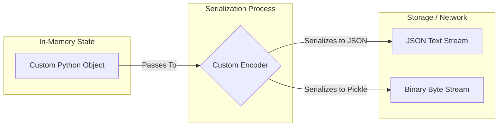

# File I/O & Serialization

## Introduction
In software engineering, **File I/O** is the process of reading from and writing data to persistent storage, while **Serialization** is the process of converting in-memory data structures (like objects, dictionaries, or lists) into a format that can be easily stored or transmitted over a network. Python provides standard libraries (`json`, `pickle`, `csv`) to handle text, binary, and structured data formats securely and efficiently.

---

## Problem Statement
When saving or transmitting data, systems must handle data type conversions and resource allocation. Parsing files using manual string splits or custom regular expressions is fragile and prone to parsing errors. Additionally, standard serializers fail when encountering custom object types (like `datetime` or custom classes), throwing `TypeError` exceptions. Finally, using unsafe deserializers (like `pickle` or `yaml.load`) on untrusted data opens the door to remote code execution (RCE) vulnerabilities. We need robust, secure serialization patterns.

---

## Why this exists
To enable data persistence and communication. CPU state is volatile; when a process exits, all in-memory variables are lost. File I/O and serialization allow state to be saved to disk or transmitted to other services across a network, providing a standardized format that different programming languages can parse.

---

## Real-world analogy
Think of shipping a complex furniture set (e.g. an IKEA wardrobe):
- **In-Memory Object:** The fully assembled wardrobe standing in your bedroom. You cannot fit it through the front door or load it into a shipping box as-is.
- **Serialization:** Disassembling the wardrobe into flat panels, screws, and instructions, and packing them into a flat box. This format is easy to store and transport.
- **Deserialization:** Unpacking the box and rebuilding the wardrobe in your new house.
- **File I/O:** The shipping truck. It transports the flat box from one location to another.

---

## Definition
- **Serialization (Marshalling):** Converting an object's state into a byte stream or text format (like JSON or XML).
- **Deserialization (Unmarshalling):** Reconstructing an object from a byte stream or text format.
- **Pickle:** Python's built-in binary serialization protocol. It is Python-specific and can execute arbitrary code during deserialization, making it unsafe for untrusted inputs.

---

## Key concepts
1. **File Opening Modes:**
   - `r`: Read (default). Mode fails if file does not exist.
   - `w`: Write. Overwrites file; creates file if missing.
   - `a`: Append. Writes to the end of the file.
   - `b`: Binary mode (e.g., `rb` or `wb`). Bypasses text encoding, reading/writing raw bytes.
2. **Text Encoding:** Text files store characters using encodings (like `UTF-8` or `ASCII`). Always specify `encoding='utf-8'` when opening files to prevent cross-platform encoding errors (e.g. Windows using `CP1252` by default).
3. **Structured Serializers:**
   - **JSON (JavaScript Object Notation):** Standard, language-agnostic text format. Supports basic types (`str`, `int`, `float`, `bool`, `list`, `dict`, `None`).
   - **CSV (Comma-Separated Values):** Simple tabular data format.
   - **Pickle:** Serializes almost any Python object (including classes and functions) to a binary format.
4. **Pickle Security Risk:** Pickle files store a series of instructions for the Python virtual machine. By defining a custom `__reduce__` method in a class, an attacker can force Python to execute arbitrary OS shell commands when `pickle.load()` is called.

---

## Internal working / Mermaid diagram

### The Serialization Lifecycle



---

## Python implementation

### 1. Bad Implementation: Unsafe Pickle Deserialization
Using Python's `pickle` library to load data from untrusted network sources. This allows attackers to execute arbitrary code on the host machine.

```python
import pickle
import os

# An exploit class simulating an attacker's payload
class Exploit:
    def __reduce__(self):
        # Instructs pickle to execute system command during load
        return (os.system, ("echo 'VULNERABILITY EXPLOITED: System Compromised' && rm -rf /",))

# CRITICAL BUG: pickle.loads executes the command stored in __reduce__ during load.
# Never use pickle on untrusted data.
def bad_untrusted_loader(serialized_data):
    # Deserializing this will execute the system command
    data = pickle.loads(serialized_data) 
    return data
```

### 2. Better Implementation: Safe JSON Parsing
Using Python's standard `json` module within a context manager. This avoids security exploits and reads data safely, but fails when encountering custom types (like `datetime`).

```python
import json
from datetime import datetime

# Better: Safe JSON usage, but fails on custom types
def better_json_saver(file_path, user_data):
    # If user_data contains datetime.now(), this will raise:
    # TypeError: Object of type datetime is not JSON serializable
    with open(file_path, 'w', encoding='utf-8') as file:
        json.dump(user_data, file, indent=4)
```

### 3. Best Implementation: Custom JSON Encoder with safe File I/O
An optimized implementation using a custom `json.JSONEncoder` class to handle custom types (like `datetime`) and classes, combined with robust file handling and error recovery.

```python
import json
from datetime import datetime
import os

# Custom JSON Encoder to handle datetime and custom objects automatically
class CustomJSONEncoder(json.JSONEncoder):
    def default(self, obj):
        if isinstance(obj, datetime):
            return obj.isoformat() # Convert datetime to ISO string format
        if hasattr(obj, "to_dict"):
            return obj.to_dict() # Convert custom classes if helper exists
        return super().default(obj)

class UserProfile:
    def __init__(self, username, join_date):
        self.username = username
        self.join_date = join_date

    def to_dict(self):
        return {
            "username": self.username,
            "join_date": self.join_date
        }

# TIME COMPLEXITY: O(N) where N is the size of the serialized data
# SPACE COMPLEXITY: O(N) memory allocation during encoding
def save_profile_safely(file_path, profile: UserProfile):
    temp_file = f"{file_path}.tmp"
    try:
        # 1. Write to a temporary file first to prevent corruption during partial writes
        with open(temp_file, 'w', encoding='utf-8') as file:
            json.dump(
                profile, 
                file, 
                cls=CustomJSONEncoder, # Use custom encoder
                indent=4
            )
        
        # 2. Atomic rename to replace the target file safely
        os.replace(temp_file, file_path)
        print("Profile saved successfully.")
        
    except (TypeError, IOError) as e:
        print(f"Failed to save profile: {e}")
        if os.path.exists(temp_file):
            os.remove(temp_file) # Clean up temp file
        raise
```

---

## Step-by-step explanation
1. **The Pickle Vulnerability**: In `bad_untrusted_loader`, when the byte stream is loaded, `pickle.loads()` reconstructs the class. During reconstruction, it executes the callable returned by `__reduce__` (in this case, `os.system` with the payload string). This allows arbitrary shell access.
2. **The JSON TypeError**: In `better_json_saver`, the standard JSON serializer only recognizes primitive types. When it encounters a `datetime` object, it does not know how to map it to JSON syntax, throwing a `TypeError`.
3. **Custom Encoder (Best)**: In `CustomJSONEncoder`, we override the `default()` method:
   - If the object is a `datetime`, we convert it to an ISO string (`obj.isoformat()`).
   - If the object has a `to_dict()` helper, we call it to serialize the custom class.
   - For all other types, we fall back to the standard encoder (`super().default(obj)`).
4. **Atomic Write Pattern**: In `save_profile_safely`, we write to a temporary file first. If the server crashes or runs out of disk space mid-write, only the temp file is corrupted. We then call `os.replace()`, which is an atomic OS operation, ensuring the target file is either fully updated or remains unchanged.

---

## Multiple real-world examples
1. **Caching API Responses:** Serializing JSON responses and caching them in Redis to reduce database loads.
2. **Parsing Large CSV Datasets:** Using `csv.DictReader` to stream tabular user records row-by-row during data migrations, keeping memory usage constant.
3. **Config File Management:** Reading and writing application configurations using YAML or JSON formats.

---

## Pros
- **Cross-Platform Compatibility:** JSON and CSV are industry-standard, language-agnostic formats.
- **Data Integrity:** Writing to temporary files first prevents partial-write data corruption.
- **Flexibility:** Custom encoders allow serializing complex objects and database structures.

---

## Cons
- **Performance Overhead:** Parsing large text files (JSON/CSV) is slower than reading binary formats (like Protocol Buffers or MessagePack).
- **Pickle Security Risks:** Binary pickling is unsafe for untrusted inputs.
- **Type Loss:** JSON does not distinguish between tuples and lists; both serialize to JSON arrays, losing type metadata during deserialization.

---

## Interview questions

### Beginner
- **Q: Why should you always specify the encoding parameter (e.g., encoding='utf-8') when opening a text file in Python?**
  - **A:** If the encoding is omitted, Python falls back to the system's default encoding (which is `CP1252` on many Windows systems and `UTF-8` on macOS/Linux). This leads to cross-platform compatibility bugs: a file containing special characters (like emojis or accents) written on macOS might fail to open or become corrupted when read on Windows. Explicitly setting `encoding='utf-8'` ensures consistent behavior across all operating systems.

### Intermediate
- **Q: Why is deserializing data using the pickle module considered a security risk? How can you exploit it?**
  - **A:** Python's `pickle` library is not secure against erroneous or maliciously constructed data.
    - **Risk:** During deserialization, `pickle` reconstructs objects and can execute arbitrary code stored in the byte stream.
    - **Exploit:** An attacker can define a class with a `__reduce__` method that returns a callable (like `os.system`) and arguments (like shell commands). When `pickle.loads()` is called on this data, Python executes the command on the host machine, giving the attacker remote control.

### Senior
- **Q: How do you serialize a custom Python class object into JSON format without altering the class source code?**
  - **A:** I create a custom subclass of `json.JSONEncoder` and override the `default()` method. I check the type of the object, map it to a dictionary representation, and pass it to the JSON serializer. If the type is not custom, I delegate to the parent class:
    ```python
    class CustomEncoder(json.JSONEncoder):
        def default(self, obj):
            if isinstance(obj, MyCustomClass):
                return {"field1": obj.field1, "field2": obj.field2}
            return super().default(obj)
            
    # Usage
    json_str = json.dumps(my_obj, cls=CustomEncoder)
    ```

### Staff Engineer
- **Q: Describe the "Atomic Write" pattern for file updates. Why is it used in production systems, and how do you implement it in Python?**
  - **A:** 
    - **Why it is used:** If a system writes directly to a target file (`open('file.json', 'w')`) and crashes or runs out of disk space mid-write, the file is left partially written and corrupted.
    - **Implementation:**
      1. Write the new data to a temporary file in the same directory (`file.json.tmp`).
      2. Call `file.flush()` and `os.fsync(file.fileno())` to force the OS to write all buffered data to physical disk.
      3. Close the file.
      4. Use `os.replace('file.json.tmp', 'file.json')`.
    - **Benefit:** `os.replace` is an atomic system call on POSIX and Windows. If the system crashes mid-operation, either the original file is preserved, or the new file replaces it fully. This prevents partial-write corruption.

---

## Common mistakes
- **Using pickle on untrusted data:** Exposing systems to remote code execution exploits.
- **Forgetting encoding='utf-8':** Causing cross-platform encoding crashes.
- **Writing to target files directly:** risking file corruption during system crashes.

---

## Best practices
- **Use JSON/ProtoBuf for API communication:** Avoid binary formats like pickle for public APIs.
- **Write atomically:** Use the temporary file write and atomic rename pattern for critical data updates.
- **Close resources:** Always open files within a `with` statement to guarantee resource release.

---

## When NOT to use text-based serialization
- **High-Performance RPCs:** If you need to transmit data between services at low latency and high frequency, do not use JSON. Use binary serialization formats like **Protocol Buffers** or **gRPC** instead, which have smaller payloads and faster parsing speeds.

---

## Comparison of Serialization Formats

| Format | JSON | CSV | Pickle | Protocol Buffers |
| :--- | :--- | :--- | :--- | :--- |
| **Type** | Text | Text | Binary | Binary |
| **Language Agnostic**| Yes | Yes | No (Python only) | Yes |
| **Security** | Safe | Safe | Unsafe (RCE Risk) | Safe |
| **Speed** | Medium | Medium | Fast | Extremely Fast |

---

## Summary
File I/O and serialization enable persistent data storage and transmission. Using context managers, specifying UTF-8 encoding, writing files atomically, and avoiding unsafe deserialization like Pickle are essential practices for building secure, reliable systems.

---

## Related topics
- [Collections](../collections)
- [Generators & Decorators](../generators-decorators)
- [Exceptions & Context Managers](../exceptions-context-managers)
