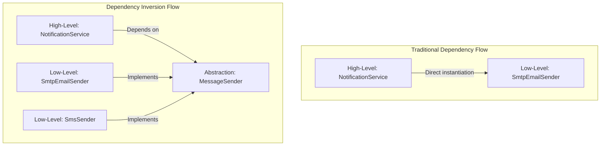

# Dependency Inversion Principle (DIP)

## Introduction
The Dependency Inversion Principle (DIP) is the fifth and final principle of the SOLID framework. It defines rules for structuring dependencies between high-level policy modules and low-level detail modules to reduce system coupling.

## Problem Statement
In traditional software architecture, high-level modules (containing core business logic) depend directly on low-level modules (handling infrastructure tasks like database access, file systems, or network APIs). For example, a `PaymentService` class might directly instantiate a `StripePaymentClient` class. When the business decides to switch payment providers to PayPal, developers must modify the core `PaymentService` class, introducing regression risks and violating the Open/Closed Principle.

## Why this exists
To isolate core business logic from changing infrastructure details. By placing an abstraction (interface) between high-level and low-level modules, both can evolve independently without breaking each other.

## Real-world analogy
Consider a **wall electrical outlet**.
Your laptop (high-level module) needs electricity to charge. It does not hardwire its internal power supply directly to the copper lines of the power grid (low-level module).
Instead, they interact via an abstraction: the **standard wall socket** (interface).
- The laptop depends on the socket interface.
- The power grid depends on the socket interface.
Because of this abstraction, you can unplug your laptop from a coal-powered grid and plug it into a solar-powered grid without altering your laptop's internal circuitry.

Another analogy is a **USB port**. The computer provides a USB port (interface). You can connect a mouse, a keyboard, or a flash drive (low-level components) without changing the computer's motherboard architecture.

## Definition
The Dependency Inversion Principle states:
1. High-level modules should not depend on low-level modules. Both should depend on abstractions (interfaces).
2. Abstractions should not depend on details. Details (concrete classes) should depend on abstractions.

## Key concepts
- **High-Level Modules:** Classes containing core business rules and policy decisions (e.g., `OrderProcessor`).
- **Low-Level Modules:** Classes handling concrete infrastructure tasks, utility details, or external APIs (e.g., `SmtpClient`, `PostgresDbConnection`).
- **Abstractions:** Interfaces or abstract classes defining functional contracts.
- **Dependency Injection (DI):** The design pattern used to pass dependencies (concrete instances) into a class via constructors, setters, or fields.
- **Inversion of Control (IoC):** The architectural pattern of delegating control of object instantiation and dependency wiring to an external container (e.g., Spring IoC).

## Internal working / Mermaid diagram



## Python/Java implementation

### Bad implementation
*A high-level `NotificationService` that directly instantiates a concrete `SmtpEmailSender` class, coupling business rules directly to SMTP protocol details.*

```java
package bad;

class SmtpEmailSender {
    public void sendEmail(String to, String body) {
        System.out.println("Connecting to SMTP server...");
        System.out.println("Email sent to " + to + " with: " + body);
    }
}

public class NotificationService {
    // Violates DIP: High-level module depends directly on a concrete low-level class
    private final SmtpEmailSender emailSender;

    public NotificationService() {
        this.emailSender = new SmtpEmailSender(); // Tight coupling!
    }

    public void alertUser(String emailAddress, String alertMessage) {
        emailSender.sendEmail(emailAddress, alertMessage);
    }
}
```

### Better implementation
*Using abstract classes to define base connections, but the high-level service still instantiates the concrete subclasses internally.*

```java
package better;

abstract class NetworkSender {
    public abstract void transmit(String target, String payload);
}

class EmailSender extends NetworkSender {
    @Override
    public void transmit(String target, String payload) {
        System.out.println("Sending Email payload: " + payload);
    }
}

public class NotificationService {
    private NetworkSender sender;

    public NotificationService(String channelType) {
        // Better, but still hardcodes concrete subclass selections inside the constructor!
        if ("EMAIL".equalsIgnoreCase(channelType)) {
            this.sender = new EmailSender();
        }
    }

    public void alert(String target, String msg) {
        sender.transmit(target, msg);
    }
}
```

### Best implementation
*A fully DIP-compliant design. Both the service and the senders depend on the `MessageSender` interface. Dependencies are injected into the service via its constructor, making it easy to swap implementations.*

```java
package best;

import java.util.Objects;

// 1. Abstraction Contract
interface MessageSender {
    void send(String target, String message);
}

// 2. Low-level modules implement the abstraction
class SmtpEmailSender implements MessageSender {
    @Override
    public void send(String target, String message) {
        System.out.println("SMTP Email sent to " + target + ": " + message);
    }
}

class SmsSender implements MessageSender {
    @Override
    public void send(String target, String message) {
        System.out.println("SMS sent to " + target + ": " + message);
    }
}

class SlackSender implements MessageSender {
    @Override
    public void send(String target, String message) {
        System.out.println("Slack notification sent to channel " + target + ": " + message);
    }
}

// 3. High-level module depends only on the abstraction
public class NotificationService {
    private final MessageSender messageSender; // Depends strictly on interface

    // Dependency Injection: Pass the dependency in via the constructor
    public NotificationService(MessageSender messageSender) {
        this.messageSender = Objects.requireNonNull(messageSender, "Sender cannot be null");
    }

    public void alert(String target, String message) {
        // High-level policy: business rules for alerts
        String formattedMessage = "[ALERT] " + message;
        messageSender.send(target, formattedMessage); // Agnostic to the transport layer!
    }
}

// 4. Wiring client code
class ApplicationRunner {
    public static void main(String[] args) {
        // We can swap senders dynamically without altering NotificationService
        MessageSender emailChannel = new SmtpEmailSender();
        NotificationService emailService = new NotificationService(emailChannel);
        emailService.alert("alice@example.com", "System update completed");

        MessageSender smsChannel = new SmsSender();
        NotificationService smsService = new NotificationService(smsChannel);
        smsService.alert("+1-555-0199", "Security alert: unauthorized login");
    }
}
```

## Step-by-step explanation
1. **Define the Abstract Contract:** We declare the `MessageSender` interface to define the signature: `send(String target, String message)`.
2. **Implement Infrastructure Details:** Senders like `SmtpEmailSender`, `SmsSender`, and `SlackSender` implement this interface.
3. **Decouple the Service:** We modify `NotificationService` to depend on the `MessageSender` interface instead of concrete classes.
4. **Apply Dependency Injection:** We pass the concrete sender instance into `NotificationService` via its constructor, letting external configuration classes wire the dependencies together.

## Multiple real-world examples
- **Spring Framework:** The Spring IoC container reads annotations like `@Autowired` and `@Component` to dynamically inject low-level repository implementations into high-level controllers.
- **Java JDBC API:** Applications interact with interfaces like `java.sql.Connection`. Concrete driver implementations are injected at runtime, allowing database swaps without altering connection queries.
- **Logging Facades (SLF4J):** Code depends on the abstract `Logger` interface. Concrete logging implementations (Logback, Log4j) are bound at runtime.

## Pros
- **Improved Testability:** Simpler to write unit tests by injecting mock implementations of the interface, avoiding real SMTP connections or database writes.
- **Decoupled Architecture:** Modifying or replacing low-level storage or communication components does not require changing core business logic.
- **Enhanced Reusability:** High-level policy classes are decoupled from infrastructure details, making them easier to reuse across different projects.

## Cons
- **Wiring Complexity:** Requires an external system (like a dependency injection container) to construct objects and wire their dependencies together.

## Interview questions

### Beginner
- **Q: What is the Dependency Inversion Principle?**
- **A:** DIP states that high-level modules should not depend on low-level modules; both should depend on abstractions (interfaces).

### Intermediate
- **Q: What is the difference between Dependency Inversion (DIP) and Dependency Injection (DI)?**
- **A:** DIP is a high-level design *principle* focusing on depending on abstractions rather than details. DI is a software *design pattern* used to implement DIP by passing concrete dependencies into a class via constructors or setters.

### Senior
- **Q: How does DIP relate to Hexagonal Architecture (Ports and Adapters)?**
- **A:** Hexagonal Architecture is a direct application of DIP. The core domain layer sits in the center and defines "Ports" (interfaces) for external actions like database storage or payment processing. The infrastructure layer provides "Adapters" (concrete implementations) that implement these ports, keeping the core domain completely decoupled from external technologies.

### Staff Engineer
- **Q: How does Dependency Inversion impact class initialization order and garbage collection performance in high-throughput JVM environments?**
- **A:**
  - **Class Initialization:** DIP shifts class initialization from compile-time instantiation to runtime dependency resolution. High-level services are initialized only after their dependencies are constructed, which can be managed by IoC containers to ensure correct execution.
  - **GC Performance:** Heavy dependency injection frameworks can create large numbers of short-lived wrapper objects during startup. To minimize GC impact in high-throughput applications, design dependencies as singletons and avoid field-based injection, which can create garbage during garbage collection cycles.

## Common mistakes
- **Using `new` for Service Classes:** Directly instantiating database, network, or filesystem clients using the `new` keyword inside business services.
- **Depending on Concrete Details:** Creating interfaces that leak technology-specific details, such as naming an interface `SQLDatabase` instead of `Database`.

## Best practices
- Practice constructor-based dependency injection to ensure classes are fully initialized before use.
- Declare dependencies as `final` when possible to promote immutability and thread safety.
- Limit the use of field injection (`@Autowired` directly on private variables) to keep classes easy to test and instantiate manually in unit tests.

## When NOT to use
- **Data Transfer Objects (DTOs):** Avoid applying DIP to simple data carriers or records (e.g., `new User("Alice")`), as they do not contain behavioral infrastructure dependencies.

## Comparison with similar concepts
- **DIP vs Inversion of Control (IoC) vs Dependency Injection (DI):**
  - **DIP:** The design principle that guides the direction of dependencies (depending on interfaces).
  - **IoC:** The software design pattern that inverts the flow of control (delegating object creation to a container).
  - **DI:** The design pattern used to pass dependencies into objects.

## Summary
The Dependency Inversion Principle decouples high-level policy from low-level details by routing all interactions through interfaces. This improves code testability and ensures systems remain highly adaptable.

## Related topics
- [Open/Closed Principle](../open-closed-principle)
- [Dependency Injection](../../design-principles/dependency-injection)
- [Hexagonal Architecture](../../../01-design-patterns/structural/adapter)
