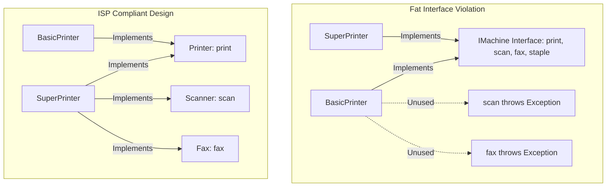

# Interface Segregation Principle (ISP)

## Introduction
The Interface Segregation Principle (ISP) is the fourth principle of the SOLID framework. It focuses on the design of cohesive, modular interfaces, ensuring that implementing classes are not burdened with methods they do not require.

## Problem Statement
When designing system components, it is common to create a single, comprehensive interface to represent a category of devices or services (e.g., an `IMachine` interface with `print()`, `scan()`, `fax()`, and `staple()` methods). While high-end office printers can support all these functions, a basic home printer only supports printing. Forcing the basic printer to implement the entire interface requires writing empty methods or throwing `UnsupportedOperationException` for the unsupported features, polluting the class and violating client expectations.

## Why this exists
To prevent the creation of "Fat Interfaces" that couple unrelated features. If an interface contains too many methods, any change to one method signature (e.g., updating the parameters for `fax()`) forces all implementing classes (including the basic printer) to recompile and redeploy, even if they do not use that feature.

## Real-world analogy
Consider a **restaurant menu**.
If a restaurant only offers a single, 500-page catalog containing breakfast, lunch, dinner, kids' meals, and catering options, a guest who only wants a coffee must flip through the entire book.
A better approach is segregation: presenting a small **Coffee Menu**, a separate **Lunch Menu**, and a **Kids' Menu**. Guests are only given the specific menu (interface) they need.

Another analogy is **utility outlets**. A wall outlet provides electrical plugs. You plug a lamp into a standard power outlet, a TV cable into a coaxial outlet, and a computer into an Ethernet port. You do not install a single giant outlet in your wall that combines power, water, gas, and cable TV connections.

## Definition
The Interface Segregation Principle states that clients should not be forced to depend on interfaces they do not use. Large interfaces should be split into smaller, more specific ones so that clients only need to know about the methods that interest them.

## Key concepts
- **Fat Interface:** An interface that contains too many methods, often covering multiple unrelated responsibilities.
- **Role Interface:** A small, focused interface that defines a single role or capability (e.g., `Runnable`, `Closeable`).
- **Cohesion:** The degree to which methods inside an interface are logically related to a single task. ISP promotes high cohesion.
- **Client Ownership:** The concept that interfaces belong to the clients that call them, not the classes that implement them.

## Internal working / Mermaid diagram



## Python/Java implementation

### Bad implementation
*A single `IMachine` interface containing print, scan, fax, and staple operations. A basic home printer is forced to implement all methods, throwing exceptions for unsupported actions.*

```java
package bad;

interface IMachine {
    void print(String doc);
    void scan(String doc);
    void fax(String doc);
    void staple(String doc);
}

class BasicPrinter implements IMachine {
    @Override
    public void print(String doc) {
        System.out.println("Printing: " + doc);
    }

    @Override
    public void scan(String doc) {
        // Violates ISP: Basic printer cannot scan
        throw new UnsupportedOperationException("Scanning not supported!");
    }

    @Override
    public void fax(String doc) {
        throw new UnsupportedOperationException("Faxing not supported!");
    }

    @Override
    public void staple(String doc) {
        throw new UnsupportedOperationException("Stapling not supported!");
    }
}
```

### Better implementation
*The interface is split into two, but the printing interface still includes unrelated document formatting or setup configurations.*

```java
package better;

interface DocumentPrinter {
    void print(String doc);
    void configurePaperTray(int trayId); // Still forces configuration dependency
}

interface DocumentScanner {
    void scan(String doc);
}

class HomePrinter implements DocumentPrinter {
    @Override
    public void print(String doc) {
        System.out.println("Printing document...");
    }

    @Override
    public void configurePaperTray(int trayId) {
        // Simple printers don't have multiple trays, but are forced to implement this
        System.out.println("Default tray configured");
    }
}
```

### Best implementation
*A fully ISP-compliant design. Interfaces are split into small, single-purpose roles. Implementing classes select only the capabilities they support.*

```java
package best;

// 1. Fine-grained Role Interfaces
interface Printer {
    void print(Document doc);
}

interface Scanner {
    void scan(Document doc);
}

interface Fax {
    void fax(Document doc);
}

interface Stapler {
    void staple(Document doc);
}

class Document {
    private final String content;
    public Document(String content) { this.content = content; }
    public String getContent() { return content; }
}

// 2. Subclasses implement only the required interfaces
class BasicPrinter implements Printer {
    @Override
    public void print(Document doc) {
        System.out.println("Basic Print: " + doc.getContent());
    }
}

class AdvancedWorkstation implements Printer, Scanner, Stapler {
    @Override
    public void print(Document doc) {
        System.out.println("Advanced Print: " + doc.getContent());
    }

    @Override
    public void scan(Document doc) {
        System.out.println("Advanced Scan of: " + doc.getContent());
    }

    @Override
    public void staple(Document doc) {
        System.out.println("Stapling document...");
    }
}
```

## Step-by-step explanation
1. **Identify Unused Methods:** We review the `IMachine` interface and identify that `BasicPrinter` leaves most methods unimplemented.
2. **Segregate Interfaces:** We break the fat interface into smaller, single-purpose role interfaces: `Printer`, `Scanner`, `Fax`, and `Stapler`.
3. **Implement Specific Roles:** `BasicPrinter` implements only `Printer`, while `AdvancedWorkstation` implements `Printer`, `Scanner`, and `Stapler`.
4. **Compile-time Safety:** Client code can request specific interfaces (e.g., calling `print()` on a `Printer`), ensuring that unsupported methods cannot be called.

## Multiple real-world examples
- **Java Collection Framework:** Instead of a single interface for all collection types, Java provides segregated interfaces like `Iterable`, `Collection`, `List`, and `Set`, allowing implementations to support only the required features.
- **Android UI Event Listeners:** Android UI components use segregated interfaces like `OnClickListener`, `OnLongClickListener`, and `OnTouchListener` rather than a single general listener interface.
- **Spring Security Contracts:** Spring Security uses segregated interfaces like `UserDetailsService` and `PasswordEncoder` to manage authentication and encryption separately.

## Pros
- **Decoupled Codebases:** Changing a method signature in one interface (e.g., adding parameters to `scan()`) only affects classes that implement that interface.
- **Clearer APIs:** Small, focused interfaces are self-documenting and easier to understand.
- **Fewer runtime exceptions:** Eliminates unsupported method stubs that throw exceptions at runtime.

## Cons
- **Interface Proliferation:** Strictly applying ISP can lead to a large number of very small interfaces, increasing the complexity of the project structure.

## Interview questions

### Beginner
- **Q: What is the Interface Segregation Principle?**
- **A:** ISP states that clients should not be forced to implement interface methods they do not use. Large interfaces should be split into smaller, more focused ones.

### Intermediate
- **Q: How does ISP support the Single Responsibility Principle (SRP)?**
- **A:** They are closely related: SRP focuses on ensuring a *class* has a single responsibility, while ISP focuses on ensuring an *interface* represents a single role or capability. Adhering to SRP often naturally leads to segregated interfaces.

### Senior
- **Q: How do you apply ISP when working with fat third-party interfaces that you cannot modify?**
- **A:** Use the **Adapter Pattern**. Create a small, focused interface that defines only the methods your client code needs. Then, write an adapter class that implements your clean interface and delegates the calls to the third-party fat interface, isolating your code from the external library.

### Staff Engineer
- **Q: How do Java 8 default methods impact the Interface Segregation Principle, and do they make fat interfaces acceptable?**
- **A:**
  - **The Impact:** Java 8 default methods allow interfaces to provide default implementations, meaning implementing classes do not have to write stub methods for every interface method.
  - **The Violation:** Default methods do not make fat interfaces acceptable. While they prevent compiler errors, the implementing class still inherits all the methods. This can pollute the subclass's public API, expose unrelated methods to clients, and violate the principle of least privilege. Segregated interfaces remain necessary to maintain clean APIs.

## Common mistakes
- **Designing interfaces for the provider:** Creating interfaces based on what a class *can* do rather than what the client *needs*. Interfaces should be designed from the client's perspective.
- **Over-segregating:** Splitting interfaces so small that they contain only one method even when the methods are logically related, creating unnecessary abstraction overhead.

## Best practices
- Keep interfaces small, cohesive, and focused on a single role.
- Name interfaces based on capabilities, often using `-able` or `-er` suffixes (e.g., `Runnable`, `Writer`).
- If an implementing class throws `UnsupportedOperationException` for an interface method, refactor the interface.

## When NOT to use
- **Logically Cohesive Operations:** If a set of methods are always implemented and used together, do not split them into separate interfaces.

## Comparison with similar concepts
- **ISP vs Single Responsibility Principle:**
  - **SRP:** Ensures a *class* has only one reason to change.
  - **ISP:** Ensures an *interface* does not force clients to depend on unused methods.

## Summary
The Interface Segregation Principle prevents bloated dependencies by splitting large interfaces into small, role-based contracts. This keeps client interfaces clean and simplifies code maintenance.

## Related topics
- [Single Responsibility Principle](../single-responsibility-principle)
- [Liskov Substitution Principle](../liskov-substitution-principle)
- [Adapter Pattern](../../../01-design-patterns/structural/adapter)
