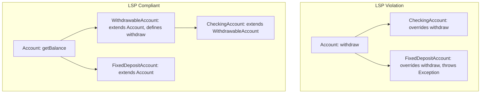

# Liskov Substitution Principle (LSP)

## Introduction
The Liskov Substitution Principle (LSP) is the third principle of the SOLID framework. Named after computer scientist Barbara Liskov, it establishes rules for designing correct, predictable inheritance hierarchies where subclass objects can substitute superclass objects without breaking program behavior.

## Problem Statement
In object-oriented design, developers often use inheritance based on real-world analogies (e.g., a "Square IS-A Rectangle" or a "Penguin IS-A Bird"). However, in code, if a subclass inherits methods it cannot support (such as a `Penguin` class inheriting `fly()`, or a `FixedDepositAccount` inheriting `withdraw()`), it must throw exceptions like `UnsupportedOperationException`. This breaks runtime polymorphism: client loops executing base methods will crash when encountering these subclasses.

## Why this exists
To ensure that polymorphism works safely at runtime. LSP guarantees that subclasses honor the behavioral contract defined by the parent class, preventing unexpected crashes and eliminating the need for client-side type-checking.

## Real-world analogy
Consider **batteries**. A device requires standard AA batteries.
- You buy a **rechargeable AA battery** (subclass). It fits and powers the device (LSP Adhered).
- You buy a **cheap alkaline AA battery** (subclass). It fits and powers the device (LSP Adhered).
- You buy a **dummy AA battery case** containing a USB plug (subclass). It fits, but it doesn't provide voltage directly, causing the device to fail to start (LSP Violated). Even though it has the same shape, it breaks the behavioral contract of a battery.

Another analogy is a **coffee machine** that accepts standard pods. An espresso pod and a decaf pod work as expected. If you insert a plastic capsule containing hot chocolate powder that requires different pressure and jams the machine, it violates the expected behavior of a pod.

## Definition
The Liskov Substitution Principle states that objects in a program should be replaceable with instances of their subtypes without altering the correctness of the program.
Specifically:
- **Preconditions cannot be strengthened** in a subclass (the subclass cannot require more strict input validation than the parent).
- **Postconditions cannot be weakened** in a subclass (the subclass must guarantee the same output properties as the parent).
- **Invariants of the superclass must be preserved** in the subclass.

## Internal working / Mermaid diagram



## Python/Java implementation

### Bad implementation
*A base class `Account` defining a `withdraw` operation. The subclass `FixedDepositAccount` inherits it but throws an exception if the funds are locked, violating the base class's contract and causing client loops to crash.*

```java
package bad;

import java.util.List;

class Account {
    protected double balance;

    public Account(double balance) {
        this.balance = balance;
    }

    public void withdraw(double amount) {
        if (amount > 0 && balance >= amount) {
            balance -= amount;
        }
    }
}

class CheckingAccount extends Account {
    public CheckingAccount(double balance) { super(balance); }
}

class FixedDepositAccount extends Account {
    public FixedDepositAccount(double balance) { super(balance); }

    @Override
    public void withdraw(double amount) {
        // Fixed deposits lock funds; direct withdrawal is not supported
        throw new UnsupportedOperationException("Fixed deposit funds are locked!");
    }
}

public class AccountManager {
    public void processWithdrawals(List<Account> accounts, double amount) {
        for (Account account : accounts) {
            // Crashes when encountering a FixedDepositAccount!
            account.withdraw(amount); 
        }
    }
}
```

### Better implementation
*Using type checks or flag queries before performing the action. While this prevents crashes, it couples client code to specific subclass types, violating the Open/Closed Principle.*

```java
package better;

import java.util.List;

class Account {
    protected double balance;
    public Account(double balance) { this.balance = balance; }
    public boolean isWithdrawable() { return true; }
    public void withdraw(double amount) { this.balance -= amount; }
}

class FixedDepositAccount extends Account {
    public FixedDepositAccount(double balance) { super(balance); }
    
    @Override
    public boolean isWithdrawable() { return false; }
    
    @Override
    public void withdraw(double amount) {
        if (!isWithdrawable()) {
            System.out.println("Blocked withdrawal from Fixed Deposit");
        }
    }
}

public class AccountManager {
    public void processWithdrawals(List<Account> accounts, double amount) {
        for (Account account : accounts) {
            // Prevents crashes, but forces client code to check flags
            if (account.isWithdrawable()) {
                account.withdraw(amount);
            }
        }
    }
}
```

### Best implementation
*Separating capabilities into distinct interfaces. Subclasses inherit only the behaviors they can support, ensuring type safety at compile time.*

```java
package best;

import java.util.List;

// 1. Base abstraction containing common attributes
abstract class Account {
    protected double balance;

    public Account(double balance) {
        this.balance = balance;
    }

    public double getBalance() {
        return balance;
    }
}

// 2. Specialized capability interface
interface Withdrawable {
    void withdraw(double amount);
}

// 3. Subclasses inheriting appropriate capabilities
class CheckingAccount extends Account implements Withdrawable {
    public CheckingAccount(double balance) {
        super(balance);
    }

    @Override
    public void withdraw(double amount) {
        if (amount > 0 && balance >= amount) {
            balance -= amount;
            System.out.println("Withdrew: " + amount);
        }
    }
}

// FixedDepositAccount only inherits base Account characteristics
class FixedDepositAccount extends Account {
    public FixedDepositAccount(double balance) {
        super(balance);
    }
}

// 4. Client code interacts with the appropriate capability interface
public class AccountManager {
    // This method only accepts withdrawable items, preventing compile-time errors
    public void processWithdrawals(List<Withdrawable> withdrawableAccounts, double amount) {
        for (Withdrawable account : withdrawableAccounts) {
            account.withdraw(amount);
        }
    }
}
```

## Step-by-step explanation
1. **Identify Behavioral Differences:** We evaluate the `Account` hierarchy and realize that while all accounts have balances, not all accounts support withdrawals.
2. **Split the Hierarchy:** We extract the `Withdrawable` capability into a separate interface.
3. **Inherit Selectively:** `CheckingAccount` implements `Withdrawable`, while `FixedDepositAccount` only extends the base `Account` class.
4. **Compile-time Verification:** We update `AccountManager.processWithdrawals` to accept `List<Withdrawable>`. This ensures the compiler blocks invalid operations, guaranteeing type safety.

## Multiple real-world examples
- **Java Collection Framework:** The `java.util.List` interface is implemented by `ArrayList` and `LinkedList`. Any client code expecting a `List` can use either implementation interchangeably without errors.
- **Java File Systems:** A base class `Path` represents file locations. Subclasses like `UnixPath` and `ZipPath` handle path operations differently but honor the contract, allowing utilities to process paths uniformly.
- **Graphic Renderers:** A `Shape` interface defines a `draw()` contract. Subclasses like `Circle` and `Rectangle` implement `draw()` without throwing exceptions, allowing renderers to draw shapes in a loop safely.

## Pros
- **Robust Codebases:** Prevents unexpected runtime crashes caused by unsupported subclasses.
- **Simpler Client Code:** Eliminates type-checks (`instanceof`) and conditional flag checks in client logic.
- **Clear Abstractions:** Forces developers to design clean, accurate taxonomies.

## Cons
- **Counter-Intuitive Modeling:** Geometrically, a square is a rectangle, and biologically, a penguin is a bird. Programmatically, forcing these relationships violates LSP, which can make domain modeling counter-intuitive initially.

## Interview questions

### Beginner
- **Q: What is the Liskov Substitution Principle?**
- **A:** LSP states that subclasses should be substitutable for their superclasses without causing runtime errors or altering program correctness.

### Intermediate
- **Q: Why does throwing an `UnsupportedOperationException` in a subclass violate LSP?**
- **A:** It violates LSP because the superclass contract guarantees that the method can be executed. Throwing an exception breaks this contract, causing client code expecting the superclass behavior to crash.

### Senior
- **Q: How does LSP relate to Design by Contract?**
- **A:** LSP is the implementation of Design by Contract for inheritance. Subclasses must honor the preconditions, postconditions, and invariants defined by the superclass:
  - **Preconditions** cannot be strengthened (subclasses cannot demand stricter inputs).
  - **Postconditions** cannot be weakened (subclasses must guarantee the same output properties).
  - **Invariants** must be preserved (subclasses must keep internal state valid).

### Staff Engineer
- **Q: In Java, how does the `java.util.Collections.unmodifiableList()` wrapper violate LSP, and how should it have been designed?**
- **A:**
  - **The Violation:** The `List` interface guarantees write operations like `add()`. The unmodifiable list wrapper returned by `unmodifiableList()` implements `List` but throws `UnsupportedOperationException` on write operations, violating LSP.
  - **The Solution:** The API should have split the collection hierarchy into read-only and writeable interfaces (e.g., `ReadOnlyCollection` and `WritableCollection`). The unmodifiable list would implement only `ReadOnlyCollection`, preventing write operations at compile time rather than throwing exceptions at runtime.

## Common mistakes
- **Inheriting to reuse code:** Extending a class to reuse helper methods without establishing a valid "IS-A" relationship.
- **Throwing exceptions for inherited methods:** Overriding parent methods only to throw `NotImplementedException` or `UnsupportedOperationException`.

## Best practices
- Favor Composition over Inheritance to reuse code.
- Keep inheritance hierarchies shallow (1-2 levels).
- Extract specific capabilities into interfaces rather than consolidating them in a base class.

## When NOT to use
- **Monolithic Hierarchies:** If subclasses cannot logically support the entire behavior of the parent class, avoid inheritance and use composition instead.

## Comparison with similar concepts
- **LSP vs Polymorphism:**
  - **Polymorphism:** The language feature allowing a variable to reference different object types.
  - **LSP:** The design principle that defines rules for organizing those types so they can be substituted safely.

## Summary
The Liskov Substitution Principle ensures that subclasses honor the contracts of their parent classes. Splitting capabilities into separate interfaces prevents runtime exceptions and keeps codebases type-safe.

## Related topics
- [Inheritance](../../oop-fundamentals/inheritance)
- [Interface Segregation Principle](../interface-segregation-principle)
- [Composition vs Inheritance](../../design-principles/composition-vs-inheritance)
