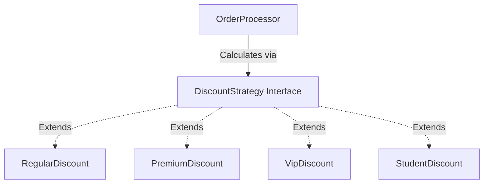

# Open/Closed Principle (OCP)

## Introduction
The Open/Closed Principle (OCP) is the second principle in the SOLID framework. It serves as a core guideline for writing software that is resilient to changing requirements, ensuring that new features can be added with minimal risk to existing code.

## Problem Statement
Imagine an `OrderProcessor` class that calculates discounts. Initially, it only processes discounts for `Regular` and `Premium` customers using an `if-else` block. Later, the business decides to introduce `VIP`, `Student`, and `BlackFriday` discount tiers. To support this, you must continually open the `OrderProcessor` class and add more conditional blocks. Modifying a stable, tested class introduces regression risks and requires re-testing the entire module.

## Why this exists
To build software that scales by addition rather than mutation. OCP ensures that stable code remains untouched while providing structured hooks or abstractions for developers to extend behavior.

## Real-world analogy
Consider a **desktop computer motherboard**.
If you want to upgrade your graphics card, you do not use a soldering iron to physically rewire the motherboard's circuits. The motherboard is **closed for modification**. Instead, you plug the new graphics card into a standard PCIe slot. The motherboard is **open for extension** because it defines a standard interface.

Another analogy is a **power socket**. The wall outlet provides electrical power (closed for modification). If you want to connect a vacuum cleaner, a phone charger, or a lamp, you plug it into the socket. You do not rewire the house's electrical panel every time you buy a new appliance (open for extension).

## Definition
The Open/Closed Principle states that software entities (classes, modules, functions) should be open for extension but closed for modification.
- **Open for extension:** The behavior of the module can be extended to meet new requirements.
- **Closed for modification:** Extending the behavior does not require modifying the module's existing source code.

## Key concepts
- **Polymorphism:** The primary mechanism for achieving OCP by defining contracts that concrete classes implement.
- **Strategy Design Pattern:** Enforces OCP by delegating algorithms (like discount logic) to interchangeable strategy objects.
- **Abstraction Boundaries:** Establishing clear interfaces so client code interacts with contracts rather than concrete implementations.

## Internal working / Mermaid diagram



## Python/Java implementation

### Bad implementation
*A calculator containing hardcoded customer type evaluations. Adding a new customer type or holiday sale discount requires modifying the core calculator class.*

```java
package bad;

public class DiscountCalculator {
    public double calculateDiscount(String customerType, double price) {
        // Violates OCP: Every new discount type requires modifying this class
        if ("REGULAR".equalsIgnoreCase(customerType)) {
            return price * 0.05; // 5%
        } else if ("PREMIUM".equalsIgnoreCase(customerType)) {
            return price * 0.10; // 10%
        } else if ("VIP".equalsIgnoreCase(customerType)) {
            return price * 0.20; // 20%
        }
        return 0;
    }
}
```

### Better implementation
*Using subclassing to override behavior. While this works, it leads to rigid inheritance trees and can violate the Single Responsibility Principle if class responsibilities become bloated.*

```java
package better;

class DiscountCalculator {
    public double getDiscount(double price) {
        return price * 0.05;
    }
}

// Subclassing to extend: works but couples code to inheritance hierarchies
class VipDiscountCalculator extends DiscountCalculator {
    @Override
    public double getDiscount(double price) {
        return price * 0.20;
    }
}
```

### Best implementation
*A Strategy pattern implementation. The `OrderProcessor` depends on the `DiscountStrategy` interface, allowing new discount types to be added as separate classes without modifying the processor.*

```java
package best;

import java.util.Objects;

// 1. Interface defining the extension contract
interface DiscountStrategy {
    double apply(double price);
}

// 2. Concrete implementations (open to extension)
class RegularDiscount implements DiscountStrategy {
    @Override
    public double apply(double price) {
        return price * 0.05;
    }
}

class PremiumDiscount implements DiscountStrategy {
    @Override
    public double apply(double price) {
        return price * 0.10;
    }
}

class VipDiscount implements DiscountStrategy {
    @Override
    public double apply(double price) {
        return price * 0.20;
    }
}

// Adding a new discount strategy is as simple as adding a new class
class BlackFridayDiscount implements DiscountStrategy {
    @Override
    public double apply(double price) {
        return price * 0.50; // 50% discount
    }
}

// 3. Calculator class (closed for modification)
public class OrderProcessor {
    private final DiscountStrategy discountStrategy;

    // Inject the strategy (decoupled dependency)
    public OrderProcessor(DiscountStrategy discountStrategy) {
        this.discountStrategy = Objects.requireNonNull(discountStrategy);
    }

    public double processOrder(double price) {
        double discount = discountStrategy.apply(price);
        return price - discount;
    }
}
```

## Step-by-step explanation
1. **Define the Extensible Interface:** We declare the `DiscountStrategy` interface, which defines the method signature: `apply(double price)`.
2. **Implement Strategies:** We write separate classes (`RegularDiscount`, `PremiumDiscount`, `VipDiscount`) implementing this interface.
3. **Decouple the Processor:** We update `OrderProcessor` to depend on the `DiscountStrategy` interface rather than concrete classes.
4. **Extend without Modifying:** When a new discount tier (e.g., `BlackFridayDiscount`) is needed, we create a new strategy class. The `OrderProcessor` class remains unchanged, fulfilling the Open/Closed Principle.

## Multiple real-world examples
- **Payment Gateways:** A checkout system depends on a `PaymentProcessor` interface. Adding support for `PayPal` or `Stripe` is done by creating new classes implementing the interface, leaving the checkout logic untouched.
- **Logging Adapters:** A logger class delegates writing to a `LogAppender` interface. Developers can add new appenders (console, file, database, Slack) without modifying the logger.
- **Browser Extensions:** Browsers provide extension APIs. Developers can add features (ad blockers, password managers) without modifying the browser's source code.

## Pros
- **Decoupled Development:** Multiple developers can build new features in separate classes without merge conflicts in a central processor file.
- **Lower Regression Risk:** Working code remains untouched, preventing accidental bugs in existing features.
- **Easier Testing:** New features can be tested in isolation without re-running tests for old modules.

## Cons
- **Over-engineering:** Designing for OCP from day one can lead to an excess of interfaces and abstract classes, violating the YAGNI (You Aren't Gonna Need It) principle.

## Interview questions

### Beginner
- **Q: What is the Open/Closed Principle?**
- **A:** OCP states that software classes should be open for extension (adding new features) but closed for modification (not changing existing source code).

### Intermediate
- **Q: How does Polymorphism support OCP?**
- **A:** Polymorphism allows a class to interact with an interface rather than concrete classes. This lets developers introduce new classes implementing the interface without modifying the class that calls them.

### Senior
- **Q: How does OCP relate to the Strategy and Decorator design patterns?**
- **A:** Both patterns are direct implementations of OCP. The Strategy pattern lets you plug in different algorithms at runtime via an interface, while the Decorator pattern dynamically wraps an object to extend its behavior without modifying the original class.

### Staff Engineer
- **Q: How do you balance the trade-offs of OCP with YAGNI when designing complex enterprise systems?**
- **A:** Implement OCP selectively by:
  1. **Applying OCP after duplication occurs:** Do not create interfaces for every class upfront. Write a simple `if` block first. The second time that block needs modification, refactor it to use interfaces.
  2. **Analyzing Volatility:** Identify parts of the domain that change frequently (e.g., payment gateways, reporting formats, tax rules) and design them to follow OCP. Keep stable areas (such as math utilities or basic configuration models) simple.

## Common mistakes
- **Using Switch Blocks on Enums:** Writing central `switch` statements that evaluate object type tags.
- **Over-abstracting Code:** Creating interfaces for classes that are unlikely to ever need extension.

## Best practices
- Program to interfaces rather than concrete classes.
- Use dependency injection to pass strategies to processors.
- Keep stable classes free of conditional logic that depends on type extensions.

## When NOT to use
- **Stable Domains:** If a module is unlikely to change or extend, a simple implementation is preferred over abstract interfaces.

## Comparison with similar concepts
- **OCP vs YAGNI:**
  - **OCP:** Designing code so that it can be extended without modification.
  - **YAGNI:** A principle advising against writing code or abstractions before they are actually needed. Balance them by applying OCP only when requirements change.

## Summary
The Open/Closed Principle ensures that systems scale by adding new classes rather than modifying existing ones. This reduces regression risks and makes codebases highly modular.

## Related topics
- [Polymorphism](../../oop-fundamentals/polymorphism)
- [Single Responsibility Principle](../single-responsibility-principle)
- [Dependency Inversion Principle](../dependency-inversion-principle)
