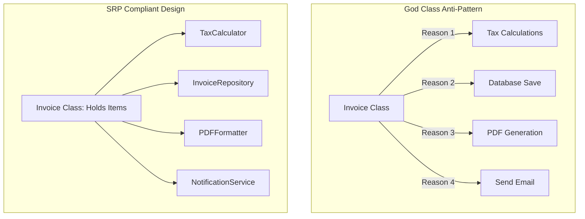

# Single Responsibility Principle (SRP)

## Introduction
The Single Responsibility Principle (SRP) is the first principle of the SOLID framework. It serves as a fundamental guideline for creating cohesive, maintainable, and testable modules in object-oriented system design.

## Problem Statement
When writing software, it is tempting to bundle all functionalities associated with a domain entity into a single class. For example, an `Invoice` class might manage invoice items, calculate taxes, format the output to HTML or PDF, save the data to a database, and email the invoice to a customer. This "God Class" pattern makes the class fragile: changes to the email library, database schema, or formatting rules will all force updates to the `Invoice` class, risking side effects across unrelated features.

## Why this exists
To isolate changes and minimize regression risks. By restricting a class to a single responsibility, you ensure that modifications to one business rule do not affect others, simplifying testing and making the codebase easier to maintain.

## Real-world analogy
Consider a **professional kitchen**.
- The **Chef** prepares the food.
- The **Host** seats the guests.
- The **Dishwasher** cleans the plates.
If a single person tries to perform all these duties (a "God Class"), the kitchen will quickly become chaotic. If the dishwasher breaks, the Chef should not have to stop cooking to repair it. Separating these tasks ensures the kitchen operates efficiently.

Another analogy is a **swiss army knife** vs **dedicated tools**. A swiss army knife is convenient but hard to use for heavy-duty work. If the knife blade breaks, you must replace the entire tool. Using dedicated tools (a separate screwdriver, separate scissors, and a separate knife) makes it easier to replace or upgrade a single tool without affecting the others.

## Definition
The Single Responsibility Principle states that a class should have one, and only one, reason to change. It is about organizing code so that each class focuses on a single responsibility.

## Key concepts
- **Reason to Change:** A source of change originating from a specific stakeholder or business requirement (e.g., changes to tax laws vs changes to PDF layouts).
- **High Cohesion:** The degree to which elements inside a class belong together. SRP promotes high cohesion.
- **Low Coupling:** The level of dependency between different classes. Separating responsibilities reduces coupling.
- **God Class Anti-Pattern:** A class that knows too much or does too much, serving as a dumping ground for unrelated logic.

## Internal working / Mermaid diagram



## Python/Java implementation

### Bad implementation
*A single `Invoice` class that handles invoice data, tax calculations, database storage, email notifications, and PDF formatting. It has five different reasons to change.*

```java
package bad;

import java.util.ArrayList;
import java.util.List;

public class Invoice {
    private final List<String> items = new ArrayList<>();
    private double amount;

    public void addItem(String item, double price) {
        items.add(item);
        amount += price;
    }

    // Responsibility 1: Business Logic / Calculation
    public double calculateTax() {
        return amount * 0.18; // Hardcoded GST rate
    }

    // Responsibility 2: Database Operations
    public void saveToDatabase() {
        System.out.println("Saving invoice to MySQL Database...");
    }

    // Responsibility 3: Formatting / Presentation
    public String generateHTMLReport() {
        return "<html><body>Invoice total: $" + (amount + calculateTax()) + "</body></html>";
    }

    // Responsibility 4: Notifications
    public void emailInvoiceToCustomer(String email) {
        System.out.println("Sending HTML invoice to " + email);
    }
}
```

### Better implementation
*The invoice data is separated from database and email operations, but the calculation rules and formatting logic remain coupled within the database handler.*

```java
package better;

import java.util.ArrayList;
import java.util.List;

class Invoice {
    private final List<String> items = new ArrayList<>();
    private double amount;

    public double getAmount() { return amount; }

    public void addItem(String item, double price) {
        items.add(item);
        amount += price;
    }
}

class InvoiceProcessor {
    // Better, but this class still mixes database writes, tax math, and printing logic
    public void process(Invoice invoice) {
        double tax = invoice.getAmount() * 0.18;
        double total = invoice.getAmount() + tax;
        
        System.out.println("Saving invoice to DB...");
        System.out.println("Printing receipt: $" + total);
    }
}
```

### Best implementation
*A fully SRP-compliant design. Each class has a single responsibility and only one reason to change, communicating via interfaces and parameters.*

```java
package best;

import java.util.ArrayList;
import java.util.Collections;
import java.util.List;

// 1. Domain Object: Holds data and basic state mutators
public class Invoice {
    private final List<InvoiceItem> items = new ArrayList<>();

    public void addItem(InvoiceItem item) {
        items.add(item);
    }

    public List<InvoiceItem> getItems() {
        return Collections.unmodifiableList(items);
    }

    public double getSubTotal() {
        return items.stream().mapToDouble(InvoiceItem::price).sum();
    }
}

record InvoiceItem(String name, double price) {}

// 2. Calculation Responsibility: Tax Calculator
class TaxCalculator {
    public double calculateTax(double amount, String taxRegion) {
        if ("EU".equalsIgnoreCase(taxRegion)) {
            return amount * 0.20;
        }
        return amount * 0.18; // Default
    }
}

// 3. Storage Responsibility: Repository
interface InvoiceRepository {
    void save(Invoice invoice);
}

class SqlInvoiceRepository implements InvoiceRepository {
    @Override
    public void save(Invoice invoice) {
        System.out.println("Saving Invoice to SQL database. Total: " + invoice.getSubTotal());
    }
}

// 4. Formatting Responsibility: Formatter
interface InvoiceFormatter {
    String format(Invoice invoice, double tax);
}

class HtmlInvoiceFormatter implements InvoiceFormatter {
    @Override
    public String format(Invoice invoice, double tax) {
        return "<html><body>Total: $" + (invoice.getSubTotal() + tax) + "</body></html>";
    }
}

// 5. Notification Responsibility: Email Sender
class InvoiceNotifier {
    public void notifyCustomer(String email, String content) {
        System.out.println("Email sent to " + email + " with content: " + content);
    }
}
```

## Step-by-step explanation
1. **Identify Responsibilities:** We break down the bad class into distinct operations: data management, calculations, storage, formatting, and messaging.
2. **Isolate domain models:** `Invoice` becomes a clean data carrier focusing only on managing `InvoiceItem` lists.
3. **Decouple database operations:** We introduce the `InvoiceRepository` interface to handle database operations separately.
4. **Decouple formatting and email logic:** `InvoiceFormatter` and `InvoiceNotifier` handle presentation and delivery separately, ensuring changes to formatting templates do not affect calculations.

## Multiple real-world examples
- **Web Architectures (MVC):** The Model handles data structure, the Controller handles application flow, and the View handles UI rendering.
- **Logging Libraries:** A `Logger` class captures log levels, a `LogFormatter` formats messages into JSON or plain text, and a `LogAppender` writes logs to files or console streams.
- **Payment Processing Gateways:** A `Cart` class stores products, a `PaymentProcessor` manages credit card connections, and an `EmailReceiptService` emails confirmations.

## Pros
- **Improved Testability:** Simpler to write isolated unit tests without mocking complex database drivers or SMTP connections.
- **Lower Bug Risk:** Changes in presentation formatting or tax rules are isolated and cannot corrupt database operations.
- **Enhanced Reusability:** The `InvoiceFormatter` can be reused to format credit notes or receipts without copying code.

## Cons
- **Class Proliferation:** Following SRP strictly can lead to many small classes, increasing the cognitive load required to understand the application structure.

## Interview questions

### Beginner
- **Q: What is the Single Responsibility Principle?**
- **A:** SRP states that a class should have only one reason to change, meaning it should perform a single job or responsibility.

### Intermediate
- **Q: How do you identify if a class violates SRP?**
- **A:** If a class imports both database libraries and UI framework packages, it is likely violating SRP. Additionally, if you describe the class's job using the word "and" (e.g., "This class calculates totals **and** saves them to SQL"), it has multiple responsibilities.

### Senior
- **Q: Does SRP mean a class should have only one method?**
- **A:** No. A class can have multiple methods as long as they all serve a single responsibility. For example, a `TextParser` class can contain methods like `parseHtml()`, `parseMarkdown()`, and `parseJson()`, because they all align with the single responsibility of parsing text.

### Staff Engineer
- **Q: How do you balance the trade-off between SRP class proliferation and system complexity in large microservice architectures?**
- **A:** Balance this trade-off using:
  1. **Package-by-Feature Packaging:** Group related SRP classes (e.g., repository, calculator, and formatter) into a single feature package. Keep implementation classes package-private and expose them only through a public interface.
  2. **Facade Pattern:** Use a Facade class to coordinate the calls to multiple small SRP classes, providing a simple entry point for clients.
  3. **Logical Cohesion Evaluation:** Avoid over-splitting classes. If two functions are always modified together for the same business reason, keep them in the same class to prevent unnecessary abstraction.

## Common mistakes
- **Creating God Helper Classes:** Building `Utils` or `Helper` classes that accumulate unrelated helper functions over time.
- **Over-splitting code:** Splitting classes so small that they lose their cohesion and context.

## Best practices
- Keep class sizes small (typically under 200 lines of code).
- Limit class imports to packages related to their single responsibility.
- Use dependency injection to compose classes with separate responsibilities.

## When NOT to use
- **Small-Scale Scripts:** For simple, one-off scripts, separating responsibilities into multiple classes introduces unnecessary boilerplate.

## Comparison with similar concepts
- **SRP vs Separation of Concerns (SoC):**
  - **SoC:** A broad architectural principle focused on separating an application into distinct layers (e.g., database, business logic, UI).
  - **SRP:** A class-level design principle focused on ensuring each class has only one reason to change.

## Summary
The Single Responsibility Principle reduces code fragility by restricting each class to a single job. Decoupling storage, calculations, and presentation rules ensures systems remain easy to test, maintain, and extend.

## Related topics
- [Open/Closed Principle](../open-closed-principle)
- [Dependency Inversion Principle](../dependency-inversion-principle)
- [Composition vs Inheritance](../../design-principles/composition-vs-inheritance)
