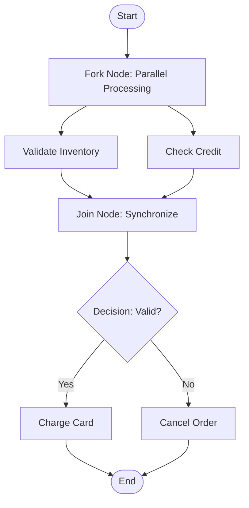

# Activity Diagrams

## Introduction
An Activity Diagram is a behavioral UML diagram used to model the control flow or data flow of a system. Essentially serving as an advanced, standardized flowchart, it highlights the sequence of actions, decisions, and parallel tasks required to execute a business process or algorithm.

## Problem Statement
When implementing workflows (like an e-commerce checkout process with inventory reservations, payment authorizations, and shipment bookings), writing nested conditional checks and managing multi-threaded asynchronous tasks leads to race conditions and spaghetti code. Without a visual map of execution states, developers struggle to synchronize concurrent tasks, leading to resource leaks.

## Why this exists
To model the dynamic, step-by-step execution of a process. Unlike Sequence Diagrams which focus on object-to-object communication, Activity Diagrams focus on the lifecycle of actions, helping developers coordinate parallel tasks and validate decision flows.

## Real-world analogy
Consider a **factory assembly line**.
Raw materials enter the line at the start node. The product moves to a station where it is split (fork) to run through separate processes simultaneously: one track stamps the product shell while another prepares the electronics. The tracks merge back together (join) to assemble the final product, which is inspected for quality before exiting the factory.

Another analogy is a **passport application workflow**. You submit your application. The agency performs two checks in parallel: validating your identity and verifying your payment. Once both checks succeed (join), the passport is printed and mailed to your address.

## Definition
A UML behavioral diagram that represents the step-by-step control flow and data flow of an activity, supporting decisions, iterations, forks, joins, and swimlanes.

## Key concepts & Notation
- **Initial Node (Start):** The starting point of the activity. Represented by a solid black circle.
- **Action State:** A step in the process where work is performed (e.g., `Validate Card`). Represented by a rounded rectangle.
- **Decision Node:** A diamond shape that branches the flow into multiple conditional paths based on guard conditions (e.g., `[Valid]`, `[Invalid]`).
- **Merge Node:** A diamond shape where alternate conditional paths come back together into a single flow.
- **Fork Node:** A thick black horizontal or vertical bar used to split a single flow into multiple parallel, concurrent paths.
- **Join Node:** A thick black bar that synchronizes parallel paths back into a single flow once all inputs succeed.
- **Final Node (End):** The point where the activity terminates. Represented by a bullseye circle.
- **Swimlanes (Partitions):** Columns that organize actions based on the actor or system performing them (e.g., `Customer`, `API Gateway`, `Database`).

## Internal working / Mermaid diagram



## Python/Java implementation

### Bad implementation
*A monolithic checkout method using nested, uncoordinated conditional checks and manual thread spawning. It lacks task synchronization, risking race conditions and data corruption.*

```java
package bad;

public class CheckoutManager {
    public void runCheckout(String item, double price) {
        // Bad: Spawns uncoordinated parallel threads without synchronizing them
        new Thread(() -> {
            System.out.println("Validating stock for: " + item);
        }).start();

        new Thread(() -> {
            System.out.println("Processing payment of: $" + price);
        }).start();

        // Race condition: printing receipt before validations complete!
        System.out.println("Receipt printed.");
    }
}
```

### Better implementation
*Using synchronous execution to prevent race conditions. While safe, it lacks parallel processing capabilities, increasing overall latency.*

```java
package better;

public class CheckoutManager {
    public void runCheckout(String item, double price) {
        // Runs sequentially, preventing race conditions but losing parallel performance
        boolean stockOk = validateStock(item);
        boolean paymentOk = processPayment(price);

        if (stockOk && paymentOk) {
            System.out.println("Checkout complete");
        } else {
            System.out.println("Checkout failed");
        }
    }

    private boolean validateStock(String item) { return true; }
    private boolean processPayment(double price) { return true; }
}
```

### Best implementation
*An executable Java simulation of a workflow coordinator representing an Activity Diagram. It models decision nodes, forks (parallel execution), joins (synchronization), and merge paths (conditional logic) as distinct steps in a thread-safe execution pipeline.*

```java
package best;

import java.util.concurrent.CompletableFuture;
import java.util.concurrent.ExecutorService;
import java.util.concurrent.Executors;

// 1. Define Action Results
record ActionResult(String actionName, boolean success) {}

public class CheckoutActivityPipeline {
    private final ExecutorService executor = Executors.newFixedThreadPool(4);

    public void executeCheckoutWorkflow(String itemId, double amount) {
        System.out.println("[Activity Pipeline] Starting checkout workflow...");

        // 2. Fork Node: Start parallel tasks concurrently
        CompletableFuture<ActionResult> inventoryTask = CompletableFuture.supplyAsync(() -> {
            System.out.println("[Task: Inventory] Checking stock for: " + itemId);
            // Simulate processing latency
            try { Thread.sleep(50); } catch (InterruptedException e) { Thread.currentThread().interrupt(); }
            return new ActionResult("Validate Inventory", true);
        }, executor);

        CompletableFuture<ActionResult> creditTask = CompletableFuture.supplyAsync(() -> {
            System.out.println("[Task: Credit] Checking credit balance for amount: " + amount);
            try { Thread.sleep(30); } catch (InterruptedException e) { Thread.currentThread().interrupt(); }
            return new ActionResult("Check Credit", amount <= 1000.0);
        }, executor);

        // 3. Join Node: Wait for both parallel tasks to complete
        CompletableFuture<Void> joinNode = CompletableFuture.allOf(inventoryTask, creditTask);

        joinNode.thenAccept(v -> {
            try {
                ActionResult inventoryResult = inventoryTask.get();
                ActionResult creditResult = creditTask.get();

                System.out.println("[Activity Pipeline] Join Node: Parallel tasks completed.");

                // 4. Decision Node & Merge Node
                if (inventoryResult.success() && creditResult.success()) {
                    // [Validation Passed] Guard Path
                    executePayment(itemId, amount);
                } else {
                    // [Validation Failed] Guard Path
                    cancelOrder(itemId);
                }
            } catch (Exception e) {
                System.err.println("Workflow execution error: " + e.getMessage());
                cancelOrder(itemId);
            }
        }).join(); // Block main thread to complete execution trace
        
        executor.shutdown();
    }

    private void executePayment(String itemId, double amount) {
        System.out.println("[Action: Payment] Charged $" + amount + " for item " + itemId);
        System.out.println("[Activity Pipeline] Workflow Finished: SUCCESS");
    }

    private void cancelOrder(String itemId) {
        System.out.println("[Action: Cancellation] Order cancelled for item: " + itemId);
        System.out.println("[Activity Pipeline] Workflow Finished: FAILED");
    }
}
```

## Step-by-step explanation
1. **Model the Fork Node:** We use Java's `CompletableFuture.supplyAsync` to split execution into parallel threads running on a thread pool.
2. **Model the Join Node:** We use `CompletableFuture.allOf` to synchronize the parallel threads, ensuring both tasks finish before moving forward.
3. **Model the Decision Node:** Once the join completes, we evaluate the results (`inventoryResult.success() && creditResult.success()`) to branch execution.
4. **Merge Back Paths:** The paths merge to call the final actions (`executePayment` or `cancelOrder`), resolving the workflow.

## Multiple real-world examples
- **Order Fulfillment Pipelines:** Manages validating credit cards, checking warehouses, and preparing shipping labels in parallel.
- **CI/CD Build Pipelines:** Runs unit tests, static code analysis, and style checks concurrently, block-joining them before permitting deployment.
- **Enterprise Travel Booking:** books flights, hotels, and car rentals simultaneously, reversing actions if any booking fails.

## Pros
- **Visually Models Concurrency:** Simplifies representing parallel threads (Forks/Joins) compared to text-based descriptions.
- **Clarifies Complex Branching:** Breaks down nested conditionals and loops into clean visual flows.
- **Simplifies Process Mapping:** Organizes task ownership clearly using swimlanes.

## Cons
- **Limited Object Detail:** Does not show class fields or object-to-object interactions (which belong in class and sequence diagrams).

## Interview questions

### Beginner
- **Q: What is the purpose of a Fork Node in an Activity Diagram?**
- **A:** A Fork Node is used to split a single execution flow into multiple parallel paths, allowing tasks to run concurrently.

### Intermediate
- **Q: How does a Decision Node differ from a Fork Node?**
- **A:**
  - **Decision Node:** Represents conditional branching (XOR). The flow follows only *one* of the exit paths based on a guard condition.
  - **Fork Node:** Represents parallel execution (AND). The flow follows *all* exiting paths simultaneously.

### Senior
- **Q: When would you use an Activity Diagram instead of a Sequence Diagram during system design?**
- **A:** Use an Activity Diagram when modeling complex workflows, algorithmic logic, and parallel processing where object communication details are less important than the flow of actions. Activity diagrams are process-centric, while sequence diagrams are object-centric.

### Staff Engineer
- **Q: In high-throughput event-driven systems, how do you handle Fork-Join workflow failures (e.g., partial successes)?**
- **A:** Handle partial failures using:
  1. **The Saga Pattern:** Define compensating actions for each step (e.g., if payment succeeds but shipping fails, trigger a refund action).
  2. **Idempotency keys:** Ensure all tasks in the workflow accept idempotency keys to allow safe retries.
  3. **Event-driven coordination:** Use orchestrator services or state machine libraries (like temporal.io or AWS Step Functions) to manage execution state and recovery.

## Common mistakes
- **Omitting Join Nodes:** Forking parallel processes without using a Join node to synchronize them, creating potential race conditions in the model.
- **Adding too much detail:** Including low-level code details (like loops or variable declarations) instead of keeping actions focused on business goals.

## Best practices
- Use swimlanes to define task ownership across systems or actors.
- Always pair Fork nodes with corresponding Join nodes to prevent race conditions.
- Keep actions high-level and focused on business processes.

## When NOT to use
- **Simple Linear Workflows:** Do not draw diagrams for simple, sequential code paths with no branching or concurrency.

## Comparison with similar concepts
- **Activity Diagram vs State Machine Diagram:**
  - **Activity Diagram:** Models the flow of *activities* and actions sequentially across multiple components.
  - **State Machine Diagram:** Models how a single *object* changes states in response to external events (e.g., an `Order` transitioning from `PENDING` to `PAID`).

## Summary
Activity Diagrams map out complex business processes and workflows. Implementing parallel pipelines in code using fork-join models ensures concurrent tasks are synchronized safely.

## Related topics
- [Sequence Diagrams](../sequence-diagrams)
- [Use Case Diagrams](../use-case-diagrams)
- [Saga Pattern](../../../02-hld/microservices/saga-pattern)
