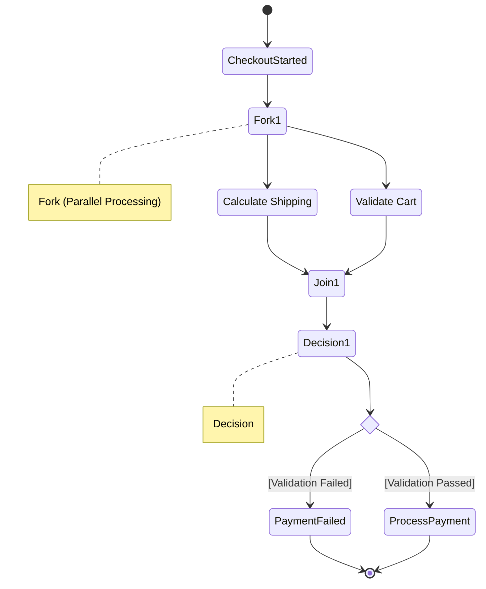

# Activity Diagrams

## Introduction
An Activity Diagram is a behavioral UML diagram used to model the flow of control or flow of data in a system. It is essentially an advanced, standardized flowchart.

## Problem Statement
While a Sequence Diagram shows interactions *between objects*, it is terrible at showing complex internal logic (like massive `if/else` trees, `while` loops, or parallel multi-threading processes). If you need to map out the exact, step-by-step business logic algorithm of a single complex method (like processing a payment), you need an Activity Diagram.

## Why this exists
To model the dynamic behavior of a system, specifically focusing on the step-by-step execution of an algorithm or business process. It makes complex procedural logic visually comprehensible.

## Real-world analogy
An Activity Diagram is like an assembly line in a factory. 
You see the raw material start at the beginning. It moves to Station A. If it's a premium product, it routes to Station B; otherwise, it routes to Station C. Sometimes, the product is split in two and processed simultaneously on parallel tracks, before being merged back together and sent out the exit door.

## Definition
A graphical representation of workflows of stepwise activities and actions with support for choice, iteration, and concurrency.

## Key concepts & Notation

### 1. Initial Node (Start)
The starting point of the activity.
- *Notation:* A solid black circle.

### 2. Activity / Action State
A step in the process where some work is performed.
- *Notation:* A rectangle with rounded corners (e.g., `Validate Credit Card`).

### 3. Decision Node & Merge Node
- **Decision (Branch):** Used for conditional logic (`if/else`). One arrow goes in, multiple come out with "Guard Conditions" (e.g., `[Valid]`, `[Invalid]`).
- **Merge:** Where multiple alternate paths come back together.
- *Notation:* An empty diamond shape.

### 4. Fork Node & Join Node
- **Fork (Concurrency):** Used to split a single flow into multiple **parallel/concurrent** threads. One arrow goes in, multiple come out.
- **Join:** Where multiple parallel threads wait for each other and merge back into a single thread.
- *Notation:* A thick black horizontal or vertical bar.

### 5. Final Node (End)
The point where the entire activity process terminates.
- *Notation:* A solid black circle surrounded by a hollow circle (a bullseye).

### 6. Swimlanes (Partitions)
Used to organize activities by *who* or *what* is performing them. The diagram is divided into vertical or horizontal columns (e.g., `Customer`, `Frontend App`, `Backend DB`).

## Internal working / Mermaid diagram

*Example: An E-commerce Checkout Process using Swimlanes and Concurrency.*

## When NOT to use
- **Do not use for object interactions:** If you want to show how the `OrderService` talks to the `PaymentGateway`, a Sequence Diagram is vastly superior.
- **Do not use for static structures:** Do not use this to show class hierarchies.

## Interview questions

### Beginner
- **Q: What is the main difference between a Decision Node and a Fork Node?**
  - **A:** A Decision Node (diamond) represents conditional logic (XOR) — the flow goes down *one* of the possible paths. A Fork Node (thick bar) represents concurrency (AND) — the flow goes down *all* of the paths simultaneously in parallel.

### Intermediate
- **Q: What is a "Guard Condition"?**
  - **A:** It is a boolean expression written in square brackets (e.g., `[balance > 0]`) placed on the arrows exiting a Decision Node to dictate which path the flow will take.

### Senior
- **Q: When would you choose an Activity Diagram over a Sequence Diagram?**
  - **A:** Sequence diagrams are object-centric; they show *who* is talking to *whom*. Activity diagrams are process-centric; they show the internal algorithmic flow of *how* a specific task is accomplished, especially when dealing with parallel processing, complex loops, or business workflows that span human and system actors (using swimlanes).

## Common mistakes
- **Forgetting Join Nodes:** If you use a Fork to create parallel processes, you generally must use a Join node to synchronize them back together before proceeding. If you don't, you've modeled a race condition.
- **Using an Activity Diagram just for simple linear code:** If your code is just 10 lines of sequential method calls with no loops or logic branches, an Activity Diagram is a waste of time.

## Best practices
- Use **Swimlanes** heavily when modeling business processes. Seeing exactly which system (or human) is responsible for a specific action block makes the diagram infinitely more valuable.
- Keep the actions at a high level. (e.g., `Calculate Tax` is good. `int i = 0` is bad).

## Summary
Activity Diagrams are the ultimate tool for mapping out algorithmic logic and business workflows. By supporting robust notation for parallel processing (Forks/Joins) and conditional branching, they allow developers to perfectly plan and visualize complex, multi-threaded processes.

## Related topics
- [Sequence Diagrams](../sequence-diagrams)
- [Use Case Diagrams](../use-case-diagrams)
