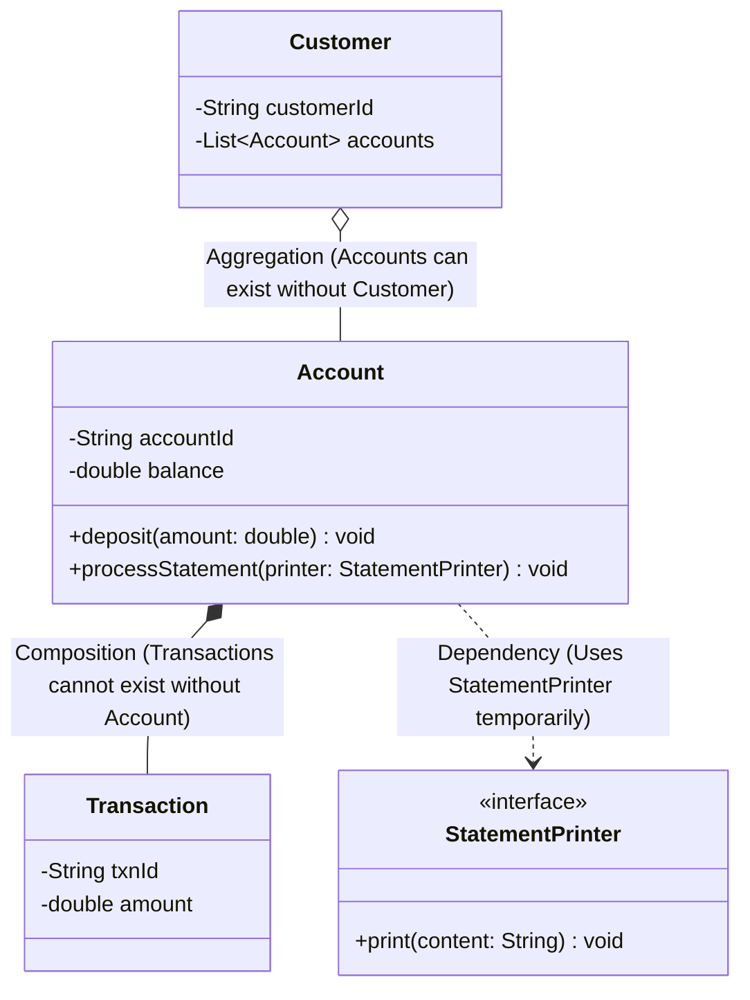

# Class Diagrams

## Introduction
A Class Diagram is a static structure diagram in the Unified Modeling Language (UML) that describes the structure of an object-oriented system. It maps out classes, their attributes, methods, and the relationships that bind objects together.

## Problem Statement
Jumping straight into writing code for a complex system (like a banking application with `Accounts`, `Ledgers`, and `PaymentGateways`) leads to circular dependencies, violating the Single Responsibility Principle, and creating brittle class structures. Without a static map, developers cannot easily trace how a change in one class impacts adjacent classes.

## Why this exists
To provide a language-agnostic blueprint of the system's static architecture. It allows architects to verify responsibilities, model object lifecycles, and communicate the design before writing code.

## Real-world analogy
Consider the **blueprint of a house**.
The blueprint shows the static layout: where the walls are, how rooms connect, and where doors are positioned. It does not show people walking through the rooms or the flow of electricity (which would be behavioral modeling). It defines the static structure.

Another analogy is a **parts catalog for an automobile**. The catalog lists the engine block, pistons, and wheels, along with how they assemble together. The engine contains pistons (composition), while the car holds a toolkit (aggregation) that can be removed without affecting the car's core structure.

## Definition
A static UML structure diagram that visualizes system classes, their internal contents (attributes, methods), and their structural relationships (inheritance, association, aggregation, composition, and dependency).

## Key concepts & Notation
- **Class Box:** A rectangle divided into three compartments:
  1. **Top Compartment:** Class Name (bold, centered. Italics indicate abstract classes).
  2. **Middle Compartment:** Attributes/Fields with visibility modifiers (e.g., `- balance: double`).
  3. **Bottom Compartment:** Methods/Operations (e.g., `+ deposit(amount: double): void`).
- **Visibility Modifiers:**
  - `+` Public (visible to all classes)
  - `-` Private (visible only within the class)
  - `#` Protected (visible to subclasses and package classes)
  - `~` Package-Private (default, visible to classes in the same package)
- **Structural Relationships:**
  - **Dependency (`A ..> B`):** A weak relationship where Class A uses Class B temporarily (e.g., as a parameter in a method call).
  - **Association (`A --> B`):** A structural connection where Class A maintains a reference to Class B.
  - **Aggregation (`A o-- B`):** A weak "HAS-A" relationship where the child can exist independently of the parent (e.g., a `Department` and a `Professor`).
  - **Composition (`A *-- B`):** A strong "HAS-A" relationship where the child's lifecycle is bound to the parent (e.g., a `House` and a `Room`). If the parent is destroyed, the child is destroyed.
  - **Generalization (`A --|> B`):** Inheritance, indicating an "IS-A" relationship (e.g., a `Car` inherits from `Vehicle`).
  - **Realization (`A ..|> B`):** Interface implementation (e.g., a class implementing a `PaymentProcessor` interface).

## Internal working / Mermaid diagram



## Python/Java implementation

### Bad implementation
*A confused Java design where composition is represented using public mutable fields. Sub-components like `Room` can be detached, shared across multiple `House` instances, or modified externally, violating composition invariants.*

```java
package bad;

import java.util.ArrayList;
import java.util.List;

class Room {
    public String roomType; // Public field leaks state
    
    public Room(String roomType) {
        this.roomType = roomType;
    }
}

class House {
    // Violates composition: public mutable list allows external modification
    public List<Room> rooms = new ArrayList<>();

    public House() {
        // Rooms can be added from outside, letting them survive independent of the House
    }
}
```

### Better implementation
*Using private fields and encapsulating room lists, but still leaking internal references in getters, allowing callers to manipulate the list outside the class.*

```java
package better;

import java.util.ArrayList;
import java.util.List;

class Room {
    private String roomType;
    public Room(String roomType) { this.roomType = roomType; }
    public String getRoomType() { return roomType; }
}

class House {
    private final List<Room> rooms;

    public House() {
        this.rooms = new ArrayList<>();
    }

    public void addRoom(String type) {
        rooms.add(new Room(type));
    }

    // Leaky getter: exposes internal collection to external mutation
    public List<Room> getRooms() {
        return this.rooms;
    }
}
```

### Best implementation
*A Java implementation reflecting UML relationships: composition uses final fields with bound lifecycles; aggregation uses separate object references; and dependency is passed as a method parameter.*

```java
package best;

import java.util.ArrayList;
import java.util.Collections;
import java.util.List;
import java.util.Objects;

// 1. Dependency Interface
interface StatementPrinter {
    void print(String content);
}

// 2. Composition Target: Transaction (Lifecycle managed entirely by Account)
class Transaction {
    private final String txnId;
    private final double amount;

    public Transaction(String txnId, double amount) {
        this.txnId = Objects.requireNonNull(txnId);
        this.amount = amount;
    }

    public double getAmount() { return amount; }
}

// 3. Composition Container: Account manages Transaction lifecycles
class Account {
    private final String accountId;
    private double balance;
    private final List<Transaction> transactions; // Composition (Internal final lifecycle)

    public Account(String accountId, double initialBalance) {
        this.accountId = Objects.requireNonNull(accountId);
        this.balance = initialBalance;
        this.transactions = new ArrayList<>(); // Instantiated within constructor
    }

    public void addTransaction(String txnId, double amount) {
        // Composition: Child instantiated inside parent constructor/methods
        // Cannot be leaked or modified externally
        Transaction txn = new Transaction(txnId, amount);
        this.transactions.add(txn);
        this.balance += amount;
    }

    // Safe read: returns unmodifiable view, protecting composition invariants
    public List<Transaction> getTransactions() {
        return Collections.unmodifiableList(transactions);
    }

    // Dependency: StatementPrinter passed as parameter (temporary uses relationship)
    public void printStatement(StatementPrinter printer) {
        printer.print("Statement for Account: " + accountId + ", Balance: " + balance);
    }
}

// 4. Aggregation Container: Customer HAS-A list of Accounts
class Customer {
    private final String customerId;
    // Aggregation: Accounts exist independently. If Customer is deleted, Accounts remain.
    private final List<Account> accounts; 

    public Customer(String customerId) {
        this.customerId = Objects.requireNonNull(customerId);
        this.accounts = new ArrayList<>();
    }

    public void associateAccount(Account account) {
        this.accounts.add(Objects.requireNonNull(account)); // Add externally created object
    }

    public List<Account> getAccounts() {
        return Collections.unmodifiableList(accounts);
    }
}
```

## Step-by-step explanation
1. **Model Composition:** In `best.Account`, the list of `Transaction` objects is private, final, and managed entirely within the class. Callers cannot add transactions directly, ensuring that transactions are bound to the account's lifecycle.
2. **Model Aggregation:** In `best.Customer`, accounts are created externally and passed in via `associateAccount()`. If the `Customer` object is garbage collected, the `Account` objects remain active in the system.
3. **Model Dependency:** In `best.Account.printStatement()`, the `StatementPrinter` is passed as a method parameter rather than being stored as a field, indicating a temporary "uses" relationship.

## Multiple real-world examples
- **E-commerce Systems:** An `Order` owns its `OrderLineItems` (composition), while `Products` exist independently of the orders (aggregation).
- **GUI Desktop Frameworks:** A `Window` contains `Buttons` and `TextFields` (composition). If the window is closed, the button components are disposed.
- **Enterprise Databases:** An `Organization` owns its `Branches` (composition), while `Employees` are associated with branches (aggregation).

## Pros
- **Clear Architecture:** Visually maps out the static dependencies and relationships of a system.
- **Design Review:** Helps identify circular dependencies and violations of the Single Responsibility Principle before writing code.
- **Onboarding Documentation:** Serves as a reference for new developers to understand the codebase.

## Cons
- **Maintenance Overhead:** Static UML diagrams can quickly become outdated in fast-paced agile development cycles unless automatically generated from code.

## Interview questions

### Beginner
- **Q: What is the difference between Aggregation and Composition?**
- **A:** Both are "HAS-A" relationships. Aggregation is a weak relationship where the child can exist independently of the parent (e.g., a `Library` and a `Book`). Composition is a strong relationship where the child's lifecycle is bound to the parent; if the parent is destroyed, the child is destroyed (e.g., a `Book` and a `Page`).

### Intermediate
- **Q: How do you represent an interface implementation in a class diagram?**
- **A:** Interface implementation (realization) is represented by a dashed line with a hollow triangle pointing from the concrete class to the interface.

### Senior
- **Q: How do Class Diagrams support the Dependency Inversion Principle (DIP)?**
- **A:** Class diagrams make dependency directions visible. By modeling relationships to point toward interfaces (`<<interface>>`) rather than concrete classes, architects can verify that high-level modules depend on abstractions rather than low-level details.

### Staff Engineer
- **Q: In Java, how do you handle memory management and prevent garbage collection leaks in Composition vs Aggregation relationships?**
- **A:**
  - **Composition:** Since the parent manages the child's lifecycle, avoid leaking references to the child objects. Returning unmodifiable wrappers (e.g., `Collections.unmodifiableList()`) or defensive copies prevents external references from keeping child objects in memory after the parent is collected.
  - **Aggregation:** Because objects exist independently, clean up associations when they are no longer needed. Use weak references (`WeakReference`) for caches or dynamic associations to allow the JVM's garbage collector to reclaim memory without requiring manual dereferencing.

## Common mistakes
- **Confusing Aggregation and Composition arrows:** Using a filled diamond (composition) when the target object's lifecycle is independent of the container.
- **Modeling dynamic behaviors:** Trying to show method invocation orders, loops, or conditionals in a static class diagram. These belong in sequence or activity diagrams.

## Best practices
- Focus on high-level relationships and key attributes rather than detailing every getter and setter.
- Keep inheritance hierarchies shallow (1-2 levels).
- Draw interfaces to make system boundaries and contracts explicit.

## When NOT to use
- **Simple scripts or single-class apps:** If a system has few classes and no complex relationships, drawing class diagrams adds unnecessary documentation overhead.

## Comparison with similar concepts
- **Class Diagram vs Entity-Relationship Diagram (ERD):**
  - **Class Diagram:** Models static object structures, visibility, behaviors (methods), and OOP relationships.
  - **ERD:** Models database schemas, tables, keys, and data relationships, without representing behaviors or methods.

## Summary
Class Diagrams provide a static map of a system's architecture. Correctly modeling composition, aggregation, and dependencies in code keeps relationships clear and decoupling effective.

## Related topics
- [Sequence Diagrams](../sequence-diagrams)
- [Composition vs Inheritance](../../design-principles/composition-vs-inheritance)
- [SOLID Principles](../../solid-principles)
