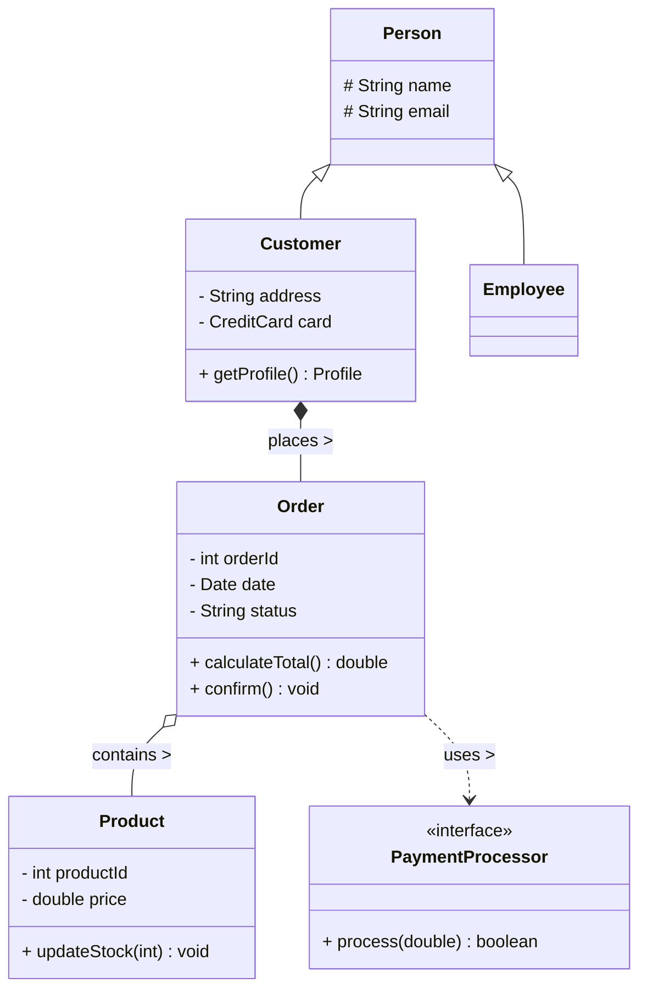

# Class Diagrams

## Introduction
A Class Diagram is the backbone of Object-Oriented modeling. It is a static structure diagram in the Unified Modeling Language (UML) that describes the structure of a system by showing its classes, their attributes, operations (methods), and the relationships among objects.

## Problem Statement
When designing a complex object-oriented system (like an e-commerce platform with `Users`, `Carts`, `Products`, and `Orders`), jumping straight into writing Java or Python code is a recipe for disaster. Without a visual map, developers will inevitably create circular dependencies, misunderstand class responsibilities, and build brittle inheritance trees.

## Why this exists
To provide a clear, language-agnostic blueprint of the system's static architecture. It allows architects to communicate the design to developers, and developers to verify that their code matches the intended architecture before writing thousands of lines of code.

## Real-world analogy
A Class Diagram is exactly like an architectural blueprint for a building. The blueprint shows the rooms, the doors, and how the rooms connect to each other. It doesn't show *people* walking through the rooms (that would be a behavioral diagram, like a Sequence Diagram).

## Definition
A visual representation of classes and their static relationships, including inheritance, aggregation, composition, and associations.

## Key concepts & Notation

### 1. The Class Box
A class is represented by a rectangle divided into three compartments:
1. **Top:** Class Name (e.g., `Customer`). Centered and bold.
2. **Middle:** Attributes/Fields (e.g., `- name: String`). 
3. **Bottom:** Operations/Methods (e.g., `+ placeOrder(): void`).

### 2. Visibility (Access Modifiers)
- `+` : Public
- `-` : Private
- `#` : Protected
- `~` : Package/Default

### 3. Relationships (The core of the diagram)
How classes interact with each other.

- **Dependency (Uses):** A weak relationship. Class A uses Class B temporarily (e.g., passing B as a parameter in a method). 
  - *Notation:* Dashed line with an open arrow `A - - -> B`.
- **Association (Knows):** A structural relationship where objects of one class are connected to objects of another (e.g., `Teacher` and `Student`). 
  - *Notation:* Solid line `A ------- B`.
- **Aggregation (Has-A, Weak):** A "whole/part" relationship where the part can exist independently of the whole. (e.g., `Department` and `Professor`. If the Department closes, the Professor still exists).
  - *Notation:* Solid line with an **empty diamond** at the "whole" end `Whole <>------- Part`.
- **Composition (Has-A, Strong):** A strict "whole/part" relationship. The part cannot exist without the whole. (e.g., `House` and `Room`. If the House is destroyed, the Room ceases to exist).
  - *Notation:* Solid line with a **filled/black diamond** at the "whole" end `Whole *------- Part`.
- **Inheritance/Generalization (Is-A):** A child class inherits from a parent class.
  - *Notation:* Solid line with a large **empty triangle** pointing to the parent `Child -------|> Parent`.
- **Realization (Implements):** A class implements an interface.
  - *Notation:* Dashed line with a large **empty triangle** pointing to the interface `Class - - - |> Interface`.

## Internal working / Mermaid diagram



## Python/Java implementation

*Class diagrams map directly to code structure. The diagram above translates exactly to:*

```java
// Inheritance
abstract class Person {
    protected String name;
    protected String email;
}

class Customer extends Person {
    private String address;
    private CreditCard card; // Composition (usually)
    
    // The relationship Customer *-- Order
    private List<Order> orders = new ArrayList<>();
}

class Order {
    private int orderId;
    
    // Aggregation: Order holds references to Products, but doesn't "own" their lifecycle
    private List<Product> products = new ArrayList<>();
    
    // Dependency: Passed in to a method temporarily
    public void confirm(PaymentProcessor processor) {
        processor.process(this.calculateTotal());
    }
}
```

## Pros
- **Clarity:** Instantly shows the overall structure of the system without reading thousands of lines of code.
- **Design Validation:** Helps identify circular dependencies or God Classes early in the design phase.
- **Documentation:** Serves as excellent technical documentation for onboarding new developers.

## Cons
- **Maintenance:** As code rapidly changes during agile development, UML diagrams quickly become outdated if not rigorously maintained or automatically generated.
- **Over-detailing:** Trying to draw every single getter, setter, and helper method creates a massive, unreadable diagram. Diagrams should focus on high-level architecture.

## Interview questions

### Beginner
- **Q: What is the difference between Aggregation and Composition?**
  - **A:** Both are "Has-A" relationships. Aggregation is weak (the child can exist without the parent, like `Car` and `Passenger`). Composition is strong (the child is destroyed if the parent is destroyed, like `Car` and `Engine`).

### Intermediate
- **Q: How do you represent an Interface in a Class Diagram?**
  - **A:** Using the `<<interface>>` stereotype above the name. A class implementing it uses a dashed line with a hollow triangle pointing to the interface.

### Senior
- **Q: During an LLD interview, should you draw a complete, rigorous UML class diagram?**
  - **A:** Rarely. Drawing perfectly strict UML (with exact diamond shapes and visibility modifiers) wastes time. Focus on "UML-lite": drawing boxes for classes, showing key relationships with simple arrows, and writing out the 2-3 most critical methods. The goal is communication, not syntax perfection.

## Common mistakes
- **Confusing Inheritance and Composition arrows:** Drawing an inheritance arrow (triangle) when it should be an association (line). 
- **Drawing behavioral logic:** Class diagrams are *static*. Do not try to show loops, if-statements, or the sequence of events. That belongs in a Sequence Diagram.

## Summary
Class Diagrams are the foundation of Object-Oriented Low-Level Design. By mastering the notation for Inheritance, Composition, and Aggregation, developers can create robust, visually understandable architectures before writing a single line of code.

## Related topics
- [Sequence Diagrams](../sequence-diagrams)
- [Composition vs Inheritance](../../design-principles/composition-vs-inheritance)
