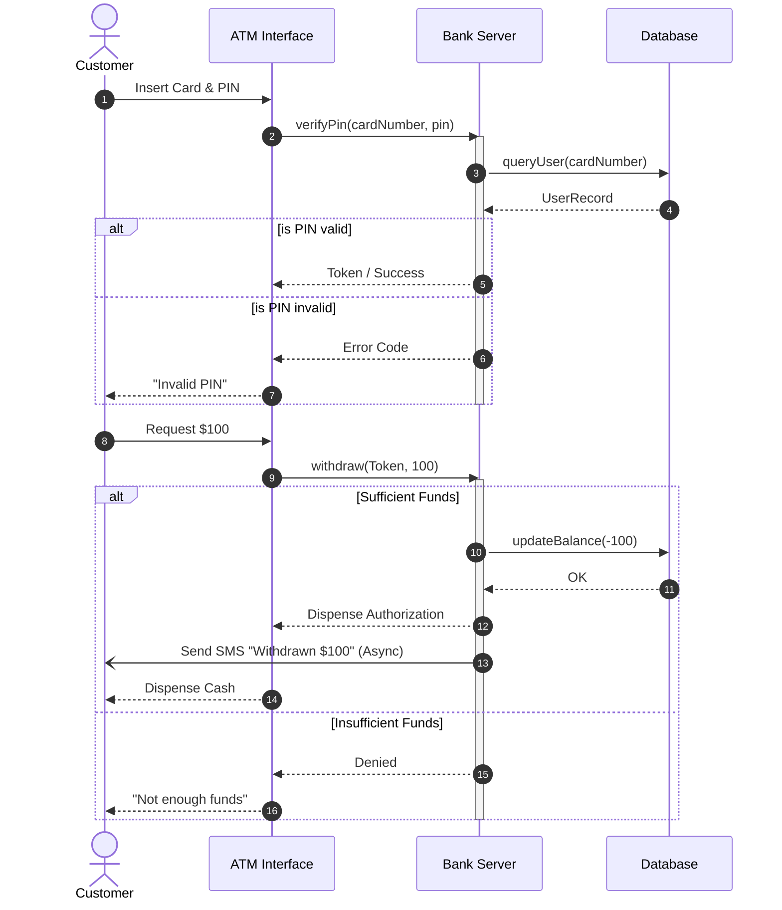

# Sequence Diagrams

## Introduction
A Sequence Diagram is an interaction diagram in the Unified Modeling Language (UML). While Class Diagrams show the *static* structure of a system (the blueprint), Sequence Diagrams show the *dynamic* behavior. They detail how objects interact with each other and in what exact time-order those interactions occur.

## Problem Statement
You have designed your classes (`User`, `AuthService`, `Database`, `EmailService`). But how exactly does the "Forgot Password" feature work? Which object calls which object? When does the database get updated? When does the email fire? Without a Sequence Diagram, developers have to read through deeply nested function calls across five different files to understand the flow of execution.

## Why this exists
To visualize the flow of logic over time. It is the best tool for modeling specific use cases, API flows, or complex distributed transactions, allowing developers to spot missing steps, race conditions, or infinite loops before writing code.

## Real-world analogy
Think of a play script in a theater. 
A Class Diagram just lists the cast of characters. 
A Sequence Diagram is the actual script: it shows exactly when Actor A speaks to Actor B, and how Actor B responds, from the beginning of the scene to the end.

## Definition
A UML diagram that shows object interactions arranged in time sequence. It depicts the objects involved in a scenario and the sequence of messages exchanged between them.

## Key concepts & Notation

### 1. Lifelines
Vertical dashed lines representing the lifespan of an object during the interaction. Time flows from top to bottom.
- *Notation:* A box at the top containing `ObjectName: ClassName` with a dashed line dropping down.

### 2. Messages (Method Calls)
Horizontal arrows between lifelines representing communication (usually method calls or HTTP requests).
- **Synchronous Message:** The sender waits for a response (e.g., standard function call). *Notation:* Solid line with a **solid arrowhead**.
- **Asynchronous Message:** The sender does not wait (e.g., firing a Kafka event). *Notation:* Solid line with an **open arrowhead**.
- **Return Message:** The response back to the sender. *Notation:* Dashed line with an **open arrowhead**.

### 3. Activation Boxes (Execution Occurrences)
Thin rectangles on the lifeline showing the duration that an object is actively processing something.

### 4. Fragments (Control Structures)
Frames that enclose a section of the diagram to show logic:
- **`alt` (Alternative):** Like an `if-else` statement. 
- **`opt` (Optional):** Like a simple `if` statement.
- **`loop`:** A `for` or `while` loop.

## Internal working / Mermaid diagram

*Example: An ATM Cash Withdrawal Flow*

## When NOT to use
- **Do not use for extreme low-level logic:** You shouldn't draw a sequence diagram to show `i++` inside a loop or basic string manipulation.
- **Do not use for static structures:** If you just want to show that a `Car` has an `Engine`, use a Class Diagram.

## Interview questions

### Beginner
- **Q: What direction does time flow in a Sequence Diagram?**
  - **A:** From top to bottom. The first message is at the top, the last is at the bottom.

### Intermediate
- **Q: What is the difference between a solid arrowhead and an open arrowhead on a message?**
  - **A:** A solid arrowhead indicates a synchronous message (the caller blocks and waits for a return). An open arrowhead indicates an asynchronous message (the caller fires the message and immediately continues executing).

### Senior
- **Q: In a system design interview, when would you draw a Sequence Diagram?**
  - **A:** It is the perfect tool for explaining complex, multi-actor workflows, such as OAuth 2.0 authentication flows, Saga Pattern distributed transactions, or the lifecycle of a web socket connection.

## Common mistakes
- **Too much detail:** Diagramming every single internal helper method. Only show inter-object communication that crosses architectural boundaries or is critical to the business logic.
- **Missing Returns:** Forgetting to draw the dashed return arrows for synchronous calls, leaving the reader wondering what data came back.

## Best practices
- Keep diagrams focused on a **single use case** (the "Happy Path"). If error handling is complex, draw a separate sequence diagram for the "Error Path" rather than cluttering one diagram with massive `alt` fragments.
- Name your messages clearly as API endpoints (`POST /login`) or method signatures (`verifyUser(id)`).

## Summary
Sequence Diagrams are the ultimate tool for understanding *how* a system actually works in real-time. By mapping out the exact sequence of method calls across multiple services, developers can design robust, race-condition-free workflows for even the most complex business requirements.

## Related topics
- [Class Diagrams](../class-diagrams)
- [OAuth](../../../02-hld/security/oauth)
