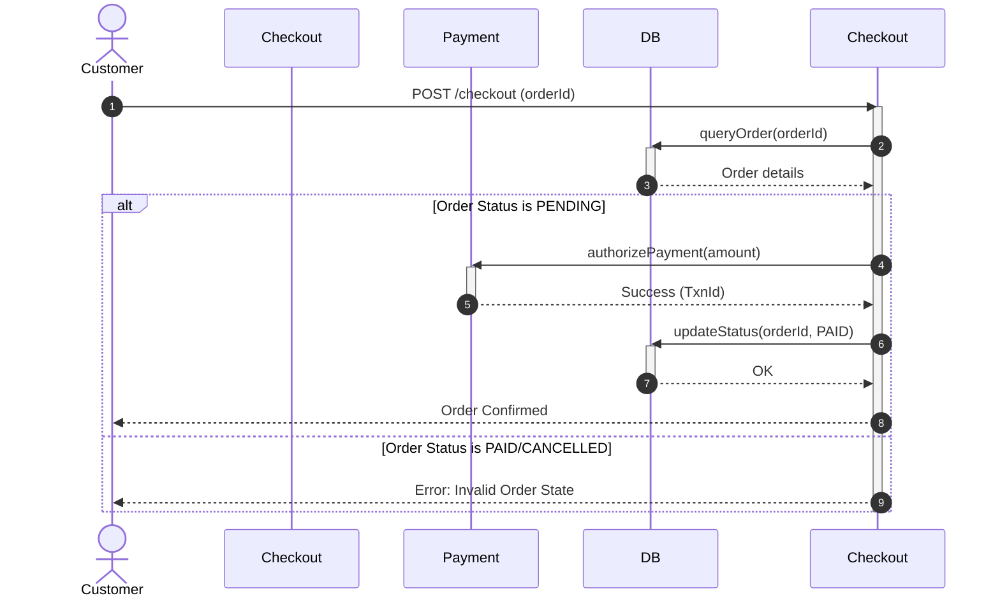

# Sequence Diagrams

## Introduction
A Sequence Diagram is an interaction diagram in the Unified Modeling Language (UML). While Class Diagrams show the static structure of a system, Sequence Diagrams show the dynamic behavior. They detail how objects interact with each other and in what exact chronological order.

## Problem Statement
When designing complex multi-component features (such as user checkouts or distributed transactions), jumping straight to implementation results in circular calls, race conditions, and undocumented dependencies. Without a sequence map, developers must read through nested method calls across multiple files to understand the control flow, making debugging difficult.

## Why this exists
To model the dynamic execution flow of a system over time. Sequence diagrams help developers map out API endpoints, verify transaction lifecycles, and identify design flaws (such as missing return statements or slow blocking calls) before writing code.

## Real-world analogy
Consider a **play script in a theater**.
The Class Diagram lists the cast of characters and their basic descriptions (static).
The **Sequence Diagram is the script itself**: it shows exactly when Character A speaks to Character B, what they say, and how Character B responds, ordered from the start of the scene to the end.

Another analogy is a **postal tracking log**. The log records the sequential package handoffs: Sender $\to$ Post Office $\to$ Distribution Hub $\to$ Delivery Vehicle $\to$ Recipient, documenting the chronological path of delivery.

## Definition
A UML interaction diagram that visualizes how processes and objects interact with each other in a sequential time frame, detailing the messages exchanged.

## Key concepts & Notation
- **Lifelines:** Vertical dashed lines representing the lifespan of an object during the interaction. Time flows from top to bottom.
- **Activation Boxes (Execution Occurrence):** Thin vertical rectangles on the lifeline indicating when an object is actively executing an operation.
- **Messages (Arrows):** Horizontal lines representing method calls, REST calls, or events:
  - **Synchronous Message (`A ->> B`):** The caller blocks and waits for a response. Represented by a solid line with a **solid arrowhead**.
  - **Asynchronous Message (`A -) B`):** The caller sends the message and continues execution immediately. Represented by a solid line with an **open arrowhead**.
  - **Return Message (`B -->> A`):** The response returning data to the caller. Represented by a dashed line with an **open arrowhead**.
- **Fragments (Frames):** Enclosures used to represent programming logic:
  - `alt` (Alternative): Represents conditional logic (if-else).
  - `opt` (Optional): Represents optional execution paths (if).
  - `loop`: Represents loops (for/while).

## Internal working / Mermaid diagram



## Python/Java implementation

### Bad implementation
*A chaotic design where checkout flows execute circular callbacks across database, payment, and user alert modules without structured call tracking, resulting in spaghetti dependencies.*

```java
package bad;

class Database {
    public void save(String info) {
        System.out.println("Saved: " + info);
        // Bad circular dependency: DB triggers notification directly!
        new AlertService().sendAlert("user@example.com", "Saved data");
    }
}

class AlertService {
    public void sendAlert(String email, String msg) {
        System.out.println("Alert: " + msg);
        // Circular: alert triggers a database log update!
        new Database().save("Log Alert: " + email);
    }
}
```

### Better implementation
*A synchronous checkout execution flow. While it runs sequentially, it lacks tracing, logging, or error rollback, making it difficult to trace failures in production.*

```java
package better;

class Database {
    public void updateStatus(String orderId, String status) {
        System.out.println("DB: Updated " + orderId + " to " + status);
    }
}

class PaymentGateway {
    public boolean process() { return true; }
}

public class CheckoutService {
    private final Database db = new Database();
    private final PaymentGateway gateway = new PaymentGateway();

    public void checkout(String orderId) {
        // Runs sequentially, but lacks intermediate logging and tracing
        boolean paid = gateway.process();
        if (paid) {
            db.updateStatus(orderId, "PAID");
        }
    }
}
```

### Best implementation
*An executable Java simulation of a call tracing engine. The engine models the lifecycles, execution steps, and network requests between components (Client, CheckoutService, PaymentGateway, Database) with a tracer capturing and logging the dynamic sequence of calls and returns, mirroring the UML Sequence Diagram structure.*

```java
package best;

import java.util.ArrayList;
import java.util.List;
import java.util.Objects;

// 1. Tracer that records the chronological execution sequence
class CallTracer {
    private final List<String> logs = new ArrayList<>();
    private int step = 1;

    public void logCall(String from, String to, String message) {
        logs.add(String.format("%d. [CALL] %s ---> %s : %s", step++, from, to, message));
    }

    public void logReturn(String from, String to, String result) {
        logs.add(String.format("   [RETURN] %s -->> %s : %s", from, to, result));
    }

    public void printTrace() {
        System.out.println("=== EXECUTION SEQUENCE TRACE ===");
        logs.forEach(System.out.println);
        System.out.println("=================================");
    }
}

// 2. Decoupled Low-Level Modules accepting Tracer logs
class Database {
    private final CallTracer tracer;

    public Database(CallTracer tracer) {
        this.tracer = Objects.requireNonNull(tracer);
    }

    public String fetchOrder(String orderId) {
        tracer.logCall("CheckoutService", "Database", "fetchOrder(" + orderId + ")");
        String result = "OrderData[id=" + orderId + ", status=PENDING, amount=150.0]";
        tracer.logReturn("Database", "CheckoutService", result);
        return result;
    }

    public void updateStatus(String orderId, String status) {
        tracer.logCall("CheckoutService", "Database", "updateStatus(" + orderId + ", " + status + ")");
        tracer.logReturn("Database", "CheckoutService", "SUCCESS");
    }
}

class PaymentGateway {
    private final CallTracer tracer;

    public PaymentGateway(CallTracer tracer) {
        this.tracer = Objects.requireNonNull(tracer);
    }

    public boolean authorize(double amount) {
        tracer.logCall("CheckoutService", "PaymentGateway", "authorize(" + amount + ")");
        boolean success = amount > 0;
        tracer.logReturn("PaymentGateway", "CheckoutService", String.valueOf(success));
        return success;
    }
}

// 3. High-Level Orchestrator representing the Sequence Diagram boundary
public class CheckoutService {
    private final Database db;
    private final PaymentGateway gateway;
    private final CallTracer tracer;

    public CheckoutService(Database db, PaymentGateway gateway, CallTracer tracer) {
        this.db = Objects.requireNonNull(db);
        this.gateway = Objects.requireNonNull(gateway);
        this.tracer = Objects.requireNonNull(tracer);
    }

    public void processCheckout(String orderId, double amount) {
        tracer.logCall("Client", "CheckoutService", "processCheckout(" + orderId + ")");
        
        // Step 1: Query Order
        String orderDetails = db.fetchOrder(orderId);
        
        // Step 2: Process Payment
        boolean paymentSuccess = gateway.authorize(amount);
        
        if (paymentSuccess) {
            // Step 3: Update database status on payment success
            db.updateStatus(orderId, "PAID");
            tracer.logReturn("CheckoutService", "Client", "Order Confirmed");
        } else {
            db.updateStatus(orderId, "FAILED");
            tracer.logReturn("CheckoutService", "Client", "Order Payment Rejected");
        }
    }
}
```

## Step-by-step explanation
1. **Define the Tracer:** We create the `CallTracer` class to capture the sequence step index and format log strings.
2. **Inject Tracer into Services:** We pass the tracer to `Database`, `PaymentGateway`, and `CheckoutService` via constructor injection.
3. **Log Calls and Returns:** As each method is invoked, it logs its call parameters and returns data back to the caller.
4. **Output the Trace:** When `printTrace()` is called, it outputs the execution trace, mirroring the steps of a UML Sequence Diagram.

## Multiple real-world examples
- **OAuth 2.0 Authorization Flow:** Maps the sequential redirects and token exchanges between User Agent, Client Application, Authorization Server, and Resource Server.
- **E-commerce Order Processing:** Logs checks across Cart services, Payment services, Inventory systems, and Delivery dispatch services.
- **Database Connection Pools:** Visualizes the lifecycle of requesting, validating, using, and returning a database connection.

## Pros
- **Clear Flow of Control:** Shows the exact timeline and order of operations across multiple objects.
- **Easy Collaboration:** Simplifies explaining complex APIs or distributed microservice flows to developers and product managers.
- **Race Condition Detection:** Helps spot timing issues and missing synchronization steps before coding.

## Cons
- **Limited to Specific Use Cases:** A single sequence diagram cannot easily show all conditional logic paths without becoming cluttered with `alt` and `loop` frames.

## Interview questions

### Beginner
- **Q: What is the main purpose of a Sequence Diagram in UML?**
- **A:** To visualize the dynamic execution flow of messages and method calls between objects in chronological order for a specific use case.

### Intermediate
- **Q: What is the difference between a synchronous message and an asynchronous message in a sequence diagram?**
- **A:**
  - **Synchronous Message:** The sender blocks and waits for the receiver to process the message and return data (represented by a solid line with a solid arrowhead).
  - **Asynchronous Message:** The sender transmits the message and immediately continues execution without waiting for a response (represented by a solid line with an open arrowhead).

### Senior
- **Q: How do you represent error handling and alternate flows in a sequence diagram without cluttering the diagram?**
- **A:** Avoid putting too much conditional logic in a single diagram. Model the "Happy Path" (successful execution) in the main diagram, and use separate sequence diagrams to model "Error Paths" (such as payment failures or timeouts), keeping each diagram focused.

### Staff Engineer
- **Q: How do you use sequence diagrams to identify bottlenecks in distributed microservices (e.g., blocking I/O vs event-driven async messaging)?**
- **A:** Use sequence diagrams to audit the length of activation boxes and the type of messages:
  1. **Identify long activation blocks:** Long activation boxes indicate that a service is waiting for blocking synchronous database queries or API responses.
  2. **Audit message types:** If you see many synchronous call arrows (`invokevirtual`) across services, it suggests a tight coupling that could be refactored using asynchronous event-driven messages (e.g., publishing to Kafka) to improve throughput.

## Common mistakes
- **Including too much detail:** Diagramming internal helper methods or loops that do not cross architectural boundaries.
- **Omitting return messages:** Leaving out the dashed return arrows, making it unclear what data is returned to the caller.

## Best practices
- Keep diagrams focused on a single use case.
- Name messages clearly to match API endpoints or method signatures.
- Draw dashed return lines for all synchronous calls to make data flow clear.

## When NOT to use
- **Static structures:** If you only need to show how classes are structured, use a Class Diagram.
- **Trivial workflows:** Do not draw diagrams for simple, single-class methods with no external dependencies.

## Comparison with similar concepts
- **Sequence Diagram vs Activity Diagram:**
  - **Sequence Diagram:** Focuses on the time-ordered interactions between specific *objects*.
  - **Activity Diagram:** Focuses on the step-by-step workflow and logic of a *process*, similar to a flowchart, without detailing individual objects.

## Summary
Sequence Diagrams visualize the dynamic flow of calls and returns between objects. Implementing structured tracing logs in code helps developers track execution sequences and debug complex transaction lifecycles.

## Related topics
- [Class Diagrams](../class-diagrams)
- [Activity Diagrams](../activity-diagrams)
- [API Security](../../security/api-security)
