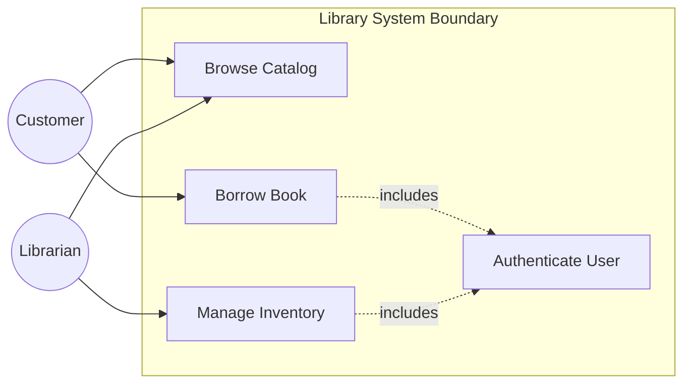

# Use Case Diagrams

## Introduction
A Use Case Diagram is a behavioral UML diagram designed to capture functional requirements. Unlike static Class Diagrams or chronological Sequence Diagrams, a Use Case Diagram models a system from the outside user's perspective, defining who uses the system and what goals they can achieve.

## Problem Statement
Jumping directly into writing API endpoints or database schemas before defining user boundaries leads to features that fail to meet user requirements. Without a clear map of actors and boundaries, developers risk building mismatched access controls (e.g., exposing administrative endpoints to regular users) and creating unclear system limits.

## Why this exists
To define system scope in a non-technical, visual format. It provides a common reference point for developers, product managers, and clients to align on what features the system must support before writing code.

## Real-world analogy
Consider a **restaurant menu**.
The menu lists the **Actors** (Customer, Waiter, Chef) and the **Use Cases** (Order Food, Serve Food, Cook Food). It does not explain the recipes or how the kitchen equipment operates. It simply defines the boundaries of what actions are supported and who performs them.

Another analogy is a **bank branch**. The lobby represents the system boundary. The actors are the Customer and Teller. The use cases include Depositing Cash, Withdrawing Cash, and Opening an Account, defining what transactions are supported within the bank lobby.

## Definition
A UML behavioral diagram that visualizes the relationships between actors (users and external systems) and use cases (the goals they achieve within the system boundary).

## Key concepts & Notation
- **Actor:** Someone or something that interacts with the system from the outside. Can be human users (e.g., `Customer`, `Librarian`) or external systems (e.g., `PaymentGateway`, `SmsService`).
- **Use Case:** A specific business goal or action performed using the system (e.g., `Borrow Book`, `Check Inventory`). Represented by an oval containing a verb phrase.
- **System Boundary:** A rectangle drawn around the use cases to represent the scope of the system. Actors are drawn outside the boundary.
- **Include Relationship (`<<include>>`):** A mandatory relationship where one use case automatically triggers another (e.g., `Checkout` always includes `MakePayment`).
- **Extend Relationship (`<<extend>>`):** An optional relationship where one use case extends the behavior of another under specific conditions (e.g., `ApplyPromoCode` optionally extends `Checkout`).

## Internal working / Mermaid diagram



## Python/Java implementation

### Bad implementation
*Unstructured actions where user roles and permissions are unchecked, allowing any user string to execute administrative database queries directly.*

```java
package bad;

public class LibrarySystem {
    public void executeAction(String userRole, String action, String bookName) {
        // Violates boundaries: lack of encapsulation makes role updates and boundary checks fragile
        if (action.equals("manageInventory")) {
            System.out.println("Updating inventory for: " + bookName);
        } else if (action.equals("borrowBook")) {
            System.out.println("Borrowing book: " + bookName);
        }
    }
}
```

### Better implementation
*Basic role checking using conditional blocks. While this prevents unauthorized calls, the role checks are scattered, making it difficult to add new actors or use cases.*

```java
package better;

class User {
    private final String role; // "LIBRARIAN" or "CUSTOMER"
    public User(String role) { this.role = role; }
    public String getRole() { return role; }
}

public class LibrarySystem {
    public void manageInventory(User user, String book) {
        if ("LIBRARIAN".equalsIgnoreCase(user.getRole())) {
            System.out.println("Inventory updated");
        } else {
            throw new SecurityException("Unauthorized access!");
        }
    }
}
```

### Best implementation
*A Java simulation representing actor boundaries and use cases. Use cases are modeled as commands that evaluate actor credentials against defined security boundaries, preventing authorization issues at compile-time and runtime.*

```java
package best;

import java.util.Objects;
import java.util.Set;

// 1. Define Actor Roles
enum Role {
    CUSTOMER, LIBRARIAN
}

record User(String userId, Set<Role> roles) {
    public User {
        Objects.requireNonNull(userId);
        Objects.requireNonNull(roles);
    }
}

// 2. Define Use Case Abstraction
interface UseCaseCommand {
    void execute(User actor);
}

// 3. Concrete Use Cases enforcing Actor boundaries
class BrowseCatalogUseCase implements UseCaseCommand {
    private final String query;

    public BrowseCatalogUseCase(String query) {
        this.query = Objects.requireNonNull(query);
    }

    @Override
    public void execute(User actor) {
        // Browse Catalog: Open to all users (Customer & Librarian)
        System.out.println("User [" + actor.userId() + "] is browsing catalog for: " + query);
    }
}

class BorrowBookUseCase implements UseCaseCommand {
    private final String bookId;

    public BorrowBookUseCase(String bookId) {
        this.bookId = Objects.requireNonNull(bookId);
    }

    @Override
    public void execute(User actor) {
        // Borrow Book: Requires CUSTOMER role
        if (!actor.roles().contains(Role.CUSTOMER)) {
            throw new SecurityException("Access Denied: Only Customers can borrow books");
        }
        System.out.println("Customer [" + actor.userId() + "] borrowed book: " + bookId);
    }
}

class ManageInventoryUseCase implements UseCaseCommand {
    private final String bookId;
    private final int newCount;

    public ManageInventoryUseCase(String bookId, int newCount) {
        this.bookId = Objects.requireNonNull(bookId);
        this.newCount = newCount;
    }

    @Override
    public void execute(User actor) {
        // Manage Inventory: Requires LIBRARIAN role
        if (!actor.roles().contains(Role.LIBRARIAN)) {
            throw new SecurityException("Access Denied: Only Librarians can manage inventory");
        }
        System.out.println("Librarian [" + actor.userId() + "] updated inventory for book " + bookId + " to " + newCount);
    }
}

// 4. System Boundary Coordinator
public class LibrarySystemBoundary {
    public void handleUseCase(User user, UseCaseCommand command) {
        try {
            command.execute(user);
        } catch (SecurityException e) {
            System.err.println("Security Boundary Violation: " + e.getMessage());
        }
    }
}
```

## Step-by-step explanation
1. **Define Actor Roles:** We define the `Role` enum to represent our actors (`CUSTOMER`, `LIBRARIAN`).
2. **Implement Use Cases as Commands:** We use the Command pattern, making each use case (e.g., `BorrowBookUseCase`) an independent command class implementing `UseCaseCommand`.
3. **Enforce Authorization Boundaries:** In each command's `execute` method, we verify the actor's roles against the use case's permission requirements.
4. **Coordinate Execution:** The `LibrarySystemBoundary` class handles execution, catching authorization failures at the system boundary.

## Multiple real-world examples
- **Authentication Services:** Standard user registers allow browsing products, while admin registers authorize catalog updates.
- **Content Management Platforms:** Authors can write articles, editors can review and publish them, and administrators manage platform settings.
- **E-commerce Checkout:** Customers submit orders (including payment), payment gateways verify transactions, and delivery services update tracking statuses.

## Pros
- **Clear Scope Definition:** Defines system boundaries and features in a non-technical format.
- **Early Requirement Alignment:** Simplifies scoping and requirements validation with business stakeholders.
- **Structured Access Control:** Models actors and roles to guide security designs.

## Cons
- **Lacks Execution Logic:** Does not show execution order, loops, or implementation details.

## Interview questions

### Beginner
- **Q: What is a System Boundary in a Use Case Diagram?**
- **A:** A system boundary is a rectangle drawn around the use cases that defines the scope of the system. Actors are drawn outside this boundary to indicate they are external entities.

### Intermediate
- **Q: What is the difference between `<<include>>` and `<<extend>>` relationships?**
- **A:**
  - **`<<include>>`:** A mandatory relationship where the base use case always calls the included use case (e.g., `Withdraw Cash` always includes `Authenticate User`).
  - **`<<extend>>`:** An optional relationship where a use case extends the base behavior only under specific conditions (e.g., `Calculate Premium Discount` optionally extends `Process Policy` if the customer is eligible).

### Senior
- **Q: How do Use Case Diagrams help in designing role-based access control (RBAC) in enterprise applications?**
- **A:** Use Case Diagrams map actors (roles) to the specific use cases (permissions) they can execute. This mapping serves as the blueprint for defining RBAC databases and role-checking middleware.

### Staff Engineer
- **Q: How do you translate Use Case Diagrams into a test suite design using Behavior-Driven Development (BDD)?**
- **A:** Translate use cases to BDD tests by:
  1. **Mapping Actors to Test Contexts:** Set up the test environment based on the actor's role.
  2. **Mapping Use Cases to Feature Files:** Write Gherkin scenario files (`Given`, `When`, `Then`) representing the use cases.
  3. **Including Pre/Postconditions:** Use BDD scenarios to verify that preconditions (like authentication) are met and postconditions (like status changes) are validated, verifying the use case boundaries.

## Common mistakes
- **Treating the diagram like a flowchart:** Drawing step-by-step UI actions (e.g., `Click Login Button`, `Type Password`) instead of high-level business goals (`Authenticate User`).
- **Neglecting System Boundaries:** Mixing actors inside the system boundary box.

## Best practices
- Name use cases using strong verb-noun phrases (e.g., `Process Payment`).
- Keep diagrams simple so they can be understood by non-technical stakeholders.
- Maintain a clear boundary between external actors and internal system use cases.

## When NOT to use
- **Algorithm Design:** If a system consists of internal backend logic (like mathematical models or sorting algorithms) with no direct user interaction, use case diagrams are unnecessary.

## Comparison with similar concepts
- **Use Case Diagram vs User Story:**
  - **Use Case Diagram:** A UML diagram showing actors, system boundaries, and functional goals.
  - **User Story:** A short, informal description of a feature written from the end-user's perspective (e.g., *"As a [User], I want to [Goal] so that [Benefit]"*).

## Summary
Use Case Diagrams define system scope by mapping relationships between actors and functional goals. Implementing use cases as distinct commands in code helps enforce security boundaries and access controls.

## Related topics
- [Class Diagrams](../class-diagrams)
- [Activity Diagrams](../activity-diagrams)
- [Authorization & Authentication](../../security/authentication)
