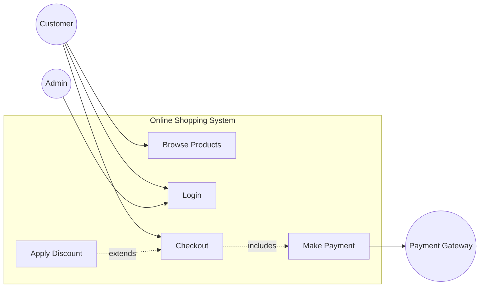

# Use Case Diagrams

## Introduction
A Use Case Diagram is a behavioral UML diagram. Unlike Class or Sequence diagrams which are meant for engineers to understand the *internal* technical implementation, a Use Case Diagram is meant to model the system from the *outside* user's perspective.

## Problem Statement
When starting a new project (e.g., an E-commerce platform), engineers immediately start thinking about Databases, APIs, and Class inheritance. If you start building without fully understanding exactly *who* uses the system and *what* they are trying to achieve, you risk building a brilliant technical system that fails to solve the actual business problem.

## Why this exists
To capture the functional requirements of a system in a simple, visual, non-technical format. It allows stakeholders (Product Managers, Clients, Engineers) to agree on the scope of the system before any code is written.

## Real-world analogy
Think of a Use Case Diagram as a restaurant menu. 
It lists the "Actors" (Customer, Waiter, Chef) and the "Use Cases" (Order Food, Serve Food, Cook Food). It does *not* explain the recipe or how the stove works. It simply defines the boundaries of what can happen in the restaurant.

## Definition
A visual representation that describes how different types of users (Actors) interact with the system to achieve specific goals (Use Cases).

## Key concepts & Notation

### 1. Actor
Someone or something that interacts with the system. Actors can be human users (e.g., `Customer`, `Admin`) or external systems (e.g., `Payment Gateway`, `Email Server`).
- *Notation:* A simple stick figure.

### 2. Use Case
A specific goal or functionality that the actor wants to achieve using the system.
- *Notation:* An oval/ellipse containing a verb phrase (e.g., `Place Order`, `Login`).

### 3. System Boundary
A box drawn around the use cases to represent the scope of the system being designed. Actors are always drawn *outside* the box.

### 4. Relationships
How actors and use cases relate to each other.
- **Association:** A solid line connecting an Actor to a Use Case they execute.
- **`<<include>>` (Must have):** A use case that is *always* required by another use case. (e.g., `Place Order` `<<include>>` `Make Payment`).
- **`<<extend>>` (Optional):** A use case that adds optional behavior under specific conditions. (e.g., `Apply Discount Code` `<<extend>>` `Make Payment`).

## Internal working / Mermaid diagram

*Example: An Online Shopping System*

```mermaid
usecaseDiagram
    %% Note: Mermaid doesn't have native "usecase" diagram support yet that looks standard,
    %% but we can simulate it with a graph or using standard plantUML/UML notation concepts.
    %% We will use a standard graph TD to represent the visual flow.
```
*(Since Mermaid's native Use Case support is limited/experimental, here is a structural representation)*


## When NOT to use
- **Do not use for technical design:** You cannot generate code from a Use Case diagram. It does not show classes, variables, loops, or databases.
- **Do not use for sequential flow:** It shows *what* happens, not the *order* in which it happens.

## Interview questions

### Beginner
- **Q: What is an Actor in a Use Case Diagram?**
  - **A:** An entity (human or external system) that interacts with the system from the outside to achieve a goal.

### Intermediate
- **Q: What is the difference between `<<include>>` and `<<extend>>`?**
  - **A:** `<<include>>` means the base use case *always* calls the included use case; it is mandatory (e.g., Login includes Verify Password). `<<extend>>` means the extending use case is *optional* and only runs under specific conditions (e.g., Place Order is extended by Apply Promo Code).

### Senior
- **Q: Why are external systems (like Stripe or an Email API) modeled as Actors?**
  - **A:** Because an Actor represents anything outside the boundary of the system you are currently designing. If your system relies on Stripe to process payments, Stripe is an external actor interacting with your "Make Payment" use case.

## Common mistakes
- **Too many use cases:** Turning the diagram into a flowchart by writing use cases like `Click Login Button`, `Enter Password`, `Validate DB`. Use Cases should be high-level business goals (`Authenticate User`), not UI steps.
- **Drawing Actors inside the system box:** Actors represent external entities. They must always remain outside the system boundary.

## Best practices
- Name use cases with strong Verb-Noun phrases (`Manage Inventory`, `Cancel Order`, `Register User`).
- Keep it simple. A Use Case diagram should be easily understandable by someone with zero technical background.

## Summary
Use Case Diagrams are the crucial first step in software design. By mapping out exactly who uses the system and what they need to achieve, teams ensure they are building the right product before diving into the complex technical architecture of Classes and Sequence diagrams.

## Related topics
- [Class Diagrams](../class-diagrams)
- [Activity Diagrams](../activity-diagrams)
