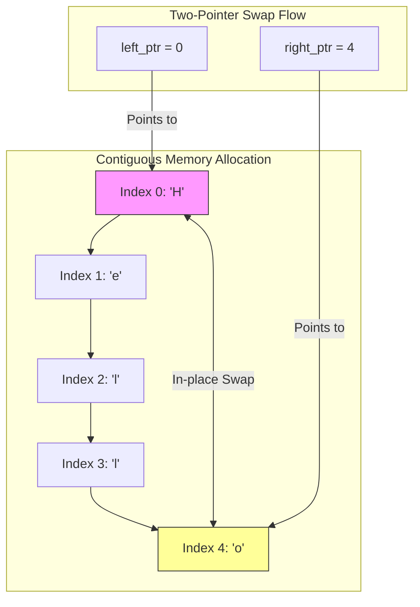

# Arrays & Strings

## Introduction
Arrays and Strings are the most fundamental data structures in computer science. They store sequential elements (characters in strings, arbitrary types in arrays) in contiguous memory blocks, providing fast, direct index access. Mastering Arrays and Strings forms the foundation for solving complex algorithmic problems.

---

## Problem Statement
Many algorithmic problems require searching, modifying, or parsing sequential data. Doing this inefficiently results in $O(N^2)$ runtimes due to redundant scans, or high memory overhead from creating new string copies. We need to leverage index math, two-pointer swaps, and hash maps to solve these problems in optimal $O(N)$ time and $O(1)$ space.

---

## Why this exists
To store and manipulate sequential data with constant-time lookup. In memory, arrays are allocated as a single contiguous block of bytes. If the base address is $B$ and each element takes $S$ bytes, the address of index $i$ is calculated as:
$$\text{Address}(i) = B + i \times S$$
This math allows the CPU to fetch any element in $O(1)$ time, making arrays the building block for hash tables, heaps, and cache-friendly buffers.

---

## Real-world analogy
Think of a row of numbered lockers in a school hallway:
- **Array:** Each locker has a specific index (0, 1, 2...). If the principal says "Open locker 42," you walk directly to locker 42 without checking lockers 0 through 41.
- **String:** A specific row of lockers where each locker is locked and contains exactly one letter card, forming a sentence. If you want to change a letter, you must replace the card, or in some systems (like immutable strings), build a whole new row of lockers.

---

## Definition
- **Array:** A container object that holds a fixed number of values of a single type in contiguous memory locations.
- **String:** An array of characters. In languages like Java and Python, strings are immutable (cannot be modified after creation).

---

## Key concepts
1. **Contiguous Memory & Locality:** Because elements are stored side-by-side, CPU cache prefetching retrieves adjacent elements automatically, making array traversals faster than linked list traversals.
2. **Two-Pointer Technique:** Using two index pointers (typically `left` and `right`) to scan the collection from both ends toward the middle, or at different speeds (fast/slow), reducing search spaces without extra memory.
3. **Immutability vs. Mutability:** 
   - In Java/Python, strings are immutable. Every concatenation (`s += "a"`) creates a new string object ($O(N)$ cost). Use `StringBuilder` or list joins instead.
   - In C++, strings are mutable and can be modified in-place.
4. **Sliding Window:** Maintaining a subsegment of the array using start and end pointers to track running metrics (like max sum subarrays) in $O(N)$ time.

---

## Internal working / Mermaid diagram



---

## Python/Java implementation

### 1. Bad Implementation: Brute-Force Subarray Sum Search
Searching for a target sum by scanning every possible subarray using nested loops runs in $O(N^2)$ time.

```python
# Returns True if there exists a subarray with the target sum.
# CRITICAL BUG: Runs in O(N^2) time due to nested loops.
def bad_subarray_sum(nums: list[int], target: int) -> bool:
    n = len(nums)
    for i in range(n):
        current_sum = 0
        for j in range(i, n):
            current_sum += nums[j]
            if current_sum == target:
                return True
    return False
```

### 2. Better Implementation: Sorting & Two-Pointer Match
Sorting the array first allows searching using two pointers from opposite ends, running in $O(N \log N)$ time and $O(1)$ space.

```python
# Find if two numbers sum to target in an array
# TIME COMPLEXITY: O(N log N) due to sorting.
# SPACE COMPLEXITY: O(1) in-place.
def better_two_sum(nums: list[int], target: int) -> bool:
    nums.sort() # O(N log N)
    left = 0
    right = len(nums) - 1
    
    while left < right:
        current = nums[left] + nums[right]
        if current == target:
            return True
        elif current < target:
            left += 1
        else:
            right -= 1
    return False
```

### 3. Best Implementation: O(N) Hash Map Lookup & Sliding Window
Using a Hash Map or Set allows matching elements in a single pass ($O(N)$ time, $O(N)$ space), and using sliding windows tracks subarrays in $O(N)$ time.

```python
# 1. Two-Sum using Hash Set for O(N) time and O(N) space
def best_two_sum(nums: list[int], target: int) -> bool:
    seen = set()
    for num in nums:
        complement = target - num
        if complement in seen:
            return True
        seen.add(num)
    return False

# 2. Sliding Window for O(N) Subarray Sum (non-negative numbers)
def best_subarray_sum(nums: list[int], target: int) -> bool:
    window_sum = 0
    left = 0
    
    for right in range(len(nums)):
        window_sum += nums[right]
        
        # Shrink the window from the left if the sum exceeds the target
        while window_sum > target and left <= right:
            window_sum -= nums[left]
            left += 1
            
        if window_sum == target:
            return True
            
    return False
```

---

## Step-by-step explanation
1. **Brute Force Scans**: In the `bad_subarray_sum` implementation, the outer loop sets the start index, and the inner loop calculates the sum for every possible ending index, repeating computations unnecessarily.
2. **Two-Pointer Scans**: The `better_two_sum` implementation sorts the array. Since the array is sorted, if the sum of elements at `left` and `right` is too small, we increment `left`. If the sum is too large, we decrement `right`.
3. **Hash Set Math**: In `best_two_sum`, for each element, we check if its complement (`target - num`) has already been visited in $O(1)$ time using a Hash Set.
4. **Sliding Window adjustment**: In `best_subarray_sum`, the `right` pointer expands the window. If the window sum exceeds the target, the `left` pointer shrinks the window, ensuring each element is visited at most twice.

---

## Multiple real-world examples
1. **Network Sockets Buffers:** Storing incoming packet byte streams in contiguous byte arrays to minimize routing latency.
2. **Text Editors (Search & Replace):** Scanning strings using KMP or Boyer-Moore algorithms to find substrings.
3. **Video Frame Rendering:** Storing RGB pixel data in contiguous arrays, enabling GPUs to render frames quickly.

---

## Pros
- **O(1) Access Time:** Allows retrieving any element immediately using its index.
- **Cache Friendly:** Contiguous memory layout maximizes CPU L1/L2 cache hits.
- **Low Overhead:** Requires no extra pointer references per element, unlike linked lists.

---

## Cons
- **Fixed Size:** Standard arrays cannot be resized after allocation; expanding them requires allocating a new array and copying elements ($O(N)$ cost).
- **Expensive Insertions/Deletions:** Inserting or deleting elements at arbitrary indices requires shifting subsequent elements ($O(N)$ cost).

---

## Interview questions

### Beginner
- **Q: Why is string concatenation in a loop considered bad practice in Java or Python?**
  - **A:** Strings are immutable in Java and Python. Concatenating strings (`s += "a"`) inside a loop of size $N$ creates a new string object on every iteration, leading to $O(N^2)$ time complexity and high garbage collection overhead. Use `StringBuilder` (Java) or `"".join()` (Python) instead.

### Intermediate
- **Q: Explain the difference between `list.sort()` and `sorted(list)` in Python.**
  - **A:** `list.sort()` modifies the original list in-place and returns `None` ($O(1)$ extra space). `sorted(list)` returns a new sorted list, leaving the original list unchanged ($O(N)$ extra space). Both run in $O(N \log N)$ time using Timsort.

### Senior
- **Q: How does the sliding window pattern guarantee O(N) time complexity if it contains a nested while loop?**
  - **A:** Although there is a nested while loop, the `left` pointer only moves forward. Across the entire execution, the `right` pointer is incremented $N$ times, and the `left` pointer is incremented at most $N$ times. The total number of operations is bounded by $2N$, which simplifies to $O(N)$ time complexity.

### Staff Engineer
- **Q: How does CPU cache line prefetching affect the performance of array traversals compared to linked lists, and how would you optimize memory access layouts?**
  - **A:** 
    - **CPU Cache Lines:** Modern CPUs fetch memory in chunks called cache lines (typically 64 bytes). When you access `array[0]`, the CPU pre-fetches the next several elements into the ultra-fast L1/L2 cache.
    - **Array vs. Linked List:** Array traversals access contiguous memory sequentially, resulting in near-zero cache misses. Linked list nodes are scattered across the heap, causing the CPU to block waiting for RAM reads (cache misses).
    - **Optimization:** For performance-critical systems, developers use structures like Arrays of Structures (AoS) or Structures of Arrays (SoA) to align data layouts with cache boundaries, preventing thrashing and maximizing instruction-level parallelism.

---

## Common mistakes
- **Off-by-one errors:** Accessing `array[array.length]`, which throws index-out-of-bounds exceptions.
- **Swallowing memory constraints:** Creating large temporary sub-arrays or string copies inside loops.
- **Unnecessary String parsing:** Converting strings to character arrays repeatedly instead of using index pointers directly.

---

## Best practices
- **Use StringBuilder:** Use mutable builders for text manipulations.
- **Initialize array capacities:** Pre-allocate list capacities when the final size is known to prevent resizing overhead.
- **Leverage two-pointers:** Prefer in-place two-pointer modifications over creating new collections.

---

## When NOT to use
- **Frequent Inserts/Deletes:** If the application requires frequent insertions or deletions at random positions, use a Linked List or Tree structure to avoid $O(N)$ element shifts.

---

## Comparison with similar concepts

| Metric | Array | Linked List |
| :--- | :--- | :--- |
| **Search by Index** | $O(1)$ | $O(N)$ |
| **Insert/Delete at Head** | $O(N)$ (requires shifts) | $O(1)$ |
| **Cache Locality** | High | Low |
| **Memory Overhead** | None | High (requires pointer references) |

---

## Summary
Arrays and Strings provide constant-time index access due to contiguous memory layouts. Using two-pointer techniques and sliding windows allows solving search and modification problems in optimal $O(N)$ time and $O(1)$ space.

---

## Related topics
- [Two Pointers](../two-pointers)
- [Sliding Window](../sliding-window)
- [Hash Tables](../hash-tables)
