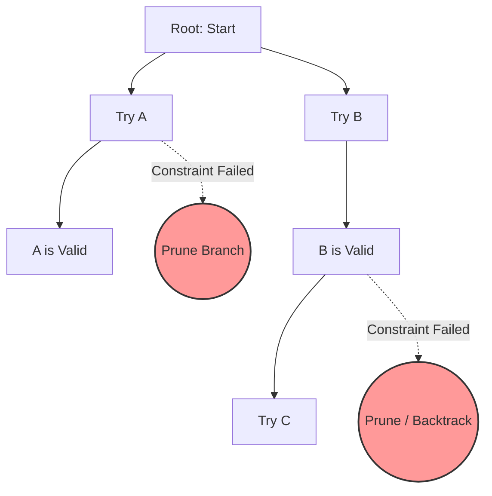

# Backtracking

## Introduction
Backtracking is an algorithmic paradigm that searches systematically for solutions to combinatorial problems. It builds candidates incrementally and abandons a candidate ("backtracks") as soon as it determines that the candidate cannot lead to a valid solution.

---

## Problem Statement
Many combinatorial problems require finding a configuration that satisfies specific constraints (e.g. Sudoku, N-Queens, Knapsack). Checking every possible combination brute-force results in factorial $O(N!)$ or exponential $O(K^N)$ runtimes. We need a method to explore the search space systematically and prune invalid paths early to avoid redundant computations.

---

## Why this exists
To solve search and constraint satisfaction problems efficiently. 
- **Brute Force:** Generates all possible configurations and checks constraints at the end, wasting cycles on invalid paths.
- **Backtracking:** Generates candidates incrementally. If a partial candidate violates constraints, the algorithm discards it immediately, pruning a branch of the search tree.

---

## Real-world analogy
Think of solving a maze:
- You walk down a path. When you reach a junction (a **Choice**), you choose to turn left.
- You continue walking until you hit a dead end (a **Constraint Violation**).
- Instead of starting over from the beginning, you walk backward to the last junction (the **Backtrack**) and try the right turn instead.

---

## Definition
- **State-Space Tree:** A hierarchical representation of all possible choices and paths explored during backtracking.
- **Pruning:** Discarding a branch of the state-space tree as soon as it violates a constraint, preventing further exploration of its descendants.

---

## Key concepts
1. **Decision Space:** The set of available choices at each step of the recursion.
2. **Constraint Checking:** Verifying if a partial solution is valid before making recursive calls.
3. **State Restoration (Backtracking):** Reverting changes to mutable variables (like lists or sets) after a recursive path finishes, preparing the state for alternate choices.
4. **Branch and Bound:** An optimization technique that tracks the best solution found so far to prune branches that cannot yield a better result.

---

## Internal working / Mermaid diagram

### Recursive Search Tree with Pruning


---

## Python/Java implementation

### 1. Bad Implementation: Unconstrained Brute-Force Permutations
Generating all possible grid placements and validating constraints *after* generation is highly inefficient, running in $O(N^N)$ or $O(N!)$ time.

```python
# Solves the N-Queens problem by generating all coordinate placements.
# CRITICAL BUG: Generates all configurations first, then validates.
# For N = 8, it checks 8^8 = 16,777,216 configurations, wasting CPU.
def bad_n_queens(n: int) -> list[list[int]]:
    results = []
    
    def generate_all(board):
        if len(board) == n:
            if is_valid_board(board):
                results.append(list(board))
            return
            
        for col in range(n):
            board.append(col)
            generate_all(board)
            board.pop()

    def is_valid_board(board):
        # Checks row and diagonal attacks for all queens
        for i in range(len(board)):
            for j in range(i + 1, len(board)):
                if board[i] == board[j] or abs(board[i] - board[j]) == abs(i - j):
                    return False
        return True

    generate_all([])
    return results
```

### 2. Better Implementation: Simple Recursion with Late Pruning
Using recursion is better, but performing $O(N)$ validation loops at each recursive step slows down execution.

```python
# Solves N-Queens with recursive validation checks.
# TIME COMPLEXITY: O(N!)
# BUG: Calling is_safe() loops through previous rows, adding O(N) overhead per check.
def better_n_queens(n: int) -> list[list[int]]:
    results = []

    def is_safe(board, row, col):
        for r in range(row):
            c = board[r]
            if c == col or abs(c - col) == row - r:
                return False
        return True

    def backtrack(row, board):
        if row == n:
            results.append(list(board))
            return
            
        for col in range(n):
            if is_safe(board, row, col): # O(N) check
                board.append(col)
                backtrack(row + 1, board)
                board.pop() # Backtrack step

    backtrack(0, [])
    return results
```

### 3. Best Implementation: Optimized Backtracking with O(1) Pruning Arrays
Using boolean arrays to track column and diagonal conflicts allows validating constraints in $O(1)$ time, optimizing performance.

```python
# Solves N-Queens using boolean tracking arrays for O(1) conflict checks.
# TIME COMPLEXITY: O(N!)
# SPACE COMPLEXITY: O(N) (call stack + tracking arrays)
def best_n_queens(n: int) -> list[list[int]]:
    results = []
    
    # O(1) lookup arrays for conflicts
    cols = [False] * n
    diag1 = [False] * (2 * n - 1)  # row + col is constant for anti-diagonals
    diag2 = [False] * (2 * n - 1)  # row - col is constant for main diagonals

    def backtrack(row, board):
        if row == n:
            results.append(list(board))
            return
            
        for col in range(n):
            d1_idx = row + col
            d2_idx = row - col + (n - 1)
            
            # O(1) constraint check
            if not (cols[col] or diag1[d1_idx] or diag2[d2_idx]):
                # Make choice
                board.append(col)
                cols[col] = diag1[d1_idx] = diag2[d2_idx] = True
                
                # Recursive exploration
                backtrack(row + 1, board)
                
                # Undo choice (Backtrack)
                board.pop()
                cols[col] = diag1[d1_idx] = diag2[d2_idx] = False

    backtrack(0, [])
    return results
```

---

## Step-by-step explanation
1. **Brute Force Scans**: In `bad_n_queens`, the algorithm places queens on every column without checking conflicts, generating millions of invalid configurations before rejecting them at the end.
2. **Late Pruning**: In `better_n_queens`, the `is_safe()` function checks row and diagonal conflicts by looping through all previously placed queens, adding $O(N)$ overhead to each step.
3. **O(1) Conflict Checking**: In `best_n_queens`, three boolean arrays (`cols`, `diag1`, `diag2`) track occupied paths.
   - Column conflict: `cols[col]`
   - Anti-diagonal conflict: `diag1[row + col]`
   - Main diagonal conflict: `diag2[row - col + (n - 1)]`
   Checking or setting a path is a simple array lookup ($O(1)$), optimizing performance.
4. **State Restoration**: After the recursive call `backtrack(row + 1)` returns, we reset the boolean flags to `False` to prepare the state for alternate path evaluations.

---

## Multiple real-world examples
1. **Regular Expression Engines:** Backtracking through match states to resolve wildcards (e.g., `.*`) against text segments.
2. **Sudoku Solvers:** Filling grid cells iteratively, backtracking when a number conflicts with a row, column, or subgrid.
3. **Database Query Planners:** Exploring join orders and indexing options to find the most efficient execution plan.

---

## Pros
- **Completeness:** Guarantees finding all valid solutions to a combinatorial problem.
- **Efficient Search:** Pruning invalid paths avoids redundant searches, outperforming brute force.
- **Low Memory Overhead:** Mutating a single shared state array in-place avoids allocating memory for each path.

---

## Cons
- **Worst-Case Runtimes:** Worst-case complexity remains exponential ($O(K^N)$) or factorial ($O(N!)$) if pruning cannot reduce the search space.
- **Recursion Overhead:** Deep recursion trees can cause stack overflows in memory-constrained environments.

---

## Interview questions

### Beginner
- **Q: How does backtracking differ from brute force?**
  - **A:** Brute force generates all possible combinations and validates them at the end. Backtracking builds solutions incrementally, checking constraints at each step and discarding invalid paths immediately.

### Intermediate
- **Q: Why do we need to undo choices (backtrack) in the recursion loop?**
  - **A:** The search state (e.g., a list of queen columns or a visited set) is shared across recursive calls. Failing to reset changes before exploring alternative paths causes state pollution, yielding incorrect results.

### Senior
- **Q: What is the time complexity of the N-Queens problem, and how does pruning affect it?**
  - **A:** The time complexity is $O(N!)$. In the first row, we have $N$ choices; in the second row, at most $N-2$ choices; and so on. Pruning reduces the search space significantly in practice, but the worst-case complexity remains $O(N!)$.

### Staff Engineer
- **Q: How would you optimize a Sudoku solver to handle hard puzzles with minimal backtracking steps?**
  - **A:** 
    - **Minimum Remaining Values (MRV) Heuristic:** Instead of filling cells sequentially, find the empty cell with the fewest possible valid numbers. This minimizes the branching factor of the search tree.
    - **Degree Heuristic:** Choose the cell that is involved in the most constraints with other empty cells.
    - **Forward Checking:** Track valid numbers for each empty cell and update them dynamically when a number is placed, backtracking early if a cell's option list becomes empty.

---

## Common mistakes
- **Forgetting to backtrack:** Mutating a shared state list and failing to revert changes after recursive calls return.
- **Duplicating states:** Copying list states (`path + [item]`) on every recursive call, which adds memory overhead.
- **Pruning late:** Checking constraints at the end of the recursion instead of at each step.

---

## Best practices
- **Mutate in-place:** Use a single shared collection and revert changes after recursive calls return.
- **Sort decision spaces:** Sort options to evaluate paths likely to succeed first.
- **Prune early:** Validate constraints before making recursive calls.

---

## When NOT to use
- **Linear Search Problems:** If the problem can be solved using dynamic programming or greedy algorithms without backtracking, avoid backtracking to prevent exponential runtimes.

---

## Comparison with similar concepts

| Strategy | Backtracking | Dynamic Programming | DFS (Graph) |
| :--- | :--- | :--- | :--- |
| **Search Space** | State-Space Tree | Directed Acyclic Graph (DAG) | Graph Vertices |
| **Goal** | Find all/optimal configurations | Find the optimal value | Explore connectivity |
| **Overlapping States** | Low | High (requires memoization) | N/A |

---

## Summary
Backtracking systematically searches combinatorial spaces by building solutions incrementally. Checking constraints early prunes invalid paths, and reverting state changes after recursive calls ensures consistent search paths.

---

## Related topics
- [Dynamic Programming](../dynamic-programming)
- [Trees & Graphs](../trees-graphs)
- [Two Pointers](../two-pointers)
