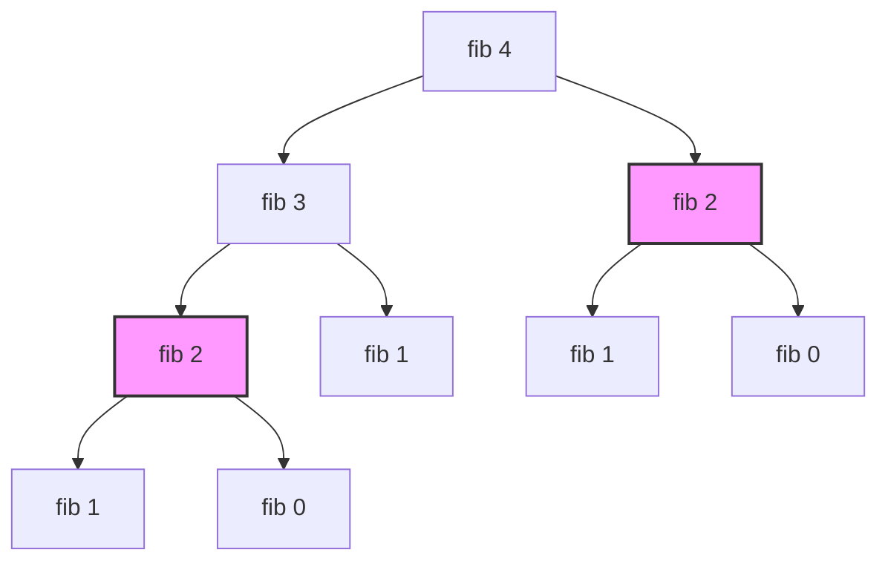

# Dynamic Programming

## Introduction
Dynamic Programming (DP) is an algorithmic paradigm that solves complex problems by breaking them down into simpler, overlapping subproblems. By storing the results of these subproblems (memoization or tabulation) rather than recomputing them, DP transforms exponential-time recursive processes into efficient polynomial-time algorithms.

---

## Problem Statement
Naive recursive solutions often evaluate identical subproblems repeatedly. For example, calculating the $N$-th Fibonacci number recursively triggers an exponential recursion tree of $O(2^N)$ operations, causing the program to freeze for relatively small values of $N$ (e.g., $N = 50$). We need a strategy to identify overlapping subproblems, define state transitions, and cache calculations to achieve linear runtimes.

---

## Why this exists
To optimize recursive relations. DP is applicable to problems that exhibit two core mathematical properties:
1. **Overlapping Subproblems:** The problem can be broken down into subproblems, and the same subproblems are solved repeatedly during execution.
2. **Optimal Substructure:** The optimal solution to the problem can be constructed from the optimal solutions of its subproblems.

---

## Real-world analogy
Think of writing an exam:
- **Naive Recursion:** On question 1, you calculate $37 \times 54$ using long multiplication and get $1998$. On question 2, you are asked: *"What is the result of $37 \times 54 + 10$?"* Instead of reusing your previous result, you calculate $37 \times 54$ from scratch again, wasting time.
- **Dynamic Programming (Memoization):** You write down $37 \times 54 = 1998$ on a scratch paper (the cache). When solving question 2, you look at your paper, retrieve $1998$ instantly, add $10$, and write down $2008$.

---

## Definition
- **Memoization (Top-Down):** A recursive approach that solves the problem starting from the top, caching subproblem results as they are computed to avoid redundant work.
- **Tabulation (Bottom-Up):** An iterative approach that starts from the base cases and fills a table (typically an array) sequentially until the target state is reached.

---

## Key concepts
1. **State Definition:** Identifying the minimal set of variables (parameters) that uniquely represent a subproblem. For Fibonacci, the state is a single variable $n$. For the Knapsack problem, the state is two variables: `(item_index, remaining_capacity)`.
2. **State Transition Relation:** The mathematical formula linking the target state to its subproblems (e.g. $DP(n) = DP(n-1) + DP(n-2)$).
3. **Memoization Table:** Typically a Hash Map or Array used to store computed states in top-down recursions.
4. **Space Optimization:** Analyzing state transitions to see if we can discard old rows in bottom-up tables (e.g. if $DP[i]$ only depends on $DP[i-1]$, we only need to store the previous state instead of a whole 2D table, reducing space complexity from $O(N)$ to $O(1)$).

---

## Internal working / Mermaid diagram

### Overlapping Subproblems in Fibonacci Recursion


---

## Python/Java implementation

### 1. Bad Implementation: Naive Exponential Recursion
The recursive function calls itself repeatedly for identical subproblems, resulting in an exponential $O(2^N)$ runtime.

```python
# Calculates the N-th Fibonacci number.
# CRITICAL BUG: Runs in O(2^N) time due to overlapping subproblem recalculations.
# e.g., fib(50) will take days to complete.
def bad_fib(n: int) -> int:
    if n <= 1:
        return n
    return bad_fib(n - 1) + bad_fib(n - 2)
```

### 2. Better Implementation: Top-Down Memoization
Caching subproblem results reduces the time complexity to $O(N)$, but using recursive stack frames consumes $O(N)$ space, risking stack overflows.

```python
# TIME COMPLEXITY: O(N)
# SPACE COMPLEXITY: O(N) (call stack + memo cache)
def better_fib(n: int, memo: dict = None) -> int:
    if memo is None:
        memo = {}
        
    if n <= 1:
        return n
        
    if n in memo:
        return memo[n] # Return cached result
        
    memo[n] = better_fib(n - 1, memo) + better_fib(n - 2, memo)
    return memo[n]
```

### 3. Best Implementation: Bottom-Up Tabulation with Space Optimization
Iterating bottom-up eliminates recursion stack frames ($O(1)$ space complexity), and maintaining only the previous two states optimizes memory usage.

```python
# TIME COMPLEXITY: O(N)
# SPACE COMPLEXITY: O(1) (Only tracks the previous two values)
def best_fib(n: int) -> int:
    if n <= 1:
        return n
        
    # Space optimization: Instead of an array of size N, we use two variables
    prev2 = 0 # Represents fib(i-2)
    prev1 = 1 # Represents fib(i-1)
    
    for _ in range(2, n + 1):
        current = prev1 + prev2
        prev2 = prev1
        prev1 = current
        
    return prev1
```

---

## Step-by-step explanation
1. **Exponential Expansion**: In `bad_fib(4)`, the function evaluates `fib(2)` twice. For `bad_fib(50)`, it evaluates `fib(2)` billions of times, leading to an exponential explosion of operations:
   $$T(N) = T(N-1) + T(N-2) + O(1) \approx O(1.618^N) \text{ operations}$$
2. **Memoization Pruning**: In `better_fib`, before calculating a state, the thread checks `n in memo`. If present, it returns the value instantly, pruning the recursion branch.
3. **Tabulation Iteration**: In `best_fib`, we start from base cases `prev2 = 0` and `prev1 = 1` and run a loop up to `n`, calculating each state iteratively.
4. **Space Optimization**: Since calculating `current` only requires `prev1` and `prev2`, we discard older values and update the pointer variables, reducing space complexity to $O(1)$.

---

## Multiple real-world examples
1. **Diff Utilities (Git Diff):** Using the Longest Common Subsequence (LCS) algorithm to find differences between two code files.
2. **Routing Protocols (Shortest Path):** Using the Bellman-Ford algorithm to find routing paths in networks with negative edge weights.
3. **Search Engine Autocomplete:** Using edit distance (Levenshtein distance) algorithms to suggest spelling corrections.

---

## Pros
- **Optimized Execution:** Transforms exponential algorithms into polynomial-time solutions.
- **Structured Logic:** Provides a mathematical approach to modeling state transitions and dependencies.
- **Space Optimization:** Allows reducing memory footprints by keeping only the necessary previous states in bottom-up tables.

---

## Cons
- **High Memory Footprint:** Standard tabulation tables require significant memory ($O(N \times M)$ for 2D grids).
- **Initialization Cost:** Allocating large tables can add minor latency for small input sizes.
- **Conceptual Complexity:** Designing state definitions and transitions requires solid algorithmic thinking.

---

## Interview questions

### Beginner
- **Q: What is the difference between Memoization and Tabulation?**
  - **A:** Memoization is a top-down, recursive approach that solves subproblems as they are encountered, caching results to avoid recalculations. Tabulation is a bottom-up, iterative approach that starts from the base cases and fills a table sequentially.

### Intermediate
- **Q: How do you optimize a 2D DP table's space complexity from $O(R \times C)$ to $O(C)$?**
  - **A:** Analyze the state transition relation. If $DP[i][j]$ only depends on the current row's left neighbors and the previous row's elements ($DP[i-1][j]$), we do not need to store the entire 2D table. We can maintain a single 1D array of size $C$ and update it in-place.

### Senior
- **Q: How would you solve the edit distance problem (Levenshtein Distance) between two strings, and what is its state transition relation?**
  - **A:** Let $DP[i][j]$ represent the edit distance between the first $i$ characters of string $A$ and the first $j$ characters of string $B$.
    - If $A[i-1] == B[j-1]$, no operation is needed: $DP[i][j] = DP[i-1][j-1]$.
    - Otherwise, we take the minimum of three operations plus 1:
      $$DP[i][j] = 1 + \min(DP[i-1][j] \text{ (Delete)}, DP[i][j-1] \text{ (Insert)}, DP[i-1][j-1] \text{ (Replace)})$$

### Staff Engineer
- **Q: How does the Matrix Chain Multiplication problem show the limits of greedy algorithms, and how does the DP solution build optimal substructures?**
  - **A:** 
    - **Greedy Limit:** A greedy approach might choose to multiply matrices with the smallest dimensions first. However, local optimizations can lead to poor global splits, resulting in more total scalar multiplications.
    - **DP Substructure:** The DP solution splits the chain $[i, j]$ at index $k$ (where $i \le k < j$). The cost of this split is:
      $$DP[i][j] = \min_{i \le k < j} \left( DP[i][k] + DP[k+1][j] + d_{i-1} \times d_k \times d_j \right)$$
      By evaluating all split indices $k$ iteratively for increasing chain lengths, we find the global optimal multiplication order.

---

## Common mistakes
- **Defining excessive state variables:** Adding unnecessary variables to the state definition, increasing complexity.
- **Incorrect base case initialization:** Initializing base cases incorrectly, leading to wrong results.
- **Neglecting space optimizations:** Keeping entire 2D tables when only the previous row is needed.

---

## Best practices
- **Start with memoization:** Design the recursive relation first, then add caching before writing tabulated versions.
- **Ensure clean base cases:** Verify base cases cover all boundary conditions (e.g. $n = 0$, empty inputs).
- **Implement space optimization:** Discard unused rows in bottom-up tables where possible.

---

## When NOT to use
- **Non-Overlapping Subproblems:** If subproblems do not overlap (e.g., in Merge Sort, where each division processes completely unique indices), DP adds cache overhead without providing any benefit. Use standard Divide-and-Conquer instead.

---

## Comparison with similar concepts

| Feature | Dynamic Programming | Greedy Algorithms | Divide and Conquer |
| :--- | :--- | :--- | :--- |
| **Subproblems** | Overlapping | Independent | Independent |
| **Substructure** | Optimal Substructure | Optimal Substructure | No optimal constraint |
| **Selection Strategy** | Evaluates all choices | Selects the local optimal choice | Solves all divisions |
| **Complexity** | Polynomial | Low | Logarithmic/Linear |

---

## Summary
Dynamic Programming optimizes recursive relationships by caching subproblem results. Using Top-Down memoization or Bottom-Up tabulation avoids redundant calculations, and discarding old states minimizes memory usage.

---

## Related topics
- [Greedy Algorithms](../greedy-algorithms)
- [Backtracking](../backtracking)
- [Trees & Graphs](../trees-graphs)
