# Greedy Algorithms

## Introduction
A Greedy Algorithm is an algorithmic paradigm that builds a solution step-by-step, making the locally optimal choice at each stage in the hope of finding a global optimum. Greedy algorithms are highly efficient, typically running in linear or logarithmic times, but their correctness depends on specific mathematical properties.

---

## Problem Statement
Optimization problems require finding the minimum or maximum values (e.g. shortest travel times, minimum currency notes, maximum scheduled events). Solving these using backtracking or dynamic programming can consume significant time or memory. We need to identify when making local, immediate choices guarantees the global optimal solution.

---

## Why this exists
To solve optimization tasks with minimal overhead. Unlike dynamic programming, which evaluates all subproblem choices, a greedy algorithm makes a single choice and never backtracks. This is applicable if the problem exhibits two properties:
1. **Greedy Choice Property:** A global optimal solution can be reached by making local optimal choices.
2. **Optimal Substructure:** The optimal solution to the problem contains optimal solutions to its subproblems.

---

## Real-world analogy
Think of buying groceries with a budget limit:
- You walk to the bulk candy section. You want to maximize the weight of candy you buy.
- A greedy strategy: You pick the heaviest, most dense candies first and fill your bag, ignoring how they taste or fit together.
- In this case, choosing the locally heaviest item at each step successfully maximizes the total weight.

---

## Definition
- **Greedy Choice:** A choice that looks best at the current moment without considering future consequences or subproblem dependencies.
- **Matroid Theory:** The mathematical framework used to prove if a greedy algorithm guarantees a global optimum on a specific algebraic structure.

---

## Key concepts
1. **Interval Scheduling:** Maximizing the number of non-overlapping events by sorting them by their finish times.
2. **Fractional Knapsack:** Maximizing value by taking fractions of items sorted by their value-to-weight ratios.
3. **Huffman Coding:** A data compression algorithm that builds a prefix code tree by greedily merging the lowest frequency characters.
4. **Greedy Failures:** Understanding when greedy choices lead to suboptimal results (e.g., in the 0-1 Knapsack problem or non-standard coin change systems).

---

## Internal working / Mermaid diagram

```mermaid
gantt
    title Interval Scheduling Greedy Choices (Sorted by Finish Time)
    dateFormat  X
    axisFormat %s
    
    section Event Options
    Event A (1 to 3)      :active, a, 1, 3
    Event B (2 to 5)      :b, 2, 5
    Event C (3 to 6)      :active, c, 3, 6
    Event D (5 to 8)      :d, 5, 8
    
    section Selected Events
    Select Event A        :crit, 1, 3
    Select Event C        :crit, 3, 6
```



---

## Python/Java implementation

### 1. Bad Implementation: Brute-Force Backtracking Subset Check
Checking all possible subsets to find the optimal selection results in an exponential $O(2^N)$ runtime.

```python
# Finds the maximum number of non-overlapping intervals using brute-force.
# CRITICAL BUG: Explores all 2^N subsets, resulting in O(2^N) time complexity.
def bad_interval_scheduling(intervals: list[tuple[int, int]]) -> int:
    def solve(index, last_end):
        if index == len(intervals):
            return 0
            
        # Option 1: Skip the current interval
        ans = solve(index + 1, last_end)
        
        # Option 2: Select the current interval (if it doesn't overlap)
        start, end = intervals[index]
        if start >= last_end:
            ans = max(ans, 1 + solve(index + 1, end))
            
        return ans

    return solve(0, 0)
```

### 2. Better Implementation: Greedy Coin Change Failing on Non-Standard Denominations
Using a greedy choice for coin change works for standard currencies, but yields incorrect results on custom systems.

```python
# Returns the minimum number of coins to make change for a target amount.
# BUG: Greedy choice fails for non-standard coin systems (e.g., denominations [1, 3, 4]).
# If target is 6, Greedy selects: 4 + 1 + 1 (3 coins).
# Optimal choice is: 3 + 3 (2 coins).
def better_greedy_coin_change(coins: list[int], target: int) -> int:
    coins.sort(reverse=True)
    count = 0
    remaining = target
    
    for coin in coins:
        if remaining >= coin:
            count += remaining // coin
            remaining %= coin
            
    if remaining != 0:
        return -1 # Cannot make change
    return count
```

### 3. Best Implementation: Provably Correct Sorted Interval Scheduling
Sorting intervals by their end times and selecting non-overlapping intervals greedily runs in $O(N \log N)$ time and $O(1)$ space.

```python
# Finds the maximum number of non-overlapping intervals.
# TIME COMPLEXITY: O(N log N) due to sorting.
# SPACE COMPLEXITY: O(1) in-place.
def best_interval_scheduling(intervals: list[tuple[int, int]]) -> list[tuple[int, int]]:
    if not intervals:
        return []
        
    # Sort intervals by their END times
    intervals.sort(key=lambda x: x[1])
    
    selected = [intervals[0]]
    last_end = intervals[0][1]
    
    for i in range(1, len(intervals)):
        start, end = intervals[i]
        # If the start time is equal or after the last end time, select it
        if start >= last_end:
            selected.append(intervals[i])
            last_end = end
            
    return selected
```

---

## Step-by-step explanation
1. **Exponential Backtracking**: In `bad_interval_scheduling`, the recursion tree branches twice at each interval index, checking all subsets.
2. **Greedy Coin Trap**: In `better_greedy_coin_change` with `coins = [1, 3, 4]` and `target = 6`:
   - It greedily takes the largest coin `4`, leaving `2`.
   - It cannot take `3`, so it takes two `1`s. Total = 3 coins.
   - It misses the optimal path of two `3` coins because it never backtracks to evaluate smaller coins.
3. **Sorting by End Time**: In `best_interval_scheduling`, sorting by end times ensures we choose the interval that finishes earliest, leaving maximum room for subsequent events.
4. **Greedy Selection Scan**: The algorithm loops through the sorted list. If an event's start time is greater than or equal to the previous event's end time, we select it and update `last_end`, resolving the task in a single pass.

---

## Multiple real-world examples
1. **Data Compression (Huffman Coding):** Merging low-frequency characters greedily to build prefix code trees.
2. **Minimum Spanning Trees (Kruskal's & Prim's):** Selecting edges with the lowest weights to connect all nodes in a network without loops.
3. **Dynamic Bandwidth Allocation:** Scheduling network packets by deadline limits to maximize packet delivery rates.

---

## Pros
- **High Efficiency:** Typically runs in $O(N \log N)$ or $O(N)$ time.
- **Low Memory Overhead:** Bypasses table allocations, unlike dynamic programming.
- **Implementation Simplicity:** Easier to design and code compared to backtracking.

---

## Cons
- **Suboptimal Risks:** Making local optimal choices can fail to find the global optimum if the greedy property is violated.
- **Proof Complexity:** Proving that a greedy choice always yields the global optimum mathematically is difficult.

---

## Interview questions

### Beginner
- **Q: What is the primary difference between Greedy Algorithms and Dynamic Programming?**
  - **A:** Greedy algorithms make a single locally optimal choice at each step and never backtrack. Dynamic programming evaluates all choices by breaking the problem into subproblems, caching results to find the global optimum.

### Intermediate
- **Q: Why does sorting by end time rather than start time yield the optimal solution in interval scheduling?**
  - **A:** Sorting by end time ensures we select the event that finishes earliest. This maximizes the remaining time window available for subsequent events. Sorting by start time can select a long event early, blocking other shorter events.

### Senior
- **Q: Prove that the fractional knapsack problem is greedy-optimal while the 0-1 knapsack problem is not.**
  - **A:** 
    - In **Fractional Knapsack**, we can take fractions of items. Sorting items by value-to-weight ratio and taking the maximum possible fraction of the highest ratio items guarantees the highest value.
    - In **0-1 Knapsack**, items cannot be divided. Choosing the item with the highest ratio can leave empty space in the knapsack, while a combination of lower-ratio items could fill the knapsack more efficiently.

### Staff Engineer
- **Q: Explain how Kruskal's algorithm utilizes a Union-Find data structure to achieve O(E log V) complexity, and how you would prove its correctness.**
  - **A:** 
    - **Complexity:** Kruskal's algorithm sorts all $E$ edges by weight ($O(E \log E)$). It then iterates through the sorted edges and uses a Union-Find (Disjoint Set Union) data structure to check if the endpoints of an edge belong to the same component. If they do not, it merges them ($O(E \alpha(V))$). Since $E \le V^2$, $O(E \log E)$ simplifies to $O(E \log V)$.
    - **Correctness Proof:** We prove Kruskal's correctness using induction and the **Cut Property** of Minimum Spanning Trees. For any cut of the graph, the edge with the minimum weight crossing the cut must belong to the MST. Since Kruskal's algorithm always selects the minimum weight edge that does not form a cycle, it is guaranteed to construct the MST.

---

## Common mistakes
- **Applying greedy blindly:** Using greedy strategies without verifying if the greedy choice property holds.
- **Sorting incorrectly:** Sorting intervals by start time instead of end time.
- **Assuming standard currency properties:** Assuming greedy coin changes work for arbitrary coin sets.

---

## Best practices
- **Prove correctness:** Reason why the greedy choice leads to the global optimum before coding.
- **Prioritize with heaps:** Use a priority queue to retrieve the next optimal choice in $O(\log N)$ time.
- **Verify edge cases:** Test the algorithm against edge cases where greedy choices can fail.

---

## When NOT to use
- **Complex Dependency States:** If a choice at step $i$ affects the availability of choices at step $i+2$, greedy algorithms are insufficient. Use Dynamic Programming or Backtracking instead.

---

## Comparison with similar concepts

| Strategy | Greedy Algorithms | Dynamic Programming | Backtracking |
| :--- | :--- | :--- | :--- |
| **Choice Evaluation** | Single local choice | Evaluates all choices | Evaluates all paths |
| **Backtracking** | No | No | Yes |
| **Complexity** | $O(N \log N)$ / $O(N)$ | $O(N \times M)$ | $O(2^N)$ / $O(N!)$ |

---

## Summary
Greedy algorithms construct solutions by making locally optimal choices at each step. Sorting or prioritizing inputs is essential, and verifying that the greedy choice property holds prevents suboptimal results.

---

## Related topics
- [Dynamic Programming](../dynamic-programming)
- [Heaps & Priority Queues](../heaps-priority-queues)
- [Union-Find](../union-find)
