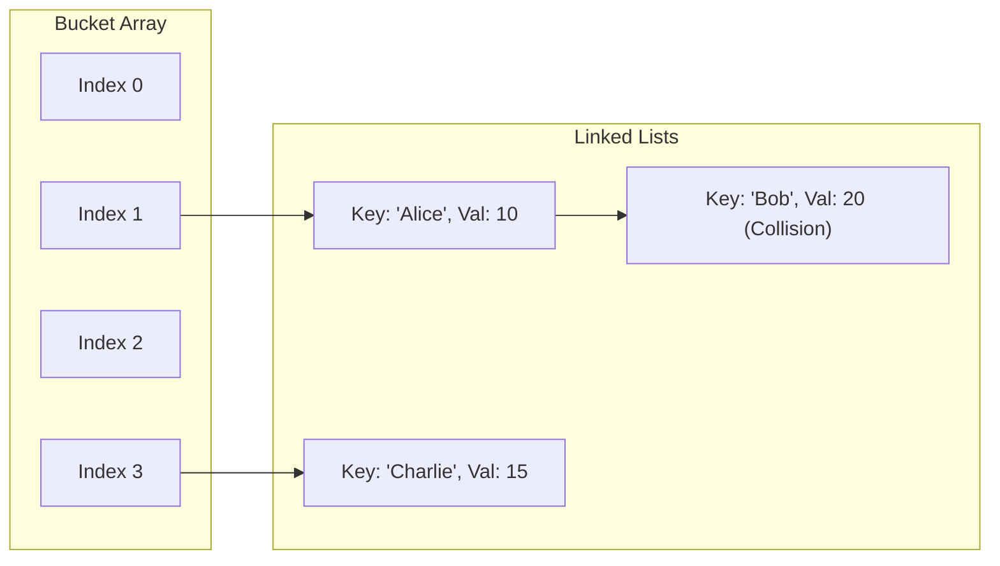

# Hash Tables

## Introduction
A **Hash Table** (or Hash Map) is a data structure that implements an associative array abstract data type, which maps keys to values. It uses a **Hash Function** to compute an index into an array of buckets or slots, from which the desired value can be found. Hash tables provide highly efficient dictionary operations, with search, insertion, and deletion completing in average $O(1)$ time.

---

## Problem Statement
When working with large collections, retrieving values using direct keys is a very common operation. Searching for a key in an unsorted list takes linear time ($O(N)$), while searching a sorted list takes logarithmic time ($O(\log N)$). We need a structure that enables instant, constant-time ($O(1)$) lookups, insertions, and updates regardless of the dataset's size.

---

## Why this exists
Hash tables bridge the gap between arbitrary key types (like strings, objects, or UUIDs) and array indices. By transforming keys into integer bounds using a mathematical hashing function, they allow keys to act as direct memory offsets, enabling fast index-based lookups.

---

## Real-world analogy
Think of a post office with mailboxes:
- Each mailbox is assigned a unique number.
- When mail arrives, the sorting system looks at the recipient's address and applies a rule (e.g., last two digits of the zip code) to determine which mailbox it belongs to.
- When you retrieve your mail, you go directly to that specific mailbox number instead of searching through all the mail in the post office.

---

## Definition
- **Hash Function:** A function that maps an arbitrary key to a fixed-size integer value (a hash code), which is then mapped to an index in the array using a modulo operation (`index = hash(key) % capacity`).
- **Load Factor ($\alpha$):** The ratio of the number of stored elements ($N$) to the total number of buckets ($M$), represented as $\alpha = N / M$.
- **Rehashing:** Creating a new, larger array (typically doubling the capacity) and moving all existing keys to their new index positions when the load factor exceeds a threshold.

---

## Key concepts
1. **Collision Resolution:** When two distinct keys produce the same hash index. Resolving collisions is essential to prevent data overwrite:
   - **Separate Chaining:** Each bucket contains a linked list or tree of key-value pairs that hash to the same index.
   - **Open Addressing:** All elements are stored directly in the bucket array. When a collision occurs, the algorithm searches for an empty slot using a probe sequence:
     - **Linear Probing:** Searching consecutive slots (`index + 1`, `index + 2`, etc.).
     - **Quadratic Probing:** Searching slots at quadratic intervals (`index + 1^2`, `index + 2^2`, etc.).
     - **Double Hashing:** Using a secondary hash function to calculate the step size.
2. **Cryptographic vs Non-Cryptographic Hashing:** Non-cryptographic hash functions (like MurmurHash or FNV-1a) prioritize speed and uniform distribution, whereas cryptographic hashes (like SHA-256) prioritize security and collision resistance at the cost of speed.
3. **Primary Clustering:** A drawback of linear probing where consecutive occupied slots form long blocks, increasing search times.

---

## Internal working / Mermaid diagram

### Separate Chaining Collision Resolution



---

## Python/Java implementation

### 1. Bad Implementation: Unsorted List Key Search
Storing key-value pairs in a list and scanning it linearly results in an inefficient $O(N)$ lookup.

```python
# A naive map using a list of tuples.
# CRITICAL BUG: Both put() and get() run in O(N) time due to linear search.
class BadMap:
    def __init__(self):
        self.pairs = []

    def put(self, key, value):
        # Update existing key or add new pair
        for i in range(len(self.pairs)):
            if self.pairs[i][0] == key:
                self.pairs[i] = (key, value)
                return
        self.pairs.append((key, value))

    def get(self, key):
        for k, v in self.pairs:
            if k == key:
                return v
        return None
```

### 2. Better Implementation: Hash Table with Linear Probing (No Resizing)
Using a hashing index and linear probing is faster, but the lack of resizing causes performance to degrade to $O(N)$ when the table fills up, and can lead to infinite loops if full.

```python
# A simple Hash Map using Linear Probing with fixed capacity.
# BUG: Without resizing, the map becomes slow (O(N)) as it fills up,
# and will throw an error or loop infinitely if capacity is exceeded.
class BetterLinearProbingMap:
    def __init__(self, capacity=11):
        self.capacity = capacity
        self.keys = [None] * capacity
        self.values = [None] * capacity

    def _hash(self, key):
        return hash(key) % self.capacity

    def put(self, key, value):
        start_idx = self._hash(key)
        idx = start_idx
        
        while self.keys[idx] is not None:
            if self.keys[idx] == key:
                self.values[idx] = value
                return
            idx = (idx + 1) % self.capacity
            if idx == start_idx:
                raise Exception("Hash Table is Full")
                
        self.keys[idx] = key
        self.values[idx] = value

    def get(self, key):
        start_idx = self._hash(key)
        idx = start_idx
        
        while self.keys[idx] is not None:
            if self.keys[idx] == key:
                return self.values[idx]
            idx = (idx + 1) % self.capacity
            if idx == start_idx:
                break
        return None
```

### 3. Best Implementation: Hash Table with Chaining and Dynamic Rehashing
An optimized Hash Map using Separate Chaining (lists of nodes) and dynamic rehashing. It doubles capacity and redistributes elements when the load factor ($\alpha$) exceeds `0.75`, maintaining $O(1)$ average complexity.

```python
# A Hash Map using Separate Chaining and dynamic rehashing.
# TIME COMPLEXITY: O(1) average lookup, insertion, and deletion.
# SPACE COMPLEXITY: O(N) where N is the number of elements.
class Node:
    def __init__(self, key, value):
        self.key = key
        self.value = value
        self.next = None

class BestHashMap:
    def __init__(self, initial_capacity=8):
        self.capacity = initial_capacity
        self.buckets = [None] * self.capacity
        self.size = 0
        self.load_factor_threshold = 0.75

    def _hash(self, key):
        return hash(key) % self.capacity

    def put(self, key, value):
        idx = self._hash(key)
        head = self.buckets[idx]
        
        # Search for existing key in the chain
        curr = head
        while curr:
            if curr.key == key:
                curr.value = value
                return
            curr = curr.next
            
        # Key not found, insert new node at head of chain
        new_node = Node(key, value)
        new_node.next = self.buckets[idx]
        self.buckets[idx] = new_node
        self.size += 1
        
        # Check load factor threshold and resize if necessary
        if self.size / self.capacity > self.load_factor_threshold:
            self._resize(self.capacity * 2)

    def get(self, key):
        idx = self._hash(key)
        curr = self.buckets[idx]
        while curr:
            if curr.key == key:
                return curr.value
            curr = curr.next
        return None

    def remove(self, key):
        idx = self._hash(key)
        curr = self.buckets[idx]
        prev = None
        
        while curr:
            if curr.key == key:
                if prev:
                    prev.next = curr.next
                else:
                    self.buckets[idx] = curr.next
                self.size -= 1
                return True
            prev = curr
            curr = curr.next
        return False

    def _resize(self, new_capacity):
        old_buckets = self.buckets
        self.capacity = new_capacity
        self.buckets = [None] * new_capacity
        self.size = 0 # Will be incremented during re-insertion
        
        # Rehash and insert all nodes into the new bucket array
        for head in old_buckets:
            curr = head
            while curr:
                self.put(curr.key, curr.value)
                curr = curr.next
```

---

## Step-by-step explanation
1. **Linear Tuple Scan**: In `BadMap`, looking up or updating a key requires iterating through the entire list of tuples, which takes $O(N)$ time.
2. **Bucket Key Mapping**: In `BestHashMap.put`, the key is hashed to a bucket index (`hash(key) % capacity`). If no collision occurs, it is stored immediately at that index.
3. **Collision Chain Traversal**: If a collision occurs (another node exists at that index), the new node is prepended to the linked list. Searching for this key only requires scanning this short chain, which remains brief if elements are distributed uniformly.
4. **Dynamic Resizing (Rehashing)**: As elements are added, the load factor (`size / capacity`) increases. When it exceeds `0.75`, `_resize` is called. We double the capacity, allocate a new bucket array, and rehash all keys to calculate their new index positions, maintaining short collision chains and fast lookup speeds.

---

## Multiple real-world examples
1. **Database Indexing:** Storing primary keys and record pointers in memory to enable fast lookups (e.g., MySQL memory tables).
2. **Caching Systems:** Key-value stores like Memcached or Redis use distributed hash tables to cache web pages, sessions, or API responses.
3. **Symbol Tables in Compilers:** Tracking variable scopes, functions, and types during compilation.
4. **Distributed Hash Tables (DHTs):** Routing files in peer-to-peer networks (like BitTorrent) using distributed hashing schemes.

---

## Pros
- **Constant Time Performance:** Average $O(1)$ time for insertions, lookups, and deletions.
- **Flexible Keys:** Keys can be any data type as long as they are hashable and comparable.
- **Space Efficiency:** Dynamic resizing adjusts memory usage based on the current load.

---

## Cons
- **Worst-Case Degradation:** If the hash function distributes keys poorly, all keys can collide in a single bucket, degrading performance to $O(N)$ (resolved in Java 8+ by using balanced trees for large buckets).
- **No Ordering:** Keys are stored in an arbitrary order. Iterating through a hash table does not guarantee a sorted output.
- **Resizing Overhead:** The rehashing step requires re-allocating and copying all elements, which causes occasional slow operations ($O(N)$ during resize).

---

## Interview questions

### Beginner
- **Q: What is a hash collision, and what are the two main ways to resolve it?**
  - **A:** A collision occurs when two distinct keys produce the same bucket index. The two main resolution strategies are:
    1. **Separate Chaining:** Storing colliding keys in a linked list or tree within the same bucket.
    2. **Open Addressing:** Finding an alternate empty slot in the main bucket array using a probing sequence (e.g., linear probing).

### Intermediate
- **Q: What is the load factor of a hash table, and why is it kept below 0.75?**
  - **A:** The load factor ($\alpha$) is the ratio of stored elements to total capacity ($N/M$). As the load factor approaches 1, the probability of collisions increases significantly, causing longer search times. Keeping it below `0.75` balances memory usage and lookup speed, triggering resizing before performance degrades.

### Senior
- **Q: How does Java 8's HashMap optimize bucket collision resolution?**
  - **A:** In Java 8, when the number of elements in a bucket's chain exceeds a threshold (called `TREEIFY_THRESHOLD = 8`) and the total table capacity is at least 64, the linked list is converted into a Self-Balancing Red-Black Tree. This improves the worst-case lookup time for colliding keys from $O(N)$ to $O(\log N)$, protecting against Hash DoS attacks.

### Staff Engineer
- **Q: Explain "Consistent Hashing" and how it is used in distributed caching systems. Why is standard modulo hashing insufficient?**
  - **A:** 
    - **Modulo Hashing Problem:** If we route keys across $K$ servers using `hash(key) % K`, adding or removing a server changes the denominator to $K \pm 1$. This forces almost all keys to rehash to different servers, invalidating the cache and causing a cache stampede.
    - **Consistent Hashing Solution:** We map both servers and keys onto a circular ring (0 to $2^{32}-1$) using their hash values. A key is routed to the first server encountered by moving clockwise.
    - **Scaling:** When a server is added or removed, only a fraction of the keys ($N/K$) need to be moved to different servers. We use **virtual nodes** to distribute keys uniformly across physical servers.

---

## Common mistakes
- **Using mutable objects as keys:** If a key's internal state changes after insertion, its hash code changes, making the element unreachable and causing memory leaks.
- **Choosing poor hash functions:** Designing hash functions that produce duplicate codes for similar inputs, causing long collision chains.
- **Neglecting to resize:** Allowing a hash table's load factor to grow too large, which degrades lookup times to $O(N)$.

---

## Best practices
- **Immutable Keys:** Use immutable data types (like strings, numbers, or tuples) as hash table keys.
- **Override equals and hashcode together:** If you override `equals` in custom classes, you must override `hashcode` to ensure equal objects return the identical hash.
- **Estimate initial capacity:** Pre-allocate capacity if the final dataset size is known to prevent the overhead of multiple resize steps.

---

## When NOT to use
- **Sorted Traversals:** If you need to retrieve elements in a sorted order, use a Balanced Binary Search Tree (e.g., TreeMap) instead.
- **Very Small Datasets:** For tiny lists (e.g., $N < 10$), a simple array or list search can be faster in practice due to the overhead of hashing functions.

---

## Comparison with similar concepts

| Structure | Hash Table | Balanced BST | Trie (Prefix Tree) |
| :--- | :--- | :--- | :--- |
| **Search Time** | $O(1)$ average | $O(\log N)$ | $O(L)$ where $L$ is key length |
| **Sorted Iteration** | No | Yes | Alphabetical |
| **Space Overhead** | High (due to empty buckets) | Low (node references) | High (character node arrays) |

---

## Summary
Hash Tables provide exceptionally fast average-time lookup, insertion, and deletion by mapping keys to bucket indices using a hash function. Managing collisions and load factors is essential to maintain optimal performance.

---

## Related topics
- [Arrays & Strings](../arrays-strings)
- [Heaps & Priority Queues](../heaps-priority-queues)
- [Union-Find](../union-find)
