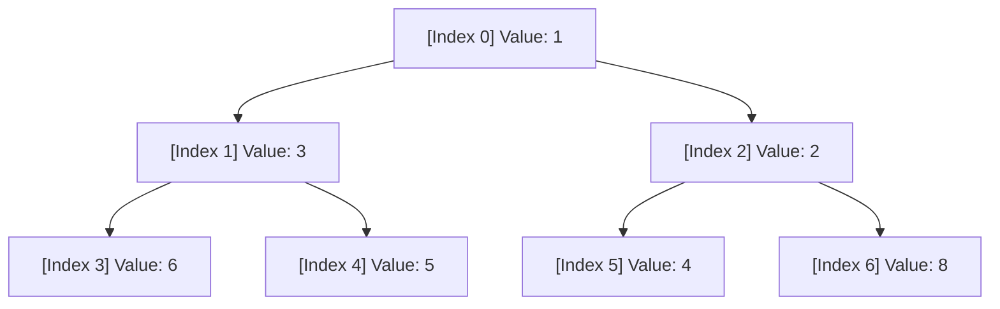

# Heaps & Priority Queues

## Introduction
A **Heap** is a specialized tree-based data structure that satisfies the heap property. A **Priority Queue** is an abstract data type similar to a regular queue or stack, but where each element has a "priority" associated with it. Elements with higher priority are served before elements with lower priority. Heaps are the most common and efficient way to implement priority queues, offering logarithmic insertion and extraction times.

---

## Problem Statement
In many applications, we need to process data dynamically while continuously retrieving the maximum or minimum element. For example:
- Scheduling CPU tasks by priority.
- Retrieving the $K$ most frequent items from a stream of words.
Sorting the entire dataset repeatedly costs $O(N \log N)$ time, which is prohibitively expensive for streaming or dynamic datasets. We need a structure that allows fast insertion and fast retrieval/deletion of the extreme element.

---

## Why this exists
To provide a balanced trade-off between insertion speed and extreme-element retrieval:
- **Unsorted Array:** Insertion is fast ($O(1)$), but finding the minimum/maximum element is slow ($O(N)$).
- **Sorted Array:** Finding the extreme element is fast ($O(1)$), but inserting a new element requires shifting elements ($O(N)$).
- **Binary Heap:** Both insertion and extraction run in logarithmic ($O(\log N)$) time, making it ideal for dynamic priority tracking.

---

## Real-world analogy
Think of an Emergency Room (ER) in a hospital:
- Patients do not get treated in the order they arrive (FIFO). Instead, they are triaged based on the severity of their condition (Priority).
- A patient with a life-threatening injury is treated immediately, even if they arrived after someone with a minor cold.
- The ER waiting room acts as a priority queue.

---

## Definition
- **Binary Heap:** A complete binary tree that maintains the **Heap Property**.
- **Min-Heap Property:** The key of any parent node is less than or equal to the keys of its children. The root contains the minimum element.
- **Max-Heap Property:** The key of any parent node is greater than or equal to the keys of its children. The root contains the maximum element.

---

## Key concepts
1. **Complete Binary Tree:** A binary tree in which every level, except possibly the last, is completely filled, and all nodes are as far left as possible. This allows the tree to be efficiently stored in a contiguous array.
2. **Array Indexing Formulas:** For a node at index `i` (0-indexed):
   - $\text{Parent}(i) = \lfloor (i - 1) / 2 \rfloor$
   - $\text{Left Child}(i) = 2i + 1$
   - $\text{Right Child}(i) = 2i + 2$
3. **Sift-Up (Bubble-Up):** Restoring the heap property by moving a node up the tree toward the root.
4. **Sift-Down (Bubble-Down/Heapify):** Restoring the heap property by moving a node down the tree toward the leaves.
5. **Heapify (Build-Heap):** Converting an arbitrary array into a valid heap in linear ($O(N)$) time.

---

## Internal working / Mermaid diagram

### Binary Min-Heap Array Representation



**Array representation:** `[1, 3, 2, 6, 5, 4, 8]`

---

## Python/Java implementation

### 1. Bad Implementation: Sorting on Every Insertion
Maintaining a sorted list by calling `list.sort()` after every new element results in an inefficient $O(N \log N)$ push operation.

```python
# A naive Priority Queue that sorts elements after every insertion.
# CRITICAL BUG: push() runs in O(N log N) time, making it highly inefficient for large inputs.
class BadPriorityQueue:
    def __init__(self):
        self.data = []

    def push(self, val):
        self.data.append(val)
        self.data.sort() # O(N log N) sorting cost

    def pop(self):
        if not self.data:
            raise IndexError("Pop from empty queue")
        return self.data.pop(0) # O(N) shift operation
```

### 2. Better Implementation: Standard Python `heapq` Wrapper
Using Python's built-in `heapq` module guarantees $O(\log N)$ push/pop and $O(N)$ heap construction.

```python
import heapq

class BetterPriorityQueue:
    def __init__(self, initial_data=None):
        # heapq.heapify converts a list into a heap in O(N) time
        self.heap = list(initial_data) if initial_data else []
        heapq.heapify(self.heap)

    def push(self, val):
        heapq.heappush(self.heap, val) # O(log N)

    def pop(self):
        if not self.heap:
            raise IndexError("Pop from empty queue")
        return heapq.heappop(self.heap) # O(log N)

    def peek(self):
        return self.heap[0] if self.heap else None
```

### 3. Best Implementation: Custom Binary Min-Heap from Scratch
An optimized, explicit implementation of a Binary Min-Heap stored in an array, showcasing the exact mechanics of `sift_up`, `sift_down`, and $O(N)$ heapification.

```python
# A complete Binary Min-Heap implementation.
# TIME COMPLEXITIES:
#   - push: O(log N)
#   - pop: O(log N)
#   - build_heap (heapify): O(N)
class BestMinHeap:
    def __init__(self, array=None):
        self.heap = list(array) if array else []
        if self.heap:
            self._build_heap()

    def push(self, val):
        self.heap.append(val)
        self._sift_up(len(self.heap) - 1)

    def pop(self):
        if not self.heap:
            raise IndexError("Pop from empty heap")
        
        # Swap root with last element
        self._swap(0, len(self.heap) - 1)
        root_val = self.heap.pop()
        
        if self.heap:
            self._sift_down(0)
            
        return root_val

    def peek(self):
        if not self.heap:
            return None
        return self.heap[0]

    def _sift_up(self, index):
        parent = (index - 1) // 2
        while index > 0 and self.heap[index] < self.heap[parent]:
            self._swap(index, parent)
            index = parent
            parent = (index - 1) // 2

    def _sift_down(self, index):
        n = len(self.heap)
        min_idx = index
        
        while True:
            left = 2 * index + 1
            right = 2 * index + 2
            
            if left < n and self.heap[left] < self.heap[min_idx]:
                min_idx = left
            if right < n and self.heap[right] < self.heap[min_idx]:
                min_idx = right
                
            if min_idx != index:
                self._swap(index, min_idx)
                index = min_idx
            else:
                break

    def _build_heap(self):
        # Start heapifying from the last non-leaf node down to the root
        last_non_leaf = (len(self.heap) - 2) // 2
        for i in range(last_non_leaf, -1, -1):
            self._sift_down(i)

    def _swap(self, i, j):
        self.heap[i], self.heap[j] = self.heap[j], self.heap[i]
```

---

## Step-by-step explanation
1. **Inefficient Sorting**: In `BadPriorityQueue`, calling `sort()` reads all $N$ items, ordering them in $O(N \log N)$ time.
2. **Sifting Up (Insertion)**: In `BestMinHeap.push`, a new element is appended at the end of the array (preserving the complete tree property). We sift it up by comparing it to its parent. If it is smaller than its parent, they are swapped. This repeats until the heap property is restored.
3. **Sifting Down (Extraction)**: In `BestMinHeap.pop`, the root element is replaced with the last element of the array. The array is truncated. We then sift the new root down by swapping it with its smallest child. This repeats down the tree.
4. **Linear Time Heap Construction**: In `_build_heap`, we loop backward from the last non-leaf node to the root. Since nodes near the bottom have smaller heights, they require fewer sift-down swaps. Mathematically, the sum of node heights converges to $O(N)$, bypassing the $O(N \log N)$ sorted insertion limit.

---

## Multiple real-world examples
1. **Dijkstra's Shortest Path Algorithm:** Using a min-heap to repeatedly extract the unvisited node with the smallest tentative distance in $O(\log V)$ time.
2. **Median Tracking in Streams:** Using two heaps (a Max-Heap for the lower half of numbers, and a Min-Heap for the upper half) to find the median in $O(1)$ time.
3. **Huffman Coding Trees:** Repeatedly extracting the two characters with the lowest frequencies to build a prefix code tree.
4. **Task Schedulers:** Managing operating system threads or background workers based on priority queues.

---

## Pros
- **Fast Extremes Access:** Retaining minimum/maximum value access in $O(1)$ time.
- **Logarithmic Transitions:** Inserting or deleting values in $O(\log N)$ time.
- **No Pointer Overhead:** Storing elements in a flat array avoids pointer memory allocations.

---

## Cons
- **No General Search:** Searching for an arbitrary key requires traversing the entire structure ($O(N)$ complexity).
- **Not Stable:** Heap operations do not guarantee that elements with equal priorities preserve their original arrival order.

---

## Interview questions

### Beginner
- **Q: Why does a Binary Heap use an array instead of node pointers?**
  - **A:** A binary heap is a complete binary tree. Complete binary trees have no empty spaces at any level except possibly the last. This structural regularity allows mapping node child/parent relationships using simple array index calculations (`2*i + 1`, `(i-1)//2`), saving pointer memory overhead.

### Intermediate
- **Q: How does building a heap from an array run in O(N) time instead of O(N log N)?**
  - **A:** In a heap of size $N$, there are $\approx N/2$ leaf nodes at height 0, $N/4$ nodes at height 1, and so on. The cost to sift down a node at height $h$ is $O(h)$. The total cost is:
    $$\sum_{h=0}^{\log N} \frac{N}{2^{h+1}} O(h) = O(N \sum \frac{h}{2^h}) = O(N)$$
    Since the infinite series $\sum \frac{h}{2^h}$ converges to 2, the heapification process finishes in linear $O(N)$ time.

### Senior
- **Q: How do you track the Median of a dynamic data stream in O(log N) insertion time?**
  - **A:** Maintain two heaps: a Max-Heap for the smaller half of the numbers, and a Min-Heap for the larger half.
    1. If a new number is smaller than the top of the Max-Heap, push it to the Max-Heap; else, push it to the Min-Heap.
    2. Balance the heaps so that their size difference is at most 1.
    3. If the sizes are equal, the median is the average of the roots of both heaps. If one is larger, its root is the median. Both median lookups take $O(1)$ time.

### Staff Engineer
- **Q: Compare Binary Heaps with Fibonacci Heaps. What are the practical trade-offs?**
  - **A:** 
    - **Fibonacci Heap:** Offers amortized $O(1)$ time for `insert`, `decrease-key`, and `merge` operations, and $O(\log N)$ for `extract-min`. This improves Dijkstra's complexity from $O(E \log V)$ to $O(E + V \log V)$.
    - **Trade-off:** Fibonacci heaps are theoretically superior but carry high constant-factor performance overheads and are complex to implement. They require managing extensive node pointers. In practice, Binary Heaps or 4-ary heaps outperform Fibonacci heaps for all but extremely large, sparse graphs.

---

## Common mistakes
- **Confusing heaps with BSTs:** Assuming a heap is sorted left-to-right. A heap only maintains parent-child relationships, not sibling relationships.
- **Using a heap for general search:** Attempting to find or remove an arbitrary element in a heap in $O(\log N)$ time (it requires $O(N)$ time).
- **Sorting to build a heap:** Sorting an array to convert it into a heap, which runs in $O(N \log N)$ instead of the optimal $O(N)$ heapify.

---

## Best practices
- **Use heapify:** Use standard heapify operations when building heaps from existing collections.
- **Store tuples:** Store custom priority tuples (e.g. `(priority_score, unique_id, task_data)`) to handle complex queue criteria.
- **Invert values for Max-Heaps:** In Python (which only implements Min-Heaps), multiply numbers by `-1` to simulate a Max-Heap.

---

## When NOT to use
- **Frequent Arbitrary Searches:** If you need to search, update, or remove random keys frequently, use a Balanced Binary Search Tree (like AVL or Red-Black trees) instead.

---

## Comparison with similar concepts

| Structure | Binary Heap | Sorted Array | Balanced BST |
| :--- | :--- | :--- | :--- |
| **Get Min/Max** | $O(1)$ | $O(1)$ | $O(\log N)$ |
| **Insert** | $O(\log N)$ | $O(N)$ | $O(\log N)$ |
| **Search Key** | $O(N)$ | $O(\log N)$ | $O(\log N)$ |

---

## Summary
Binary Heaps provide a highly efficient, array-backed structure for tracking dynamic extremes. With logarithmic insertion and removal times, they power priority queues, schedulers, and pathfinding algorithms.

---

## Related topics
- [Stacks & Queues](../stacks-queues)
- [Trees & Graphs](../trees-graphs)
- [Hash Tables](../hash-tables)
