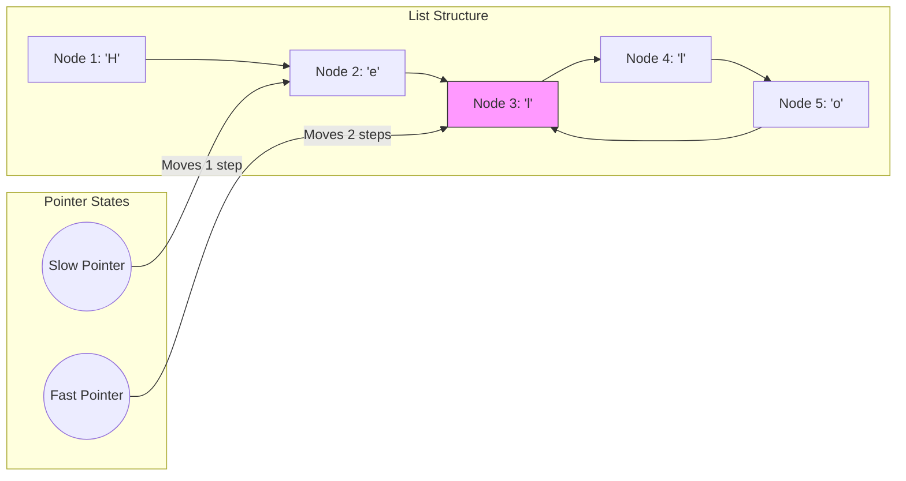

# Linked Lists

## Introduction
A Linked List is a linear data structure where elements are not stored in contiguous memory locations. Instead, each element (node) is a separate object containing data and a reference (pointer) to the next node in the sequence. This structure enables efficient dynamic size adjustments and constant-time insertions or deletions.

---

## Problem Statement
While arrays provide fast index-based lookups, they are inefficient when inserting or deleting elements in the middle, requiring $O(N)$ element shifts. We need a data structure that supports constant-time insertions and deletions, dynamically grows in memory, and allows traversing elements sequentially without pre-allocating large memory blocks.

---

## Why this exists
To provide dynamic memory allocation. Unlike arrays, which require contiguous memory, linked list nodes are allocated dynamically on the heap. This allows the system to utilize fragmented memory blocks. Insertions and deletions at a known pointer location require updating only two references ($O(1)$ time), bypassing element shifts.

---

## Real-world analogy
Think of a treasure hunt game:
- You receive a card that tells you to go to the kitchen.
- Once in the kitchen, you find a clue pointing to the garage.
- In the garage, you find a clue pointing to the backyard.
- To add a new location (e.g. the living room) between the kitchen and the garage, you only need to change the clue card in the kitchen to point to the living room, and write a clue in the living room pointing to the garage.

---

## Definition
- **Node:** The basic building block of a linked list, containing a data field and a reference to the next node.
- **Head:** The starting node of the linked list.
- **Tail:** The final node of the linked list, whose next pointer is `null`.

---

## Key concepts
1. **Singly Linked List:** Each node contains a single pointer to the next node. Travel is strictly unidirectional.
2. **Doubly Linked List:** Each node contains two pointers: one to the next node and one to the previous node, supporting bidirectional traversal at the cost of extra memory.
3. **Dummy Nodes:** An initialization technique using a placeholder node (`dummy = Node(0)`) at the head of the list. This simplifies edge cases when deleting or inserting at the head, eliminating null checks.
4. **Fast and Slow Pointers:** A technique using two pointers moving at different speeds (e.g., slow moves 1 step, fast moves 2 steps) to detect cycles (Floyd's Cycle Finding) or find the middle of the list.

---

## Internal working / Mermaid diagram

### Singly Linked List Cycle Detection


---

## Python/Java implementation

### 1. Bad Implementation: Index-Hopping Lookup in Loops
Iterating through a linked list using index retrieval methods inside a loop results in redundant traversals from the head, raising execution times to $O(N^2)$.

```python
class Node:
    def __init__(self, value, nxt=None):
        self.value = value
        self.next = nxt

# CRITICAL BUG: Calling get_element_at(i) inside a loop traverses 
# the list from the head repeatedly, causing O(N^2) runtime.
def print_list_inefficiently(head: Node, size: int):
    for i in range(size):
        node = get_element_at(head, i)
        print(node.value)

def get_element_at(head: Node, index: int) -> Node:
    curr = head
    for _ in range(index):
        if curr:
            curr = curr.next
    return curr
```

### 2. Better Implementation: Iterative Deletion without Dummy Nodes
Deleting a node using pointers is efficient ($O(N)$ time), but neglecting dummy nodes requires writing complex conditional checks to handle head deletions.

```python
# Deletes a node with a specific value.
# TIME COMPLEXITY: O(N).
# BUG-PRONE: Requires separate conditional branches to handle head mutations.
def better_delete(head: Node, target_val: int) -> Node:
    if not head:
        return None
        
    # Special check required for head node
    if head.value == target_val:
        return head.next
        
    curr = head
    while curr.next:
        if curr.next.value == target_val:
            curr.next = curr.next.next
            return head
        curr = curr.next
        
    return head
```

### 3. Best Implementation: Dummy Node Mutations & Floyd's Cycle Detection
Using a dummy node simplifies head deletions, and applying Floyd's Cycle Detection (fast/slow pointers) finds loops in $O(N)$ time and $O(1)$ space.

```python
# 1. Deleting a node cleanly using a Dummy Node
def best_delete(head: Node, target_val: int) -> Node:
    dummy = Node(0)
    dummy.next = head
    prev, curr = dummy, head
    
    while curr:
        if curr.value == target_val:
            prev.next = curr.next # Bypass current node
            break
        prev, curr = curr, curr.next
        
    return dummy.next

# 2. Floyd's Cycle Detection Algorithm (Fast/Slow pointers)
# TIME COMPLEXITY: O(N)
# SPACE COMPLEXITY: O(1)
def has_cycle(head: Node) -> bool:
    if not head or not head.next:
        return False
        
    slow = head
    fast = head.next
    
    while fast and fast.next:
        if slow == fast:
            return True # Pointers met, cycle detected
        slow = slow.next
        fast = fast.next.next
        
    return False
```

---

## Step-by-step explanation
1. **Index-Hopping Overhead**: In `print_list_inefficiently`, calling `get_element_at(i)` starts traversing from the head on every iteration. For index $i$, it executes $i$ steps. Over a list of size $N$, the total steps is:
   $$0 + 1 + 2 + \dots + (N-1) = \frac{N(N-1)}{2} = O(N^2) \text{ operations}$$
2. **Dummy Node Bypass**: In `best_delete`, `dummy.next` points to the head. If the head node contains the target value, `prev.next = curr.next` updates `dummy.next` to point to the second node, handling head deletions without explicit conditionals.
3. **Floyd's Cycle Finding**: In `has_cycle`, the `fast` pointer moves twice as fast as the `slow` pointer. If a cycle exists, the fast pointer will eventually catch up to the slow pointer from behind. If no cycle exists, the fast pointer will reach the end of the list (`null`), terminating the loop.

---

## Multiple real-world examples
1. **JVM Memory Allocators (Free Lists):** Using linked lists of block headers to track free memory slots inside the JVM heap.
2. **Application Undo Redo Stacks:** Using doubly linked lists to traverse user action states forward and backward.
3. **LRU Cache (Least Recently Used):** Combining a Hash Map with a Doubly Linked List to support $O(1)$ cache evictions.

---

## Pros
- **Constant Time Mutations:** Inserting or deleting nodes at a known pointer location takes $O(1)$ time.
- **Dynamic Size:** Grows and shrinks in size dynamically without requiring copy allocations.
- **Memory Utilization:** Utilizes non-contiguous, fragmented memory slots.

---

## Cons
- **O(N) Search Latency:** Finding an element requires traversing sequentially from the head node.
- **Memory Overhead:** Each node requires extra memory to store pointer references.
- **Cache Unfriendly:** Non-contiguous node storage results in high CPU cache misses.

---

## Interview questions

### Beginner
- **Q: What is the benefit of a Doubly Linked List over a Singly Linked List?**
  - **A:** A Doubly Linked List allows bidirectional traversal (nodes point to both next and previous elements), which simplifies deleting a node when only a reference to that node is given. However, it requires extra memory for the previous pointer references.

### Intermediate
- **Q: How does a dummy node simplify linked list insertion/deletion code?**
  - **A:** A dummy node acts as a placeholder head node. It guarantees that the list is never empty during mutations, eliminating separate code paths for inserting or deleting at the head of the list.

### Senior
- **Q: Explain how you would find the middle node of a singly linked list in a single pass.**
  - **A:** Use the fast and slow pointer technique. Initialize both pointers at the head of the list. Move the slow pointer 1 step and the fast pointer 2 steps on each iteration. When the fast pointer reaches the end of the list, the slow pointer will be at the middle node, resolving the task in $O(N)$ time and $O(1)$ space.

### Staff Engineer
- **Q: How would you design a thread-safe lock-free concurrent Queue using a Linked List, and what concurrency issues (like the ABA problem) must you solve?**
  - **A:** 
    - **Lock-Free Queue (Michael-Scott Queue):** We implement the queue using atomic reference mutations (using `AtomicReference` in Java or CAS operations on node pointers). Both the head and tail are represented as atomic references.
    - **CAS Operations:** Enqueue attempts a CAS update on the tail's next reference. If successful, it updates the tail pointer.
    - **ABA Problem:** In languages with manual memory management (like C++), if Thread A reads Node X, Thread B deletes Node X and allocates a new Node Y at the same memory address, Thread A's CAS check on the address will succeed despite the change. We prevent the ABA problem by using tagged pointers (associating a transaction version counter with each pointer reference) or relying on the JVM's Garbage Collector to manage reference allocations safely.

---

## Common mistakes
- **Dereferencing Null pointers:** Calling `curr.next` when `curr` is null, causing runtime crashes.
- **Losing list references:** Reassigning a node's next pointer before saving the remaining list reference, which breaks the list.
- **Infinite loops in cycle traversals:** Failing to handle cycles, causing traversals to run indefinitely.

---

## Best practices
- **Use Dummy Heads:** Simplify head insertions and deletions by using dummy nodes.
- **Verify Null Boundaries:** Always check `curr` and `curr.next` before accessing child references.
- **Draw pointer shifts:** Sketch pointer adjustments on paper to verify reference shifts before coding.

---

## When NOT to use
- **Frequent Index Lookups:** If the application requires frequent random access to elements by index, use an Array or Vector to avoid $O(N)$ traversal overhead.

---

## Comparison with similar concepts

| Operation | Array | Singly Linked List | Doubly Linked List |
| :--- | :--- | :--- | :--- |
| **Random Access** | $O(1)$ | $O(N)$ | $O(N)$ |
| **Insert/Delete at Head** | $O(N)$ | $O(1)$ | $O(1)$ |
| **Insert/Delete at Tail** | $O(1)$ (amortized) | $O(N)$ (without tail ref) | $O(1)$ |
| **Memory Overhead** | None | Low (1 pointer/node) | Medium (2 pointers/node) |

---

## Summary
Linked Lists support constant-time insertions and deletions by storing elements in non-contiguous memory locations linked by pointers. Utilizing dummy nodes simplifies mutations, and applying fast/slow pointer techniques resolves traversal tasks efficiently.

---

## Related topics
- [Arrays & Strings](../arrays-strings)
- [Two Pointers](../two-pointers)
- [Stacks & Queues](../stacks-queues)
