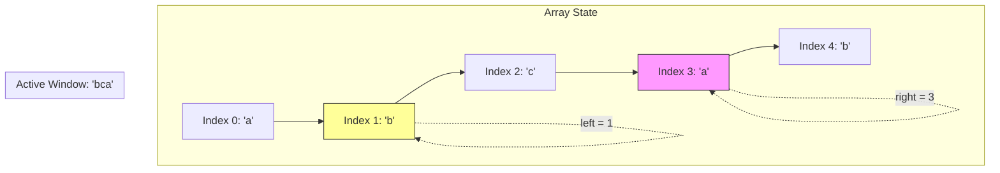

# Sliding Window

## Introduction
The Sliding Window pattern is an algorithmic technique used to perform operations on contiguous subarrays or substrings. By maintaining a running state of a window defined by start and end pointers, this pattern converts inefficient $O(N^2)$ nested loop lookups into optimal $O(N)$ linear-time solutions.

---

## Problem Statement
Many array and string problems require finding a contiguous subsegment that satisfies specific constraints (e.g. longest substring without repeating characters, minimum size subarray sum). Solving these brute-force by evaluating all possible subarrays requires $O(N^2)$ time, which is too slow for large inputs.

---

## Why this exists
To eliminate redundant calculations on overlapping subsegments. 
When a window shifts from $[i, j]$ to $[i+1, j+1]$, the subsegment $[i+1, j]$ remains unchanged. Instead of recalculating statistics for the entire window from scratch, the sliding window pattern updates the running state by subtracting the exiting element ($i$) and adding the entering element ($j+1$) in constant $O(1)$ time.

---

## Real-world analogy
Think of a dashboard camera recording a drive:
- The camera displays a continuous 10-second video stream of the road.
- As the car moves forward 1 second (expanding the window on the right), the oldest 1 second of video is deleted from memory (contracting the window on the left).
- The camera does not record a brand-new 10-second clip from scratch every second; it updates the running buffer dynamically.

---

## Definition
- **Fixed Window:** A window of constant size $K$ that slides across the collection, updating metrics as it moves.
- **Dynamic Window:** A window of variable size that expands or contracts its boundaries dynamically based on state constraint validations.

---

## Key concepts
1. **Pointers Coordination:** Using `left` and `right` index boundaries to define the window. The `right` pointer expands the window, while the `left` pointer shrinks it to restore constraints.
2. **State Tracking:** Maintaining a map, set, or counter to track the contents of the current window (e.g., character frequencies, running sum) in $O(1)$ time.
3. **Invalid State Resolution:** Shrinking the window from the left as soon as a constraint is violated, moving toward the next valid state.

---

## Internal working / Mermaid diagram

### Resizing Window Over Character Stream


---

## Python/Java implementation

### 1. Bad Implementation: Brute-Force Subarray Checks
Checking every possible contiguous subarray using nested loops results in an inefficient $O(N^2)$ runtime.

```python
# Finds the length of the longest substring without repeating characters.
# CRITICAL BUG: Evaluates all possible substrings, resulting in O(N^2) time complexity.
def bad_longest_substring(s: str) -> int:
    n = len(s)
    max_len = 0
    
    for i in range(n):
        seen = set()
        for j in range(i, n):
            if s[j] in seen:
                break # Duplicate found, stop expanding this start index
            seen.add(s[j])
            max_len = max(max_len, j - i + 1)
            
    return max_len
```

### 2. Better Implementation: Basic Sliding Window with Iterative Shrinking
Expanding the window and shrinking it iteratively using a while loop is efficient ($O(N)$), but updating the left boundary step-by-step can be optimized.

```python
# TIME COMPLEXITY: O(N)
# SPACE COMPLEXITY: O(N) (hash set cache)
def better_longest_substring(s: str) -> int:
    seen = set()
    left = 0
    max_len = 0
    
    for right in range(len(s)):
        # Shrink the window step-by-step from the left until duplicate is removed
        while s[right] in seen:
            seen.remove(s[left])
            left += 1
            
        seen.add(s[right])
        max_len = max(max_len, right - left + 1)
        
    return max_len
```

### 3. Best Implementation: Dynamic Window with O(1) Index Jumps
Using a hash map to store the last seen index of each character allows jumping the `left` pointer directly to the next valid index, optimizing performance.

```python
# TIME COMPLEXITY: O(N) (single pass)
# SPACE COMPLEXITY: O(min(M, N)) (hash map storing characters, where M is alphabet size)
def best_longest_substring(s: str) -> int:
    last_seen = {}
    left = 0
    max_len = 0
    
    for right, char in enumerate(s):
        # If the character is a duplicate and lies inside the current window,
        # jump the left pointer directly to the index after its previous occurrence.
        if char in last_seen and last_seen[char] >= left:
            left = last_seen[char] + 1
            
        last_seen[char] = right
        max_len = max(max_len, right - left + 1)
        
    return max_len
```

---

## Step-by-step explanation
1. **Duplicate Scans**: In `bad_longest_substring`, the algorithm resets the `seen` set on every index $i$ and scans forward, re-evaluating substring characters multiple times.
2. **Iterative Shrinking**: In `better_longest_substring`, if `s[right]` is a duplicate, the `while` loop removes characters from `left` one-by-one until the duplicate is evicted.
3. **Index Jumps**: In `best_longest_substring`, the `last_seen` map stores character indices. If we encounter a duplicate at index `right` (e.g. `'a'` last seen at index `2` and `left = 1`), we jump `left` directly to `3` (`last_seen['a'] + 1`), bypassing intermediate elements.
4. **Window Bounds**: The maximum length is updated at each step using the formula `right - left + 1`, resolving the task in a single pass.

---

## Multiple real-world examples
1. **TCP Flow Control (Sliding Window Protocol):** Managing packet transfers between client and server, adjusting window sizes based on network congestion.
2. **API Rate Limiters (Sliding Window Log):** Tracking user requests within a moving window (e.g. max 100 requests per minute) to prevent service abuse.
3. **Audio Signal Processing:** Analyzing audio buffers by dividing signals into overlapping, sliding windows to compute FFTs (Fast Fourier Transforms).

---

## Pros
- **Linear Complexity:** Reduces nested loop complexities from $O(N^2)$ to $O(N)$ time.
- **Constant Cache Memory:** Updates states in-place, minimizing allocation overheads.
- **Dynamic Adjustments:** Adapts window boundaries dynamically to satisfy variable constraints.

---

## Cons
- **Limited to Contiguous Data:** Cannot be applied to problems requiring non-contiguous element selections.
- **State Validation Cost:** Maintaining complex window states (e.g. sorted arrays using BSTs) can add minor overhead.

---

## Interview questions

### Beginner
- **Q: How does a sliding window algorithm achieve O(N) time complexity if it contains nested loops?**
  - **A:** Although there is a nested loop (e.g. shrinking the window), the left pointer only moves forward. Each element is added to the window at most once by the right pointer, and removed at most once by the left pointer. The total operations are bounded by $2N$, which simplifies to $O(N)$ time.

### Intermediate
- **Q: What is the difference between a Fixed Sliding Window and a Dynamic Sliding Window?**
  - **A:** 
    - A **Fixed Window** maintains a constant size $K$ throughout the traversal.
    - A **Dynamic Window** adjusts its boundaries dynamically based on state constraints, expanding the right pointer and shrinking the left pointer to find optimal subsegments.

### Senior
- **Q: Solve the "Minimum Window Substring" problem (find the shortest substring of $S$ containing all characters of $T$) using sliding window.**
  - **A:** Let $T\_count$ store character frequencies of $T$, and $window\_count$ track characters in the current window.
    1. Expand `right` until the window contains all characters of $T$ (the window becomes valid).
    2. Once valid, record the window size and try to shrink it by moving `left` forward.
    3. If moving `left` evicts a required character, the window becomes invalid. Expand `right` again and repeat, resolving the task in $O(|S| + |T|)$ time.

### Staff Engineer
- **Q: How would you design a real-time sliding window analytics engine that calculates the top 10 trending search terms over a moving 1-hour window, handling 100,000 queries per second?**
  - **A:** 
    - **In-Memory Store (Redis Sorted Sets):** We store search queries in a Redis Sorted Set where the score is the epoch timestamp of the query.
    - **Sliding Window Eviction:** Every incoming query executes a pipeline:
      1. Add the query to the sorted set: `ZADD query_set <timestamp> <query>`.
      2. Evict queries older than 1 hour: `ZREMRANGEBYSCORE query_set -inf <now - 3600>`.
    - **Top 10 Extraction:** Retrieve the top 10 items using `ZREVRANGE query_set 0 9 WITHSCORES`.
    - **Distributed Scaling:** We partition search queries across multiple nodes by hashing search terms, and aggregate regional top 10 trends periodically.

---

## Common mistakes
- **Updating statistics incorrectly:** Recomputing sum or frequency metrics from scratch on every window shift instead of updating the state in $O(1)$ time.
- **Off-by-one window boundaries:** Accessing invalid indices at array boundaries.
- **Neglecting to update left boundaries:** Failing to shrink the window when constraints are violated, leading to incorrect results.

---

## Best practices
- **Update states in O(1):** Add the entering element and subtract the exiting element to maintain states efficiently.
- **Initialize pointers to zero:** Start both `left` and `right` pointers at the beginning of the collection.
- **Use array caches:** Use integer arrays (`int[256]`) instead of hash maps to track ASCII character frequencies, optimizing lookup performance.

---

## When NOT to use
- **Non-Contiguous Queries:** If the problem requires finding subsequences (where elements do not need to be adjacent), sliding window is inapplicable. Use Subsequence Dynamic Programming instead.

---

## Comparison with similar concepts

| Strategy | Sliding Window | Two Pointers | Double-Ended Queue |
| :--- | :--- | :--- | :--- |
| **Primary Focus** | Contiguous subarrays or substrings | Sorted array searches or cycle detections | Monotonic element tracking |
| **Pointers direction** | Pointers move in the same direction | Pointers typically move toward each other | Elements are added/removed at both ends |
| **State Complexity** | Medium (requires tracking window contents) | Low (requires simple index checks) | Medium |

---

## Summary
The Sliding Window pattern optimizes contiguous subarray operations. By maintaining a running window state and adjusting boundaries dynamically, it reduces nested loop searches to optimal $O(N)$ linear-time solutions.

---

## Related topics
- [Two Pointers](../two-pointers)
- [Arrays & Strings](../arrays-strings)
- [Hash Tables](../hash-tables)
