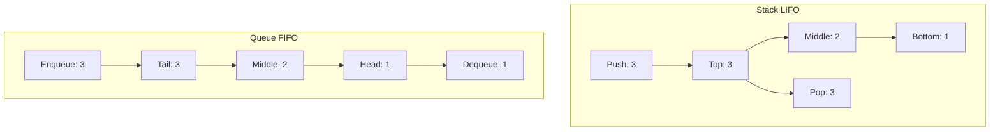

# Stacks & Queues

## Introduction
Stacks and Queues are fundamental linear data types that impose constraints on how elements are stored and retrieved. A **Stack** operates on a Last-In, First-Out (LIFO) basis, whereas a **Queue** operates on a First-In, First-Out (FIFO) basis. They serve as the backbone for graph traversals (DFS/BFS), function call management, expression parsing, and priority scheduling.

---

## Problem Statement
When designing algorithms that process data sequentially, we often need to manage the order of access. For example:
- Retrieving the most recently added item (e.g., undo functionality, backtracking paths).
- Processing items in the exact order they arrived (e.g., job scheduling, network packets).
Using basic arrays for these patterns can lead to inefficient element shifting operations ($O(N)$ time complexity) or uncontrolled memory allocation. We need dedicated structures that guarantee constant-time ($O(1)$) insert and delete operations.

---

## Why this exists
Stacks and Queues exist to restrict access patterns, reducing programmer errors and optimizing resource usage:
- **Stacks (LIFO):** Model nested or recursive behaviors. By restricting access to only the "top" element, they prevent accidental out-of-order element modifications.
- **Queues (FIFO):** Model waiting lines and buffers. They guarantee fair processing order without needing to search the entire collection.

---

## Real-world analogy
- **Stack:** Think of a stack of dinner plates in a cafeteria. You add new plates to the top, and customers take plates from the top. The first plate placed on the table is the last one to be washed and reused.
- **Queue:** Think of a line of people waiting at an ATM. The person who arrives first is served first, and new arrivals join the back of the line.

---

## Definition
- **Stack (LIFO):** A collection where insertions (`push`) and deletions (`pop`) occur at the same end, called the **Top**.
- **Queue (FIFO):** A collection where insertions (`enqueue`) occur at one end (the **Rear/Tail**) and deletions (`dequeue`) occur at the opposite end (the **Front/Head**).
- **Double-Ended Queue (Deque):** A sequence that allows insertion and deletion at both the front and rear.

---

## Key concepts
1. **Underflow & Overflow:** Underflow occurs when attempting to pop/dequeue from an empty structure. Overflow occurs when pushing/enqueueing into a fixed-capacity structure that is full.
2. **Monotonic Stack/Queue:** A stack or queue that maintains its elements in a strictly increasing or decreasing order. Used to solve range queries (e.g., Next Greater Element) in linear time.
3. **Circular Queue:** A queue implementation using a fixed-size array where the tail wraps around to the beginning, optimizing space utilization.
4. **Deque (Double-Ended Queue):** A generalized queue supporting $O(1)$ operations at both ends, serving as the underlying container for stacks and queues in many standard libraries.

---

## Internal working / Mermaid diagram

### Stack (LIFO) vs Queue (FIFO) Operations



---

## Python/Java implementation

### 1. Bad Implementation: Queue Using Python List `pop(0)`
Using a standard list as a queue and calling `pop(0)` forces the interpreter to shift all remaining elements left, resulting in $O(N)$ runtime.

```python
# A naive queue implementation using a python list.
# CRITICAL BUG: list.pop(0) requires shifting all remaining elements, resulting in O(N) dequeue.
class BadQueue:
    def __init__(self):
        self.queue = []

    def enqueue(self, item):
        self.queue.append(item)

    def dequeue(self):
        if not self.queue:
            raise IndexError("Dequeue from empty queue")
        return self.queue.pop(0) # O(N) shift operation
```

### 2. Better Implementation: Standard LIFO Stack and FIFO Queue
Using a standard list for stacks ($O(1)$ amortized append/pop) and `collections.deque` for queues ($O(1)$ append/popleft) ensures optimal time complexity.

```python
from collections import deque

class BetterStack:
    def __init__(self):
        self.stack = []

    def push(self, item):
        self.stack.append(item) # O(1) amortized

    def pop(self):
        if not self.stack:
            raise IndexError("Pop from empty stack")
        return self.stack.pop() # O(1)

    def peek(self):
        return self.stack[-1] if self.stack else None


class BetterQueue:
    def __init__(self):
        self.queue = deque()

    def enqueue(self, item):
        self.queue.append(item) # O(1)

    def dequeue(self):
        if not self.queue:
            raise IndexError("Dequeue from empty queue")
        return self.queue.popleft() # O(1)
```

### 3. Best Implementation: Monotonic Stack (Next Greater Element)
An optimized implementation of the **Next Greater Element** problem using a monotonic decreasing stack, solving a classic range query in $O(N)$ time instead of brute-force $O(N^2)$.

```python
# Finds the next greater element for each index in an array.
# If no greater element exists, returns -1.
# TIME COMPLEXITY: O(N) (each index is pushed and popped at most once)
# SPACE COMPLEXITY: O(N) for the stack and output array
def next_greater_element(nums: list[int]) -> list[int]:
    n = len(nums)
    result = [-1] * n
    stack = [] # Monotonic decreasing stack (stores indices)

    for i in range(n):
        # Maintain monotonic property: while current element is larger than
        # the element at the top of the stack, we found its next greater element.
        while stack and nums[i] > nums[stack[-1]]:
            prev_index = stack.pop()
            result[prev_index] = nums[i]
            
        stack.append(i)

    return result
```

---

## Step-by-step explanation
1. **Naive Queue Shifting**: In `BadQueue`, when `pop(0)` is called, the first element is removed, and every other element must shift one position to the left. For $N$ items, this takes $O(N)$ operations.
2. **Double-Ended Queue (Deque)**: In `BetterQueue`, `collections.deque` uses a doubly linked list of blocks internally. Inserting at the right or removing from the left requires updating pointer references, which completes in constant $O(1)$ time.
3. **Monotonic Decreasing Stack**: In `next_greater_element`, we scan through `nums`:
   - If `nums[i]` is smaller than the element at the top of the stack, we push index `i` onto the stack (maintaining a decreasing sequence of values).
   - If `nums[i]` is larger, it represents the "next greater element" for the indices on top of the stack. We pop those indices and write `nums[i]` to their results.
   - Each element enters and exits the stack at most once, maintaining linear $O(N)$ time.

---

## Multiple real-world examples
1. **Compiler Expression Parsing (Call Stack):** Managing nested scopes, activation records, local variables, and recursive returns during function execution.
2. **Breadth-First Search (BFS) Traversal:** Using queues to manage discovery frontiers in network routers or shortest path searches.
3. **Browser History Navigation:** Using two stacks (forward and backward) to enable page back-tracking.
4. **Message Brokers (Message Queues):** Buffering asynchronous tasks in architectures like RabbitMQ or Celery to decouple publishers and consumers.

---

## Pros
- **Fast Operations:** $O(1)$ operations for insertions and deletions.
- **Predictable Behavior:** Restricted access routes minimize state corruption bugs.
- **Resource Management:** Fixed-size circular queues prevent memory exhaustion by reusing buffers.

---

## Cons
- **No Random Access:** Retrieving an element in the middle requires popping/dequeuing all preceding items ($O(N)$ search complexity).
- **Stack Overflow Risks:** Deep recursion or large call stacks can exhaust the application memory stack.

---

## Interview questions

### Beginner
- **Q: How do you implement a Stack using two Queues?**
  - **A:** Maintain two queues, `q1` and `q2`.
    - **Push:** Enqueue the element to `q2`, then dequeue all elements from `q1` and enqueue them to `q2`. Swap the names of `q1` and `q2`. This makes `q1` hold elements in stack order (newest at the front), making pop $O(1)$ and push $O(N)$.
    - **Pop:** Dequeue from `q1`.

### Intermediate
- **Q: How do you implement a Queue using two Stacks?**
  - **A:** Maintain two stacks: `input_stack` and `output_stack`.
    - **Enqueue:** Push to `input_stack` ($O(1)$).
    - **Dequeue:** If `output_stack` is empty, pop all elements from `input_stack` and push them to `output_stack` (which reverses their order to FIFO). Then pop from `output_stack`. The amortized cost of dequeue is $O(1)$.

### Senior
- **Q: Explain the monotonic stack pattern. When should it be used?**
  - **A:** A monotonic stack maintains elements in a sorted order (increasing or decreasing). It is used to solve problems where you need to find the "next nearest element" that satisfies a inequality condition (e.g., next greater element, nearest smaller value, daily temperatures). It runs in $O(N)$ time because each index is pushed and popped at most once.

### Staff Engineer
- **Q: How would you design a thread-safe, lock-free Concurrent Queue (e.g., Disruptor Ring Buffer)?**
  - **A:** 
    - **Circular Array Structure:** Use a fixed-size ring buffer array to avoid memory allocation garbage collection overhead.
    - **Atomic Sequence Counters:** Use atomic pointers (using Compare-And-Swap/CAS operations) for the write sequence (tail) and read sequence (head).
    - **Memory Barriers & Cache-Line Padding:** Add padding (dummy variables) around sequence counters to prevent **false sharing**, where threads running on different CPU cores invalidate each other's cache lines because the pointers reside on the same cache line.

---

## Common mistakes
- **Using list as a queue:** Using `list.pop(0)` or `list.insert(0, val)` in performance-critical loops.
- **Forgetting empty checks:** Calling pop/dequeue on empty structures without verifying boundary states, causing runtime crashes.
- **Infinite recursion:** Failing to limit recursive call stack depth, resulting in stack overflows.

---

## Best practices
- **Use `deque`:** Always use `collections.deque` (Python) or `ArrayDeque` (Java) instead of lists/vectors.
- **Pre-allocate size:** Use bounded structures when memory consumption limits must be guaranteed.
- **Document invariants:** Clearly comment the sorting invariants when utilizing monotonic stacks.

---

## When NOT to use
- **Random Access Lookups:** If elements need to be retrieved or sorted by index or key, use Hash Maps or Balanced BSTs instead.

---

## Comparison with similar concepts

| Structure | Stack | Queue | Deque |
| :--- | :--- | :--- | :--- |
| **Access Policy** | LIFO | FIFO | Bidirectional |
| **Primary Operations** | `push` / `pop` | `enqueue` / `dequeue` | `append` / `popleft` / `appendleft` / `pop` |
| **Search Time** | $O(N)$ | $O(N)$ | $O(N)$ |

---

## Summary
Stacks and Queues restrict access patterns to LIFO and FIFO schemes, ensuring efficient and error-free sequential data processing. They provide $O(1)$ insert/delete times, forming the basis of search algorithms and system buffers.

---

## Related topics
- [Arrays & Strings](../arrays-strings)
- [Heaps & Priority Queues](../heaps-priority-queues)
- [Trees & Graphs](../trees-graphs)
