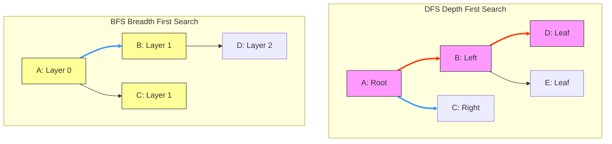

# Trees & Graphs

## Introduction
Trees and Graphs are non-linear data structures used to model hierarchical structures (like file directories) and network relationships (like road networks or social graphs). Understanding traversal strategies (BFS and DFS) and pathfinding algorithms (like Dijkstra's) is essential for solving complex routing and connectivity problems.

---

## Problem Statement
Many real-world systems require modeling networks of connected entities. Finding the shortest path, identifying connected components, or detecting cycles in these networks is challenging because naive algorithms can trigger stack overflows, get stuck in infinite loops, or fail to handle weighted edges correctly.

---

## Why this exists
To model complex, multi-dimensional relationships. 
- **Tree:** A hierarchical structure consisting of nodes connected by edges, containing no cycles ($N$ nodes and $N-1$ edges, with a single path between any two nodes).
- **Graph:** A generalized network of vertices ($V$) connected by edges ($E$), which can be directed or undirected, cyclic or acyclic, and weighted or unweighted.

---

## Real-world analogy
Think of navigating a city:
- **Tree:** A corporate organizational chart. The CEO is at the top (Root). Below them are VPs (Children), and below them are Directors. A Director reports to only one VP.
- **Graph:** The city road network. Intersections are vertices, and roads are edges. Edges can be one-way (directed) or two-way, and can have travel times (weights). The network contains loops, allowing multiple routes between two locations.

---

## Definition
- **BFS (Breadth-First Search):** An algorithm that explores nodes layer-by-layer, starting from the source, using a Queue (FIFO) structure.
- **DFS (Depth-First Search):** An algorithm that explores as deep as possible along each branch before backtracking, using a Stack (LIFO) or recursion.

---

## Key concepts
1. **Queue vs. Stack:** BFS uses a queue to explore neighbors first. DFS uses a stack to explore deep branches first.
2. **Cycle Safety:** Tracking visited vertices (`visited` set) to prevent infinite loops when traversing graphs with cycles.
3. **Tree Balance:** Maintaining height balance in binary trees (like AVL or Red-Black trees) to guarantee $O(\log N)$ search, insertion, and deletion times.
4. **Weighted Pathfinding:** Using greedy priority queues (Dijkstra's Algorithm) to find the shortest path in graphs with weighted edges.

---

## Internal working / Mermaid diagram



---

## Python/Java implementation

### 1. Bad Implementation: Naive DFS Recursion without Stack Safety
Using basic recursion on large, deep linear graphs/trees can exhaust the call stack, causing a `RecursionError` (Python) or `StackOverflowError` (Java).

```python
# CRITICAL BUG: Recursive DFS on a deep linear graph 
# (e.g. 0 -> 1 -> 2 -> ... -> 10000) causes Stack Overflow.
def bad_dfs(graph: dict, node: int, visited: set):
    visited.add(node)
    for neighbor in graph.get(node, []):
        if neighbor not in visited:
            bad_dfs(graph, neighbor, visited) # Recursive call stack accumulates
```

### 2. Better Implementation: Iterative DFS/BFS lacking Cycle Protections
Using an explicit stack or queue is safer, but omitting visited checks on cyclic graphs can cause the traversal to loop infinitely.

```python
from collections import deque

# BUG: If the graph contains a cycle (e.g. A -> B -> A), 
# this loop will run infinitely and exhaust system memory.
def better_bfs(graph: dict, start: int):
    queue = deque([start])
    while queue:
        node = queue.popleft()
        print(f"Visited: {node}")
        for neighbor in graph.get(node, []):
            queue.append(neighbor) # Adds neighbors repeatedly without checking cycles
```

### 3. Best Implementation: Dijkstra's Pathfinding & Cycle-Safe Traversals
Implementing cycle-safe traversals using visited sets, and using Dijkstra's Algorithm with a priority queue to route shortest paths on weighted graphs.

```python
import heapq

# 1. Cycle-Safe Iterative DFS using an explicit Stack
# TIME COMPLEXITY: O(V + E) | SPACE COMPLEXITY: O(V)
def cycle_safe_dfs(graph: dict, start: int) -> list[int]:
    visited = set()
    stack = [start]
    traversal_order = []
    
    while stack:
        node = stack.pop()
        if node in visited:
            continue
        visited.add(node)
        traversal_order.append(node)
        
        for neighbor in reversed(graph.get(node, [])):
            if neighbor not in visited:
                stack.append(neighbor)
                
    return traversal_order

# 2. Dijkstra's Algorithm for Shortest Path on Weighted Graphs
# TIME COMPLEXITY: O((V + E) log V) | SPACE COMPLEXITY: O(V)
def dijkstra(graph: dict, start: int, end: int) -> int:
    # Min-priority queue stores tuple: (cost, node)
    pq = [(0, start)]
    distances = {start: 0}
    visited = set()
    
    while pq:
        current_cost, current_node = heapq.heappop(pq)
        
        if current_node == end:
            return current_cost
            
        if current_node in visited:
            continue
        visited.add(current_node)
        
        for neighbor, weight in graph.get(current_node, []):
            if neighbor in visited:
                continue
            new_cost = current_cost + weight
            
            if new_cost < distances.get(neighbor, float('inf')):
                distances[neighbor] = new_cost
                heapq.heappush(pq, (new_cost, neighbor))
                
    return -1 # End node is unreachable
```

---

## Step-by-step explanation
1. **Recursive Stack Exhaustion**: In `bad_dfs`, every recursive step pushes a new activation record onto the call stack. If the graph is a linear chain of 10,000 nodes, the system limit is exceeded, triggering a stack overflow.
2. **Cyclic Loops**: In `better_bfs`, if a cycle exists (e.g. Node A points to B, and B points to A), the queue repeatedly accepts B and A alternately, running the loop indefinitely.
3. **Iterative Stack Isolation**: In `cycle_safe_dfs`, using an explicit Python list as a stack stores data in heap memory instead of the thread's call stack, preventing stack overflows.
4. **Greedy Relaxations (Dijkstra's)**: In `dijkstra`, the min-heap returns the node with the lowest accumulated cost first. If a shorter path to a neighbor is found, we update `distances[neighbor]` and push it to the heap, guaranteeing the shortest path is resolved.

---

## Multiple real-world examples
1. **Social Network Connections (LinkedIn):** Using BFS to calculate connection degrees (1st, 2nd, 3rd degree connections).
2. **GPS Routing Engines (Google Maps):** Using Dijkstra's or A* algorithms to find the fastest route between two intersections.
3. **Build Dependency Systems (Maven/Gradle):** Using DFS to topological-sort build dependencies, identifying cyclic dependencies.

---

## Pros
- **Accurate Modeling:** Captures multi-dimensional network relationships and hierarchical data.
- **Efficient Pathfinding:** Dijkstra's algorithm solves weighted routing problems in $O((V + E) \log V)$ time.
- **Modular Traversal:** BFS is ideal for shortest paths on unweighted graphs, while DFS is suited for topology exploration.

---

## Cons
- **Memory Consumption:** Storing graph edges and tracking visited sets consumes significant memory ($O(V + E)$).
- **Search Space Scale:** Unconstrained search on large graphs can cause slow traversals without pruning heuristics.

---

## Interview questions

### Beginner
- **Q: When should you choose BFS over DFS?**
  - **A:** Choose BFS when searching for the shortest path on an unweighted graph, or when exploring nodes close to the source. Choose DFS when you need to search deep branches first, traverse topological dependencies, or check connectivity in deep mazes.

### Intermediate
- **Q: How do you detect a cycle in a directed graph?**
  - **A:** Run DFS and track nodes in the current recursion stack (using a `visiting` set). If a node is visited that is already in the recursion stack, a back-edge exists, indicating a cycle.

### Senior
- **Q: Why does Dijkstra's algorithm fail on graphs with negative edge weights?**
  - **A:** Dijkstra is a greedy algorithm. It assumes that once a node is popped from the priority queue, its shortest path is finalized. If negative weights exist, a longer path with a negative edge could end up having a lower total cost, violating this assumption. Use the **Bellman-Ford** algorithm instead.

### Staff Engineer
- **Q: How would you design a distributed graph traversal system (like Google Pregel) that processes graphs with billions of vertices across a cluster?**
  - **A:** 
    - **Data Partitioning:** We partition the graph using vertex-cut or edge-cut strategies (e.g. hashing vertex IDs across nodes).
    - **Bulk Synchronous Parallel (BSP) Model:** Calculations run in synchronized supersteps. In each superstep, vertices execute logic locally and send messages to their neighbors on other machines asynchronously.
    - **Message Routing:** Vertices receive incoming messages, update their values, and vote to halt. A synchronization barrier coordinates the transition between supersteps.

---

## Common mistakes
- **Forgetting visited sets:** Neglecting to track visited nodes on cyclic graphs, causing infinite loops.
- **Using recursion on deep trees:** Swallowing stack space on deep structures instead of using iterative stacks.
- **Using BFS for weighted shortest paths:** Using BFS instead of Dijkstra's on weighted graphs, which yields incorrect paths.

---

## Best practices
- **Always track visited nodes:** Protect traversals from cyclic loops by using sets.
- **Sort neighbors before DFS:** If a specific traversal order is required, sort neighbors before pushing them to the stack.
- **Enforce queue bounds:** Bounding queues prevents memory exhaustion during wide BFS runs.

---

## When NOT to use
- **Contiguous Tabular Data:** For flat, sequential lookups, using graph structures adds unnecessary overhead. Use an array or hash map instead.

---

## Comparison with similar concepts

| Metric | BFS | DFS | Dijkstra's |
| :--- | :--- | :--- | :--- |
| **Data Structure** | Queue (FIFO) | Stack (LIFO / Recursion) | Min-Priority Queue |
| **Shortest Path** | Yes (unweighted graphs only) | No | Yes (weighted graphs without negative edges) |
| **Space Complexity** | $O(V)$ (high memory on wide graphs) | $O(H)$ (where $H$ is the tree height) | $O(V)$ |

---

## Summary
Trees and Graphs model hierarchical and network relationships. Using BFS allows finding shortest paths on unweighted graphs, DFS is suited for topology exploration, and Dijkstra's algorithm resolves weighted pathfinding tasks efficiently.

---

## Related topics
- [Arrays & Strings](../arrays-strings)
- [Dynamic Programming](../dynamic-programming)
- [Heaps & Priority Queues](../heaps-priority-queues)
