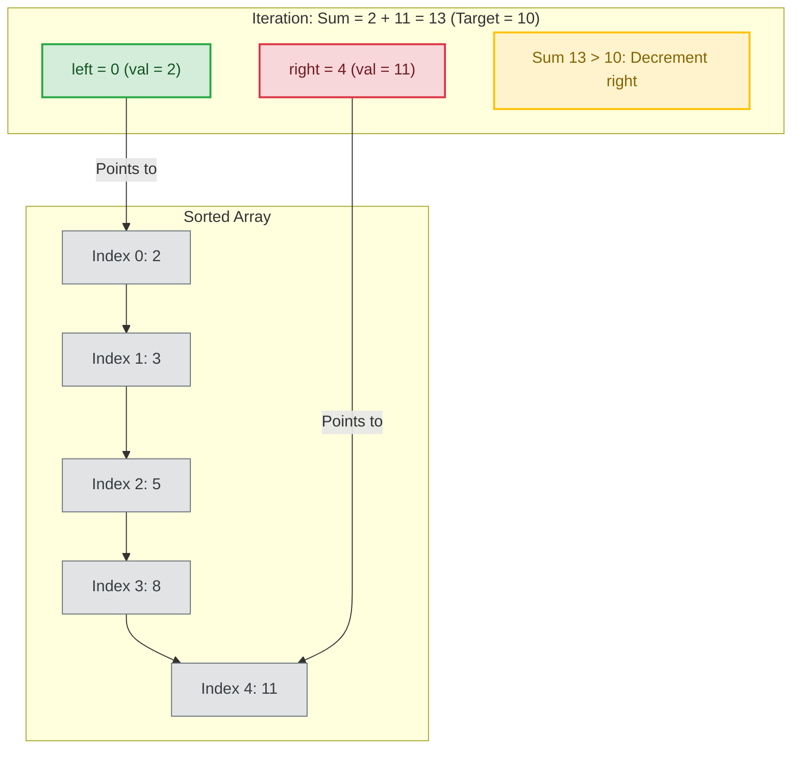

# Two Pointers Pattern

## Introduction
The Two Pointers pattern is an algorithmic technique that uses two index markers (pointers) to traverse a data structure (typically an array or string) concurrently. Pointers can move in opposite directions (e.g., meeting in the middle) or the same direction at different speeds (fast and slow pointers), optimizing search space traversals.

---

## Problem Statement
Many array operations require finding pairs, triplets, or subsegments that satisfy specific conditions (e.g., finding two numbers that sum to a target, reversing an array in-place, finding the container that holds the most water). Solving these brute-force using nested loops results in $O(N^2)$ runtimes. We need a way to prune the search space dynamically to achieve linear $O(N)$ execution.

---

## Why this exists
To optimize search spaces by leveraging array properties (like sorting).
In a sorted array, if the sum of elements at index `left` and `right` is too small, we know that incrementing `left` will increase the sum, and decrementing `right` will decrease the sum. This mathematical property allows us to discard an entire row or column of the search matrix on every step, reducing the search space from $O(N^2)$ to $O(N)$.

---

## Real-world analogy
Think of two people meeting in a narrow corridor:
- Person A starts at the left entrance and walks right. Person B starts at the right entrance and walks left.
- They walk toward each other. If they are looking for a specific meeting point, they adjust their walking speeds or directions based on how close they are.
- Once they meet (pointers cross), the entire corridor has been traversed without either person having to walk the entire distance twice.

---

## Definition
- **Opposite Direction Pointers:** One pointer starts at index `0` and the other at index `N-1`. They move toward each other until they meet.
- **Fast and Slow Pointers:** Both pointers start at the beginning, but one moves faster (e.g., 2 steps per iteration) than the other (1 step), used to detect cycles or find middle nodes.

---

## Key concepts
1. **Sorted Array Pruning:** Utilizing sorting to make deterministic choices about which pointer to increment or decrement.
2. **In-place Mutations:** Swapping elements using `left` and `right` indices to reverse arrays or partition elements without allocating extra memory ($O(1)$ space).
3. **Greedy Range Containment:** Calculating volumes (like in the "Container With Most Water" problem) and shifting the pointer pointing to the shorter wall, since keeping the shorter wall can never yield a larger volume.
4. **Pointer Invariants:** Defining strict loop termination conditions (typically `while left < right`) to prevent out-of-bounds errors.

---

## Internal working / Mermaid diagram

### Two-Pointer Search Pruning (Sorted Sum Match)


---

## Python/Java implementation

### 1. Bad Implementation: Brute-Force Pair Search
Scanning all possible pairs using nested loops to find a target sum results in an inefficient $O(N^2)$ runtime.

```python
# Finds if there exist two numbers in the array that sum to target.
# CRITICAL BUG: Runs in O(N^2) time due to nested loops.
def bad_two_sum(nums: list[int], target: int) -> bool:
    n = len(nums)
    for i in range(n):
        for j in range(i + 1, n):
            if nums[i] + nums[j] == target:
                return True
    return False
```

### 2. Better Implementation: Single-Direction Write Pointer Duplication Removal
Using a read-pointer and a write-pointer allows modifying arrays in-place in $O(N)$ time, but this same-direction approach is limited to simple edits.

```python
# Removes duplicates from a sorted array in-place, returning the new length.
# TIME COMPLEXITY: O(N) | SPACE COMPLEXITY: O(1)
def better_remove_duplicates(nums: list[int]) -> int:
    if not nums:
        return 0
        
    # Same-direction pointers: 'write' tracks placement, 'read' scans forward
    write = 1
    
    for read in range(1, len(nums)):
        if nums[read] != nums[read - 1]:
            nums[write] = nums[read]
            write += 1
            
    return write
```

### 3. Best Implementation: Bidirectional Pointer Search (Container With Most Water)
Using bidirectional pointers to solve complex range containment problems in $O(N)$ time and $O(1)$ space, leveraging greedy choices to prune paths.

```python
# Finds the maximum volume of water a container can hold.
# TIME COMPLEXITY: O(N) | SPACE COMPLEXITY: O(1)
def max_area(height: list[int]) -> int:
    left = 0
    right = len(height) - 1
    max_val = 0
    
    while left < right:
        # Calculate current area: width * min_height
        width = right - left
        current_height = min(height[left], height[right])
        current_area = width * current_height
        
        max_val = max(max_val, current_area)
        
        # Greedy choice: Move the pointer pointing to the shorter line.
        # Keeping the shorter line can never yield a larger area because
        # the width is decreasing, and the height is limited by the shorter line.
        if height[left] < height[right]:
            left += 1
        else:
            right -= 1
            
    return max_val
```

---

## Step-by-step explanation
1. **Brute Force Scans**: In `bad_two_sum`, the algorithm checks every pair of elements. If the array size is 10,000, it performs:
   $$\frac{10000 \times 9999}{2} \approx 50 \text{ million comparisons} \quad (O(N^2))$$
2. **In-place Write Head**: In `better_remove_duplicates`, the `read` pointer scans the array. When a new unique element is found, it is copied to the `write` index, modifying the array in-place.
3. **Greedy Height Selection**: In `max_area`, the container volume is limited by the shorter of the two heights at `left` and `right`.
   - If `height[left] < height[right]`, moving `right` inward cannot increase the height limit (it is still bounded by `height[left]`), but the width decreases.
   - Therefore, the only way to find a larger area is to move the shorter side (`left`), pruning the search path.
4. **Loop Termination**: The `while left < right` condition terminates the loop once the pointers meet, ensuring each element is visited at most once.

---

## Multiple real-world examples
1. **Network Packet Reassembly:** Sorting and merging out-of-order packets using two-pointer merge routines.
2. **String Tokenizers (Trim Functions):** Removing leading and trailing whitespaces by scanning from both ends of a string.
3. **Memory Garbage Collectors (Mark-Compact):** Relocating live heap objects using two-pointer copy sweeps to defragment memory.

---

## Pros
- **High Efficiency:** Reduces nested loop complexities from $O(N^2)$ to $O(N)$ time.
- **In-place Execution:** Operates directly on the input array, maintaining $O(1)$ space complexity.
- **Implementation Simplicity:** Requires no complex data structures.

---

## Cons
- **Requires Sorted Input:** Bidirectional search for sums requires sorted arrays; sorting unsorted arrays adds $O(N \log N)$ cost.
- **Limited to Contiguous Data:** Cannot be applied to non-contiguous collection patterns.

---

## Interview questions

### Beginner
- **Q: What is the difference between same-direction and opposite-direction two-pointer patterns?**
  - **A:** 
    - **Opposite-direction** pointers start at opposite ends (`0` and `N-1`) and move toward each other (used for pair-sum searches or array reversals).
    - **Same-direction** pointers start at the same end and move in the same direction at different speeds (used for duplicate removal or cycle detection).

### Intermediate
- **Q: How would you solve the "3-Sum" problem (find all unique triplets that sum to 0) using two pointers?**
  - **A:** 
    1. Sort the array.
    2. Iterate through the array with pointer `i`.
    3. For each `i`, set `left = i + 1` and `right = N - 1`, and run a two-pointer search to find pairs where `nums[left] + nums[right] == -nums[i]`.
    4. Skip duplicate values for `i`, `left`, and `right` to ensure uniqueness, resolving the task in $O(N^2)$ time.

### Senior
- **Q: Prove that the greedy choice in the "Container With Most Water" problem always yields the optimal solution.**
  - **A:** Let the left line be shorter than the right line (`height[left] < height[right]`). The area is bounded by `height[left] * (right - left)`. If we keep `left` and shift `right` inward to `right - 1`, the new width is smaller. The new height cannot exceed `height[left]`. Thus, the area of any container using `left` and a right boundary index less than `right` will always be smaller than the current area. Therefore, it is safe to discard `left` by incrementing it.

### Staff Engineer
- **Q: How would you optimize the two-pointer merge algorithm in a distributed external merge-sort system processing petabytes of data?**
  - **A:** 
    - **Multi-way Merge:** Instead of merging 2 files, we merge $K$ sorted runs concurrently using a Min-Heap (Priority Queue) of size $K$.
    - **Buffer Optimization:** We allocate memory-mapped files (mmap) for each run. Pointers are represented as file buffer offsets.
    - **Double Buffering:** While the CPU merges chunks in memory, asynchronous I/O threads prefetch the next blocks from disk into secondary buffers. This prevents CPU starvation during disk read waits.

---

## Common mistakes
- **Dereferencing index boundaries:** Failing to check index limits, causing index-out-of-bounds exceptions.
- **Forgetting duplicate checks:** Neglecting to skip duplicate values in problems requiring unique solutions (like 3-Sum).
- **Using on unsorted arrays:** Applying bidirectional sum searches on unsorted arrays, which yields incorrect results.

---

## Best practices
- **Enforce boundary limits:** Always include `left < right` conditions in loop checks.
- **Sort first:** Sort the array if the algorithm requires ordering.
- **Skip duplicates:** Increment or decrement pointers past identical values to prevent duplicate entries in output sets.

---

## When NOT to use
- **Unsorted Key Mappings:** If the array cannot be sorted (or sorting is too expensive), use a Hash Map ($O(N)$ time and space) instead of two pointers.

---

## Comparison with similar concepts

| Strategy | Two Pointers | Sliding Window | Binary Search |
| :--- | :--- | :--- | :--- |
| **Primary Goal** | Find pairs or modify elements in-place | Track contiguous subarrays or substrings | Locate an element in sorted collections |
| **Search Space Pruning** | Incremental ($O(1)$ index shifts) | Incremental ($O(1)$ index shifts) | Logarithmic (halves search space) |
| **Complexity** | $O(N)$ | $O(N)$ | $O(\log N)$ |

---

## Summary
The Two Pointers pattern uses two indices to traverse structures from opposite ends or at different speeds. By leveraging sorted arrays, it prunes search spaces efficiently, reducing nested loop complexities to linear $O(N)$ execution.

---

## Related topics
- [Sliding Window](../sliding-window)
- [Arrays & Strings](../arrays-strings)
- [Hash Tables](../hash-tables)
