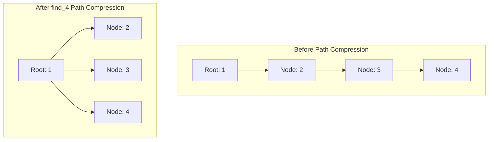

# Union-Find (Disjoint Set Union)

## Introduction
The **Union-Find** data structure, also known as **Disjoint Set Union (DSU)**, is a structure that tracks a partition of a set into cojoint, non-overlapping subsets. It is optimized to support two primary operations: determining which subset an element belongs to (**Find**), and merging two subsets together (**Union**). Using optimized path compression and ranking heuristics, DSU operations run in near-constant amortized time.

---

## Problem Statement
When modeling systems with dynamic connections (e.g., social networks, computer network grids, pixels in image segmentation), we often need to determine if two elements belong to the same connected component. Answering this using standard Graph algorithms like DFS or BFS requires searching the entire graph, taking $O(V + E)$ time per query. We need a way to track and merge components dynamically, responding to queries in near $O(1)$ time.

---

## Why this exists
To solve the **Dynamic Connectivity** problem efficiently. When edges are added dynamically, updating and searching tree configurations repeatedly using traditional lists or graphs is too slow. DSU represents subsets as tree-like structures, where each node points to its parent, allowing trees to merge and compress their paths on the fly.

---

## Real-world analogy
Think of corporate mergers:
- Initially, every employee works for their own single-person startup (individual sets).
- When Startup A merges with Startup B, one founder is chosen as the CEO (Union).
- Over time, corporate buyouts happen. To ask "Who is employee X's ultimate boss?", employee X checks their manager, who checks their manager, all the way up to the CEO (Find).
- To make communication efficient, every time an employee finds out who the CEO is, they report directly to the CEO from then on instead of going through managers (Path Compression).

---

## Definition
- **Disjoint Sets:** Sets that share no common elements.
- **Representative (Root):** A unique element chosen from each set to identify it. Two elements are in the same set if and only if they return the identical representative.
- **Inverse Ackermann Function ($\alpha(N)$):** An extremely slow-growing function. For all practical values of $N$ (up to the number of atoms in the observable universe), $\alpha(N) \le 4$. DSU operations run in amortized $O(\alpha(N))$ time.

---

## Key concepts
1. **Find Operation:** Traverses parent pointers from a given node up to the root representative.
2. **Union Operation:** Merges two subsets by pointing the root of one subset to the root of another.
3. **Path Compression:** During a `find` call, updating every visited node's parent pointer to point directly to the root. This flattens the tree structure, optimizing future lookups.
4. **Union by Rank/Size:** Attaching the smaller tree to the root of the larger tree during a `union` operation. This prevents trees from growing too deep:
   - **Union by Rank:** Uses tree height (rank) as the merge criteria.
   - **Union by Size:** Uses the number of nodes in the subset as the merge criteria.

---

## Internal working / Mermaid diagram

### Tree Flattening via Path Compression



---

## Python/Java implementation

### 1. Bad Implementation: Naive Quick-Find with $O(N)$ Union
In a Quick-Find implementation, the root of each element is stored directly in an array. This makes lookup fast ($O(1)$), but merging two sets forces a loop through the entire array, resulting in an inefficient $O(N)$ union.

```python
# A naive Quick-Find disjoint set implementation.
# CRITICAL BUG: union() loops through the entire array to update representatives,
# resulting in an inefficient O(N) time complexity for unions.
class BadQuickFind:
    def __init__(self, size):
        self.root = list(range(size))

    def find(self, x):
        return self.root[x] # O(1)

    def union(self, x, y):
        root_x = self.find(x)
        root_y = self.find(y)
        if root_x != root_y:
            # Shift all elements belonging to root_y's set to root_x
            for i in range(len(self.root)):
                if self.root[i] == root_y:
                    self.root[i] = root_x # O(N) loop
```

### 2. Better Implementation: Naive Quick-Union (No Compression/Rank Heuristics)
Using parent trees is better, but without balancing or path compression, the trees can degenerate into long linear chains (essentially linked lists), causing operations to degrade to $O(N)$ in the worst case.

```python
# A Quick-Union implementation without optimizations.
# BUG: Without path compression or rank heuristics, tree structures can
# degenerate into long chains, causing find() and union() to degrade to O(N) time.
class BetterQuickUnion:
    def __init__(self, size):
        self.parent = list(range(size))

    def find(self, x):
        # Traverse parent pointers to find the root
        curr = x
        while curr != self.parent[curr]:
            curr = self.parent[curr]
        return curr # O(N) worst-case

    def union(self, x, y):
        root_x = self.find(x)
        root_y = self.find(y)
        if root_x != root_y:
            self.parent[root_y] = root_x # Simply attach one root to another
```

### 3. Best Implementation: Optimized DSU with Path Compression and Union by Rank
An optimized implementation utilizing recursive path compression and union by rank. This guarantees that all operations run in near-constant amortized $O(\alpha(N))$ time.

```python
# Disjoint Set Union (DSU) with Path Compression and Union by Rank.
# TIME COMPLEXITY: O(alpha(N)) amortized per operation.
# SPACE COMPLEXITY: O(N) for parent and rank arrays.
class BestUnionFind:
    def __init__(self, size):
        self.parent = list(range(size))
        self.rank = [0] * size
        self.count = size # Number of independent components

    def find(self, x):
        # Base case: x is its own root
        if self.parent[x] == x:
            return x
        # Path Compression: recursively find the root and assign it directly
        self.parent[x] = self.find(self.parent[x])
        return self.parent[x]

    def union(self, x, y):
        root_x = self.find(x)
        root_y = self.find(y)
        
        if root_x == root_y:
            return False # Already in the same set

        # Union by Rank: attach the shorter tree under the taller tree
        if self.rank[root_x] < self.rank[root_y]:
            self.parent[root_x] = root_y
        elif self.rank[root_x] > self.rank[root_y]:
            self.parent[root_y] = root_x
        else:
            self.parent[root_y] = root_x
            self.rank[root_x] += 1
            
        self.count -= 1
        return True

    def is_connected(self, x, y):
        return self.find(x) == self.find(y)

    def get_count(self):
        return self.count
```

---

## Step-by-step explanation
1. **O(N) Array Updates**: In `BadQuickFind`, every time we perform a union, we must scan the entire array to locate and update nodes containing the old representative, which takes $O(N)$ operations.
2. **Recursive Path Compression**: In `BestUnionFind.find(x)`, the method searches for the root. When the recursion unwinds, it assigns the returned root pointer directly to `parent[x]`. This flattens the tree. Subsequent lookups for `x` or any node in its path bypass the intermediate parent chain, completing in $O(1)$ time.
3. **Union by Rank**: During `union(x, y)`, the rank array tracks tree heights.
   - If `rank[root_x] < rank[root_y]`, we attach `root_x` to `root_y`. The height of the merged tree remains unchanged.
   - If they have equal ranks, we attach `root_y` to `root_x` and increment `rank[root_x]` by 1. This prevents tree heights from growing logarithmically.
4. **Combined Optimizations**: When both path compression and rank heuristics are used, the maximum tree height is bounded, reducing operations to amortized $O(\alpha(N))$ time.

---

## Multiple real-world examples
1. **Kruskal's Minimum Spanning Tree Algorithm:** Sorting edges by weight and using Union-Find to skip edges that connect nodes already in the same component, preventing loops.
2. **Social Network Connectivity:** Calculating connected friend circles and determining if two users share an indirect path of connections.
3. **Image Connected-Component Labeling:** Identifying contiguous blobs of pixels in computer vision thresholding operations.
4. **Percolation Theory Simulations:** Simulating grid materials to determine at what connection density liquid can flow from top to bottom.

---

## Pros
- **Near Constant Speed:** Amortized $O(\alpha(N))$ performance is practically indistinguishable from $O(1)$ time.
- **Dynamic Adaptability:** Adapts to dynamic connectivity graphs without needing to re-build trees or run full traversals.
- **In-place Flat Arrays:** Implementation relies on simple, cache-friendly integer arrays.

---

## Cons
- **Limited to Undirected Graphs:** Cannot be used to resolve connectivity or paths in directed graphs.
- **No Edge Deletions:** Standard Union-Find cannot remove connections (deleting edges). Implementing backtracking or edge deletion requires complex **offline** dynamic connectivity structures.

---

## Interview questions

### Beginner
- **Q: What is the purpose of path compression in Union-Find?**
  - **A:** Path compression flattens the tree structure by making every node visited during a `find` operation point directly to the root. This prevents the tree from growing too deep, ensuring that future search operations complete in constant time.

### Intermediate
- **Q: What is the difference between Union by Rank and Union by Size?**
  - **A:** 
    - **Union by Rank:** Minimizes the depth of the merged tree by comparing the heights (ranks) of both components, attaching the shorter tree under the taller tree.
    - **Union by Size:** Compares the total number of nodes in each tree, attaching the tree with fewer nodes under the tree with more nodes. Both approaches achieve the same amortized complexity.

### Senior
- **Q: How does Union-Find detect cycles in an undirected graph?**
  - **A:** Iterate through all edges of the graph. For each edge `(u, v)`:
    1. Call `find(u)` and `find(v)`.
    2. If the roots are equal (`find(u) == find(v)`), it means `u` and `v` are already connected through another path. Adding the current edge would create a cycle.
    3. If they are different, call `union(u, v)` to connect them and continue.

### Staff Engineer
- **Q: Explain how you would implement a "Disjoint Set with Rollback" to support undoing union operations. What is the time complexity trade-off?**
  - **A:** 
    - **Rollback Implementation:** To undo union operations, we must store previous parent-child pointer changes in a stack. A rollback pops the last merge state from the stack and reverts the modified indices in the `parent` and `rank` arrays.
    - **Path Compression Restriction:** We **cannot** use path compression. Path compression makes multiple parent changes during a `find` call, which are difficult to track and undo.
    - **Complexity:** We use Union by Size/Rank alone. This guarantees a strict $O(\log N)$ worst-case height for the tree. Find and Union operations run in $O(\log N)$ time, while rollback runs in $O(1)$ time.

---

## Common mistakes
- **Omitting path compression:** Implementing `find` without modifying the parent array (`parent[x] = find(parent[x])`), which degrades lookup speeds to $O(N)$.
- **Comparing elements directly:** Merging trees using elements `x` and `y` instead of their root representatives `find(x)` and `find(y)`.
- **Applying to directed cycles:** Attempting to detect cycles in a directed graph using Union-Find (it cannot distinguish between path convergence and cycle loops).

---

## Best practices
- **Combine heuristics:** Always implement both Path Compression and Union by Rank/Size together to guarantee $O(\alpha(N))$ time.
- **Track count:** Maintain a running `count` variable within the DSU class to track the number of independent connected components in $O(1)$ time.
- **Initialize fully:** Initialize parent arrays with unique indices `i` to ensure every element starts as its own independent set.

---

## When NOT to use
- **Directed Graph Routing:** If you need to trace directed paths or handle directed cycles, use DFS/BFS or Tarjan's Strongly Connected Components algorithm instead.
- **Dynamic Edge Deletion:** If the problem requires frequent deletions of graph connections, use Link-Cut trees or dynamic connectivity algorithms instead of standard DSU.

---

## Comparison with similar concepts

| Concept | Union-Find (DSU) | DFS / BFS | Dijkstra's Algorithm |
| :--- | :--- | :--- | :--- |
| **Primary Goal** | Group elements & query connectivity | Explore paths and graph structures | Find shortest path in weighted graphs |
| **Edge Updates** | Dynamic (inserts edges on the fly) | Static (requires re-building graph) | Static |
| **Complexity** | $O(\alpha(N))$ query and union | $O(V + E)$ full search | $O(E \log V)$ |

---

## Summary
Union-Find is a highly efficient structure for tracking disjoint sets and managing dynamic connectivity. Using path compression and rank heuristics, DSU resolves merges and connectivity queries in near-constant amortized time.

---

## Related topics
- [Trees & Graphs](../trees-graphs)
- [Heaps & Priority Queues](../heaps-priority-queues)
- [Hash Tables](../hash-tables)
