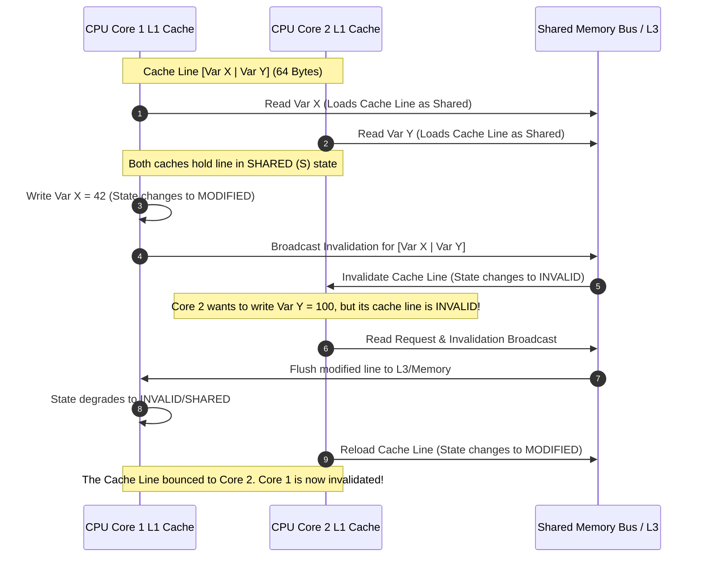

# Cache Coherence & False Sharing

## Introduction
In multi-core CPU architectures, each core maintains its own high-speed, local L1 and L2 caches to minimize slow main memory (DRAM) accesses. **Cache Coherence** is the hardware-level synchronization that ensures all CPU cores maintain a consistent, unified view of shared memory. A major side effect of this hardware-level synchronization is **False Sharing**, which occurs when independent threads running on different cores modify separate variables that happen to reside on the same **Cache Line**, causing severe performance degradation.

---

## Problem Statement
When a CPU core reads a variable, it does not fetch just that variable. Instead, it reads a contiguous chunk of memory called a **Cache Line** (typically 64 bytes). If Core 1 modifies variable $X$ and Core 2 modifies adjacent variable $Y$ on the same cache line, the hardware's cache coherence protocol forces Core 1 to invalidate Core 2's cache line on every write. The cache line constantly bounces between the L1 caches of the two cores, stalling the CPU pipelines. We need ways to detect and prevent this "cache line bouncing" (False Sharing).

---

## Why this exists
To maintain correctness while keeping memory access fast. Without cache coherence, Core 1 could write `x = 42` to its local L1 cache, but Core 2 would continue reading `x = 0` from its own L1 cache indefinitely. To prevent this, hardware uses coherence protocols to invalidate or update stale copies. However, because these protocols operate at the granularity of 64-byte cache lines rather than individual variables, they cause false sharing conflicts on adjacent memory addresses.

---

## Real-world analogy
Think of two authors editing a shared book on a physical page:
- **Shared Memory:** The book.
- **Cache Line:** A single sheet of paper containing lines of text.
- **False Sharing:** Author 1 wants to edit line 1 of the page, and Author 2 wants to edit line 2.
- **Conflict:** Although their edits are completely independent, only one author can hold and write on the piece of paper at a time. Author 1 grabs the paper, writes, and passes it to Author 2. Author 2 writes one word and passes it back. They spend more time passing the paper back and forth than writing, even though their work does not overlap.

---

## Definition
- **Cache Line:** The basic unit of data transfer between main memory and CPU caches, typically 64 bytes in modern architectures.
- **Cache Coherence:** The synchronization of shared memory states across multiple local CPU caches to ensure all cores observe read and write operations consistently.
- **False Sharing:** The performance degradation that occurs when two or more CPU cores modify independent variables that occupy the same cache line, triggering constant cache line invalidations.

---

## Key concepts

### Hardware Coherence Protocols
To track the state of cache lines, CPUs use protocols. The most common is the **MESI Protocol**:
1. **M - Modified:** The cache line is present only in the current cache and contains dirty data that has not been written to main memory.
2. **E - Exclusive:** The cache line is present only in the current cache and is clean (matches main memory).
3. **S - Shared:** The cache line is present in multiple CPU caches and is clean.
4. **I - Invalid:** The cache line contains invalid (stale) data and cannot be read.

### Coherence Mechanisms
- **Snooping (Bus-based):** Caches monitor a shared memory bus to detect reads/writes from other cores and update or invalidate their local lines. Efficient for low core counts.
- **Directory-based:** A centralized directory tracks which caches hold copies of which lines. Scales better to high core counts (e.g. multi-socket servers).

---

## Internal working / Mermaid diagram

### Cache Line Bouncing (False Sharing)



---

## Java implementation

### 1. Bad Implementation: False Sharing on Shared Objects
Two threads updating adjacent fields in a single array or object. The variables reside on the same cache line, causing false sharing.

```java
// Two threads modifying separate variables stored adjacent in memory.
// CRITICAL BUG: val1 and val2 reside on the same 64-byte cache line.
// Core 1 and Core 2 constantly invalidate each other's L1 caches, slowing down execution.
public class FalseSharingDemo {
    public static final class SharedData {
        public long val1 = 0; // 8 bytes
        public long val2 = 0; // 8 bytes (resides on same cache line as val1)
    }

    public static void main(String[] args) throws InterruptedException {
        SharedData data = new SharedData();
        int iterations = 100_000_000;

        Thread t1 = new Thread(() -> {
            for (int i = 0; i < iterations; i++) {
                data.val1++; // Core 1 writes to val1, invalidating Core 2
            }
        });

        Thread t2 = new Thread(() -> {
            for (int i = 0; i < iterations; i++) {
                data.val2++; // Core 2 writes to val2, invalidating Core 1
            }
        });

        long start = System.nanoTime();
        t1.start(); t2.start();
        t1.join(); t2.join();
        System.out.println("Bad Duration: " + (System.nanoTime() - start) / 1_000_000 + " ms");
    }
}
```

### 2. Better Implementation: Manual Cache Line Padding
Adding unused variables (padding) to pad the space between `val1` and `val2` to at least 64 bytes. This pushes them onto different cache lines, preventing false sharing.

```java
// Adding 7 unused long variables (56 bytes) between val1 and val2.
// This guarantees they reside on different 64-byte cache lines.
// TIME COMPLEXITY: O(1) reads/writes (no cache line bouncing)
// SPACE COMPLEXITY: O(1) (minor padding memory overhead)
public class PaddedSharingDemo {
    public static final class PaddedData {
        public long val1 = 0; // 8 bytes
        
        // Manual Padding: 7 * 8 bytes = 56 bytes of dummy space.
        // val1 + padding = 64 bytes (1 cache line).
        public long p1, p2, p3, p4, p5, p6, p7; 
        
        public long val2 = 0; // Resides on the next cache line
    }

    public static void main(String[] args) throws InterruptedException {
        PaddedData data = new PaddedData();
        int iterations = 100_000_000;

        Thread t1 = new Thread(() -> {
            for (int i = 0; i < iterations; i++) {
                data.val1++; // Core 1 writes to cache line 1
            }
        });

        Thread t2 = new Thread(() -> {
            for (int i = 0; i < iterations; i++) {
                data.val2++; // Core 2 writes to cache line 2 (No interference!)
            }
        });

        long start = System.nanoTime();
        t1.start(); t2.start();
        t1.join(); t2.join();
        System.out.println("Padded Duration: " + (System.nanoTime() - start) / 1_000_000 + " ms");
    }
}
```

### 3. Best Implementation: Using Java's `@Contended` Annotation
Using Java 8's built-in `@Contended` annotation. The JVM automatically calculates cache line sizes and inserts the appropriate memory padding at runtime, keeping code clean and portable.

```java
// Using @Contended to prevent false sharing.
// Note: Requires running JVM with flag: -XX:-RestrictContended
// TIME COMPLEXITY: O(1) read/write
// SPACE COMPLEXITY: O(1) (JVM managed padding)
public class ContendedSharingDemo {
    public static final class ContendedData {
        // JVM inserts padding around marked fields automatically
        @jdk.internal.vm.annotation.Contended
        public long val1 = 0;

        @jdk.internal.vm.annotation.Contended
        public long val2 = 0;
    }

    public static void main(String[] args) throws InterruptedException {
        ContendedData data = new ContendedData();
        int iterations = 100_000_000;

        Thread t1 = new Thread(() -> {
            for (int i = 0; i < iterations; i++) {
                data.val1++;
            }
        });

        Thread t2 = new Thread(() -> {
            for (int i = 0; i < iterations; i++) {
                data.val2++;
            }
        });

        long start = System.nanoTime();
        t1.start(); t2.start();
        t1.join(); t2.join();
        System.out.println("Contended Duration: " + (System.nanoTime() - start) / 1_000_000 + " ms");
    }
}
```

---

## Step-by-step explanation
1. **The 64-Byte Cache Line Unit**: In `FalseSharingDemo`, `val1` and `val2` are declared consecutively. The compiler allocates them adjacent in heap memory. Because each is a 64-bit integer (8 bytes), they fit easily on a single 64-byte cache line.
2. **Cache Line Bouncing Loop**:
   - Thread 1 on Core 1 reads the cache line to increment `val1`. Core 1's cache changes the line state to **Modified (M)**.
   - Core 1 broadcasts an invalidation signal over the memory bus. Core 2 receives the signal and marks its copy of the cache line as **Invalid (I)**.
   - Thread 2 on Core 2 attempts to increment `val2`. It encounters a cache miss because the line is invalid.
   - Core 2 requests the data. Core 1 must flush its modified cache line back to L3 cache or main memory before Core 2 can load it.
   - Core 2 loads the line and marks it **Modified (M)**, invalidating Core 1.
   This sequence repeats millions of times, slowing down execution (e.g. running 5-10$\times$ slower than sequential execution).
3. **Padding Isolation (Best)**: In `PaddedSharingDemo`, the dummy fields `p1` to `p7` consume 56 bytes. This forces `val2` to be allocated at least 64 bytes away from `val1`. They occupy separate cache lines. Cores 1 and 2 write to their respective cache lines without triggering invalidation signals, achieving true parallel performance.

---

## Multiple real-world examples
1. **Java's LongAdder Class:** An atomic counter that distributes writes across an array of cells (`Cell[]`) to reduce contention. Each cell in the array is annotated with `@Contended` to prevent false sharing between threads updating different cells.
2. **Disruptor Ring Buffer:** Pads the producer and consumer sequence counters with dummy long variables (`p1, p2, p3...`) to ensure sequence pointers reside on separate cache lines.
3. **OS Kernel Data Structures:** Linux kernel task structs align locks and counters to cache line boundaries (`____cacheline_aligned`) to prevent performance drops on multi-socket servers.

---

## Pros
- **Extreme Performance Gains:** Eliminating false sharing can speed up concurrent loops by 5$\times$ to 10$\times$.
- **Hardware Coherence:** Keeps program state consistent across CPU cores automatically.
- **Portability:** Annotations like `@Contended` allow the virtual machine to manage padding, adapting to different CPU cache line sizes dynamically.

---

## Cons
- **Memory Overhead:** Adding 56 bytes of padding to small objects increases memory consumption.
- **Wasted Cache Space:** Padding increases L1/L2 cache footprint, reducing the amount of useful data that can be cached.
- **Silent Profiling:** False sharing is invisible to standard software profilers. Finding it requires hardware performance counter analysis (e.g. Intel VTune, Linux `perf`).

---

## Interview questions

### Beginner
- **Q: What is a cache line, and what is its typical size in modern CPUs?**
  - **A:** A cache line is the basic unit of data transfer between main memory and CPU caches. Instead of fetching single bytes, the CPU loads a contiguous block of memory into its cache. Its typical size is **64 bytes** in x86 and ARM architectures.

### Intermediate
- **Q: What is false sharing?**
  - **A:** False sharing occurs when two threads running on different CPU cores modify separate, independent variables that reside on the identical cache line. The CPU cache coherence protocol treats the cache line as a single unit, forcing it to bounce between the L1 caches of both cores and degrading performance.

### Senior
- **Q: Describe the MESI cache coherence protocol states.**
  - **A:** MESI represents the four states of a cache line:
    - **Modified (M):** The line is present only in the current cache and holds modified (dirty) data that has not been written to main memory.
    - **Exclusive (E):** The line is present only in the current cache and is clean (matches main memory).
    - **Shared (S):** The line is present in multiple CPU caches and is clean.
    - **Invalid (I):** The line contains stale (invalid) data.

### Staff Engineer
- **Q: Explain "Cache Line Bouncing" and "Directory-based Coherence" scaling limits. How does Directory-based scaling improve upon Snooping-based scaling in massive multi-core systems?**
  - **A:** 
    - **Snooping Coherence Limit:** In a snooping system, all CPU caches are connected to a shared memory bus. Every write broadcast is listened to by all cores. As the number of cores grows (e.g. beyond 16 or 32), the broadcast traffic saturates the bus bandwidth, limiting scalability.
    - **Directory Coherence Scaling:** In a directory-based system, a centralized directory (often distributed across memory controllers) tracks which cores hold copies of each cache line. When a core writes to a line, it queries the directory and sends invalidation signals **only** to the specific cores holding the line, rather than broadcasting to all cores. This reduces bus traffic, allowing systems with hundreds of cores to scale efficiently.

---

## Common mistakes
- **Ignoring field order:** Storing active thread counters adjacent to each other in memory.
- **Over-padding:** Adding padding to every object indiscriminately, which exhausts L1 cache space and causes cache thrashing.
- **Assuming compiler optimizations prevent it:** Assuming compilers will automatically restructure fields to prevent false sharing (compilers cannot alter object layout rules).

---

## Best practices
- **Isolate thread-local counters:** Group variables accessed by a single thread together and pad them away from variables accessed by other threads.
- **Use @Contended:** Use built-in JVM annotations or compiler alignment directives rather than manual padding variables to maintain clean code.
- **Align array elements:** Align structures in concurrent arrays to 64-byte boundaries.

---

## When NOT to use
- **Read-Only Arrays:** If data in a cache line is read-only (immutable), the line remains in the **Shared (S)** state on all cores. No invalidations occur, making false sharing impossible. Padding is unnecessary.

---

## Comparison with similar concepts

| Concept | False Sharing | True Sharing | Lock Contention |
| :--- | :--- | :--- | :--- |
| **Data Access** | Threads access different variables | Threads access the same variable | Threads attempt to acquire the same lock |
| **Conflict Unit** | 64-byte Cache Line | Individual Variable | Mutex/Lock Object |
| **System Level** | Hardware (Cache Coherence) | Software / Memory Model | Software / OS Scheduler |

---

## Summary
Cache coherence protocols maintain consistent memory states across CPU caches. Developers must design concurrent structures to prevent false sharing by padding or aligning variables to 64-byte boundaries, avoiding cache line bouncing and performance drops.

---

## Related topics
- [Memory Models](../memory-models)
- [Synchronization Primitives](../synchronization)
- [Processes & Threads](../processes-threads)
