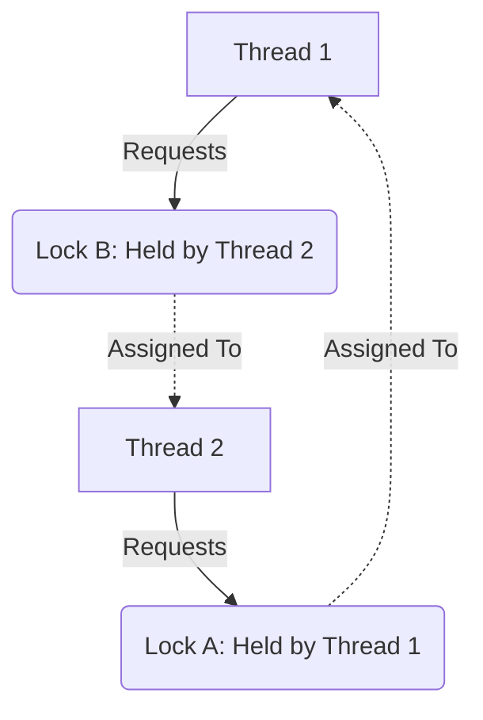

# Concurrency Deadlocks

## Introduction
A **Deadlock** is a state in concurrent programming where two or more threads or processes are unable to make progress because each is waiting for a resource that is held by another. The entire execution halts, causing application freezes. Detecting, preventing, and recovering from deadlocks is a core challenge in operating systems and distributed systems.

---

## Problem Statement
When multiple threads require exclusive access to multiple shared resources (like database rows, files, or lock objects) to complete a transaction, they must acquire locks. If Thread 1 holds Resource A and requests Resource B, while Thread 2 holds Resource B and requests Resource A, neither thread can proceed. We need strategies to prevent these cyclical dependency deadlocks.

---

## Why this exists
To balance lock granularity and performance. If we lock the entire system using a single global lock, deadlocks are impossible, but concurrent throughput is reduced. When we break locks down into fine-grained locks to increase parallel processing, we open the door to deadlocks if lock acquisition order is not coordinated.

---

## Real-world analogy
Think of a narrow, one-lane bridge over a river:
- **Shared Resources:** The bridge segments.
- **Deadlock:** Car A drives onto the bridge from the north, and Car B drives onto the bridge from the south. They meet in the middle.
- **Deadlock Conditions:** Neither car can drive forward (Mutual Exclusion). Neither car is willing to back up (Hold and Wait). Neither car can push the other out of the way (No Preemption). They are stuck in a circular block, waiting for each other to clear the road.

---

## Definition
- **Deadlock:** A condition where a set of processes are blocked because each process holds a resource and waits for another resource held by some other process in the set.
- **Livelock:** Similar to a deadlock, except that the states of the processes involved in the livelock constantly change with respect to one another, none progressing (e.g., two polite people trying to pass each other in a hallway, repeatedly stepping to the same side).
- **Starvation:** A condition where a thread is perpetually denied necessary resources to make progress, even though the system as a whole is running correctly.

---

## Key concepts

### The Four Coffman Conditions
All four conditions **must** hold simultaneously for a deadlock to occur. Negating any one of these conditions prevents deadlocks:
1. **Mutual Exclusion:** At least one resource must be held in a non-shareable mode (only one thread can use it at a time).
2. **Hold and Wait:** A thread must hold at least one resource and be waiting to acquire additional resources held by other threads.
3. **No Preemption:** Resources cannot be forcibly taken from a thread; they can only be released voluntarily by the thread holding them.
4. **Circular Wait:** A closed loop of threads exists, where each thread waits for a resource held by the next thread in the chain.

---

## Internal working / Mermaid diagram

### Circular Wait Deadlock Cycle



---

## Java implementation

### 1. Bad Implementation: Arbitrary Lock Ordering Deadlock
Two threads acquiring two locks in different orders. When executed concurrently, the threads will deadlock, hanging the program permanently.

```java
// Two threads attempting to acquire two locks in opposite orders.
// CRITICAL BUG: Thread 1 acquires lock1, Thread 2 acquires lock2.
// Both are then suspended indefinitely waiting for the other to release.
public class BadDeadlock {
    private static final Object lock1 = new Object();
    private static final Object lock2 = new Object();

    public static void runThread1() {
        synchronized (lock1) {
            System.out.println("Thread 1: Acquired lock1");
            try { Thread.sleep(50); } catch (InterruptedException e) {}
            
            synchronized (lock2) { // Requests lock2, held by Thread 2
                System.out.println("Thread 1: Acquired lock2");
            }
        }
    }

    public static void runThread2() {
        synchronized (lock2) {
            System.out.println("Thread 2: Acquired lock2");
            try { Thread.sleep(50); } catch (InterruptedException e) {}
            
            synchronized (lock1) { // Requests lock1, held by Thread 1
                System.out.println("Thread 2: Acquired lock1");
            }
        }
    }

    public static void main(String[] args) {
        new Thread(BadDeadlock::runThread1).start();
        new Thread(BadDeadlock::runThread2).start();
    }
}
```

### 2. Better Implementation: Enforced Lock Ordering
Eliminating the **Circular Wait** condition by enforcing a strict, global lock acquisition order. Both threads must acquire `lock1` before attempting to acquire `lock2`.

```java
// Enforcing a strict lock acquisition order.
// TIME COMPLEXITY: O(1) lock acquisition
// SPACE COMPLEXITY: O(1)
public class BetterOrderedLocks {
    private static final Object lock1 = new Object();
    private static final Object lock2 = new Object();

    public static void runThread1() {
        // Enforce ordering: lock1 then lock2
        synchronized (lock1) {
            System.out.println("Thread 1: Acquired lock1");
            try { Thread.sleep(50); } catch (InterruptedException e) {}
            
            synchronized (lock2) {
                System.out.println("Thread 1: Acquired lock2");
            }
        }
    }

    public static void runThread2() {
        // Enforce identical ordering: lock1 then lock2
        // If Thread 1 holds lock1, Thread 2 blocks here instead of holding lock2
        synchronized (lock1) { 
            System.out.println("Thread 2: Acquired lock1");
            try { Thread.sleep(50); } catch (InterruptedException e) {}
            
            synchronized (lock2) {
                System.out.println("Thread 2: Acquired lock2");
            }
        }
    }
}
```

### 3. Best Implementation: Lock Timeouts with Try-Lock
Eliminating the **No Preemption** and **Hold and Wait** conditions using `tryLock` with timeouts. If a lock cannot be acquired within a time limit, the thread releases its acquired locks, backs off, and tries again later, preventing permanent hangs.

```java
import java.util.concurrent.TimeUnit;
import java.util.concurrent.locks.ReentrantLock;

// Using tryLock timeouts to prevent deadlocks dynamically.
// TIME COMPLEXITY: O(1) per lock attempt (with timeout limits)
// SPACE COMPLEXITY: O(1)
public class BestTryLock {
    private static final ReentrantLock lock1 = new ReentrantLock();
    private static final ReentrantLock lock2 = new ReentrantLock();

    public static void performTransaction(ReentrantLock firstLock, ReentrantLock secondLock) {
        while (true) {
            boolean gotFirstLock = false;
            boolean gotSecondLock = false;
            try {
                // Attempt to acquire the first lock with a brief timeout
                gotFirstLock = firstLock.tryLock(10, TimeUnit.MILLISECONDS);
                if (gotFirstLock) {
                    // Attempt to acquire the second lock
                    gotSecondLock = secondLock.tryLock(10, TimeUnit.MILLISECONDS);
                }
            } catch (InterruptedException e) {
                Thread.currentThread().interrupt();
                return;
            }

            if (gotFirstLock && gotSecondLock) {
                try {
                    // Critical Section: successfully acquired both locks safely
                    System.out.println(Thread.currentThread().getName() + ": Completed transaction!");
                    return;
                } finally {
                    firstLock.unlock();
                    secondLock.unlock();
                }
            }

            // Back off: if we failed to acquire BOTH locks, release any lock we DO hold
            if (gotFirstLock) {
                firstLock.unlock(); // Prevent Hold and Wait
            }
            
            // Wait briefly before retrying to prevent CPU-intensive livelock spinning
            try { Thread.sleep((int)(Math.random() * 20)); } catch (InterruptedException e) {}
        }
    }

    public static void main(String[] args) {
        Thread t1 = new Thread(() -> performTransaction(lock1, lock2), "Thread-1");
        Thread t2 = new Thread(() -> performTransaction(lock2, lock1), "Thread-2");
        t1.start();
        t2.start();
    }
}
```

---

## Step-by-step explanation
1. **Circular Wait Creation**: In `BadDeadlock`, Thread 1 enters `runThread1()`, locks `lock1`, and sleeps. Thread 2 enters `runThread2()`, locks `lock2`, and sleeps. When they wake up, Thread 1 tries to enter `synchronized(lock2)` but blocks. Thread 2 tries to enter `synchronized(lock1)` but blocks. Since neither releases their held lock, they hang forever.
2. **Lock Order Enforcement**: In `BetterOrderedLocks`, we align the locking sequence. If Thread 1 acquires `lock1`, Thread 2 is blocked from acquiring `lock1` and cannot lock `lock2`. Thread 1 completes its work, releases `lock1` and `lock2`, and Thread 2 proceeds safely.
3. **Try-Lock Backoff (Best)**: In `BestTryLock`, Thread 1 locks `lock1` but fails to acquire `lock2` within `10ms`.
   - Instead of waiting forever, Thread 1 releases `lock1` (`firstLock.unlock()`), clearing the deadlock condition.
   - Both threads sleep for a random interval to prevent synchronized step-locking (which causes **Livelocks**).
   - They retry the sequence, successfully completing their work without OS intervention.

---

## Multiple real-world examples
1. **Database Deadlocks:** Two concurrent SQL transactions attempting to update the same rows in opposite orders. Modern databases (like MySQL/PostgreSQL) run background threads to detect cycles in dependency graphs and abort one of the transactions.
2. **Thread Pools (Resource Deadlock):** A thread pool of size 2 is running. Task A and Task B occupy both threads. To complete, Task A submits a subtask to the pool and waits for its result. Since the pool is full, the subtask waits in the queue forever, deadlocking the system.
3. **Telecommunication Routing:** Routing paths allocating circuit links in closed loops, blocking data transfers.

---

## Pros
- **Consistent Lock Ordering:** Easy to implement and carries no runtime execution overhead.
- **Try-Lock Timeouts:** Protects applications from permanent freezes and enables self-recovery.
- **Detection Routines:** Allows logging and diagnosing resource bottlenecks before production crashes occur.

---

## Cons
- **Deadlock Recovery Cost:** Aborting transactions or killing threads to recover from a deadlock loses work and requires rollback logic.
- **Livelock Risks:** Poorly designed retry mechanisms in try-locks can cause threads to loop infinitely, consuming 100% CPU.
- **Maintainability:** Enforcing global lock ordering across large, complex codebases with distributed teams is difficult.

---

## Interview questions

### Beginner
- **Q: What are the four Coffman conditions required for a deadlock to occur?**
  - **A:** 
    1. **Mutual Exclusion:** At least one resource must be held exclusively.
    2. **Hold and Wait:** A process holds resources while waiting for others.
    3. **No Preemption:** Resources cannot be forcibly taken from processes.
    4. **Circular Wait:** A closed chain of processes exists where each waits for a resource held by the next.

### Intermediate
- **Q: How does a Livelock differ from a Deadlock?**
  - **A:** 
    - In a **Deadlock**, threads are blocked in a waiting state (consuming 0% CPU) and cannot change their state.
    - In a **Livelock**, threads actively change their states and execute instructions (consuming 100% CPU) but make no functional progress due to synchronized resource backoffs.

### Senior
- **Q: Explain the Banker's Algorithm. When is it used?**
  - **A:** The Banker's Algorithm is a deadlock avoidance algorithm developed by Edsger Dijkstra. It is used in operating systems to allocate resources safely.
    - **How it works:** When a process requests resources, the OS simulates the allocation. It checks if the remaining resource state is **Safe**—meaning there exists at least one execution sequence where all processes can run to completion. If safe, it allocates the resources; if unsafe, it forces the process to wait.
    - **Limitation:** In practice, it is rarely used because it requires knowing the maximum resource demands of every process in advance, which is difficult to predict.

### Staff Engineer
- **Q: How would you design a distributed deadlock detection system for a sharded database?**
  - **A:** 
    - **Resource Allocation Graphs (RAG):** Each shard maintains a local Wait-For Graph (WFG) where nodes represent transactions and directed edges represent lock waits.
    - **Distributed Cycle Detection:**
      1. **Centralized Approach:** Shards periodically send their local WFGs to a coordinator node that aggregates them into a global WFG and runs Cycle Detection algorithms (like Tarjan's SCC).
      2. **Path-Pushing Approach:** When a shard detects a local path ending in an external wait, it sends a "probe" message containing the path to the remote shard. If the probe returns to its origin shard, a cycle is detected.
    - **Resolution:** To break the cycle, the coordinator selects a **Victim Transaction** to abort based on priority, age, or lock cost.

---

## Common mistakes
- **Acquiring locks in arbitrary order:** Nested locking without ordering conventions.
- **Omitting backoff randomizers:** Retrying failed try-locks immediately, which leads to livelock.
- **Holding locks during network calls:** Keeping locks active while waiting for remote API responses, which increases lock hold times and deadlock risks.

---

## Best practices
- **Avoid Nested Locks:** Minimize holding multiple locks simultaneously.
- **Use Try-Locks with timeouts:** Replace raw blocking lock calls with timed locks.
- **Determine Order by Hash:** If acquiring locks on two objects of the same class, determine ordering by their unique system hash codes (`System.identityHashCode(obj1)` vs `System.identityHashCode(obj2)`).

---

## When NOT to use
- **Lock-Free Concurrency Design:** If your application uses atomic counters, immutable states, or message queues, locking is bypassed, making deadlock handling strategies unnecessary.

---

## Comparison with similar concepts

| Concept | Deadlock | Livelock | Starvation |
| :--- | :--- | :--- | :--- |
| **CPU Utilization** | 0% (threads are blocked) | 100% (threads are active) | Variable (thread is runnable but ignored) |
| **State Changes** | None | Continuous | Continuous |
| **Self-Recovery** | Never (requires OS/admin intervention) | Rare (without random backoff) | Possible (if workloads change) |

---

## Summary
Deadlocks occur when threads hold resources while waiting for others in a circular dependency. They can be avoided by enforcing lock ordering, utilizing timed locks, or using lock-free data structures.

---

## Related topics
- [Synchronization Primitives](../synchronization)
- [Processes & Threads](../processes-threads)
- [Memory Models](../memory-models)
