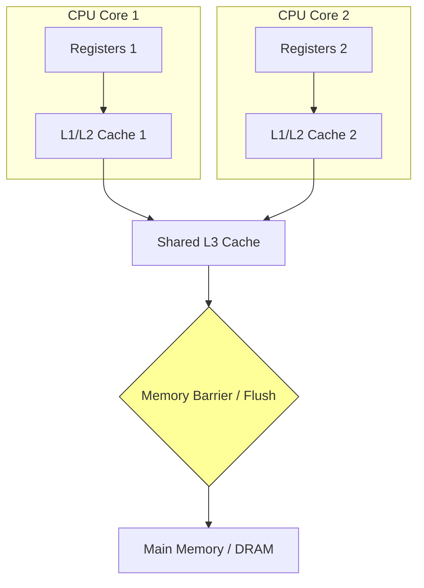

# Memory Models

## Introduction
A **Memory Model** is a formal specification that defines the rules and guarantees for how reads and writes to shared memory are observed across different threads and CPU cores. It specifies when modifications made by one thread become visible to other threads and how instruction reordering affects concurrent execution. The **Java Memory Model (JMM)** and C++ Memory Model are crucial concepts for writing correct, high-performance concurrent software.

---

## Problem Statement
For maximum performance, modern compilers, virtual machines, and CPU cores optimize execution paths by reordering instructions and caching variables in CPU registers or L1/L2/L3 caches. If a program assumes that memory operations always execute in the exact order they appear in source code (Sequential Consistency), concurrent threads can read stale cached data or execute operations out of order, leading to silent bugs. We need a formal contract that defines memory visibility and ordering guarantees.

---

## Why this exists
To balance hardware optimization and programmer usability. Without a memory model, hardware designers could not optimize CPU architectures (like out-of-order execution) because they might break concurrent programs. A memory model establishes a contract: if programmers use specific synchronization markers (like `volatile` or locks), the runtime and hardware guarantee memory visibility and prevent invalid instruction reorderings.

---

## Real-world analogy
Think of writing a joint document on a cloud platform (like Google Docs) with offline synchronization:
- **Shared Memory:** The master document on the cloud server.
- **CPU Cache/Register:** Your offline local draft.
- **Visibility Problem:** If you edit your local draft offline, your coworker cannot see your updates. They continue reading the old version (stale memory) until you explicitly sync and publish your changes (Memory Barrier/Flush).
- **Instruction Reordering:** If you write a summary of a feature before writing the feature description, but the sync mechanism uploads the summary first, your coworker might read the summary and wonder why the feature description is missing.

---

## Definition
- **Java Memory Model (JMM):** A specification that describes how the Java Virtual Machine (JVM) behaves in relation to the computer's main memory, defining the semantics of `volatile`, `synchronized`, and `final` keywords.
- **Happens-Before Relationship:** A formal relation defined by the JMM. If event A *happens-before* event B, the memory model guarantees that all memory updates completed before A are visible to the thread executing B, and that the relative execution order of A and B is preserved.
- **Instruction Reordering:** The rearrangement of memory operations by the compiler or CPU to improve performance (e.g., executing a memory write later to avoid CPU stall cycles).

---

## Key concepts
1. **Memory Visibility:** The guarantee that a write to a variable by one thread is observed by a read of the same variable by another thread.
2. **Instruction Reordering Categories:**
   - **Compiler Reordering:** The compiler reorganizes bytecodes during optimization.
   - **Processor Reordering:** The CPU executes instructions out-of-order based on resource availability (e.g. executing load instructions early if execution pipelines are idle).
3. **Memory Barriers (Fences):** Hardware instructions that force the CPU to flush its write buffers and reload its caches, preventing memory operations from crossing the barrier line.
4. **Volatile Semantics:**
   - **Visibility:** Reads and writes bypass CPU registers/caches and go directly to main memory.
   - **Ordering:** Prevents instruction reordering around volatile variables using memory fences.
5. **Data Race vs Race Condition:**
   - **Data Race:** A low-level memory conflict where two threads access the same memory location concurrently, at least one access is a write, and there is no synchronization.
   - **Race Condition:** A high-level logical flaw where the correctness of program output depends on the relative timing or interleaving of threads.

---

## Internal working / Mermaid diagram

### Hardware Memory Hierarchy vs Memory Barriers



---

## Java implementation

### 1. Bad Implementation: Infinite Loop Due to Memory Caching (No Visibility)
A worker thread checks a shared boolean flag to terminate. Because the flag is not synchronized or declared volatile, the JVM caches the flag in the thread's CPU register, causing the worker thread to loop infinitely even after the main thread updates the flag.

```java
// A worker thread that checks a flag to terminate.
// CRITICAL BUG: flag is not volatile. The JVM caches it in Thread 1's L1 cache/register.
// Thread 1 never observes the update made by the Main Thread, looping infinitely.
public class StaleFlagLoop {
    private boolean stopRequested = false; // No visibility guarantees

    public void startWorker() {
        Thread worker = new Thread(() -> {
            int count = 0;
            while (!stopRequested) { // Reads cached value (false) infinitely
                count++;
            }
            System.out.println("Worker stopped. Count: " + count);
        });
        worker.start();
    }

    public void stopWorker() {
        stopRequested = true; // Write is not immediately visible to worker thread
        System.out.println("Stop requested in main thread.");
    }

    public static void main(String[] args) throws InterruptedException {
        StaleFlagLoop demo = new StaleFlagLoop();
        demo.startWorker();
        Thread.sleep(100);
        demo.stopWorker();
    }
}
```

### 2. Better Implementation: Ensuring Visibility with `volatile`
Declaring the shared flag as `volatile`. This forces all reads and writes to bypass CPU caches and access main memory directly, ensuring immediate visibility.

```java
// Declaring the flag as volatile.
// TIME COMPLEXITY: O(1) read/write
// SPACE COMPLEXITY: O(1)
public class VolatileFlag {
    // volatile guarantees visibility across threads
    private volatile boolean stopRequested = false;

    public void startWorker() {
        Thread worker = new Thread(() -> {
            int count = 0;
            while (!stopRequested) { // Always reads from main memory
                count++;
            }
            System.out.println("Worker stopped. Count: " + count);
        });
        worker.start();
    }

    public void stopWorker() {
        stopRequested = true; // Write immediately flushes to main memory
        System.out.println("Stop requested in main thread.");
    }
}
```

### 3. Best Implementation: Safe Double-Checked Locking (DCL)
An optimized implementation of the Singleton pattern using **Double-Checked Locking**. The `volatile` reference is essential to prevent instruction reordering, preventing threads from reading partially initialized objects.

```java
// Thread-Safe Singleton using Double-Checked Locking.
// TIME COMPLEXITY: O(1) (bypasses synchronization after initialization)
// SPACE COMPLEXITY: O(1)
public class SafeDCLSingleton {
    // volatile prevents instruction reordering during instantiation
    private static volatile SafeDCLSingleton instance;

    private SafeDCLSingleton() {
        // Initialize heavy resources here
    }

    public static SafeDCLSingleton getInstance() {
        SafeDCLSingleton result = instance; // Read volatile once
        if (result == null) { // First check (no lock overhead)
            synchronized (SafeDCLSingleton.class) {
                result = instance;
                if (result == null) { // Second check (with lock)
                    instance = result = new SafeDCLSingleton();
                    // Instantiation involves:
                    // 1. Allocate memory
                    // 2. Run constructor (init fields)
                    // 3. Assign memory address to instance variable
                    // volatile prevents step 3 from being reordered before step 2.
                }
            }
        }
        return result;
    }
}
```

---

## Step-by-step explanation
1. **The Visibility Deficit**: In `StaleFlagLoop`, the JVM optimizer identifies that `stopRequested` is not modified inside the loop. To improve performance, it hoists the variable out of the loop or caches it in a CPU register. When the main thread writes `stopRequested = true` on another CPU core, it updates its local cache or write buffer, but the change does not propagate to the worker thread's register, causing an infinite loop.
2. **Volatile Memory Barriers**: In `VolatileFlag`, declaring `stopRequested` as `volatile` generates a **Load-Load/Load-Store** memory barrier before reads, and a **Store-Store/Store-Load** barrier after writes. This forces the hardware to write changes to main memory immediately and invalidates cached copies in other CPU cores, forcing them to re-read from main memory.
3. **Instruction Reordering Protection (Best)**: In `SafeDCLSingleton`, when a CPU instantiates an object:
   - Without `volatile`, the CPU might allocate memory and immediately write the memory address to `instance` (making it non-null), and then execute the constructor asynchronously.
   - If Thread 2 calls `getInstance()` during this gap, it checks `instance == null` (which evaluates to false), bypasses synchronization, and returns the reference. Thread 2 then attempts to read fields on a partially initialized object, causing a crash.
   - `volatile` prevents the constructor write and reference write from being reordered, ensuring safety.

---

## Multiple real-world examples
1. **Disruptor Ring Buffer:** Using memory barriers (via sequence numbers) to coordinate consumer and producer threads without locks.
2. **Java Concurrent Package (java.util.concurrent):** Classes like `ConcurrentHashMap` and `LinkedBlockingQueue` rely heavily on volatile state variables and CAS operations to achieve thread safety.
3. **Rust Concurrency (Send & Sync):** Rust's compile-time memory model enforces thread safety by tracking ownership and resource-sharing capabilities (`Send`/`Sync` traits) at compile time.

---

## Pros
- **High Performance:** Volatile variables bypass lock acquisition overhead.
- **Instruction Control:** Prevents compiler and CPU reorderings that violate correctness.
- **Formal Contract:** Provides predictable rules for reasoning about multi-threaded memory access.

---

## Cons
- **No Atomicity:** `volatile` only guarantees visibility and ordering; it does **not** make compound operations (like `counter++` or check-then-act) atomic.
- **Complexity:** Reasoning about memory models and happens-before relationships is difficult and error-prone.
- **Cache Invalidation Overhead:** Frequent volatile writes force CPU cache invalidations, which can degrade memory bus bandwidth.

---

## Interview questions

### Beginner
- **Q: What does the volatile keyword guarantee in Java?**
  - **A:** It guarantees two things:
    1. **Visibility:** All reads and writes to the volatile variable go directly to main memory, preventing threads from reading stale cached values.
    2. **Ordering:** It prevents compiler and CPU instruction reorderings around the volatile variable.
    It does **not** guarantee atomicity.

### Intermediate
- **Q: What is the "Happens-Before" relationship? Give 3 examples.**
  - **A:** It is a formal JMM contract. If event A *happens-before* event B, the memory effects of A are visible to B. Examples:
    1. **Lock Rule:** An unlock operation on a monitor *happens-before* every subsequent lock operation on that same monitor.
    2. **Volatile Variable Rule:** A write to a volatile field *happens-before* every subsequent read of that same field.
    3. **Thread Start Rule:** A call to `Thread.start()` *happens-before* any action in the started thread.

### Senior
- **Q: In Double-Checked Locking for Singletons, why is the local variable `SafeDCLSingleton result = instance` used?**
  - **A:** It is a performance optimization. Reading a volatile variable requires executing memory barriers at the CPU level, which is slower than reading a standard register. By copying the volatile `instance` to a local helper variable `result`, we only perform a single volatile read in the common path (when the singleton is already initialized), saving CPU execution cycles.

### Staff Engineer
- **Q: Explain Sequential Consistency vs Weak Memory Models. How do x86 and ARM CPU architectures differ in memory ordering?**
  - **A:** 
    - **Sequential Consistency:** A strict memory model where all memory operations appear to execute in a single global sequential order, and every thread observes operations in the identical order. Modern hardware does not implement this due to performance overheads.
    - **Weak Memory Models:** Allow memory operations to be reordered and observed differently by different threads unless memory barriers are used.
    - **Architecture Differences:**
      - **x86 (Strong Memory Model / TSO):** Implements **Total Store Order (TSO)**. It does not reorder Reads with Reads, Writes with Writes, or Reads with Writes. It only reorders Writes followed by Reads (Store-Load reordering). Memory fences are rarely needed.
      - **ARM/PowerPC (Weak Memory Model):** Highly relaxed. It can reorder any memory operations (Load-Load, Load-Store, Store-Store, Store-Load) unless explicit memory barriers (e.g., `DMB` instructions) are used. Concurrent code written for x86 can fail on ARM (e.g., Apple Silicon, AWS Graviton) if proper memory model barriers are omitted.

---

## Common mistakes
- **Confusing volatile with synchronized:** Assuming `volatile` guarantees thread-safety for compound operations like `counter++`.
- **Forgetting volatile in DCL:** Implementing Double-Checked Locking without `volatile`, which leads to race conditions and partially initialized object reads.
- **Assuming Sequential Consistency:** Assuming that memory operations will always execute in the order written in the source code.

---

## Best practices
- **Use volatile for single flags:** Use `volatile` only when a variable's value is written by a single thread and read by others, or when locking is too expensive.
- **Prefer atomic wrappers:** Use `AtomicBoolean` or `AtomicInteger` over raw volatile variables for compound updates.
- **Document memory invariants:** Clearly document the happens-before paths when building custom lock-free primitives.

---

## When NOT to use
- **Compound State Updates:** If a state change depends on the current value (e.g., `counter = counter + 1`), do not use `volatile` alone. Use synchronized blocks, explicit locks, or Atomic classes instead.

---

## Comparison with similar concepts

| Concept | volatile | synchronized | AtomicInteger |
| :--- | :--- | :--- | :--- |
| **Guarantees Visibility** | Yes | Yes | Yes |
| **Guarantees Ordering** | Yes | Yes | Yes |
| **Guarantees Atomicity** | No | Yes (via locking) | Yes (via CAS) |
| **Thread Blocking** | No | Yes | No |

---

## Summary
Memory Models define rules for memory visibility and instruction ordering in concurrent systems. Developers must understand the happens-before relationship, compiler reordering, and volatile semantics to write safe, high-performance concurrent code.

---

## Related topics
- [Synchronization Primitives](../synchronization)
- [Processes & Threads](../processes-threads)
- [Cache Coherence](../cache-coherence)
