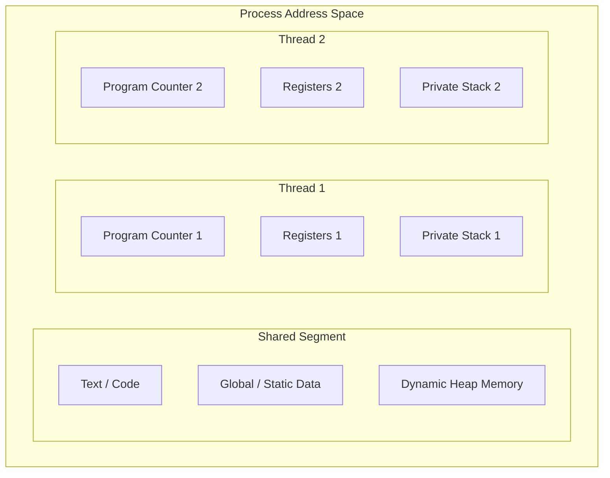

# Processes & Threads

## Introduction
At the core of multitasking operating systems are two fundamental units of execution: **Processes** and **Threads**. A process is an isolated execution environment with its own dedicated resources, while a thread is the smallest schedulable unit of execution within a process. Understanding how they operate, share memory, and context-switch is crucial for building scalable, high-performance applications.

---

## Problem Statement
Modern CPUs contain multiple cores capable of executing billions of instructions per second. If an application runs as a single, sequential thread of execution, it can only utilize a single CPU core, leaving the rest of the system idle. However, building concurrent systems introduces complex resource isolation, synchronization, and communication challenges. We need to decide when to split workloads into isolated processes versus lightweight, shared-memory threads.

---

## Why this exists
To balance isolation and performance:
- **Processes (High Isolation, High Overhead):** Provide a crash-proof security boundary. If one process encounters a segmentation fault or memory leak, other processes on the system continue unaffected.
- **Threads (Low Isolation, Low Overhead):** Enable fast cooperative multitasking. Threads share the same memory space, bypassing the expensive memory mapping and message-passing protocols required between processes.

---

## Real-world analogy
Think of a large corporate office building:
- **Process:** An entire rented office suite occupied by Company A. Company A has its own locked doors, filing cabinets, and private desks. Company B (another process) in the suite next door cannot walk in and read Company A's filing cabinets.
- **Thread:** Individual employees working inside Company A's office. All employees share the same desks, pantry, and whiteboards (shared heap memory), but each employee has their own notepad and pen (private stack/local registers). If an employee makes a mess on the shared whiteboard, it affects other employees in the company.

---

## Definition
- **Process:** An instance of a computer program that is being executed. It contains the program code, its current activity (tracked by the program counter), and its allocated system resources (memory, file descriptors, security contexts).
- **Thread:** A sequence of programmed instructions that can be managed independently by an operating system scheduler. Multiple threads exist within a single process and share its address space.
- **Context Switch:** The process of storing the state of a CPU core (registers, program counter) so that execution can be paused and resumed later, allowing another process or thread to run.

---

## Key concepts
1. **Memory Layout Differences:**
   - **Process Memory:** Divided into Text (code), Data (global variables), Heap (dynamic allocations), and Stack segments. It uses Virtual Address Spaces mapped by the OS page tables.
   - **Thread Memory:** Share the process's Text, Data, and Heap segments. Each thread maintains its own private **Program Counter (PC)**, **Register Set**, and **Call Stack** (local variables).
2. **Context Switching Overhead:**
   - **Process Switch:** Expensive. Requires flushing the Translation Lookaside Buffer (TLB), changing memory page tables in the MMU, and reloading register states.
   - **Thread Switch:** Lightweight. Only requires saving and restoring register sets and program counters. The memory mapping remains unchanged.
3. **Inter-Process Communication (IPC):** Since processes are isolated, they must communicate via explicit OS channels: Sockets, Pipes, Shared Memory Segments, or Message Queues.
4. **CPython Global Interpreter Lock (GIL):** A mutex in the standard Python interpreter that prevents multiple threads from executing Python bytecodes at once, limiting standard Python threads to a single CPU core for CPU-bound tasks.

---

## Internal working / Mermaid diagram

### Process vs Thread Memory Model



---

## Python/Java implementation

### 1. Bad Implementation: CPU-Bound Tasks running on Python Threads
Attempting to run CPU-intensive calculations concurrently using CPython's standard `threading` library. The GIL forces threads to run sequentially on a single core, running slower than sequential execution due to context-switching overhead.

```python
import threading
import time

# A CPU-bound task that calculates a sum of squares
def cpu_heavy_task(n):
    return sum(i * i for i in range(n))

# CRITICAL BUG: CPython's GIL prevents threads from running CPU-bound tasks in parallel.
# They run sequentially, adding context-switch overhead.
def bad_multithreading():
    limit = 10_000_000
    t1 = threading.Thread(target=cpu_heavy_task, args=(limit,))
    t2 = threading.Thread(target=cpu_heavy_task, args=(limit,))
    
    start = time.perf_counter()
    t1.start()
    t2.start()
    t1.join()
    t2.join()
    print(f"Bad Multithreading Duration: {time.perf_counter() - start:.4f} seconds")
```

### 2. Better Implementation: Bypassing the GIL with Multiprocessing
Using the `multiprocessing` module launches independent OS processes with their own Python interpreters, allowing CPU-bound tasks to run in parallel on separate CPU cores.

```python
import multiprocessing
import time

def cpu_heavy_task(n):
    return sum(i * i for i in range(n))

# Better: Spawns separate processes, bypassing the CPython GIL.
# Runs in parallel on multiple CPU cores.
def better_multiprocessing():
    limit = 10_000_000
    p1 = multiprocessing.Process(target=cpu_heavy_task, args=(limit,))
    p2 = multiprocessing.Process(target=cpu_heavy_task, args=(limit,))
    
    start = time.perf_counter()
    p1.start()
    p2.start()
    p1.join()
    p2.join()
    print(f"Better Multiprocessing Duration: {time.perf_counter() - start:.4f} seconds")
```

### 3. Best Implementation: Dynamic Concurrency using Executors
Using `concurrent.futures` to manage concurrency. It abstracts task distribution, pools resources, and allows switching between processes (for CPU-bound tasks) and threads (for I/O-bound tasks) with a unified API.

```python
from concurrent.futures import ProcessPoolExecutor, ThreadPoolExecutor
import time
import requests

# CPU-bound helper
def cpu_heavy_task(n):
    return sum(i * i for i in range(n))

# I/O-bound helper (fetches status code)
def io_bound_task(url):
    try:
        response = requests.get(url, timeout=5)
        return response.status_code
    except requests.RequestException:
        return None

# TIME COMPLEXITY: O(N) tasks split across K CPU cores
# SPACE COMPLEXITY: O(K) active process/thread overhead
def best_concurrent_executor():
    # 1. CPU-Bound Tasks: Use Process Pool to run across core units
    limit = 10_000_000
    tasks = [limit] * 4
    
    print("Launching CPU-bound tasks via ProcessPoolExecutor...")
    start = time.perf_counter()
    with ProcessPoolExecutor() as executor:
        # Maps tasks to worker processes in parallel
        results = list(executor.map(cpu_heavy_task, tasks))
    print(f"CPU Parallel Tasks Duration: {time.perf_counter() - start:.4f} seconds")

    # 2. I/O-Bound Tasks: Use Thread Pool (since GIL is released during network waits)
    urls = ["https://httpbin.org/delay/1"] * 4
    
    print("\nLaunching I/O-bound tasks via ThreadPoolExecutor...")
    start = time.perf_counter()
    with ThreadPoolExecutor(max_workers=4) as executor:
        # Maps network requests to worker threads
        status_codes = list(executor.map(io_bound_task, urls))
    print(f"I/O Threaded Tasks Duration: {time.perf_counter() - start:.4f} seconds")
```

---

## Step-by-step explanation
1. **The GIL Bottleneck**: In `bad_multithreading`, although two threads are spawned, CPython's GIL restricts execution to a single OS thread at a time. The OS scheduler continuously context-switches between threads, adding overhead without achieving parallel execution.
2. **Process Spawn Isolation**: In `better_multiprocessing`, the OS creates two distinct process spaces. Each process loads its own copy of the Python interpreter and gets assigned to a different CPU core, achieving true hardware parallelism.
3. **Task Pooling (Best)**: In `best_concurrent_executor`, we avoid the overhead of repeatedly spawning and destroying processes/threads by utilizing Executors.
   - **ProcessPoolExecutor** maintains a warm pool of worker processes.
   - **ThreadPoolExecutor** manages I/O tasks. During network requests (`requests.get`), the underlying C library releases the Python GIL, allowing other threads to run concurrently and handle I/O waits efficiently.

---

## Multiple real-world examples
1. **Web Browsers (Chrome/Brave):** Using a multi-process architecture where each tab, plugin, and rendering engine runs in its own isolated process to prevent a single crashed page from closing the browser.
2. **Database Servers (PostgreSQL vs MySQL):**
   - **PostgreSQL:** Uses a process-based model (each client connection spawns a dedicated backend process).
   - **MySQL:** Uses a thread-based model (each connection runs inside a dedicated connection thread, sharing database buffers).
3. **Nginx Web Server:** Utilizing a master process that manages lightweight worker processes, each running an asynchronous, non-blocking event loop to handle thousands of concurrent requests.

---

## Pros
- **Process Isolation:** Protects application state. One crashed component cannot crash the entire system.
- **Thread Efficiency:** Low memory usage and fast context switching simplify shared-state concurrency.
- **Hardware Utilization:** Spreading work across processes unlocks the computational power of multi-core CPUs.

---

## Cons
- **Thread Safety Hazards:** Shared memory spaces introduce race conditions, deadlocks, and memory corruption bugs.
- **Process Communication Cost:** Exchanging data between processes requires serialization (pickling) and IPC, which adds performance overhead.
- **Resource Depletion:** Spawning too many processes or threads consumes significant system memory and can lead to thrashing.

---

## Interview questions

### Beginner
- **Q: What is the primary difference between a process and a thread?**
  - **A:** A process is an independent execution unit with its own virtual memory space and system resources. A thread is a lightweight execution unit that resides inside a process, sharing its memory space (heap, global data) but maintaining its own stack and registers.

### Intermediate
- **Q: Why does a thread switch have lower overhead than a process switch?**
  - **A:** A thread switch only requires saving and restoring register states and program counters. A process switch requires updating the MMU page tables, flushing the Translation Lookaside Buffer (TLB), and switching the security/resource context, which is much slower.

### Senior
- **Q: What is Python's GIL (Global Interpreter Lock), and how does it affect multi-threaded CPU-bound vs I/O-bound tasks?**
  - **A:** The GIL is a mutex that prevents multiple native threads from executing Python bytecodes at once.
    - **CPU-bound tasks:** Multi-threading is ineffective because only one thread runs at a time. Spawning processes is required to achieve parallelism.
    - **I/O-bound tasks:** Multi-threading is highly effective because threads release the GIL when waiting for disk I/O, network packets, or database queries, allowing other threads to run.

### Staff Engineer
- **Q: Explain Amdahl's Law and its implications for scaling concurrent applications.**
  - **A:** Amdahl's Law calculates the theoretical speedup in latency of the execution of a task at fixed workload that can be expected of a system whose resources are improved. The formula is:
    $$S(s) = \frac{1}{(1 - P) + \frac{P}{s}}$$
    where $P$ is the proportion of execution time that can be parallelized, and $s$ is the speedup factor of the parallel part (e.g., number of processors).
    - **Implication:** Even with infinite CPU cores ($s \to \infty$), the maximum speedup is limited by the sequential portion of the code ($1 / (1-P)$). If 10% of an application must run sequentially ($P = 0.9$), the maximum possible speedup is $1 / 0.1 = 10\times$, regardless of how many CPU cores are added.

---

## Common mistakes
- **Spawning threads for CPU-bound Python tasks:** Assuming `threading.Thread` will speed up mathematical computations in standard Python.
- **Assuming thread safety:** Accessing shared global variables without synchronization primitives (like locks or semaphores).
- **Leaking resources:** Spawning processes or threads without closing them or using resource pools, which leaks file descriptors and memory.

---

## Best practices
- **Use thread pools:** Never spawn threads raw in loop cycles; use reuse-pools (`ThreadPoolExecutor` or `ForkJoinPool`).
- **Match workload to concurrency model:** Use processes for CPU-bound tasks and threads/coroutine event loops (async/await) for I/O-bound tasks.
- **Minimize shared state:** Prefer passing immutable messages (like actor models) over sharing mutable memory buffers.

---

## When NOT to use
- **Single-Core Environments:** If the hardware only contains a single CPU core and the workload is purely CPU-bound, introducing multi-threading adds context-switching overhead without any speedup.

---

## Comparison with similar concepts

| Concept | Process | Thread | Coroutine (Async/Await) |
| :--- | :--- | :--- | :--- |
| **Managed By** | Operating System | Operating System / Runtime | Application Runtime (User space) |
| **Memory Isolation** | Full (Isolated address space) | Shared Heap (Private Stack) | Shared memory space |
| **Scheduling** | Preemptive | Preemptive | Cooperative |
| **Creation Cost** | Very High | Medium | Extremely Low |

---

## Summary
Processes provide isolated execution environments with independent memory, while threads allow lightweight concurrency within a single process. Selecting the correct model depends on resource isolation requirements and whether the workload is CPU-bound or I/O-bound.

---

## Related topics
- [Synchronization Primitives](../synchronization)
- [Deadlocks](../deadlocks)
- [Scheduling](../scheduling)
