# Operating System Scheduling

## Introduction
**Scheduling** is the mechanism by which an operating system kernel decides which of the active processes or threads is allocated execution time on the CPU. A scheduler must balance competing goals—maximizing throughput, minimizing response times, maintaining fairness, and preventing task starvation—while managing hardware limits.

---

## Problem Statement
In any multitasking system, the number of active threads exceeds the number of available CPU cores. If the operating system runs tasks in their simple arrival order or allows a single thread to run indefinitely, long-running tasks can block short, interactive tasks (e.g. keyboard inputs, UI updates), causing the system to feel sluggish. We need scheduling algorithms that distribute CPU time fairly and efficiently.

---

## Why this exists
To maximize CPU utilization and provide the illusion of simultaneous execution (multitasking). By rapidly context-switching between threads, the scheduler ensures that all programs make progress, and interactive applications remain responsive to user actions.

---

## Real-world analogy
Think of a single copy machine in a busy office:
- **FCFS/Convoy Effect:** Someone arrives with a 1,000-page copying job. A line of 10 people, each wanting to copy a single page, forms behind them. Everyone waits hours because of one large task.
- **Round Robin:** The office introduces a rule: you can copy at most 5 pages at a time. If you have more, you must go to the back of the line. Now, people with 1-page jobs finish quickly, and the 1,000-page job still makes progress.

---

## Definition
- **Preemptive Scheduling:** The OS kernel can interrupt a currently running process to allocate CPU time to another process (e.g., when a higher-priority task wakes up or a time slice expires).
- **Cooperative Scheduling:** A running process continues executing until it voluntarily yields control to the scheduler (e.g., via a system call or I/O wait). If a process loops infinitely, the system hangs.
- **Time Quantum (Slice):** The small interval of time (typically 10ms to 100ms) allocated to a process in Round Robin scheduling before it is preempted.

---

## Key concepts
1. **Performance Metrics:**
   - **Throughput:** Number of processes completed per unit of time.
   - **Turnaround Time:** Total time elapsed from process submission to its completion.
   - **Waiting Time:** Total time a process spends waiting in the ready queue.
   - **Response Time:** Time from submission to the first CPU execution (crucial for UI).
2. **Scheduling Algorithms:**
   - **First-Come, First-Served (FCFS):** Simple FIFO queue. Suffers from the **Convoy Effect**.
   - **Shortest Job First (SJF) / Shortest Remaining Time First (SRTF):** Provably optimal for minimizing average waiting time, but susceptible to starvation of long tasks.
   - **Round Robin (RR):** Cyclic scheduling using time slices.
   - **Multi-Level Feedback Queue (MLFQ):** Dynamically adjusts task priorities based on their history. I/O-bound tasks get high priority, while CPU-bound tasks are demoted to lower-priority queues.
3. **Completely Fair Scheduler (CFS):** The default Linux scheduler. It uses a **Red-Black Tree** to track processes sorted by their **Virtual Runtime (vruntime)**, always scheduling the node with the smallest `vruntime` to ensure equal CPU distribution.

---

## Internal working / Mermaid diagram

### FCFS Convoy Effect vs Round Robin Scheduling

```mermaid
gantt
    title Scheduling Comparison (Tasks: A=10s, B=2s, C=2s)
    dateFormat  X
    axisFormat %s
    
    section FCFS (Convoy)
    Task A (Long)       :crit, a1, 0, 10
    Task B (Short)      :active, b1, 10, 12
    Task C (Short)      :active, c1, 12, 14
    
    section Round Robin (Quantum = 2s)
    Task A (Slice 1)    :crit, a2, 0, 2
    Task B (Finished)   :active, b2, 2, 4
    Task C (Finished)   :active, c2, 4, 6
    Task A (Remaining)  :crit, a3, 6, 14
```



---

## Python implementation

### 1. Bad Implementation: Naive FCFS Scheduler (Convoy Effect)
A First-Come-First-Served scheduler executes tasks in arrival order. A long task arriving first blocks short tasks, degrading average waiting and response times.

```python
# A simple First-Come-First-Served (FCFS) scheduler.
# CRITICAL BUG: Suffers from the Convoy Effect. Short jobs are blocked behind
# long-running tasks, causing high average waiting times.
class NaiveFCFSScheduler:
    def __init__(self):
        self.queue = []

    def add_task(self, task_id, burst_time):
        self.queue.append({"id": task_id, "burst": burst_time})

    def run(self):
        current_time = 0
        waiting_times = {}
        
        for task in self.queue:
            # Waiting time is the current elapsed time
            waiting_times[task["id"]] = current_time
            print(f"Running Task {task['id']} for {task['burst']}s...")
            current_time += task["burst"]
            
        avg_wait = sum(waiting_times.values()) / len(self.queue)
        print(f"Average Waiting Time: {avg_wait:.2f}s")
        return waiting_times
```

### 2. Better Implementation: Round Robin Scheduler
A Round Robin scheduler allocates a fixed time quantum to each task, cycling through the ready queue to ensure responsiveness for short tasks.

```python
from collections import deque

# Round Robin Scheduler with time-slice preemption.
# TIME COMPLEXITY: O(Total Execution Time / Quantum)
# SPACE COMPLEXITY: O(N) queue storage
class RoundRobinScheduler:
    def __init__(self, quantum=2):
        self.quantum = quantum
        self.queue = deque()

    def add_task(self, task_id, burst_time):
        self.queue.append({"id": task_id, "remaining": burst_time})

    def run(self):
        current_time = 0
        waiting_times = {}
        initial_bursts = {t["id"]: t["remaining"] for t in self.queue}
        
        while self.queue:
            task = self.queue.popleft()
            run_time = min(task["remaining"], self.quantum)
            
            print(f"Time {current_time}s: Running Task {task['id']} for {run_time}s")
            current_time += run_time
            task["remaining"] -= run_time
            
            if task["remaining"] > 0:
                self.queue.append(task) # Put back in queue (Preemption)
            else:
                # Task finished. Waiting time = Completion Time - Burst Time
                waiting_times[task["id"]] = current_time - initial_bursts[task["id"]]
                
        avg_wait = sum(waiting_times.values()) / len(initial_bursts)
        print(f"Average Waiting Time: {avg_wait:.2f}s")
        return waiting_times
```

### 3. Best Implementation: Priority Scheduler with Starvation Prevention (Aging)
An optimized Priority Preemptive Scheduler using a min-heap. It implements **Aging**—gradually increasing the priority of waiting tasks over time—to prevent low-priority tasks from starving.

```python
import heapq

# Priority Scheduler with Starvation Prevention via Aging.
# TIME COMPLEXITY: O(N log N) for priority queue operations
# SPACE COMPLEXITY: O(N) storage
class PrioritySchedulerWithAging:
    def __init__(self):
        self.task_heap = [] # Min-heap storing: (priority_score, arrival_time, task)
        self.aging_factor = 1 # Priority boost increment per scheduling cycle

    def add_task(self, task_id, priority, burst_time, arrival_time):
        # Lower priority numbers represent higher priority (e.g. 0 is highest)
        heapq.heappush(self.task_heap, [priority, arrival_time, {
            "id": task_id, 
            "burst": burst_time,
            "base_priority": priority
        }])

    def run_next_task(self, current_time):
        if not self.task_heap:
            return None
            
        # 1. Age all other waiting tasks in the heap to prevent starvation
        for task in self.task_heap:
            # Decrease priority number to boost priority
            task[0] = max(0, task[0] - self.aging_factor)
            
        heapq.heapify(self.task_heap) # Restore heap property after modifications
        
        # 2. Extract and run the highest priority task
        priority, arrival, task = heapq.heappop(self.task_heap)
        print(f"Time {current_time}s: Executing Task {task['id']} (Current Priority: {priority}, Base: {task['base_priority']})")
        return task
```

---

## Step-by-step explanation
1. **The Convoy Effect in Action**: In `NaiveFCFSScheduler`, if Task A (burst = 10s), Task B (burst = 2s), and Task C (burst = 2s) arrive in that order:
   - Task A waits 0s. Task B waits 10s. Task C waits 12s.
   - Average waiting time = $(0 + 10 + 12)/3 = 7.33$s.
   Task A's long execution delays the completion of shorter tasks.
2. **Preemption and Responsiveness**: In `RoundRobinScheduler`, with a quantum of 2s, Task A runs for 2s and is then preempted. Task B runs for 2s and finishes. Task C runs for 2s and finishes.
   - Task B finishes at time 4s. Waiting time = $4 - 2 = 2$s.
   - Task C finishes at time 6s. Waiting time = $6 - 2 = 4$s.
   - Average waiting time = $(6 + 2 + 4)/3 = 4.00$s.
   Short tasks finish quickly, improving system responsiveness.
3. **Starvation Prevention via Aging**: In `PrioritySchedulerWithAging`, if high-priority tasks keep arriving, a low-priority task (e.g., priority 10) might never run (Starvation).
   - In each scheduling step, we iterate through the waiting heap and decrement priority values (e.g., changing priority 10 to 9, then 8).
   - Eventually, the waiting task's priority increases enough to match or exceed new arrivals, guaranteeing it gets allocated CPU time.

---

## Multiple real-world examples
1. **Operating System Kernels:** Scheduling threads across CPU cores (e.g., Linux CFS, Windows Thread Scheduler).
2. **Database Query Engine:** Scheduling read queries vs write transactions to maximize concurrent transaction rates.
3. **Distributed Batch Systems:** Scheduling jobs across cluster nodes (e.g. Kubernetes kube-scheduler, Hadoop YARN).

---

## Pros
- **Preemptive Scheduling:** Ensures interactive tasks remain responsive and prevents system hangs.
- **Aging Heuristics:** Prevents resource starvation, ensuring fair execution for all tasks.
- **Round Robin:** Minimizes response times for short tasks with low overhead.

---

## Cons
- **Context Switch Overhead:** Frequent preemption forces the CPU to save and reload register states and flush TLBs constantly, wasting clock cycles.
- **Complexity:** Complex schedulers (like MLFQ) require fine-tuning parameters (time quanta, priority demotion thresholds).
- **Starvation Risks:** Naive priority or shortest-job-first schedulers can starve long or low-priority tasks indefinitely.

---

## Interview questions

### Beginner
- **Q: What is the difference between preemptive and cooperative scheduling?**
  - **A:** 
    - **Preemptive:** The OS scheduler can forcibly pause a running process at any time to run another process.
    - **Cooperative:** A process runs until it voluntarily yields control (e.g., during I/O waits or yielding APIs). If a cooperative process runs into an infinite loop, the entire OS hangs.

### Intermediate
- **Q: What is the convoy effect in scheduling, and which algorithm suffers from it?**
  - **A:** The convoy effect occurs when short processes wait behind a single long process at the head of the queue, increasing average waiting times. This occurs in First-Come, First-Served (FCFS) scheduling.

### Senior
- **Q: Describe the Linux Completely Fair Scheduler (CFS) algorithm. What data structure does it use, and why?**
  - **A:** 
    - **Concept:** CFS aims to run tasks as close to a "perfect multitasking hardware" model as possible, giving each task an equal share of CPU power. It tracks the **virtual runtime (vruntime)** of each task.
    - **Execution:** The task with the smallest `vruntime` is scheduled next. While running, its `vruntime` increases.
    - **Data Structure:** It uses a **Self-Balancing Red-Black Tree** to store runnable tasks sorted by `vruntime`. This allows finding the task with the smallest `vruntime` in $O(1)$ time (leftmost node) and inserting/deleting tasks in $O(\log N)$ time.

### Staff Engineer
- **Q: How does the Multi-Level Feedback Queue (MLFQ) scheduler learn task behavior to optimize both responsiveness and throughput?**
  - **A:** MLFQ maintains multiple priority queues, each with different time quantum lengths:
    - **Rules:**
      1. When a task enters the system, it is placed in the highest priority queue.
      2. If a task uses up its entire time quantum while running on the CPU, its priority is demoted (moved to a lower queue with a larger time quantum).
      3. If a task yields the CPU before its quantum expires (e.g., during I/O waits), it remains at the same priority level.
      4. Periodically, all tasks are boosted back to the top queue to prevent starvation.
    - **Result:** MLFQ dynamically identifies and prioritizes short interactive I/O tasks while scheduling long CPU-bound batch tasks to lower queues with longer run times, minimizing context-switch overhead.

---

## Common mistakes
- **Ignoring context switch overhead:** Setting time slices too small in Round Robin, causing the CPU to spend more time context-switching than running actual code.
- **Forgetting aging:** Implementing priority schedulers without aging heuristics, causing low-priority tasks to starve under heavy workloads.
- **Cooperative loop hangs:** Assuming thread concurrency will prevent loops from hanging systems in cooperative schedulers.

---

## Best practices
- **Align quantum to cache limits:** Keep time quanta long enough so that context-switch overhead accounts for less than 1% of CPU time (typically 10ms to 100ms).
- **Implement starvation safeguards:** Always include aging or periodic priority boosting in priority schedulers.
- **Isolate CPU-heavy tasks:** Assign CPU-bound and I/O-bound tasks to separate execution pools to prevent scheduling bottlenecks.

---

## When NOT to use
- **Hard Real-Time Systems:** General-purpose schedulers (like CFS or MLFQ) cannot be used in safety-critical systems (e.g., avionics, medical pacemakers) that require strict execution deadlines. These systems require **Real-Time Operating System (RTOS)** schedulers like Rate Monotonic Scheduling (RMS).

---

## Comparison with similar concepts

| Strategy | FCFS | Round Robin | MLFQ | CFS (Linux) |
| :--- | :--- | :--- | :--- | :--- |
| **Preemptive** | No | Yes | Yes | Yes |
| **Response Time** | Poor | Good | Excellent | Excellent |
| **Overhead** | Minimal | Medium | High | High |
| **Starvation Free** | Yes | Yes | Yes (with boost) | Yes |

---

## Summary
Operating System Schedulers manage thread execution on CPU cores. Choosing between FCFS, Round Robin, MLFQ, and CFS depends on balancing system throughput, task response times, and scheduler complexity.

---

## Related topics
- [Processes & Threads](../processes-threads)
- [Synchronization Primitives](../synchronization)
- [Memory Models](../memory-models)
