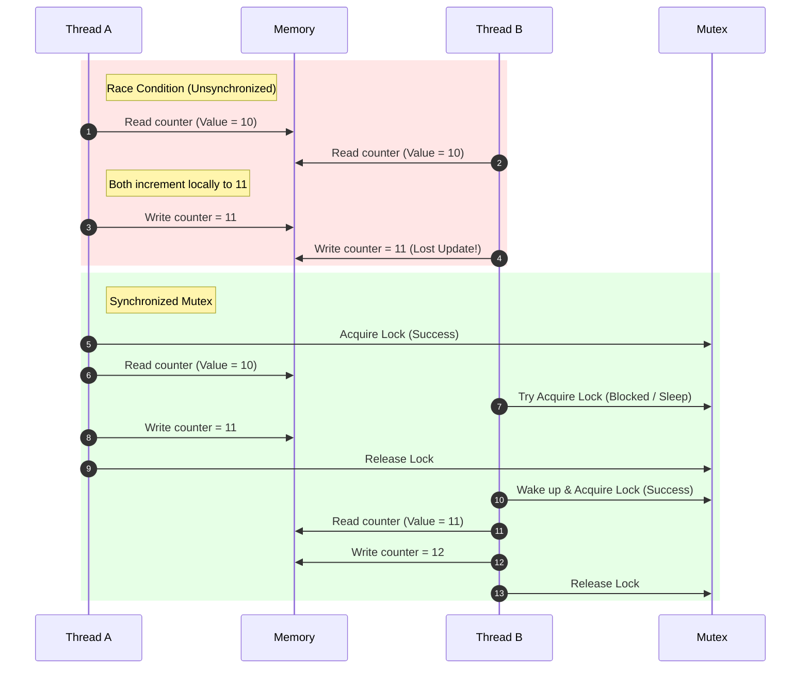

# Concurrency Synchronization

## Introduction
In concurrent programming, **Synchronization** is the coordination of execution paths among multiple threads or processes to ensure they access shared resources in a safe, predictable manner. When multiple threads modify shared mutable state concurrently without coordination, they cause **Race Conditions**, leading to silent data corruption and erratic application behavior.

---

## Problem Statement
When multiple CPU cores execute instructions simultaneously, they read and write to memory independently. If Thread A reads a variable, increments it, and writes it back, Thread B might read the original value before Thread A writes the updated value. This results in one of the updates being lost. We need mechanisms to serialize access to these critical sections of code.

---

## Why this exists
To enforce correctness invariants in the presence of concurrency:
- **Mutual Exclusion:** Ensuring that only one thread executes a critical section of code at a time.
- **Memory Visibility:** Guaranteeing that updates made to shared variables by one thread are immediately visible to all other threads (preventing CPU register caching delays).

---

## Real-world analogy
Think of a single-occupancy restroom in a coffee shop:
- **Shared Resource:** The restroom.
- **Race Condition:** Two customers try to open the door and walk in at the same time.
- **Mutex (Lock):** The door lock. A customer enters, locks the door (acquires the lock), uses the restroom (critical section), and unlocks the door (releases the lock) when leaving. Other customers must wait outside until the lock is released.

---

## Definition
- **Race Condition:** A flaw in a concurrent system where the output is dependent on the sequence or timing of uncontrollable events (such as thread scheduling).
- **Critical Section:** A block of code that accesses shared mutable resources and must not be concurrently run by more than one thread.
- **Atomic Operation:** An operation that runs completely or not at all, appearing instantaneous to the rest of the system without interruption.

---

## Key concepts
1. **Mutex (Mutual Exclusion Lock):** A blocking primitive that allows only one thread to hold the lock at a time. If another thread requests the lock, it is put to sleep until the owner releases it.
2. **Semaphore:** A signaling primitive that maintains a counter:
   - **Binary Semaphore:** Has a counter of 0 or 1 (acts similarly to a Mutex, but has no ownership concept; any thread can release it).
   - **Counting Semaphore:** Restricts access to a pool of $K$ identical resources.
3. **Read-Write Lock:** Optimizes access by allowing multiple threads to read a resource simultaneously, but restricts write operations to a single thread exclusively.
4. **Compare-And-Swap (CAS):** A hardware-level atomic instruction that compares the contents of a memory location to a given value and, only if they are equal, updates that location to a new value. This forms the basis of **Lock-free** data structures.
5. **Spinlock:** A lock where threads loop repeatedly ("spin" / busy-wait) checking if the lock is available, rather than sleeping. Efficient for extremely short lock durations, but consumes high CPU cycles.

---

## Internal working / Mermaid diagram

### Race Condition vs Synchronized Mutex Execution



---

## Java implementation

### 1. Bad Implementation: Unsynchronized Concurrent Thread Counter
Multiple threads incrementing a shared class variable without synchronization results in a race condition and incorrect final tallies.

```java
// Multiple threads incrementing a shared counter without protection.
// CRITICAL BUG: counter++ is not atomic. It involves 3 steps: read, update, and write.
// Concurrent executions will overwrite each other's updates, leading to data loss.
public class BadCounter {
    private int counter = 0;

    public void increment() {
        counter++; // Race condition occurs here
    }

    public int getCounter() {
        return counter;
    }

    public static void main(String[] args) throws InterruptedException {
        BadCounter tc = new BadCounter();
        Runnable task = () -> {
            for (int i = 0; i < 1000; i++) {
                tc.increment();
            }
        };

        Thread t1 = new Thread(task);
        Thread t2 = new Thread(task);
        t1.start();
        t2.start();
        t1.join();
        t2.join();

        // Expected: 2000, Actual: unpredictable (e.g., 1842)
        System.out.println("Final Counter: " + tc.getCounter());
    }
}
```

### 2. Better Implementation: Thread Synchronization Using Mutex Locks
Protecting the critical section using Java's `synchronized` block or explicit `ReentrantLock` objects. This serializes access, guaranteeing correctness at the cost of blocking overhead.

```java
import java.util.concurrent.locks.ReentrantLock;

// Using ReentrantLock to serialize access to the critical section.
// TIME COMPLEXITY: O(1) lock acquisition (blocking if contested)
// SPACE COMPLEXITY: O(1)
public class BetterMutexCounter {
    private int counter = 0;
    private final ReentrantLock lock = new ReentrantLock();

    public void increment() {
        lock.lock(); // Acquire lock, blocking other threads
        try {
            counter++; // Critical Section
        } finally {
            lock.unlock(); // Ensure lock is released even if exception occurs
        }
    }

    public int getCounter() {
        return counter;
    }
}
```

### 3. Best Implementation: Lock-Free Atomic Operations Using CAS
Using Java's `AtomicInteger`, which utilizes low-level CPU Compare-And-Swap (CAS) instructions. This avoids OS-level thread blocking and context switches, providing high-performance concurrency.

```java
import java.util.concurrent.atomic.AtomicInteger;

// Lock-Free counter using CPU CAS instructions.
// TIME COMPLEXITY: O(1) average (under extreme contention, loops briefly)
// SPACE COMPLEXITY: O(1)
public class BestAtomicCounter {
    // AtomicInteger wraps a volatile value and updates it using CAS
    private final AtomicInteger counter = new AtomicInteger(0);

    public void increment() {
        // Internally loops calling CAS: compareAndSet(expectedVal, expectedVal + 1)
        counter.incrementAndGet(); 
    }

    public int getCounter() {
        return counter.get();
    }
}
```

---

## Step-by-step explanation
1. **The counter++ Deconstruction**: In `BadCounter`, the Java expression `counter++` is compiled into three bytecode instructions:
   - `getfield` (read value from heap to register)
   - `iadd` (increment register value by 1)
   - `putfield` (write value back to heap)
   If Thread 1 is preempted between `getfield` and `putfield`, Thread 2 reads the original value, increments it, and writes it back. Thread 1 then resumes and writes its value, overwriting Thread 2's update.
2. **Mutex Lock Blocks**: In `BetterMutexCounter`, `lock.lock()` acts as a gatekeeper. If Thread 2 arrives while Thread 1 holds the lock, the operating system suspends Thread 2, moving it to a wait queue. Thread 2 consumes no CPU cycles while waiting, but resuming it requires an OS context switch.
3. **Compare-And-Swap loop (Best)**: In `BestAtomicCounter`, `incrementAndGet()` calls native CPU instructions.
   - It reads the current value (e.g. `10`).
   - It calculates the new value (`11`).
   - It executes a hardware CAS instruction: "If memory address still holds `10`, write `11`. Otherwise, do nothing and fail."
   - If it fails (due to another thread writing first), it loops back, reads the new value (`11`), and tries again. This avoids suspending the thread, maximizing performance.

---

## Multiple real-world examples
1. **Ticket Booking Engines:** Using database transactions or distributed locks to prevent two customers from booking the same seat simultaneously.
2. **Print Spoolers:** Using Semaphores to coordinate access to a fixed set of printers.
3. **Financial Ledgers:** Enforcing strict serializable operations when transfering money between account balances.

---

## Pros
- **Data Correctness:** Eliminates race conditions and prevents memory corruption.
- **Resource Management:** Semaphores and Barriers coordinate thread execution stages.
- **High Performance:** Lock-free CAS primitives avoid the overhead of thread blocking.

---

## Cons
- **Performance Overhead:** Acquiring locks, context-switching suspended threads, and CPU cache invalidations add latency.
- **Deadlock Risks:** Incorrect locking order across multiple locks can freeze applications permanently.
- **Priority Inversion:** A low-priority thread holding a lock can block a high-priority thread, starving it.

---

## Interview questions

### Beginner
- **Q: What is the difference between a Mutex and a Semaphore?**
  - **A:** 
    - **Mutex:** A mutual exclusion lock that has an **ownership** concept. Only the thread that acquired the mutex can release it. Used to protect a single critical section.
    - **Semaphore:** A signaling primitive that maintains a counter. It has no ownership; any thread can release or increment it. A binary semaphore restricts access to 1 resource, while a counting semaphore restricts access to a pool of $K$ resources.

### Intermediate
- **Q: What is lock contention, and how do you reduce it?**
  - **A:** Lock contention occurs when multiple threads attempt to acquire the same lock simultaneously, causing thread blocking and performance loss. It can be reduced by:
    1. **Reducing Critical Section Size:** Keeping lock hold times as short as possible.
    2. **Lock Striping:** Dividing a lock into multiple smaller locks (e.g., locking individual buckets in a ConcurrentHashMap instead of the entire map).
    3. **Read-Write Locks:** Allowing concurrent reads while locking only write operations.

### Senior
- **Q: Explain the double-checked locking pattern for singleton initialization, and why the volatile keyword is necessary in Java.**
  - **A:** The double-checked locking pattern initializes a singleton lazily with minimal lock overhead:
    ```java
    public class Singleton {
        private static volatile Singleton instance;
        public static Singleton getInstance() {
            if (instance == null) { // First check (no lock)
                synchronized (Singleton.class) {
                    if (instance == null) { // Second check (with lock)
                        instance = new Singleton();
                    }
                }
            }
            return instance;
        }
    }
    ```
    - **Volatile Requirement:** Without `volatile`, the Java compiler or CPU can reorder instructions during instantiation (`instance = new Singleton()`). Instantiation involves: (1) allocating memory, (2) running the constructor, (3) assigning the memory address to `instance`. If (3) is reordered before (2), another thread calling `getInstance()` might read a non-null, partially initialized instance, leading to crashes. `volatile` prevents instruction reordering.

### Staff Engineer
- **Q: How would you design a lock-free Single-Producer Single-Consumer (SPSC) queue? Explain memory fences and memory visibility.**
  - **A:** 
    - **Structure:** Use a circular array with `head` and `tail` pointers.
    - **Lock-Free Mechanics:** Since there is only one producer and one consumer:
      - The producer only updates `tail` and reads `head`.
      - The consumer only updates `head` and reads `tail`.
      No coordination is needed between producers or consumers.
    - **Memory Barriers (Fences):** To ensure thread safety, we must prevent CPU read/write reorderings:
      - The producer must execute a **Store-Store** barrier after writing data to the slot and before updating the `tail` pointer, ensuring the consumer does not read uninitialized data.
      - The variables `head` and `tail` must be declared `volatile` (in Java) or use atomic release/acquire semantics (in C++) to enforce memory visibility across CPU caches.

---

## Common mistakes
- **Locking too coarsely:** Locking entire methods or large blocks of code, causing threads to run sequentially.
- **Forgetting to unlock:** Failing to release locks in `finally` blocks, causing permanent application freezes if exceptions occur.
- **Overlooking memory visibility:** Accessing shared variables without declaring them `volatile` or synchronizing, allowing threads to read stale cached values.

---

## Best practices
- **Minimize Critical Sections:** Lock only the lines of code that modify shared mutable variables.
- **Always unlock in a finally block:** Wrap locked operations in `try-finally` blocks.
- **Prefer Lock-Free structures:** Use built-in concurrent classes (`ConcurrentHashMap`, `AtomicInteger`) instead of manual synchronization.

---

## When NOT to use
- **Read-Only State:** If a shared resource is immutable (never modified after creation), synchronization is unnecessary. Concurrent reads are inherently thread-safe.

---

## Comparison with similar concepts

| Primitives | Mutex | Counting Semaphore | Read-Write Lock | Spinlock |
| :--- | :--- | :--- | :--- | :--- |
| **Ownership** | Yes (thread-bound) | No | Yes (exclusive write) | Yes |
| **Thread Action** | Sleep / Suspend | Sleep / Suspend | Sleep / Suspend | Busy-Wait (Spin) |
| **Resource Units** | 1 | $K$ | 1 writer / $\infty$ readers | 1 |

---

## Summary
Synchronization coordinates concurrent threads to prevent race conditions and protect critical sections. Selecting between Mutexes, Semaphores, and Lock-free CAS atomic operations depends on resource constraints and performance requirements.

---

## Related topics
- [Processes & Threads](../processes-threads)
- [Deadlocks](../deadlocks)
- [Memory Models](../memory-models)
