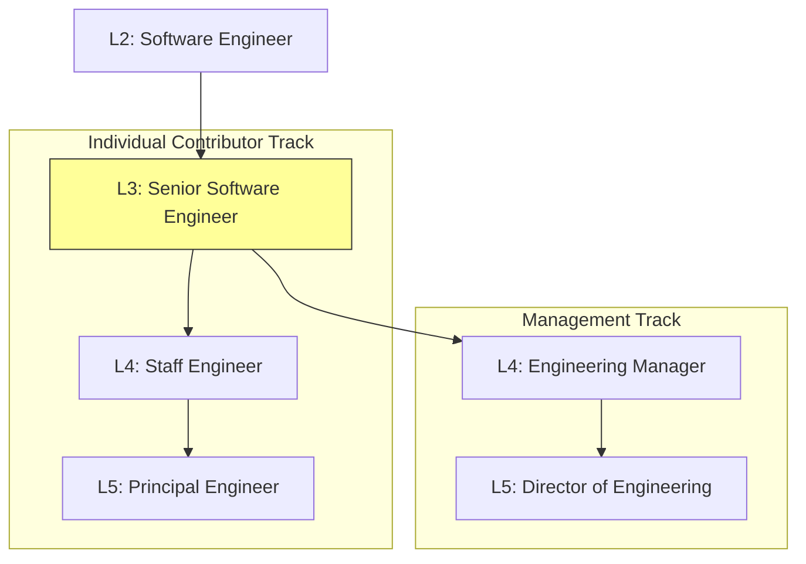

# Career Growth in Software Engineering

## Introduction
**Career Growth** in software engineering is the process of expanding your technical capabilities, leadership skills, scope of influence, and organizational impact over time. It is not just about gaining years of experience; it requires transitioning from executing structured individual tasks to defining technical strategies, mentoring teams, and solving complex business problems.

---

## Problem Statement
Many engineers hit a "career ceiling" at the mid-level or senior level. They focus entirely on writing code and executing tickets, expecting promotions based on technical execution or tenure alone. Without a strategic growth plan, engineers struggle to expand their scope of influence, resulting in stagnation, lack of motivation, and missed leadership opportunities. We need frameworks to guide career progression, differentiate growth paths, and set actionable goals.

---

## Why this exists
To build sustainable, high-performing engineering organizations. As systems and companies grow, they need technical leaders who can guide architectural directions, mentor junior developers, and bridge the gap between business strategy and execution. Clear career ladders help engineers align their personal goals with the needs of the company.

---

## Real-world analogy
Think of the growth of a tree in a forest:
- **Seedling (Junior Engineer):** Focused on establishing roots and absorbing water (learning the codebase, writing basic features). Requires protection and support.
- **Young Tree (Senior Engineer):** Grows strong branches and leaves, contributing significantly to the forest canopy (owning major features, ensuring code quality).
- **Mature Tree (Staff Engineer):** Develops a deep root system that connects to other trees, provides shade and shelter, and drops seeds to grow new trees (mentoring others, setting architectural standards, influencing department strategy).

---

## Definition
- **Dual Career Ladder:** A career progression framework that offers two parallel advancement paths of equal status and compensation: the **Individual Contributor (IC) track** (focusing on technical leadership) and the **Engineering Management (EM) track** (focusing on people, project, and team management).
- **Scope of Influence:** The reach of an engineer's impact within an organization, expanding from a single codebase (Junior) to a team (Senior), multiple teams (Staff), a department (Principal), or the entire company (Distinguished).
- **GROW Model:** A structured coaching framework used to guide career discussions: **G**oal, **R**eality, **O**ptions, **W**ill.

---

## Key concepts
1. **The Dual Career Ladder tracks:**
   - **Individual Contributor (IC):** Senior Developer $\to$ Staff Engineer $\to$ Principal Engineer $\to$ Distinguished Engineer. Focuses on architecture, system design, technical strategy, and mentorship.
   - **Management Track (EM):** Tech Lead Manager $\to$ Engineering Manager $\to$ Director of Engineering $\to$ VP of Engineering. Focuses on people development, team health, project execution, and product alignment.
2. **T-Shaped Skills Profile:** An engineer who has a broad general understanding of many software areas (the horizontal bar of the T, e.g. basic frontend, DevOps, databases) combined with deep expertise in one specific area (the vertical bar, e.g. backend systems, distributed cache architecture).
3. **Mentorship vs Sponsorship:**
   - **Mentorship:** A mentor talks *with* you, giving advice, sharing experiences, and acting as a sounding board.
   - **Sponsorship:** A sponsor talks *about* you, advocating for your career advancement behind closed doors during promotion reviews and assigning you high-visibility stretch projects.

---

## Internal working / Mermaid diagram

### The Dual Career Ladder in Software Engineering



---

## Growth Behaviors (STAR Scenarios)

### 1. Bad Behavior: Expecting Promotion for Simply Doing the Job
*Situation: A senior developer wants to be promoted to Staff Engineer.*
- **Action:** The developer writes clean code, completes all assigned sprint tickets on time, and maintains a high ticket completion rate. They wait for their manager to initiate promotion talks.
- **Result:** During performance reviews, the manager explains that while they are an excellent senior contributor, they are not operating at the Staff level because their impact is limited to their own tickets. The promotion is denied.

```python
# Simulation of tenure/ticket-based growth logic: fails to meet Staff criteria
def check_promotion_criteria(tickets_completed, scope_of_influence):
    # Operating at L3 (Senior) but expecting L4 (Staff) based on L3 metrics
    if tickets_completed > 100 and scope_of_influence == "individual_tickets":
        promotion_approved = False
        feedback = "Focus on cross-team impact and mentoring rather than ticket speed"
    return promotion_approved, feedback
```

### 2. Better Behavior: Requesting Growth Opportunities without a Structured Plan
*Situation: The senior developer requests promotion advice.*
- **Action:** The developer schedules a 1-on-1 meeting and tells their manager: *"I want to be promoted to Staff. What do I need to do?"*
- **Result:** Without structured goals, the manager gives generic advice (*"Write more design docs, help others"*). The developer works on random tasks without a clear focus, failing to make measurable progress.

```python
# Simulation of growth requests lacking structure
def unstructured_growth_loop(developer_goal):
    if developer_goal == "I want promotion":
        action_items = ["help others", "work harder"] # Too vague to measure
        progress = "Unfocused / Slow"
    return action_items, progress
```

### 3. Best Behavior: Proactive Growth Using the GROW Model
*Situation: The senior developer plans their growth path.*
- **Action:** The developer schedules a career 1-on-1, using the GROW coaching model to lead the conversation:
  - **Goal:** *"I want to reach the Staff level in 12 months by leading cross-team architectural alignment."*
  - **Reality:** *"I currently write design docs for my team, but I have limited exposure to other teams' databases."*
  - **Options:** *"I can lead our database migration project or mentor junior developers in the payments team."*
  - **Will:** *"I commit to drafting the migration RFC by next sprint. Let's review my progress monthly."*
- **Result:** The manager approves the migration project. The developer demonstrates Staff-level leadership and receives the promotion on schedule.

```python
# Simulation of the GROW coaching framework
class GrowCareerPlanner:
    def __init__(self, goal, reality, options):
        self.goal = goal
        self.reality = reality
        self.options = options
        self.will = None

    def define_action_plan(self, chosen_option, commitment_date):
        # Establish a concrete, measurable action plan
        self.will = {
            "action": chosen_option,
            "by_when": commitment_date,
            "review_cadence": "Monthly check-in"
        }
        return self.will
```

---

## Step-by-step explanation
1. **The Tenure Trap**: In `check_promotion_criteria`, the developer assumes that doing L3 work for a long time earns an L4 promotion. In software engineering, promotions are forward-looking: you must demonstrate L4 behavior (cross-team influence) before being promoted.
2. **Vague Growth Plans**: In `unstructured_growth_loop`, asking for promotion advice without proposing a plan leads to vague guidance. The developer remains dependent on their manager to define their career.
3. **GROW Model Execution (Best)**: In `GrowCareerPlanner`, the developer drives their own growth:
   - **Goal:** Define a clear, time-bound target (Staff in 12 months).
   - **Reality:** Assess current skills and gaps objectively.
   - **Options:** Identify specific stretch projects.
   - **Will:** Commit to concrete deliverables and establish a monthly review cadence.
   This structured approach builds a track record of predictable growth.

---

## Multiple real-world examples
1. **Transitioning from Senior to Staff:** A senior developer identifies that the frontend and backend teams have API integration bottlenecks. They write an API specification RFC, coordinate alignment workshops, and guide the rollout, demonstrating Staff-level influence.
2. **Mentoring a Mid-Level Engineer:** A senior engineer uses the GROW model during 1-on-1s to help a mid-level colleague take ownership of their first system design document, acting as a sounding board rather than writing it for them.
3. **Expanding Skills to become T-Shaped:** A backend developer spends a sprint pairing with the DevOps team to set up CI/CD pipelines, broadening their horizontal skill bar while maintaining their deep backend focus.

---

## Pros
- **High Career Predictability:** Structured growth plans ensure alignment with management expectations.
- **Improved Retention:** Clear advancement paths reduce developer turnover.
- **Organizational Scale:** Encouraging mentorship and technical leadership helps build internal talent pools.

---

## Cons
- **Emotional Exhaustion:** Transitioning from individual coding to leadership can cause initial stress and imposter syndrome.
- **Promotion Delays:** Budget constraints or organizational changes can delay promotions, even if growth criteria are met.
- **Mentorship Demands:** Helping others grow takes time away from direct technical deliverables.

---

## Interview questions

### Beginner
- **Q: How do you identify areas where you need to improve, and how do you work on them?**
  - **A:** I seek feedback from peer code reviews, post-project retrospectives, and regular 1-on-1s with my manager. I identify my skill gaps (e.g., system monitoring) and add them to a learning plan. I allocate 2-3 hours a week to study the topic and ask to shadow a senior developer on a relevant project to gain practical experience.

### Intermediate
- **Q: Describe a time you mentored a junior colleague. What approach did you take, and what was the outcome?**
  - **A:** I paired with a junior developer who struggled with database optimizations. I used the **GROW** model to guide our sessions:
    - *Goal:* Help them design and optimize their first database schema independently.
    - *Approach:* Instead of writing the schema for them, I asked guiding questions and reviewed their design drafts. I encouraged them to present their proposal to the team.
    - *Outcome:* They successfully deployed the schema, and their confidence increased, allowing them to take on similar tasks without assistance.

### Senior
- **Q: How do you determine whether to follow the Individual Contributor (IC) track or the Management track?**
  - **A:** I evaluate where I can have the most impact and what work brings me energy:
    - **IC Track:** Focuses on solving complex technical challenges, defining system architectures, and guiding engineering standards.
    - **Management Track:** Focuses on people development, building high-performing teams, and aligning project execution with business strategy.
    I chose the IC track because I enjoy technical design, refactoring legacy systems, and mentoring developers on coding practices.

### Staff Engineer
- **Q: How do you build a business case to justify your promotion to a Staff or Principal level?**
  - **A:** I build a promotion case based on **measurable business impact** and **scope of influence**:
    - **Impact:** I compile data on projects I led (e.g., "Led the migration of our checkout service, which reduced checkout latencies by 40% and saved $30,000 in monthly hosting costs").
    - **Influence:** I document my cross-team contributions (e.g., "Designed our internal API guidelines used by 5 engineering teams, reducing integration bugs by 25%").
    - **Mentorship:** I show a track record of leveling up others (e.g., "Mentored two mid-level engineers to senior level").
    I present this case to my manager and VP of Engineering, aligned with our company's career ladder criteria.

---

## Common mistakes
- **Expecting tenure promotions:** Assuming that working at a company for a certain number of years guarantees a promotion.
- **Ignoring soft skills:** Assuming that technical skills alone are sufficient for advancement, while ignoring communication, leadership, and collaboration.
- **Failing to write down goals:** Keeping career goals vague, making it difficult to measure progress.

---

## Best practices
- **Drive your own career:** Take ownership of your career goals; do not wait for your manager to direct your growth.
- **Build a brag document:** Keep a running log of your achievements, code reviews, design docs, and positive feedback to simplify performance reviews.
- **Find a sponsor:** Build relationships with senior leaders who can advocate for your career advancement during promotion cycles.

---

## When NOT to focus on promotion
- **Onboarding and Role Transitions:** When you have recently joined a new company or transitioned to a new team, focus on learning the codebase and building relationships first. Avoid pushing for promotions until you have established a consistent track record in your current role.

---

## Comparison of Career tracks

| Metric | Individual Contributor (IC) | Engineering Manager (EM) |
| :--- | :--- | :--- |
| **Primary Focus** | Technical architecture, coding, system design | People development, project delivery, team health |
| **Core Success Metric** | System stability, developer velocity, tech strategy | Team retention, project delivery, product alignment |
| **Daily Tasks** | Coding, writing RFCs, reviewing code | Running 1-on-1s, sprint planning, hiring |
| **Advancement Path** | Staff $\to$ Principal $\to$ Distinguished | Manager $\to$ Director $\to$ VP of Engineering |

---

## Summary
Career growth in software engineering requires expanding your scope of influence and organizational impact. By utilizing the GROW model, building T-shaped skills, and choosing between the parallel IC and management tracks, engineers can systematically advance their careers.

---

## Related topics
- [Team Leadership](../team-leadership)
- [Communication](../communication)
- [Stakeholder Management](../stakeholder-management)
