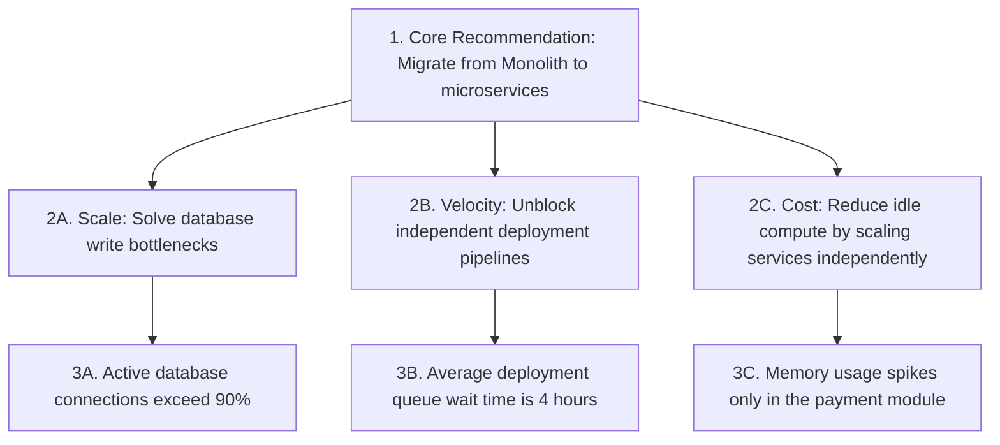

# Professional Communication in Engineering

## Introduction
In software engineering, **Communication** is the process of conveying technical context, architectural choices, project risks, and strategic decisions to diverse audiences. Effective communication acts as a force multiplier: it aligns team execution, prevents architectural drift, builds trust with business partners, and ensures that engineering efforts deliver measurable business value.

---

## Problem Statement
Software systems are too complex for a single person to build alone. However, technical teams often struggle with communication bottlenecks. Engineers might write code that meets specifications but fails to solve the actual business problem, or pitch technical refactorings using dense jargon that fails to secure funding from non-technical stakeholders. We need structured communication frameworks to bridge the gap between technical complexity and business value.

---

## Why this exists
To minimize friction and align execution. As engineers progress from junior to senior and staff levels, their primary responsibilities shift from writing code to **influencing outcomes**. This transition requires translating complex technical realities into clear, actionable proposals that align stakeholders, product managers, and engineering teams.

---

## Real-world analogy
Think of a language translator in a diplomatic meeting:
- **Diplomats (Business/Product):** Focused on trade agreements, budgets, and public relations.
- **Translators (Technical Leaders):** Translate these high-level goals into the native language of the builders (code, architecture, APIs), and translate engineering constraints (technical debt, database limits) back into business-risk terms (downtime, slow feature delivery).
- **Communication Breakdown:** If the translator speaks only in dense grammatical jargon (bytecodes, pointer allocations), the diplomats cannot make informed decisions.

---

## Definition
- **Pyramid Principle (Minto):** A structured communication framework where you state the conclusion first, group your supporting arguments logically, and present detailed evidence last.
- **STAR Method:** A structured pattern for presenting behavioral stories: **S**ituation, **T**ask, **A**ction, **R**esult.
- **Active Listening:** The practice of fully focusing on, understanding, responding to, and remembering what is being said, rather than planning your response while the other person is speaking.

---

## Key concepts
1. **Audience Adaptation:** Adjusting the level of technical detail based on who you are addressing:
   - **Executive (CEO/VP):** Focus on business impact, costs, risks, and timelines.
   - **Product Manager (PM):** Focus on user features, dependencies, and delivery scope.
   - **Engineers (Devs):** Focus on architectural details, code structures, and API specs.
2. **Written Documentation Formats:**
   - **RFC (Request for Comments):** Detailed technical proposals to gather feedback before starting implementation.
   - **ADR (Architecture Decision Record):** Lightweight documents that capture the context, options, and consequences of a design choice.
   - **Blameless Post-Mortem:** Incident reports that analyze the systemic causes of an outage without blaming individuals, outlining prevention steps.
3. **The SCQA Framework (Situation, Complication, Question, Answer):** A storytelling framework to structure technical pitches or proposals.

---

## Internal working / Mermaid diagram

### Minto's Pyramid Principle for Technical Proposals



---

## Communication Scenarios (STAR Framework)

### 1. Bad Scenario: Jargon-Heavy Pitch to Product Management
*Situation: The team wants to rewrite a slow legacy API using GraphQL.*
- **Communication:** An engineer pitches to the Product Manager: *"Our REST endpoints are returning over-fetched payloads, causing unnecessary serialization cycles on our Node.js event loop. We need to implement a GraphQL schema resolver with custom query stitching to optimize the network layer."*
- **Result:** The PM does not understand the technical jargon, assumes the work is a low-priority developer preference, denies the request, and prioritizes new features instead.

```python
# Simulation of poor communication: Jargon overload, missing business context
def bad_jargon_pitch(technical_details):
    pitch = f"Use {technical_details['jargon_terms']} to fix {technical_details['internal_problems']}"
    impact = "Developer happiness" # Fails to address PM/business concerns
    return pitch, impact
```

### 2. Better Scenario: Structured Pitch with Basic Metrics
*Situation: The GraphQL API rewrite.*
- **Communication:** The engineer explains: *"Our current API is slow because it downloads too much data from the database. If we rewrite it using GraphQL, it will run faster and make mobile app development easier."*
- **Result:** The PM understands the goal, but because there are no clear metrics or ROI (Return on Investment) calculations, they hesitate to delay the product roadmap for it.

```python
# Simulation of better communication: Simple language but lacks metric commitments
def better_metric_pitch(simplifications):
    pitch = f"We will fix {simplifications['problem']} to make {simplifications['benefit']} better"
    impact = "Vague performance boost"
    return pitch, impact
```

### 3. Best Scenario: Business-Aligned, Metric-Driven Proposal (SCQA / Pyramid Principle)
*Situation: The GraphQL API rewrite.*
- **Communication (Pyramid/SCQA Structure):**
  - **Conclusion:** *"We propose migrating our checkout API to GraphQL to increase mobile checkout conversion rates by 5% and reduce server costs by $50,000 annually."*
  - **Situation:** *"Our mobile app traffic has doubled over the past year."*
  - **Complication:** *"Our REST APIs send large payloads, causing mobile checkout page load times to exceed 4 seconds on 3G networks. This latency causes a 15% user drop-off during checkout."*
  - **Resolution:** *"GraphQL allows the mobile app to request only the specific fields needed. This reduces payload sizes by 75% and cuts page load times to under 1.5 seconds, unblocking checkout conversion."*
- **Result:** The PM immediately approves the task because the technical solution is linked directly to business metrics (conversion rates) and cost savings.

```python
# Simulation of best communication: business-aligned, metric-driven
class MetricDrivenPitch:
    def __init__(self, data):
        self.conclusion = data["conclusion"] # "Increase conversion by 5%"
        self.situation = data["situation"]   # "Mobile traffic doubled"
        self.complication = data["complication"] # "4s latency causes 15% drop-off"
        self.resolution = data["resolution"] # "GraphQL cuts payload size by 75%"

    def present_to_pm(self):
        # Lead with the conclusion first (Pyramid Principle)
        presentation = f"Goal: {self.conclusion}\n"
        presentation += f"Context: {self.situation}\n"
        presentation += f"Problem: {self.complication}\n"
        presentation += f"Solution: {self.resolution}"
        return presentation
```

---

## Step-by-step explanation
1. **The Over-Fetching Jargon Trap**: In `bad_jargon_pitch`, the engineer speaks from their own perspective (Developer Experience/DX) rather than the listener's perspective (User/Business Experience). Jargon acts as a barrier, causing stakeholders to disconnect.
2. **Missing Metrics**: In `better_metric_pitch`, words like "faster" and "easier" are subjective. Product managers cannot justify delaying features for undefined performance improvements.
3. **Value Alignment (Best)**: In `MetricDrivenPitch`, the engineer applies the SCQA framework and the Minto Pyramid Principle:
   - **Pyramid Principle:** Lead with the core recommendation and its business value (5% conversion boost, $50k savings).
   - **SCQA Framework:** Establish the context (traffic doubled), define the complication (4s load times causing 15% user drop-off), and present the solution (GraphQL reducing payloads by 75%).
   This structure presents the technical work as a solution to a business problem.

---

## Multiple real-world examples
1. **Writing an RFC for a System Migration:** Pitching a transition from a database to Redis. The document outlines database query latencies ($O(1)$ vs index scans), memory cost estimations, and cache invalidation strategies to align multiple team leads.
2. **Delivering a Incident Post-Mortem to Leadership:** Translating a system crash caused by a memory leak into a clear explanation of what happened, its impact (1 hour downtime, 1,000 failed orders), and the concrete steps taken to prevent it (setting up JVM memory alerts and circuit breakers).
3. **Weekly Status Reports (Snippets):** Writing weekly status updates using the **PPP** format (Progress, Plans, Problems), keeping them concise and scannable for managers.

---

## Pros
- **Fast Alignment:** Leading with conclusions cuts meeting lengths and speeds up decision-making.
- **Improved Autonomy:** Clear written documentation (ADRs/RFCs) allows remote teams to work asynchronously without constant meetings.
- **Career Advancement:** Technical leaders who write and present clearly gain influence and get promoted faster.

---

## Cons
- **Time Consuming:** Writing high-quality ADRs and RFCs takes time away from writing code.
- **Simplification Risks:** Over-simplifying technical challenges to non-technical stakeholders can lead them to underestimate project complexity.
- **Continuous Effort:** Maintaining up-to-date documentation requires continuous discipline.

---

## Interview questions

### Beginner
- **Q: How do you explain a complex technical bug to a non-technical customer support representative?**
  - **A:** I avoid technical jargon (like database joins or stack overflows) and focus on the user's experience. I use analogies: instead of saying "the database pool is exhausted," I explain that "our server is experiencing high traffic and the waiting queue is temporarily full, similar to a busy bank with too few tellers." I provide a clear timeline for the fix and outline how they can update affected customers.

### Intermediate
- **Q: Describe a time you disagreed with an architectural choice made by a senior peer. How did you resolve it?**
  - **A:** I focus on technical trade-offs rather than opinions, keeping discussions objective. I wrote a comparison document analyzing both designs across key metrics: scalability, maintenance cost, and implementation time. I set up a meeting where I listened to their perspective first (Active Listening) to see if I missed any context. By presenting the data side-by-side, we identified that their approach was faster to build, while mine was easier to maintain. We agreed on a compromise: building their design first but implementing my architectural abstractions to simplify future migrations.

### Senior
- **Q: How do you present a proposal for a major refactoring project to non-technical business executives?**
  - **A:** I use the **Pyramid Principle**, leading with the business impact (cost savings, faster feature delivery, reduced downtime risk). I translate technical issues into risk metrics: instead of "we need to rewrite legacy PHP code to Go," I explain that "our current system has a high maintenance cost, and this rewrite will reduce server costs by 40% and cut the time-to-market for new features in half." I present a phased rollout plan to demonstrate that we can deliver value incrementally without disrupting the business.

### Staff Engineer
- **Q: How do you manage communication during a critical tier-1 production outage?**
  - **A:** 
    - **Step 1: Roles Separation:** Assign one senior engineer as the **Incident Commander (IC)** to lead the technical fix. Assign another engineer as the **Communications Lead (CL)**. This prevents the fixing team from being interrupted by status requests.
    - **Step 2: Internal Updates:** The CL sets up a dedicated incident room and posts updates every 15-20 minutes to a shared channel, detailing: (1) what is broken, (2) what we are checking, (3) current mitigation steps.
    - **Step 3: External Updates:** Send concise updates to support teams and customers: "We are investigating an issue affecting logins. The system is failing to authenticate users. We are working on a fix and will update you in 30 minutes."
    - **Step 4: Post-Mortem:** Once resolved, lead a blameless post-mortem to document the incident and assign action items to prevent future occurrences.

---

## Common mistakes
- **Jargon Overload:** Using overly technical terms with product managers or business partners, causing confusion.
- **Writing too much:** Drafting long, unstructured documents that peers find difficult to read. Lead with summaries.
- **Defensive listening:** Focusing on defending your code or ideas during reviews rather than listening to feedback.

---

## Best practices
- **Write a TL;DR:** Always start RFCs, designs, or status emails with a 2-3 sentence summary (Too Long; Didn't Read).
- **Use analogies:** Use relatable analogies to explain complex systems to non-technical peers.
- **Write blamelessly:** Focus on system flaws and process improvements rather than human errors when discussing bugs.

---

## When NOT to use detailed documentation
- **Hotfixes & Prototypes:** When experimenting with quick throwaway prototypes or deploying critical hotfixes during an outage, skip writing full RFCs. Rely on quick verbal check-ins and document the changes later.

---

## Comparison of Communication Frameworks

| Framework | Minto's Pyramid | STAR Method | SCQA |
| :--- | :--- | :--- | :--- |
| **Best For** | Proposals, pitches, executive updates | Behavioral interviews, incident reports | Storytelling, problem statements |
| **Structure** | Conclusion $\to$ Arguments $\to$ Evidence | Situation $\to$ Task $\to$ Action $\to$ Result | Situation $\to$ Complication $\to$ Question $\to$ Answer |
| **Focus** | Top-down logic | Individual actions and results | Narrative tension and resolution |

---

## Summary
Effective communication translates technical complexity into business value and aligns team execution. Utilizing structured frameworks like the Pyramid Principle and the STAR method helps engineers scale their impact and grow into leadership roles.

---

## Related topics
- [Team Leadership](../team-leadership)
- [Stakeholder Management](../stakeholder-management)
- [Decision Making](../decision-making)
