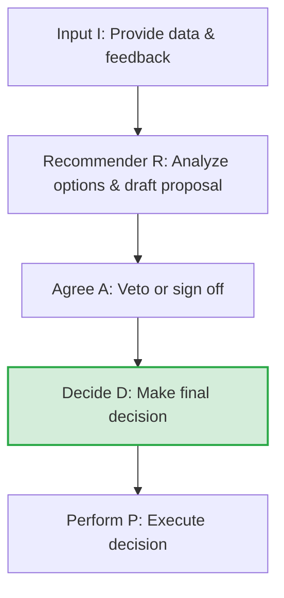

# Decision Making in Technical Leadership

## Introduction
In software engineering, **Decision Making** is the process of selecting a technical direction, architectural pattern, or project priority from multiple alternatives. Technical leaders must frequently make decisions under conditions of uncertainty, incomplete data, and tight deadlines. Making high-quality, timely decisions and aligning teams with the chosen direction is a core capability of senior and staff engineers.

---

## Problem Statement
Software engineering is a series of trade-offs. A team that fails to make decisions quickly falls into **Analysis Paralysis**, stalling progress and missing market windows. Conversely, making snap decisions without evaluating trade-offs leads to architectural dead-ends, unmanageable technical debt, and system instability. We need structured frameworks to classify decision types, assign clear ownership, and evaluate trade-offs objectively.

---

## Why this exists
To maintain momentum while managing risk. As technical systems and organizations scale, the cost of wrong decisions increases. A structured decision-making process ensures that we gather necessary input, evaluate alternative paths, document choices to prevent future debates, and move forward decisively.

---

## Real-world analogy
Think of a captain steering a ship through a storm:
- **Analysis Paralysis:** The captain waits to collect perfect weather data from all instruments. While they wait, the ship is pushed into the rocks by the waves.
- **Snap Decision:** The captain turns the wheel sharply without checking the depth charts, running the ship aground on a hidden reef.
- **Structured Decision Making:** The captain identifies the turn as a **reversible decision** (Type 2) or **irreversible decision** (Type 1). They quickly consult the navigator (Gather Input), make a firm choice to adjust course by 10 degrees (Decide), and monitor the results to course-correct if needed (OODA Loop).

---

## Definition
- **Type 1 (Irreversible) Decisions:** High-risk, one-way doors. These decisions are difficult and expensive to undo (e.g. choosing a primary cloud provider or selecting a programming language for a core platform). They require deep analysis and broad input.
- **Type 2 (Reversible) Decisions:** Low-risk, two-way doors. These decisions can be undone quickly and cheaply with minimal impact (e.g. selecting a third-party logging library or refactoring a local class interface). They should be made quickly by individuals.
- **RAPID Decision Framework:** A decision-making matrix developed by Bain & Company to assign clear roles: **R**ecommend, **A**gree, **P**erform, **I**nput, and **D**ecide.

---

## Key concepts
1. **The RAPID Matrix Roles:**
   - **Recommend (R):** The person responsible for gathering data, evaluating options, and proposing a direction.
   - **Agree (A):** The person who must sign off on the recommendation (usually has veto power).
   - **Input (I):** Subject matter experts who provide data and feedback to the Recommender.
   - **Decide (D):** The single person who makes the final decision, resolving any conflicts.
   - **Perform (P):** The team responsible for executing the decision.
2. **The OODA Loop (Observe, Orient, Decide, Act):** A cyclic loop developed by military strategist John Boyd to make decisions and adapt to changing conditions in dynamic environments.
3. **The Cost of Delay:** Quantifying the financial or strategic cost of delaying a decision to collect more data vs making the decision immediately with incomplete data.
4. **Architectural Decision Records (ADRs):** Short documents capturing the context, options considered, decision made, and consequences of a design choice, serving as a historical record for the team.

---

## Internal working / Mermaid diagram

### RAPID Decision Flow



---

## Behavioral Scenarios (STAR Framework)

### 1. Bad Behavior: Analysis Paralysis on Reversible Decisions
*Situation: The team needs to choose a serialization library for an internal microservice.*
- **Action:** The lead engineer, wanting to make a perfect decision, spends 4 weeks writing detailed benchmark comparisons, running performance tests across 10 different libraries, and scheduling 5 team meetings to discuss the options.
- **Result:** The project is delayed by a month. The chosen library only improves performance by 2 milliseconds, which has no noticeable impact on user experience. The cost of the delay exceeds the value of the optimization.

```python
# Simulation of analysis paralysis: looping infinitely to collect data
def bad_analysis_paralysis(decision_type, cost_per_day):
    days_spent = 0
    decision_made = False
    
    # Type 2 decisions are reversible, but the lead remains stuck in the loop
    if decision_type == "Type 2 (Reversible)":
        while days_spent < 30: # Waiting for perfect data
            gather_more_benchmarks()
            hold_another_meeting()
            days_spent += 1
            
        decision_made = True
        total_delay_cost = days_spent * cost_per_day
    return decision_made, total_delay_cost
```

### 2. Better Behavior: Consensus-Only Decision Loops
*Situation: The serialization library choice.*
- **Action:** The lead engineer sets up a voting system where all 8 team members must agree on the library choice.
- **Result:** The team clashes over preferences. Half prefer JSON, the other half Protocol Buffers. Without a clear decider, the debate continues for weeks, causing frustration and stalling progress.

```python
# Simulation of consensus-seeking: stalls when votes are split
def consensus_only_vote(team_votes):
    # If team is split (4 JSON vs 4 Protobuf) and consensus is required
    decision = None
    if len(set(team_votes.values())) > 1:
        # Endless debates continue
        decision = "Stalled in Committee"
    return decision
```

### 3. Best Behavior: RAPID Execution on Reversible Choices
*Situation: The serialization library choice.*
- **Action:** The lead engineer identifies this as a **Type 2 (Reversible)** decision. They assign a mid-level engineer as the **Recommender (R)**:
  - *Input (I) gathered from two senior developers in 2 days.*
  - *Recommender proposes Protocol Buffers based on API schema requirements.*
  - *Lead engineer acts as the **Decider (D)** and signs off on the recommendation in 10 minutes.*
- **Result:** The decision is made in 3 days. If issues emerge later, the team can swap the library in a sprint (two-way door), keeping project momentum high.

```python
# Simulation of RAPID decision framework
class RapidDecisionEngine:
    def __init__(self, decision_type):
        self.type = decision_type # "Type 1" or "Type 2"

    def execute_decision(self, recommender, decider, inputs):
        start_time = 0
        
        if self.type == "Type 2 (Reversible)":
            # Quick 2-day input gather
            gather_inputs(inputs, duration_days=2)
            proposal = recommender.draft_proposal()
            
            # Decider reviews and signs off immediately
            decision = decider.sign_off(proposal)
            end_time = 3 # Decision made in 3 days
            return decision, end_time
        return "Type 1 requires deeper analysis", None
```

---

## Step-by-step explanation
1. **The Cost of Delay Trap**: In `bad_analysis_paralysis`, the lead engineer treats a Type 2 decision (a two-way door) as a Type 1 decision (a one-way door). They spend $30\times$ more time than necessary, wasting engineering resources.
2. **Consensus Stalls**: In `consensus_only_vote`, the leader confuses collaboration with consensus. Seeking consensus on every choice leads to compromise designs that satisfy no one, or permanent deadlocks.
3. **RAPID Efficiency (Best)**: In `RapidDecisionEngine`, the leader uses the RAPID framework to separate input-gathering from decision-making. By identifying the decision as reversible, they bound the input phase to 2 days, allowing the Decider to make a choice quickly and keep the project moving.

---

## Multiple real-world examples
1. **Choosing a Database Technology (Type 1 Decision):** Selecting between PostgreSQL and DynamoDB for a new core banking ledger. The decision is irreversible once in production. The team spends 2 weeks gathering inputs from security, DBA, and cloud teams, documenting the decision in a detailed ADR signed off by the VP of Engineering.
2. **Selecting a Testing Framework (Type 2 Decision):** Selecting between PyTest and Unittest. The lead engineer delegates the choice to the developer building the test suite, telling them to make a choice in 1 day and start writing tests.
3. **Handling Post-Outage Architecture Changes:** Following a production outage, the team orient themselves using log data, decide to add a Redis cache layer to protect the database (OODA Loop), and deploy the mitigation within 2 hours.

---

## Pros
- **Maintains Momentum:** Classifying decisions prevents analysis paralysis and keeps teams moving.
- **Clear Accountability:** The RAPID framework eliminates confusion over who has the final say.
- **Knowledge Preservation:** Architectural Decision Records (ADRs) document context, preventing recurring debates.

---

## Cons
- **Veto Friction:** If the "Agree" and "Decide" roles are poorly managed, vetoes can cause organizational friction.
- **Initial Complexity:** Setting up RAPID roles for every minor decision can add administrative overhead.
- **Over-Simplification:** Incorrectly classifying a Type 1 decision as a Type 2 decision can lead to expensive architectural mistakes.

---

## Interview questions

### Beginner
- **Q: What is the difference between a Type 1 and a Type 2 decision?**
  - **A:** 
    - **Type 1 Decisions** are irreversible, high-risk one-way doors (e.g. changing cloud providers). They require deep analysis and broad input because they are expensive to undo.
    - **Type 2 Decisions** are reversible, low-risk two-way doors (e.g. choosing a logging library). They should be made quickly by individuals or small teams to maintain momentum.

### Intermediate
- **Q: How do you make a decision when your team is evenly split between two technical options?**
  - **A:** I use the **RAPID** framework. I clarify that while everyone's input is valued, consensus is not required. I assign one engineer to list the pros, cons, and costs of both options. I then act as the Decider (D), select the option that best aligns with our project constraints (e.g. faster time-to-market vs long-term scalability), and document our choice in an ADR. Once the decision is made, we align behind it (Disengage and Commit).

### Senior
- **Q: Tell me about a time you made a technical decision that later proved to be wrong. How did you handle it?**
  - **A:** During a database migration, I decided to use a NoSQL database to store user sessions, expecting high scalability. After rollout, we discovered that complex query patterns resulted in high latency.
    - **Mitigation:** I acknowledged the mistake immediately in our team sync (Blameless ownership).
    - **Action:** Using the OODA loop, I gathered latency data and proposed a migration to Redis. We migrated the session store in one sprint, resolving the performance issues.
    - **Learning:** I updated our team's ADR to document this constraint, preventing similar database misclassifications in future services.

### Staff Engineer
- **Q: How do you establish a decision-making framework across an entire engineering department of 100+ developers?**
  - **A:** 
    - **Step 1: Standardize ADRs:** Implement a lightweight Architecture Decision Record (ADR) template in a shared repository.
    - **Step 2: Define Escalation Rules:** Establish rules: Type 2 decisions are made at the team level without approval. Type 1 decisions must follow an RFC process and be presented to an Architecture Review Board.
    - **Step 3: Train on RAPID:** Train tech leads and product managers on the RAPID framework to assign clear roles for major projects.
    - **Step 4: Cultivate a "Disagree and Commit" Culture:** Establish the rule that once the Decider makes a choice, all team members must work to make it successful, even if they disagreed during the input phase.

---

## Common mistakes
- **Treating all decisions as Type 1:** Slowing down projects by requiring deep analysis and meetings for minor, reversible choices.
- **Seeking 100% consensus:** Delaying decisions until every team member agrees, resulting in stalled projects.
- **Omitting documentation:** Failing to write ADRs, leading to the same technical debates repeating every few months.

---

## Best practices
- **Disagree and Commit:** Encourage healthy debate during the input phase, but once a decision is made, everyone must align behind it.
- **Write ADRs:** Document the context and trade-offs of all major decisions. Keep them short (1-2 pages).
- **Time-box inputs:** Set clear deadlines for gathering feedback to prevent infinite research loops.

---

## When NOT to use a formal framework
- **Emergency Incident Response:** During a critical production outage, skip formal RAPID reviews or writing ADRs. The Incident Commander makes quick decisions to restore service, and the team reviews the choices during the post-mortem.

---

## Comparison of Decision Types

| Metric | Type 1 (One-Way Door) | Type 2 (Two-Way Door) |
| :--- | :--- | :--- |
| **Reversibility** | Irreversible / Expensive to undo | Reversible / Cheap to undo |
| **Risk Level** | High (affects architecture, budget) | Low (local code, minor tooling) |
| **Speed** | Deliberate, analytical | Fast, execution-focused |
| **Role Assignment** | Formal RAPID roles | Individual developer |
| **Example** | Monolith to Microservices migration | Choosing a validation library |

---

## Summary
Decision Making in technical leadership requires classifying choices into reversible and irreversible categories. By utilizing the RAPID framework, maintaining an OODA loop, and documenting choices in ADRs, leaders keep teams aligned and maintain momentum.

---

## Related topics
- [Team Leadership](../team-leadership)
- [Communication](../communication)
- [Stakeholder Management](../stakeholder-management)
