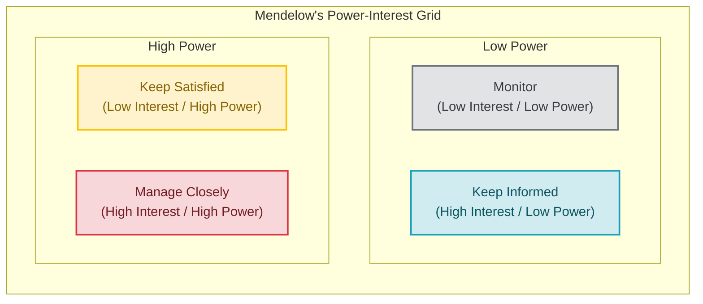

# Stakeholder Management

## Introduction
In software engineering, **Stakeholder Management** is the process of identifying, analyzing, and aligning the expectations of individuals or groups who are affected by or can influence a project. Technical leaders must manage diverse relationships—with product managers, business executives, customers, and other engineering teams—to secure project support, manage trade-offs, and deliver software that drives business outcomes.

---

## Problem Statement
Engineering projects do not operate in a vacuum. A team that writes technically excellent code can still fail if their product does not align with business goals, or if key stakeholders are surprised by delayed rollouts. Mismanaged expectations lead to sudden changes in project scope, canceled projects, lost funding, and team frustration. We need systematic frameworks to manage communication and align goals across organizational boundaries.

---

## Why this exists
To build trust and coordinate project delivery. As software projects grow in scope, the primary challenges shift from purely technical concerns to alignment challenges. Stakeholder management ensures that business leaders understand the technical constraints, engineering teams understand the business priorities, and everyone agrees on the definition of project success.

---

## Real-world analogy
Think of building a new house in a suburban neighborhood:
- **Builders (Engineering Team):** Focused on the foundation, plumbing, and structural integrity.
- **Homebuyer (Primary Stakeholder):** Focused on the move-in date, aesthetics, and total cost.
- **City Inspectors & Neighbors (Secondary Stakeholders):** Focused on building regulations and noise limits.
- **Stakeholder Management:** The contractor's updates. If the contractor finds a foundation crack, they do not hide it or use dense structural jargon. They explain the issue, the timeline impact, and the cost options clearly to the buyer, while managing city permits, ensuring a smooth build with no surprises.

---

## Definition
- **Mendelow's Power-Interest Grid:** A matrix used to categorize stakeholders based on their power to influence a project and their interest in its details, determining the appropriate communication strategy.
- **RACI Matrix:** A resource allocation chart defining roles for project tasks: **R**esponsible, **A**ccountable, **C**onsulted, and **I**nformed.
- **The Trust Equation:** A framework developed by David Maister to measure trustworthiness:
  $$\text{Trustworthiness} = \frac{\text{Credibility} + \text{Reliability} + \text{Intimacy}}{\text{Self-Orientation}}$$

---

## Key concepts
1. **Mendelow's Power-Interest Matrix Categories:**
   - **High Power, High Interest (Manage Closely):** Key players like Project Sponsors or Core Product Managers. Require active, detailed partnership.
   - **High Power, Low Interest (Keep Satisfied):** Executives, VP of Engineering, or Security Officers. Require high-level status updates and risk summaries.
   - **Low Power, High Interest (Keep Informed):** End-users, customer support, or peer engineering teams. Require regular updates and release notes.
   - **Low Power, Low Interest (Monitor):** Minor external dependencies. Require minimal monitoring.
2. **Proactive Risk Communication (The "No Surprises" Rule):** Communicating problems (such as bugs or project delays) to stakeholders as soon as they are identified, accompanied by concrete mitigation options, rather than waiting until the deadline has passed.
3. **Translating Technical Metrics to Business Value:** Discussing engineering trade-offs in terms of business impact (e.g. latency translated to conversion drop-off, server cost savings, or developer velocity).

---

## Internal working / Mermaid diagram

### Mendelow's Power-Interest Matrix



---

## Behavioral Scenarios (STAR Framework)

### 1. Bad Behavior: Avoiding Stakeholders and Hiding Bad News
*Situation: A critical third-party payment integration is delayed by three weeks due to API compatibility issues.*
- **Action:** The engineering lead, hoping to fix the issue before anyone notices, avoids status updates and continues reporting the project as "on track" in dashboard updates.
- **Result:** The deadline arrives, and the integration is incomplete. The product marketing team launches the marketing campaign for a feature that cannot be used. Trust is broken, and the project lead is demoted.

```python
# Simulation of poor stakeholder management: hiding risks, avoiding communication
def bad_risk_handling(project_delay, campaign_launch_date):
    project_status = "Green" # Hiding the delay
    
    # Marketing proceeds based on false dashboard status
    if campaign_launch_date == "reached" and project_delay > 0:
        trust_level = "Destroyed"
        project_state = "Failed Launch & Lost Reputation"
    return trust_level, project_state
```

### 2. Better Behavior: Hiding Jargon behind Late Disclosures
*Situation: The payment integration delay.*
- **Action:** Two days before the deadline, the engineering lead emails the VP of Product: *"Our Webhook SSL handshake is failing due to cipher negotiation limits on the provider's end, so the integration is blocked."*
- **Result:** The PM is confused by the technical jargon, annoyed by the late notice, and forced to reschedule marketing campaigns last-minute, damaging cross-team relationships.

```python
# Simulation of late, jargon-heavy updates
def late_jargon_update(jargon_msg, days_before_deadline):
    if days_before_deadline <= 2:
        pm_reaction = "Annoyed / Rescheduling Overhead"
        trust_impact = "Reduced"
    return pm_reaction, trust_impact
```

### 3. Best Behavior: Proactive Risk Communication with Mitigation Options
*Situation: The payment integration delay.*
- **Action:** Three weeks before the deadline, the lead engineer flags the risk to the PM and VP of Engineering:
  - **The Issue:** *"The payment provider's sandbox API is slow, adding 3 weeks to development."*
  - **Mitigation Options:**
    1. *Delay launch by 3 weeks to support the full payment provider.*
    2. *Launch on time by routing transactions through our existing payment provider, adding a 1% transaction cost temporarily.*
- **Result:** The PM chooses Option 2. The project launches on time, marketing campaigns run smoothly, and trust in the engineering team increases due to their proactive approach.

```python
# Simulation of proactive stakeholder partnership
class ProactiveStakeholderManager:
    def __init__(self, delay_weeks):
        self.delay = delay_weeks
        self.trust_level = "High"

    def handle_delay(self, weeks_before_deadline):
        if weeks_before_deadline >= 3:
            # Present options immediately instead of hiding issues
            options = {
                "Option A": "Delay launch by 3 weeks",
                "Option B": "Use legacy provider (temporary 1% fee)"
            }
            # Collaborate with PM to select the best business outcome
            chosen_option = collaborate_with_product(options)
            self.trust_level = "Increased (Proactive Partnership)"
            return chosen_option, self.trust_level
        return "Late notification", "Decreased"
```

---

## Step-by-step explanation
1. **The Silence of Fear**: In `bad_risk_handling`, the lead engineer avoids communication because they fear looking incompetent. This shifts the impact of the delay to other departments (marketing, support), turning a manageable technical delay into a major business failure.
2. **Late Jargon Dump**: In `late_jargon_update`, the update is sent too late for stakeholders to adapt their plans. The technical explanation ("cipher negotiation limits") shifts blame rather than offering a solution.
3. **Proactive Partnership (Best)**: In `ProactiveStakeholderManager`, the lead engineer communicates the issue early, allowing stakeholders time to adapt. By presenting concrete business options rather than a technical blocker, they position themselves as a partner in solving the business challenge.

---

## Multiple real-world examples
1. **Handling Scope Creep during Sprint Cycles:** When a PM requests a new database field mid-sprint, the lead engineer does not say "no" flatly. Instead, they present the trade-off: "We can add this field, but it will push the User Registration task to the next sprint. Which one would you like to prioritize?"
2. **Managing Security Compliance Audits:** Partnering with the Security Team (High Power, Low Interest) during architectural planning to ensure compliance (e.g. encrypting user data at rest) early in the design cycle, avoiding last-minute audit blockers.
3. **Deprecating Legacy APIs:** Coordinating with peer engineering teams (Low Power, High Interest) to sunset an old API by providing a 6-month migration guide, clear deprecation warnings in logs, and monthly progress reviews.

---

## Pros
- **Smooth Delivery:** Proactive alignment prevents late-stage changes in project scope.
- **Organizational Trust:** Transparent communication builds credibility and secures funding for technical initiatives.
- **Team Focus:** Protecting developers from direct stakeholder interrupts allows them to focus on writing code.

---

## Cons
- **Time Overhead:** Attending alignment meetings, writing status updates, and running design workshops consumes significant energy.
- **Navigating Politics:** Leaders must balance conflicting goals across different departments (e.g., Sales demanding quick features vs Security demanding compliance).
- **Communication Overhead:** Over-communicating minor details can clutter stakeholder channels.

---

## Interview questions

### Beginner
- **Q: How do you handle a situation where a stakeholder asks you to build a feature that you believe has no value?**
  - **A:** I avoid saying "no" flatly. Instead, I ask clarifying questions to understand their underlying goal. I present our current roadmap and user data, discussing the trade-offs in terms of impact and effort. If the request is small, I propose testing it with a quick prototype or A/B test to collect user data before committing to a full build.

### Intermediate
- **Q: Describe a time you had to communicate a project delay to a business stakeholder.**
  - **A:** I apply the "No Surprises" rule. As soon as we identified that our cloud migration would be delayed by two weeks due to network configuration issues, I set up a meeting with our product sponsor. I explained the issue in simple terms, detailed the impact on our launch date, and presented two mitigation options (a phased region rollout vs delaying the launch). By presenting solutions rather than just a problem, we agreed on a phased rollout that kept our marketing launch on schedule.

### Senior
- **Q: How do you manage a stakeholder with high organizational power but low interest in your technical project (e.g., VP of Finance, Chief Security Officer)?**
  - **A:** I categorize them under the "Keep Satisfied" quadrant of Mendelow's Matrix. I do not send them detailed daily standup logs or technical design docs. Instead, I send them monthly high-level summaries focusing on their areas of interest (e.g., cost projections for finance, compliance status for security). I consult them early during architectural planning to identify guardrails and keep them informed of major risks, ensuring they are never surprised during final reviews.

### Staff Engineer
- **Q: How do you rebuild trust with business partners after your engineering team has missed multiple consecutive project deadlines?**
  - **A:** 
    - **Step 1: Ownership:** Schedule an alignment meeting to acknowledge the missed deadlines without making excuses.
    - **Step 2: Root-Cause Analysis:** Share a blameless analysis of why the deadlines were missed (e.g., unrealistic estimates, high unplanned work, technical debt).
    - **Step 3: Concrete Process Fixes:** Present a plan to improve estimation accuracy:
      - *Reducing commitment velocity by 30% temporarily to build a track record of predictable delivery.*
      - *Breaking large epics into smaller, measurable milestones.*
      - *Allocating 20% of our capacity to address the technical debt that caused the delays.*
    - **Step 4: Establish Transparency:** Share a dashboard tracking our sprint commitments vs actual delivery, building credibility through consistent, transparent delivery.

---

## Common mistakes
- **Surprising stakeholders:** Waiting until the project deadline to report a delay.
- **Jargon dumping:** Explaining business project issues using dense technical jargon.
- **Agreeing to everything:** Accepting scope creep without communicating the impact on deadlines or quality, leading to developer burnout.

---

## Best practices
- **Set communication boundaries:** Agree on communication channels and check-in cadences (e.g., Slack for daily updates, email for weekly status, meetings for monthly reviews) at the start of a project.
- **Maintain a RACI Matrix:** Map out team roles for major initiatives to prevent confusion over who makes final decisions.
- **Translate tech to value:** Frame all technical projects in terms of business metrics (conversion, retention, server costs, developer velocity).

---

## When NOT to use detailed stakeholder reviews
- **Internal Technical Optimizations:** For minor technical improvements that do not affect user features, API contracts, or budgets (e.g., upgrading a library version, minor refactoring), make decisions within the engineering team without involving business stakeholders.

---

## Comparison of Stakeholder quadrants (Mendelow)

| Quadrant | Manage Closely | Keep Satisfied | Keep Informed | Monitor |
| :--- | :--- | :--- | :--- | :--- |
| **Power** | High | High | Low | Low |
| **Interest** | High | Low | High | Low |
| **Strategy** | Active Partnership | High-level reviews | Regular updates | Minimal monitoring |
| **Example** | Lead PM, Project Sponsor | Security Auditor, CFO | End-Users, Support Leads | Third-party API provider |

---

## Summary
Stakeholder Management aligns engineering efforts with business goals. By applying Mendelow's Power-Interest matrix, practicing proactive risk communication, and translating technical choices into business metrics, technical leaders build organizational trust and deliver projects predictably.

---

## Related topics
- [Communication](../communication)
- [Team Leadership](../team-leadership)
- [Decision Making](../decision-making)
