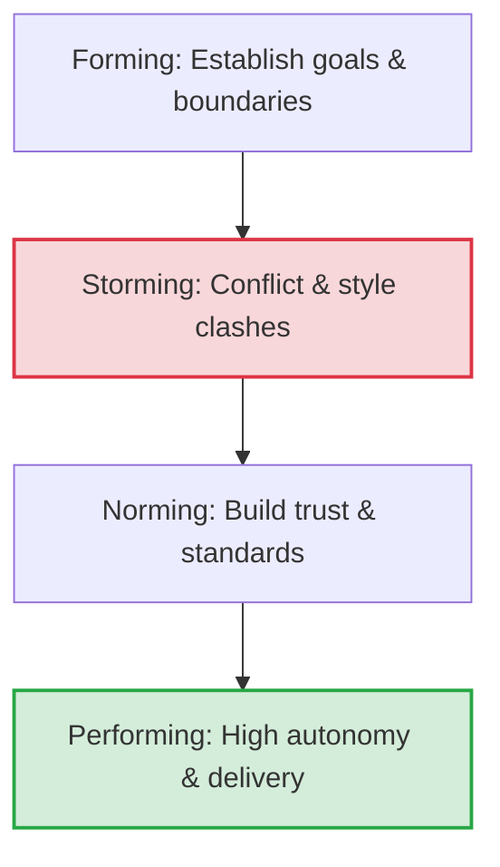

# Team Leadership

## Introduction
In software engineering, **Team Leadership** is the practice of guiding a technical team to deliver high-quality software while aligning with business goals and supporting individual career growth. It extends beyond writing code; it requires balancing technical vision, project execution, interpersonal communication, and team dynamics under conditions of uncertainty.

---

## Problem Statement
Highly skilled individual developers can write excellent code, but without coordination, their efforts can pull in opposite directions. A team lacking strong leadership suffers from disjointed architectures, misaligned priorities, build-ups of unmanaged technical debt, low morale, and communication bottlenecks. We need structured frameworks to guide teams, foster psychological safety, and deliver complex software projects predictably.

---

## Why this exists
To scale engineering efforts. A single engineer's output is limited by their available hours. Team leadership enables **multiplicative influence**—amplifying the output of an entire group of engineers by removing blockers, setting clear directions, mentoring others, and building high-trust, autonomous environments.

---

## Real-world analogy
Think of a mountain guide leading an expedition to Everest:
- **Individual Contributor:** A climber focused on their own steps, gear, and stamina.
- **Team Leader:** The guide. They map out the route (technical roadmap), assess weather risks (technical debt and project scope), ensure climbers have the necessary equipment and support (mentorship and tooling), and maintain high group morale during difficult ascents. The guide does not climb for the team; they enable the team to reach the summit safely.

---

## Definition
- **Technical Leadership:** The ability to guide the technical direction of a team, establishing architectural guardrails and engineering standards.
- **Situational Leadership:** A leadership framework where the leader adapts their style (Directing, Coaching, Supporting, Delegating) based on the development and maturity level of the team members for a specific task.
- **Psychological Safety:** A shared belief held by members of a team that the team is safe for interpersonal risk-taking, where members can ask questions, admit mistakes, and pitch new ideas without fear of humiliation or retaliation.

---

## Key concepts
1. **Tuckman's Stages of Group Development:**
   - **Forming:** Team members meet, establish initial boundaries, and feel out roles.
   - **Storming:** Conflict emerges as different work styles, personalities, and opinions clash.
   - **Norming:** The team resolves conflicts, establishes norms, and builds trust.
   - **Performing:** The team operates as a high-performing, autonomous unit focused on goals.
2. **Situational Leadership Model (Hersey-Blanchard):**
   - **Directing (S1):** High directive, low supportive behavior. Best for enthusiastic beginners.
   - **Coaching (S2):** High directive, high supportive behavior. Best for disillusioned learners.
   - **Supporting (S3):** Low directive, high supportive behavior. Best for capable but cautious contributors.
   - **Delegating (S4):** Low directive, low supportive behavior. Best for self-reliant achievers.
3. **Radical Candor (Kim Scott):** The practice of **Challenging Directly** while showing that you **Care Personally**. This framework helps leaders provide effective constructive feedback.

---

## Internal working / Mermaid diagram

### Tuckman's Team Development Lifecycle



---

## Leadership Behaviors (STAR Scenarios)

### 1. Bad Behavior: Micromanagement and Top-Down Directives
*Scenario: A critical production service needs to be migrated to a new database engine.*
- **Action:** The lead engineer drafts the entire design document in isolation, mandates the exact database technology to use, assigns micro-tasks to developers daily, and demands status updates every few hours.
- **Result:** The team feels disempowered, junior engineers do not grow, and the migration fails to account for edge cases known only by the developers, resulting in downtime.

```python
# Simulation of a micromanager's loop: high check-in frequency, low trust
def bad_micromanagement_loop(tasks, developers):
    schedule = {}
    for task in tasks:
        # Micromanager assigns exact implementation steps without dev input
        dev = select_developer(developers)
        schedule[task] = {"assigned_to": dev, "status": "Not Started"}
        
    # Constant interrupts for status reports
    for hour in range(9, 18):
        for task in schedule:
            interrupt_developer(schedule[task]["assigned_to"])
            schedule[task]["status"] = check_status()
```

### 2. Better Behavior: Delegate-and-Forget (Hands-off Management)
*Scenario: The database migration project.*
- **Action:** The lead engineer assigns the migration goal to the team during a sprint planning session, tells them to "figure it out," and steps back completely, checking in only at the end of the sprint.
- **Result:** Without architectural guardrails or regular feedback, developers choose inconsistent tools, hit integration blockers late in the cycle, and miss the deadline due to lack of coordination.

```python
# Simulation of hands-off leadership: zero support or alignment checks
def hands_off_delegate(tasks, developers):
    project_state = "uncoordinated"
    # Assign and disappear
    for task in tasks:
        assign_task_to_dev_and_exit(task)
        
    # Check in only at deadline
    if deadline_reached():
        project_state = evaluate_final_output() # High probability of failure/bugs
    return project_state
```

### 3. Best Behavior: Supportive Enablement & Situational Coaching
*Scenario: The database migration project.*
- **Action:** The lead engineer runs a collaborative design workshop to define the architectural goal (migration to PostgreSQL). They establish clear success criteria (latency < 50ms, zero downtime). They assign migration subsegments based on developer maturity levels:
  - **S2 (Coaching) style** for a mid-level engineer handling data schema design, reviewing changes daily.
  - **S4 (Delegating) style** for a senior engineer setting up the replication pipeline, checking in weekly.
- **Result:** The project completes on time with zero downtime. Developers gain ownership of their parts and grow their technical skills within clear guardrails.

```python
# Simulation of situational, supportive leadership
class SituationalLeader:
    def __init__(self):
        self.team_members = {
            "junior_dev": {"maturity": "S1", "support": "High", "direction": "High"},
            "mid_dev": {"maturity": "S2", "support": "High", "direction": "Medium"},
            "senior_dev": {"maturity": "S4", "support": "Low", "direction": "Low"}
        }

    def assign_and_support(self, task, dev_name):
        dev = self.team_members[dev_name]
        
        # Define clear guardrails and success criteria
        guardrails = establish_architectural_guardrails(task)
        
        # Tailor check-in cadence based on maturity level
        if dev["maturity"] == "S1" or dev["maturity"] == "S2":
            set_daily_sync_and_coaching(dev_name, task)
        else:
            set_weekly_milestone_review(dev_name, task)
            
        # Unblock and support continuously
        provide_psychological_safety(dev_name)
```

---

## Step-by-step explanation
1. **Micromanagement Trap**: Micromanagers assume they are the bottleneck for all decisions. They focus on the *how* rather than the *what* or *why*, which isolates developers and creates a single point of failure (the leader).
2. **Hands-Off Pitfalls**: Delegate-and-forget leadership confuses autonomy with abandonment. Without guidance, teams often fall into the "Storming" phase and remain there, failing to deliver results.
3. **Situational Alignment (Best)**: A supportive leader assesses the complexity of the task and the developer's experience level, applying the Hersey-Blanchard model:
   - For a developer new to databases (S2), they provide regular code reviews and architectural advice.
   - For an experienced database engineer (S4), they delegate the task completely, reviewing only the final design.
   This approach balances delivery speed with team growth.

---

## Multiple real-world examples
1. **Post-Mortem Incident Reviews:** Leading blameless post-mortems after a system outage. Instead of blaming individuals, the leader focuses on systemic issues and process improvements, building psychological safety.
2. **Mentoring Junior Engineers:** Gradually transitioning a junior engineer from S1 (detailed task descriptions) to S3 (providing high-level goals and reviewing their design proposals) during features development.
3. **Resolving Cross-Team Architectural Conflicts:** Leading a joint task force between the Frontend and Backend teams to agree on a new API specification, facilitating trade-off discussions rather than dictating solutions.

---

## Pros
- **High Autonomy:** Empowers developers to make decisions, increasing delivery speed.
- **Career Growth:** Mentorship and tailored delegation help engineers level up.
- **Team Resilience:** High psychological safety encourages innovation and early risk flagging.

---

## Cons
- **Time Intensive:** Mentoring, coaching, and alignment meetings take time away from direct coding.
- **Context-Switching:** Leaders must constantly switch between technical reviews, product alignment, and team management.
- **Interpersonal Stress:** Navigating team conflicts and delivering hard performance reviews can be emotionally challenging.

---

## Interview questions

### Beginner
- **Q: How do you prioritize tasks for your team when there is too much work?**
  - **A:** I prioritize tasks by analyzing their business impact and technical risk. I collaborate with product managers to identify high-value customer features, and map out technical dependencies. I then estimate task sizes with the team, ensuring workload fits within our sprint capacity while leaving 10-20% buffer for bugs and technical debt.

### Intermediate
- **Q: Describe a time you had to deliver constructive feedback to an underperforming team member.**
  - **A:** I use the **Radical Candor** framework, caring personally while challenging directly. In our 1-on-1, I shared specific examples of the issue (e.g., missed code review deadlines delaying sprints) and explained its impact on the team. I listened to their perspective to see if they faced external blockers. Together, we drafted a 30-day improvement plan with clear milestones and checked in weekly to track progress.

### Senior
- **Q: How do you manage technical debt while delivering new features under tight deadlines?**
  - **A:** I treat technical debt as a financial interest payment. If ignored, it slows down all future feature delivery. I maintain a technical debt backlog and allocate 15-20% of every sprint cycle to refactoring and tooling improvements. For large refactoring tasks, I present a business case to product managers (e.g. "Migrating this service will reduce server costs by 30% and cut feature delivery times in half"), aligning tech improvements with business goals.

### Staff Engineer
- **Q: How do you build consensus and align multiple teams with competing priorities on a major architectural change?**
  - **A:** 
    - **Step 1: Stakeholder Discovery:** Meet with the leads of each team individually to understand their current goals, constraints, and reservations about the change.
    - **Step 2: Define Shared Value:** Structure the proposal to address their pain points (e.g., standardizing APIs to reduce cross-team bugs).
    - **Step 3: RFC (Request for Comments) Process:** Write a detailed design document (RFC) detailing the trade-offs and alternatives considered, inviting open feedback.
    - **Step 4: Collaborative Workshops:** Hold review sessions to resolve major disagreements, focusing on data and architectural principles rather than opinions.
    - **Step 5: Phased Rollout:** Propose a low-risk, phased migration plan to minimize disruption to their schedules, building trust through early wins.

---

## Common mistakes
- **Dictating rather than facilitating:** Making all architectural choices top-down, which disempowers the team and leads to blind spots.
- **Allowing toxic behavior:** Letting brilliant but toxic developers damage psychological safety, which ruins long-term team performance.
- **Ignoring team health:** Focusing entirely on deliverables while ignoring developer burnout and high turnover rates.

---

## Best practices
- **Use Architecture Decision Records (ADRs):** Document the context, choices, and trade-offs of all major design decisions to align the team.
- **Schedule regular 1-on-1s:** Use 1-on-1 meetings to discuss career goals, provide feedback, and build trust, keeping project status updates out of these sessions.
- **Celebrate wins:** Publicly recognize team and individual achievements to maintain high morale.

---

## When NOT to use a top-down style
- **Innovative Problem Solving:** When the team is designing new features or solving complex bugs, top-down control limits creativity. Empower the team to research and propose solutions instead.

---

## Comparison of Leadership Styles

| Style | Directing (S1) | Coaching (S2) | Supporting (S3) | Delegating (S4) |
| :--- | :--- | :--- | :--- | :--- |
| **Best For** | Enthusiastic Beginners | Disillusioned Learners | Capable but Cautious | Self-Reliant Achievers |
| **Directive Action** | High (Define how to do it) | High | Low | Low |
| **Supportive Action**| Low | High | High | Low |
| **Decisions Made By**| Leader | Jointly (Leader guides) | Jointly (Member guides) | Team Member |

---

## Summary
Team Leadership is the art of guiding software teams to success. By adapting leadership styles to team maturity levels, maintaining psychological safety, and aligning tech choices with business goals, leaders scale their impact and build high-performing engineering cultures.

---

## Related topics
- [Communication](../communication)
- [Stakeholder Management](../stakeholder-management)
- [Decision Making](../decision-making)
